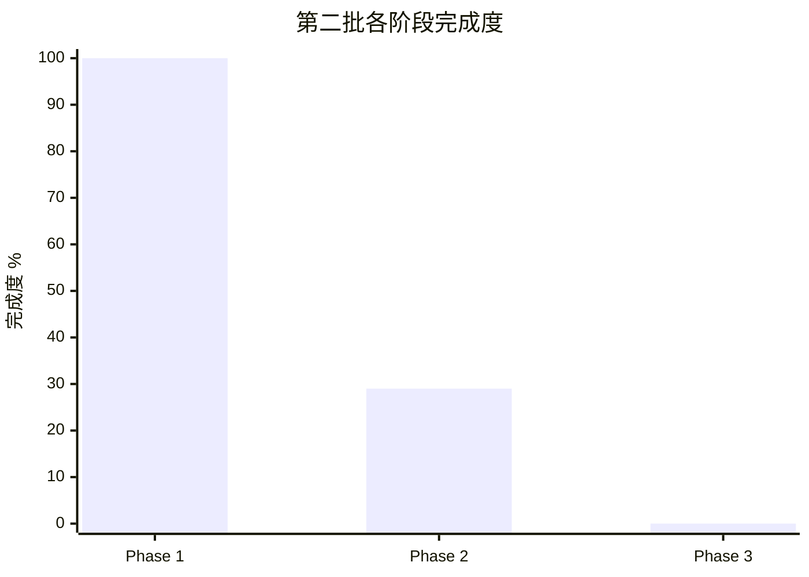

# 第二批上游基线与测试门禁实施结果

- 报告日期：2026-08-01
- 来源计划：`docs/v0.0.5/codex-upstream-sync/02-upstream-baseline-and-test-gates-plan.md`
- 检查范围：`whalecode-codex` 分支，起始提交 `3e0cedd34f2fbd56d206b65357784a922c896ddc`
- Phase 1 实现提交：`4d9777610`（已推送）
- W5 TUI runner 提交：`77f6e0e95`（已推送）
- W6 TUI 基线提交：`dbbd9e0ee`（已推送）
- 当前报告边界：Phase 1 + Phase 2/W5–W6
- 费用边界：未运行真实 Whale Agent，模型请求数为 0

## 1. 完成度总览

计划按 15 个等权工作单元计分；只有实现、集成并通过声明门禁的单元记为 verified。

| 层级 | 计划单元 | 已验证单元 | 完成度 | 计分依据 |
| --- | ---: | ---: | ---: | --- |
| 第二批整体 | 15 | 7 | 47% | W0–W6 verified；W7–W14 未完成 |
| Phase 1：同步事实源 | 5 | 5 | 100% | schema、生成器、两类账本、validator 均有工件与测试 |
| Phase 2：TUI 门禁 | 7 | 2 | 29% | W5–W6 verified；W7–W11 未完成 |
| Phase 3：Windows/收口 | 3 | 0 | 0% | 尚未开始 W12–W14 |

## 2. 阶段与模块完成情况

| 阶段 | 阶段完成度 | 模块 | 模块完成度 | 状态 | 证据 | 验证 |
| --- | ---: | --- | ---: | --- | --- | --- |
| Phase 1 | 100% | W0 输入冻结 | 100% | complete | baseline `fed0a8f4`、target `e363b08c`；Python 3.14.4、Nextest 0.9.138、Insta 1.48.0 | Git 对象解析通过 |
| Phase 1 | 100% | W1 合同/schema | 100% | complete | `scripts/codex-upstream/schemas/`、`metadata_contract.py` | 10 个正反例单测通过 |
| Phase 1 | 100% | W2 overlay inventory | 100% | complete | `generate_overlay_inventory.py`、`overlay-inventory.json` | `--check` 逐字节一致；730 产品/代码路径、0 unclassified；`UPSTREAM.md` 作为控制面排除 |
| Phase 1 | 100% | W3 backport ledger | 100% | complete | 15 条权威记录、19 条 provenance backlog | upstream/local 对象、patch digest、路径和证据校验通过 |
| Phase 1 | 100% | W4 统一校验/上游说明 | 100% | complete | `validate_sync_metadata.py`、`UPSTREAM.md` | 联合校验 exit 0 |
| Phase 2 | 29% | W5 Nextest/JUnit runner | 100% | complete | `run_tui_baseline.py`、`tui_baseline.py`、tool config | 8 MiB 栈敏感用例通过；真实 JUnit 规范化通过；`.snap.new` 增量 0 |
| Phase 2 | 29% | W6 三次 TUI 基线 | 100% | complete | `tui-baseline.json`、`compare_tui_baselines.py` | 三次 SHA-256 相同；漂移 0；1892 tests 全量记账 |
| Phase 2 | 29% | W7–W11 TUI 修复/最终门禁 | 0% | not started | 当前基线仍有 33 failures | 尚未修复 |
| Phase 3 | 0% | W12–W14 Windows/收口 | 0% | not started | 尚无 PowerShell runner 和动态 smoke | 未运行 |

## 3. 目标对齐矩阵

| 主目标 | 子目标 | 计划结果 | 实际工作 | 测量结果 | 验证方法 | 状态 |
| --- | --- | --- | --- | --- | --- | --- |
| 来源可追溯 | vendor 差异机器化 | 固定基线到当前 vendor 的确定性清单 | 比较 baseline tree 与 Git index vendor subtree；固定 no-renames | 730 路径：164 added、560 modified、6 deleted；另有 1 条控制元数据显式排除 | 连续生成与 validator | complete |
| 来源可追溯 | 回移不重复 | upstream/local/digest/路径/证据账本 | 建立 15 条权威记录 | active upstream SHA 重复数 0 | validator | complete |
| 保留不确定性 | 历史来源债务单列 | 不把推断写成事实 | 建立 19 条 provenance backlog | 17 条候选来源、2 条 source unproven | Git 对象检查与人工历史审计 | complete |
| 元数据可信 | 修正 vendor 描述 | 删除人工 patch 数和过时 DeepSeek/app-server描述 | 改为 immutable baseline、Responses API 和机器账本链接 | stale 字符串 0 | validator 文本合同 | complete |
| 测试可治理 | TUI/Windows 最终门禁 | 三次机器基线与平台证据 | runner 已实施，基线与平台验证未实施 | not verified | W6–W14 | partial |
| 测试可治理 | TUI runner | Nextest/JUnit 可重复入口 | 建立独立 tool config、纯 Python parser 和 runner | 定向 1/1 passed；1891 skipped；8 MiB；快照增量 0 | focused 真实运行 + 5 个 parser 单测 | complete |
| 测试可治理 | 稳定失败集合 | 三次运行结果一致且 ignored 不隐身 | 三次完整 JUnit 加 Nextest list ignored 清单 | 每次 1854 passed、33 failed、5 ignored；32 snapshot、1 functional；漂移 0 | 三次统一 SHA + comparison CLI | complete |

## 4. 工程收益矩阵

| 主目标 | 工程收益 | 类型 | 基线 | 目标 | 实际结果 | 验证证据 | 状态 |
| --- | --- | --- | --- | --- | --- | --- | --- |
| Overlay 审计 | vendor refresh 前可逐路径定位冲突域 | 可维护性 | `UPSTREAM.md` 人工写“1 active overlay” | 全量、可解释、可重生成 | 730 条产品/代码路径均含 hash、numstat、分类、规则 ID 和 evidence commit；1 条控制路径显式排除 | inventory + `--check` | achieved |
| 未知项治理 | 防止宽泛分类隐藏未知改造 | 可靠性 | 分类首跑 167 unclassified | 0 unclassified | 通过明确产品/子系统规则降至 0 | summary + validator | achieved |
| Backport 防重 | 自动发现重复回移或 digest 漂移 | 安全/合规 | 无机器账本 | 所有可证实回移有唯一记录 | 15 条 authoritative，active 重复 0 | validator | achieved |
| 历史数据质量 | 推断来源不污染权威事实 | 可审计性 | 19 个 upstream-labelled 本地提交无 trailers/sync log | 单独记账 | 19 条 backlog，patch digest 不伪造 | backlog JSON | achieved |
| TUI 回归检测 | 用 Nextest/JUnit 形成稳定失败集合 | 测试性 | cargo test 基线 33 failed/1 ignored，且曾栈溢出 | 当前事实可逐测试复现；最终目标 0 failed | 1892 个测试身份入账，三次漂移 0；当前仍 33 failed | baseline + comparison CLI | partial |

## 5. 证据与验证矩阵

| 项目 | 证据类型 | 证据位置/命令 | 执行结果 | 缺口 |
| --- | --- | --- | --- | --- |
| Python 合同测试 | test | `python3 -m unittest discover -s scripts/codex-upstream/tests -p 'test_*.py'` | 19/19 passed | 无 |
| Inventory 可复现性 | test | `python3 scripts/codex-upstream/generate_overlay_inventory.py --check` | passed | 无 |
| 联合元数据校验 | test | `python3 scripts/codex-upstream/validate_sync_metadata.py` | passed | 无 |
| 提交后自引用回归 | test | 在 `4d9777610` 上重新运行 inventory `--check` 与联合校验 | passed | `UPSTREAM.md` 由 `excluded_control_paths` 明确隔离 |
| 固定对象 | runtime | `git cat-file` / `git rev-parse` | baseline/target/local/upstream 对象可解析 | provenance backlog 有 2 条无可证实 upstream 对象 |
| Patch 完整性 | test | 官方 `git show --format= --binary` SHA-256 | 15/15 matched | 2026-05-01 digest 是本轮重算，不是历史 trailer |
| Overlay 分类 | code/doc | `classification.py`、inventory summary | 730/730 classified，1 条控制路径显式排除 | 分类规则仍需在 vendor refresh 时复审 |
| TUI focused runner | test/runtime | `run_tui_baseline.py --filter-expr test(...) --output /tmp/whale-tui-focused.json` | 1 passed；JUnit 与规范化 JSON 生成；`.snap.new` 增量 0 | 无 |
| TUI 三次全量 | test/runtime | 三次 runner 输出 + `compare_tui_baselines.py` | 三份规范化 JSON SHA-256 均为 `5a801391852ac8b88344be3693a0d8677b3a438f229ee2f079b67c8e35099056`；漂移 0 | 33 个稳定失败待处理 |
| TUI baseline check | test | `run_tui_baseline.py --check --allow-test-failures` | baseline 逐字节匹配 | `--allow-test-failures` 只用于事实基线；最终门禁不得使用 |
| Python XML 环境诊断 | runtime/test | Homebrew Python 3.14 `pyexpat` 导入栈 + parser regression | 确认动态库符号不兼容；runner 改为无 expat 依赖并通过真实 JUnit | 系统 Python 安装问题未修复，但 runner 已隔离 |
| 历史快照临时文件 | runtime | 两个已被 Git 跟踪的 core compact `.snap.new` | 曾移入桌面回收站，确认 tracked deletion 后已原位恢复且 diff 为空；W5 运行增量 0 | 内容未接受，留待快照审阅工作单元处理 |
| TUI 全量 | test | Nextest/JUnit runner | 1854 passed、33 failed、5 ignored；连续三次一致 | W7–W11 尚未关闭失败 |
| Windows 动态 smoke | runtime | VS Code terminal / Windows Terminal | not run | 缺 Windows 环境证据 |

## 6. 未完成工作

| 未完成项 | 计划范围 | 当前状态 | 未完成原因 | 证据 | 不完成的影响 | 所需动作 |
| --- | --- | --- | --- | --- | --- | --- |
| W7–W8 | 两组快照审阅 | not started | 依赖 W6 稳定失败集合 | 计划依赖图 | 无法区分产品变化与陈旧快照 | 完成 W6 后逐组审阅 |
| W9 | ActionMap 功能断言 | blocked-on-discovery | 尚无 Nextest 规范化失败证据 | 第一批仅有失败摘要 | TaskSpace TUI 门禁非绿色 | 先复现并做根因诊断 |
| W10 | memory-setting flake | blocked-on-discovery | 尚未在相同配置重复三次 | 无重复证据 | 可能误判确定性回归 | 隔离重复测试 |
| W11 | TUI 零失败门禁 | not started | 依赖 W7–W10 | 计划依赖图 | vendor refresh 仍缺 TUI 准入门禁 | 完成前置工作 |
| W12–W13 | Windows 自动/动态验证 | not started | 当前运行环境为 Linux，且 runner 尚未实现 | 平台事实 | 第一批 W2/W4 平台风险未关闭 | 先实现脚本，再在真实 Windows 执行 |
| W14 | 批次收口 | not started | Phase 2/3 未完成 | 7/15 单元 verified | 第二批不能标记 complete | 完成剩余工作并复跑全部门禁 |

## 7. 下一步

| 优先级 | 动作 | 原因 | 依赖 | 预期结果 | 验证 |
| ---: | --- | --- | --- | --- | --- |
| P0 | 按 W7–W8 分组审阅快照 | 32 个失败均已稳定归为 snapshot review | W6 | 每组独立产品判断和提交 | focused + full Nextest |
| P0 | 诊断 W9 ActionMap 断言 | 唯一 functional failure 已稳定复现 | W6 | 根因证据和回归测试 | focused test + TaskSpace 定向回归 |
| P1 | 核对 W10 memory-setting 候选 | 三次全量未出现该失败 | W6 | 证明已稳定或保留 flake 结论 | 隔离重复三次 |
| P1 | 实施 W12 Windows runner | 先把平台验证步骤机械化 | Phase 1 | 可在 Windows 一键执行三组测试 | PowerShell exit code 与日志 |
