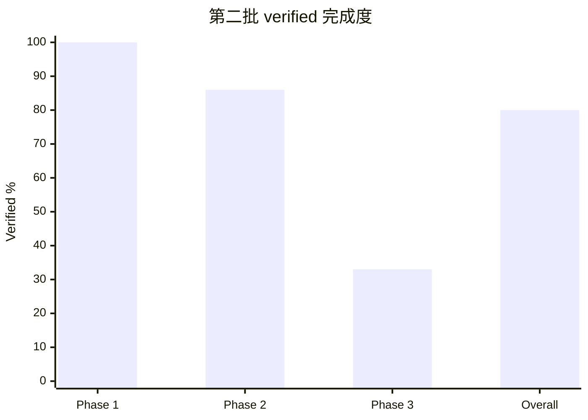

# 第二批上游基线与测试门禁最终实施报告

> 历史执行报告：本文中的 W/Phase 标签只用于追溯当时的执行记录，不属于当前计划编号；当前唯一计划为 `docs/v0.0.5/codex-upstream-sync/plan.md`。

- 报告日期：2026-08-02
- 文档角色：最终历史执行证据
- 检查范围：`whalecode-codex` 分支，`3e0cedd34` 至本收口提交
- 收口方式：12 个工作单元 verified，W9/W12/W13 经用户决策 deferred
- 费用边界：未运行真实 Whale Agent，模型请求数为 0

## 1. 完成度总览

计划按 W0–W14 共 15 个等权工作单元计分。延期项已有明确 disposition，但不计作 verified。

| 层级 | 计划单元 | Verified | Deferred | 交付完成度 | Disposition 覆盖率 |
| --- | ---: | ---: | ---: | ---: | ---: |
| 第二批整体 | 15 | 12 | 3 | 80% | 100% |
| Phase 1：同步事实源 | 5 | 5 | 0 | 100% | 100% |
| Phase 2：TUI 门禁 | 7 | 6 | 1 | 86% | 100% |
| Phase 3：Windows/收口 | 3 | 1 | 2 | 33% | 100% |

## 2. 阶段与模块完成情况

| 阶段 | 模块 | 完成度 | 状态 | 实际结果 | 验证证据 |
| --- | --- | ---: | --- | --- | --- |
| Phase 1 | W0–W4 | 100% | complete | 固定基线、schema、inventory、ledger、validator 均已落地 | 19/19 Python tests；inventory reproducible；metadata validation passed |
| Phase 2 | W5–W6 | 100% | complete | Nextest/JUnit runner 与稳定 TUI 基线建立 | 三次初始基线一致；当前基线可逐字节检查 |
| Phase 2 | W7 | 100% | complete | DeepSeek effort 与 summary capability 解耦 | request/SSE/catalog/status 定向回归与缓存 index gate |
| Phase 2 | W8 | 100% | complete | Flash 默认、Pro 隐藏的产品决策与快照固化 | 514/514 chatwidget tests passed |
| Phase 2 | W9 | 0% | deferred | 根因已确认，修复延期到 TaskSpace 专项分支 | `coe/2026-08-01-23-55-w9-taskspace-mode-routing.md` |
| Phase 2 | W10 | 100% | complete | memory-setting 候选未复现 | 两个用例连续 3 轮，共 6/6 passed |
| Phase 2 | W11 | 100% | complete | 最终基线失败集合精确等于 deferred W9 | 1887 passed、1 known-deferred failed、5 skipped；无新增/unknown |
| Phase 3 | W12 | 0% | deferred | Windows PowerShell runner 未实现 | 用户于 2026-08-02 决定跳过本批 |
| Phase 3 | W13 | 0% | deferred | VS Code/Windows Terminal smoke 未执行 | 无真实 Windows 环境证据，不声明通过 |
| Phase 3 | W14 | 100% | complete | 计划、专题首页、迁移记录与最终状态完成对账 | 本报告、最终门禁、提交及远端同步 |

## 3. 目标对齐矩阵

| 主目标 | 子目标 | 计划结果 | 实际结果 | 测量效果 | 状态 |
| --- | --- | --- | --- | --- | --- |
| 来源可追溯 | vendor overlay | 可机器重建且无未分类路径 | inventory、分类规则和 validator 已落地 | 730 条产品/代码路径，0 unclassified | complete |
| 来源可追溯 | backport 防重 | upstream/local/digest 可核验 | 账本与 provenance backlog 分层维护 | active upstream SHA 重复数 0 | complete |
| 测试可治理 | TUI 稳定基线 | 失败集合可复现 | 从 33 failures 收敛到唯一 deferred W9 | 失败数下降 32，降幅 97% | partial：W9 deferred |
| DeepSeek 合同 | Flash reasoning | 保留 effort，不请求或展示无效 summary | request、SSE、catalog、status 合同一致 | 相关定向测试通过，12 个 status failure 归零 | complete |
| 平台验证 | Windows | 自动 runner 与两类终端 smoke | 本批未实施 | 无 Windows 测量 | deferred |

## 4. 工程收益矩阵

| 主目标 | 工程收益 | 类型 | 基线 | 目标 | 实际结果 | 验证 | 状态 |
| --- | --- | --- | --- | --- | --- | --- | --- |
| Overlay 审计 | vendor refresh 前可逐路径定位冲突域 | 可维护性 | 人工描述“1 active overlay” | 全量机器清单 | 730 条路径全部分类 | generator `--check` + validator | achieved |
| Backport 治理 | 自动发现重复回移和 digest 漂移 | 安全/审计 | 无机器账本 | 唯一、可核验 | active 重复 0 | 19/19 contract tests | achieved |
| TUI 门禁 | 稳定识别回归而不自动接受快照 | 测试性 | 33 failed | 非延期失败 0 | 1887 passed；唯一失败为已登记 W9 | full Nextest/JUnit baseline | achieved for non-deferred scope |
| DeepSeek 请求 | effort 与 summary 独立表达 | 可靠性 | capability 耦合导致错误请求/展示 | effort 保留，unsupported summary 省略 | 12 个 status failure 归零 | focused + full TUI | achieved |
| Windows | 验证 Windows 专属行为 | 可靠性 | 无动态证据 | 自动与实机证据 | 未执行 | 无 | not verified |

## 5. 证据与验证矩阵

| 项目 | 类型 | 验证 | 结果 | 缺口 |
| --- | --- | --- | --- | --- |
| Metadata 工具 | test | Python tests、inventory `--check`、metadata validator | passed | 无 |
| W10 稳定性 | test | `cargo nextest run -p codex-tui -E 'test(/update_memory_settings/)'` 连续三轮 | 6/6 passed | 无 |
| TUI 最终基线 | test/runtime | `run_tui_baseline.py --check --allow-test-failures` | 1887 passed、1 W9 failed、5 skipped；与基线一致 | W9 deferred |
| Rust 格式与构建 | test | `cargo fmt --all -- --check`；`cargo check -p codex-cli --bin whale --locked` | passed；仅 stable rustfmt 的已知 unstable-option warnings | 无阻断 |
| 安全/Git 回归 | test | `codex-shell-command --lib`；`codex-git-utils --lib` | 130/130、36/36 passed | Windows 动态行为未验证 |
| MCP gate 前置 | test | build `test_stdio_server` | passed | 无 |
| Cache index gate | test | `check_cache_regression_gate.py --source index` | passed；无真实模型 run | live baseline 历史状态不由本批改变 |
| Snapshot 增量 | runtime | Git 状态与 `.snap.new` 路径核对 | 本批新增 0 | vendor 历史跟踪 2 个 `.snap.new`，未审阅、不删除 |
| Git 交付 | runtime | `git diff --check`、commit、push、clean status | passed | 无 |

## 6. 未完成工作

| 未完成项 | 当前状态 | 未完成原因 | 证据 | 影响 | 恢复决策 |
| --- | --- | --- | --- | --- | --- |
| W9 TaskSpace mode | deferred | 测试夹具缺少 projection policy；用户决定在 TaskSpace 专项分支解决 | Bug Killer 案例和单变量对照 | 全量 TUI 原始 exit code 仍非 0 | TaskSpace 专项恢复，保持 Standard 默认 |
| W12 Windows runner | deferred | 用户决定本批跳过 | 仓库无 `verify-quick-backports.ps1` | 无法一键复核 Windows 专属回归 | Windows 专项实现 |
| W13 Windows smoke | deferred | 当前为 Linux 环境且用户决定跳过 | 无 VS Code/Windows Terminal 运行记录 | paste burst 的真实平台体验未验证 | 在真实 Windows 环境执行 |
| 历史 core `.snap.new` | deferred review | 两个文件来自既有上游提交且已被 Git 跟踪 | `git ls-files --stage`、历史提交 `78101e19c` | 不影响本批增量清洁，但内容仍待专项审阅 | 快照专项决定接受、改名或保留 |

## 7. 后续动作

| 优先级 | 动作 | 归属 | 依赖 | 验证 |
| ---: | --- | --- | --- | --- |
| P1 | 修复 W9 夹具并补缺失 policy 的拒绝/可观测性测试 | TaskSpace 专项 | 明确启动专项分支 | focused W9 + TaskSpace state/store + full TUI |
| P1 | 建立 Windows PowerShell runner | Windows 专项 | Windows 工程环境 | runner exit code、日志和三组测试 |
| P1 | 执行 VS Code integrated terminal 与 Windows Terminal smoke | Windows 专项 | W12 runner、真实终端 | 两份环境/步骤/结果记录 |
| P2 | 审阅两个历史 tracked `.snap.new` | compaction/快照专项 | 产品语义审阅 | 对应 core compact tests 与 snapshot diff |

本批不授权刷新 Codex vendor，也不授权恢复 DeepSeek V4 Pro。下一批上游追赶应从新的专项计划开始。
