# WhaleCode 多 Agent 群体协同架构设计

---

## 文档定位

本文件是 WhaleCode multi-agent 架构的唯一权威设计文档，已合并原
`docs/plans/2026-04-30-action-map-runtime-design.md` 的 Action Map Runtime 设计，避免
Supervisor / Cohort / Artifact 与 Action Map Runtime 两套文档长期漂移。

`docs/plans/2026-04-29-multi-agent-behavior-kernel-design.md` 保留为早期行为内核设计记录；
本文优先作为后续实现和评审依据。

---

## 一、设计目标

WhaleCode 的多 Agent 设计不是“多个聊天机器人互相讨论”，而是一个受 Supervisor 控制的群体计算系统。目标是用 DeepSeek V4 的速度、低成本、大上下文和缓存能力，把单个 agent 的不稳定性转化为群体层面的高覆盖率、高吞吐和高质量。

核心假设：

- 单个 Flash agent 可以平庸，但大量 Flash agent 可快速覆盖搜索空间。
- agent 数量只有在视角、工具、上下文切片或候选路径足够不相关时才会转化为质量；同质 agent 只会更快地产生一致错误。
- Pro agent 不应承担所有工作，而应作为关键路径的裁判、整合者和高风险决策者。
- 质量不是靠单 agent 一次输出，而是靠“并行探索 → 候选竞争 → 证据加权 → 交叉审查 → 验证闭环”产生。
- 1M context 不是让每个 agent 无限堆上下文，而是让 Supervisor 能构造高质量共享任务包，并让每个 agent 在独立上下文内处理更大的局部问题。
- cache hit 优势来自稳定前缀和批量调度，不应作为正确性前提。

截至 2026-04-25，DeepSeek 官方 API 文档公开列出 `deepseek-v4-flash` 和 `deepseek-v4-pro`，支持 1M context、384K max output、thinking、tool calls、context cache usage 统计，并对并发采用动态 429 机制。因此 WhaleCode 可以设计为高并发群体系统，但必须内置动态并发治理。

---

## 二、设计原则

| 原则 | 设计含义 |
|------|----------|
| Many cheap attempts | 用 Flash 大量生成候选、收集证据、跑局部实现 |
| Few expensive decisions | 用 Pro 做设计裁判、根因裁判、合并裁判、最终审查 |
| Independence before consensus | 先让 agent 独立工作，再聚合，避免互相影响导致同质化 |
| Diversity before width | 先扩大视角、模型、工具和上下文差异，再扩大 agent 数量 |
| Evidence over votes | 多数票不能直接代表正确，必须按证据质量、测试结果和风险加权 |
| Artifact-first communication | Agent 之间传 artifact reference，不传大段聊天历史 |
| Cache-aware fan-out | 群体请求共享稳定前缀，提高 cache hit 概率 |
| Dynamic width | 并发宽度由 API 429、延迟、token 预算、CPU、文件 ownership 动态调整 |
| Patch isolation | 并行写入只能产出 PatchArtifact，不直接写共享工作区 |
| Deterministic supervision | 何时 spawn、kill、merge、retry、escalate 由 Supervisor 决定 |
| Stop early when enough | 一旦证据/候选质量达到门槛，立即收敛，避免成本失控 |

---

## 三、总体模型：群体计算而不是群聊

```text
User Goal
  │
  ▼
Supervisor
  ├─ builds Shared Task Pack
  ├─ warms stable prompt/context prefix
  ├─ creates Work Units
  ├─ launches Agent Cohorts
  ├─ collects Artifacts
  ├─ runs Tournament / Consensus
  ├─ applies PatchArtifact gates
  └─ verifies final result

Agent Cohorts
  ├─ Scouts        read-only wide search
  ├─ Analysts      independent decomposition / hypothesis / risk analysis
  ├─ Implementers  isolated patch candidates
  ├─ Reviewers     candidate review and regression checks
  ├─ Judges        Pro-level ranking and synthesis
  ├─ Verifiers     test/build/repro validation
  └─ Viewer        adversarial concern layer
```

Agent 之间默认不直接开放自由聊天。自由聊天容易带来上下文污染、立场同化和成本膨胀。Agent 通信通过 Message Bus 传递结构化 artifact：

- `Finding`
- `Hypothesis`
- `Evidence`
- `PlanCandidate`
- `PatchArtifact`
- `ReviewFinding`
- `VerificationResult`
- `Concern`
- `ConsensusReport`

每个 artifact 都有 schema、来源、trace、置信度、证据引用和成本统计。

---

## 四、Agent Cohort 类型

### 4.1 Scout Cohort

用途：大规模只读搜索。

特点：

- 高并发 Scout 默认使用 `deepseek-v4-flash`；全局交互默认仍为 `deepseek-v4-pro`。
- 工具只读：read、glob、grep、git_read、doc_search、web_search。
- 输出 `Finding`，不输出设计结论。
- 每个 Scout 只拿一个明确问题，避免泛泛搜索。

典型任务：

- 找相关文件。
- 找测试入口。
- 找相似实现。
- 找历史提交。
- 找配置约束。
- 找外部参考。

默认并行宽度：

- local repo search：8-32。
- web/doc search：3-8。
- git history search：2-6。

### 4.2 Analyst Cohort

用途：并行理解、分解和假设生成。

特点：

- Flash 优先，复杂任务可用 Pro。
- 多个 Analyst 必须使用不同 lens。
- 输出 `AnalysisCandidate` 或 `HypothesisSet`。

Lens 示例：

- minimal-change lens。
- architecture lens。
- security lens。
- performance lens。
- testability lens。
- backwards-compatibility lens。
- failure-mode lens。

设计要求：

- Analyst 之间不能先看彼此输出。
- Supervisor 收齐候选后再进入比较。
- 比较时按证据覆盖、风险识别、实现成本、可验证性评分。

### 4.3 Implementer Cohort

用途：生成可比较的实现候选。

特点：

- 高并发 Implementer 默认 `deepseek-v4-flash`；全局交互默认仍为 `deepseek-v4-pro`。
- 每个 Implementer 在独立 workspace 或 patch buffer 中工作。
- 输出 `PatchArtifact`，不直接写共享工作区。
- 可做同一任务的多方案竞赛，也可做不同文件/模块分片。

两种模式：

| 模式 | 用途 | 并行策略 |
|------|------|----------|
| Sharded Implement | 大任务拆成不重叠文件 ownership | 多 agent 同时产 patch |
| Competitive Implement | 同一任务生成多个候选方案 | 多 agent 互不知情，最后 tournament |

默认并行宽度：

- file ownership 可静态证明：3-8。
- 同文件竞争候选：2-4。
- 共享工作区实际写入：始终 1。

### 4.4 Reviewer Cohort

用途：交叉审查候选产物。

特点：

- 常规审查可用 Flash。
- 高风险审查用 Pro。
- Reviewer 不允许审自己所属 cohort 的产物。
- 输出 `ReviewFinding` 和候选评分。

审查维度：

- correctness。
- regression risk。
- test gap。
- security/privacy。
- maintainability。
- consistency with architecture。
- observability。

### 4.5 Judge Cohort

用途：Pro 级裁判和综合。

特点：

- 默认使用 `deepseek-v4-pro`。
- 数量少，通常 1-3。
- 不参与底层搜索和大规模实现。
- 只在 gate、merge、root-cause、final answer 等关键点介入。

输出：

- `CandidateRanking`
- `SynthesisPlan`
- `MergeDecision`
- `RootCauseDecision`
- `FinalAnswerReview`

### 4.6 Verifier Cohort

用途：验证候选是否真的满足目标。

特点：

- LLM 可以是 Flash 或非 LLM deterministic runner。
- 优先执行测试、构建、复现脚本、静态检查。
- 输出 `VerificationResult`。

Verifier 不是 Reviewer。Reviewer 判断“看起来是否合理”，Verifier 判断“证据是否成立”。

### 4.7 Viewer

Viewer 是独立对抗层，不属于具体 cohort。

触发点：

- plan tournament 结束。
- patch candidate 入围。
- Pro Judge 做出关键裁决。
- permission escalation。
- verification gap。
- final answer 前。

Viewer 不默认监听每个 token。严格模式才扩大触发范围。

---

## 五、核心协同模式

### 5.1 Map-Reduce

适合：大范围搜索、仓库理解、影响面分析。

```text
Supervisor
  -> split questions
  -> launch Scouts
  -> collect Finding[]
  -> reduce into RepoMap / ImpactMap
```

关键点：

- map 阶段只产事实。
- reduce 阶段才做解释。
- 事实引用必须带文件、行号、命令或 URL。

### 5.2 Tournament

适合：方案设计、实现候选、修复候选。

```text
Candidate A  ┐
Candidate B  ├─ Reviewer Cohort -> scorecards
Candidate C  ┘
          │
          ▼
      Pro Judge
          │
          ├─ choose winner
          ├─ synthesize hybrid
          └─ request another round
```

Tournament 不一定选单个 winner。常见结果是：

- 选 A。
- 选 A，但吸收 B 的测试。
- 合并 A 的实现和 C 的边界处理。
- 全部拒绝，重开一轮。

### 5.3 Independent Redundancy

适合：关键根因判断、高风险设计、复杂 bug。

同一个问题分配给多个 agent，要求独立作答。Supervisor 比较差异：

- 高一致 + 高证据：快速收敛。
- 高一致 + 低证据：继续证据收集。
- 低一致 + 高证据：交给 Pro Judge 做裁决。
- 低一致 + 低证据：重分解问题。

### 5.4 Evidence Race

适合：Debug。

每个假设绑定证据计划，Searcher/Verifier 并行执行。哪个假设先得到强证据，哪个进入下一轮；被证伪的假设立即停止消耗。

```text
H1: 数据库连接池耗尽 -> collect db logs / pool metrics
H2: 参数校验异常     -> collect request payload / validator path
H3: session 过期      -> collect auth middleware trace

Evidence Race:
  H1 evidence weak
  H2 evidence strong
  H3 falsified

Debugger + Judge -> converge on H2
```

### 5.5 Debate Without Cross-Talk

适合：架构取舍。

不是让 agent 互聊，而是让它们提交结构化立场：

- claim。
- assumptions。
- evidence。
- tradeoffs。
- invalidation conditions。

Supervisor 再组织二轮回应。这样保留多样性，避免早期同化。

### 5.6 Patch League

适合：同一功能的多实现候选。

流程：

1. Implementer A/B/C 独立产 `PatchArtifact`。
2. Verifier 对每个 patch dry-run apply。
3. Reviewer 生成 scorecard。
4. Judge 选 winner 或 synthesis。
5. Supervisor 应用最终 patch。
6. Verifier 跑最终测试。

Patch League 的核心是隔离：候选可以多，实际写共享区只有一次。

---

## 六、DeepSeek V4 特化调度

### 6.1 Flash / Pro 分层

| 工作 | 默认模型 | 原因 |
|------|----------|------|
| Scout search | V4 Flash | 高并发、低成本、事实收集 |
| Analyst first pass | V4 Flash | 多视角快速覆盖 |
| Implementer candidate | V4 Flash | 大量候选实现 |
| Verifier explanation | V4 Flash | 解释失败、整理证据 |
| Architect final design | V4 Pro | 关键路径设计 |
| Judge ranking | V4 Pro | 候选裁决 |
| Debug root-cause decision | V4 Pro | 高风险收敛 |
| Viewer critical concern | V4 Pro | 对抗性审查 |
| Context compaction | V4 Pro for critical / Flash for routine | 按上下文重要性路由 |

### 6.2 Thinking 策略

DeepSeek V4 thinking 默认可用，但不是所有 agent 都需要高强度 thinking。

| 场景 | thinking | effort |
|------|----------|--------|
| 文件搜索、grep 解释 | disabled 或 high-light | 不做深推理 |
| 方案生成、根因分析 | enabled | high/max |
| Patch candidate | enabled | high |
| Judge / Viewer | enabled | max |
| 大量低风险 Scout | disabled 优先 | 控制延迟 |

Thinking mode 的工具调用有历史拼接要求：如果某轮发生 tool call，该 assistant message 的 `reasoning_content` 必须在后续请求中保留。这个逻辑属于 Model Adapter 的硬约束，不能交给 agent prompt 自觉处理。

### 6.3 Cache-aware Fan-out

DeepSeek context cache 只命中重复前缀，且 best-effort。WhaleCode 要把多 Agent 请求组织成稳定前缀：

```text
Stable Prefix
  ├─ WhaleCode global system prompt
  ├─ project policy / AGENTS.md summary
  ├─ task invariant
  ├─ shared repo map
  ├─ shared constraints
  └─ cohort instruction prefix

Variable Suffix
  ├─ agent lens
  ├─ work unit
  ├─ local context slice
  └─ artifact references
```

调度策略：

1. Supervisor 先构造 `SharedTaskPack`。
2. 对同一 cohort 使用相同 stable prefix。
3. 先发送少量 cache-warm 请求。
4. 数秒后启动 fan-out burst。
5. 记录 `prompt_cache_hit_tokens` / `prompt_cache_miss_tokens`。
6. Cache hit 低于阈值时调整 prefix 排布，但不影响正确性。

### 6.4 大上下文使用策略

1M context 不等于所有 agent 都塞满 1M。

推荐分层：

| 层 | 内容 | 是否共享 |
|----|------|----------|
| L0 Stable Prompt | 全局规则、角色协议、输出 schema | 全 cohort 共享 |
| L1 Task Pack | 用户目标、约束、验收、风险 | 全 workflow 共享 |
| L2 Repo Map | 文件树、关键模块摘要、AGENTS 摘要 | 多 cohort 共享 |
| L3 Work Unit Pack | 当前分片相关代码和证据 | 单 agent / 小 cohort |
| L4 Artifact Refs | finding、patch、review、verification 引用 | 按需注入 |
| L5 Raw Dumps | 大日志、大 grep、大测试输出 | 默认不进上下文，只引用 |

大窗口的价值在 L1-L3：减少早期压缩和上下文丢失，让 agent 处理更完整的局部任务。L5 原始输出仍需截断和引用化。

### 6.5 Dynamic Concurrency Governor

DeepSeek API 会根据服务器负载动态限制并发，触发 429。WhaleCode 必须自适应：

```text
ConcurrencyGovernor
  inputs:
    - recent_429_rate
    - p50/p95 first-token latency
    - active_stream_count
    - prompt_cache_hit_ratio
    - token_budget_remaining
    - local_cpu_load
    - tool_queue_depth
    - write_lock_state

  outputs:
    - max_flash_agents
    - max_pro_agents
    - max_tool_calls
    - max_patch_candidates
    - backoff_duration
```

默认策略：

- 遇到 429：立即降低 burst width，指数退避。
- SSE keep-alive 长时间无 token：保持连接但暂停新增同类请求。
- Pro agent 永远有限宽，避免关键路径拥塞。
- read-only agent 可扩宽，write/patch agent 严格限宽。

---

## 七、核心数据结构

### 7.1 SwarmSpec

```rust
pub struct SwarmSpec {
    pub id: SwarmId,
    pub goal: UserGoal,
    pub workflow: WorkflowKind,
    pub mode: SwarmMode,
    pub shared_task_pack: SharedTaskPack,
    pub cohorts: Vec<CohortSpec>,
    pub budget: SwarmBudget,
    pub stop_rules: Vec<StopRule>,
    pub quality_gates: Vec<QualityGate>,
}
```

### 7.2 CohortSpec

```rust
pub struct CohortSpec {
    pub role: CohortRole,
    pub model_route: ModelRoute,
    pub width: WidthPolicy,
    pub independence: IndependencePolicy,
    pub context_policy: ContextPolicy,
    pub tools: ToolPolicy,
    pub output_contract: ArtifactContract,
}
```

### 7.3 WorkUnit

```rust
pub struct WorkUnit {
    pub id: WorkUnitId,
    pub lane: WorkLane,
    pub prompt_suffix: String,
    pub context_refs: Vec<ContextRef>,
    pub required_artifacts: Vec<ArtifactKind>,
    pub ownership_claim: Option<FileOwnershipClaim>,
    pub deadline: Deadline,
}
```

### 7.4 CandidateScore

```rust
pub struct CandidateScore {
    pub candidate_id: ArtifactId,
    pub correctness: f32,
    pub evidence_strength: f32,
    pub test_strength: f32,
    pub risk: f32,
    pub maintainability: f32,
    pub integration_cost: f32,
    pub reviewer_agreement: f32,
    pub confidence: f32,
}
```

### 7.5 ConsensusReport

```rust
pub struct ConsensusReport {
    pub decision: Decision,
    pub selected_artifacts: Vec<ArtifactId>,
    pub rejected_artifacts: Vec<ArtifactId>,
    pub disagreements: Vec<Disagreement>,
    pub evidence_refs: Vec<EvidenceRef>,
    pub residual_risks: Vec<Risk>,
    pub required_verification: Vec<VerificationCommand>,
}
```

---

## 八、Create 工作流深化

### 8.1 Create 群体流程

```text
ANALYZE
  -> Scout Map-Reduce
  -> Analyst lenses
  -> RepoMap + ConstraintMap

DESIGN
  -> Plan Tournament
  -> Pro Judge synthesis
  -> Viewer concern check

SCAFFOLD
  -> independent foundation lanes
  -> logging/testing/constraints
  -> verifier checks

IMPLEMENT
  -> sharded implement if ownership clean
  -> patch league if high-risk/same-file
  -> reviewer cohort scorecards

REVIEW
  -> Pro Judge final merge decision
  -> Verifier matrix
  -> Viewer final concern check

CONFIRM
  -> final summary with artifact refs
```

### 8.2 Create 默认宽度

| 阶段 | 默认宽度 | 说明 |
|------|----------|------|
| Scout | 8-24 Flash | 本地搜索和参考研究 |
| Analyst | 4-8 Flash | 多 lens 独立分解 |
| Plan candidate | 3-5 Flash/Pro mix | 复杂任务至少一个 Pro |
| Judge | 1-2 Pro | 合成最终设计 |
| Scaffold implement | 2-4 Flash | 基建任务并行 |
| Feature implement | 2-6 Flash | 按 ownership 动态 |
| Review | 2-4 Flash + 1 Pro | 先广后深 |
| Verify | deterministic + 1-2 Flash | 测试失败解释和补充检查 |

### 8.3 Create 质量收敛规则

进入 Implement 前必须满足：

- 至少 2 个独立 plan candidate 被比较。
- 至少 1 个 Pro Judge 给出 synthesis。
- DAG 的 file ownership 可解释。
- Scaffolding tasks 在 DAG 中是功能任务前置依赖。
- Viewer 无 critical concern。

进入 Confirm 前必须满足：

- 选中的 PatchArtifact 全部通过 dry-run 和 apply gate。
- required verification 全部有结果。
- Reviewer 对 critical 文件无 unresolved finding。
- 如果候选之间分歧大，ConsensusReport 必须记录 rejected rationale。

---

## 九、Debug 工作流深化

### 9.1 Debug 群体流程

```text
ANALYZE
  -> Symptom Pack
  -> Scout impact search
  -> reproduction map

HYPOTHESIZE
  -> independent hypothesis generation
  -> hypothesis dedup
  -> evidence plan assignment

COLLECT_EVIDENCE
  -> Evidence Race
  -> falsify weak hypotheses early

EVALUATE
  -> Debugger synthesis
  -> Pro root-cause judge
  -> Viewer challenge

FIX
  -> small patch league
  -> impact-limited implementation

VERIFY
  -> original repro
  -> regression tests
  -> negative checks
  -> final root-cause report
```

### 9.2 Hypothesis 多样性

Debugger 不能只生成一个最像的根因。默认至少生成 3 类假设：

- code path hypothesis。
- data/config hypothesis。
- environment/runtime hypothesis。
- recent-change hypothesis。
- integration boundary hypothesis。

每个假设必须带：

- falsifiable claim。
- expected evidence。
- fastest evidence command。
- risk if wrong。
- stop condition。

### 9.3 Evidence 加权

证据不是越多越好，而是越能证伪越好。

| 证据类型 | 权重 |
|----------|------|
| 原始复现消失 | 最高 |
| failing test 变 passing | 最高 |
| 直接日志/trace 指向 | 高 |
| 代码路径静态匹配 | 中 |
| 相似历史 issue | 中 |
| agent 推测 | 低 |

Debug 的最终报告必须包含：

- 被确认的根因。
- 被证伪的主要假设。
- 修复为什么有效。
- 原始症状如何验证消失。
- 回归测试或 test gap。

---

## 十、质量函数

Supervisor 需要把“群体作战”转成可计算质量函数，而不是凭感觉。

```text
QualityScore =
  evidence_strength * 0.28
  + verification_strength * 0.24
  + diversity_effective_channels * 0.12
  + reviewer_agreement * 0.12
  + independence_score * 0.08
  + architecture_fit * 0.08
  + maintainability * 0.08
  - risk_penalty
  - integration_cost_penalty
```

说明：

- `independence_score` 衡量候选是否来自真正独立的上下文/lens。
- `diversity_effective_channels` 衡量候选之间是否提供非冗余信息，而不是简单统计 agent 数量。
- `reviewer_agreement` 不是简单多数票，Reviewer 必须给 evidence。
- `verification_strength` 高于 Reviewer 主观判断。
- Pro Judge 可覆盖分数，但必须写入 override reason。

---

## 十一、预算与停止规则

### 11.1 SwarmBudget

预算维度：

- max total tokens。
- max wall-clock time。
- max active Flash agents。
- max active Pro agents。
- max patch candidates。
- max tool calls。
- max retries。
- max unresolved concerns。

### 11.2 StopRule

默认停止规则：

- 找到满足 gate 的高质量候选，停止更多候选生成。
- 连续两轮 candidate 没有质量提升，停止扩散。
- 429 rate 超过阈值，进入低并发模式。
- Pro Judge 和 Viewer 都认为 residual risk 可接受，进入验证。
- Debug 证据链三轮仍不收敛，输出 `stuck_report`。

### 11.3 Cost Mode

| 模式 | 用途 | 策略 |
|------|------|------|
| economy | 普通小任务 | 少量 Scout，单候选实现，Flash-first |
| balanced | 默认 | 中等 fan-out，关键点 Pro Judge |
| swarm | 复杂任务 | 大量 Scout/Analyst，多候选 tournament |
| strict | 高风险任务 | 更多 Pro review，更多 verification |

用户可以指定模式；Supervisor 也可以按任务风险自动提升。

---

## 十二、Message Bus 扩展

新增事件类型：

```rust
pub enum SwarmEvent {
    SwarmStarted { spec: SwarmSpec },
    CohortSpawned { cohort: CohortSpec },
    WorkUnitAssigned { unit: WorkUnit, agent_id: AgentId },
    ArtifactSubmitted { artifact: ArtifactRef },
    CandidateScored { score: CandidateScore },
    ConsensusStarted { artifact_ids: Vec<ArtifactId> },
    ConsensusCompleted { report: ConsensusReport },
    BudgetUpdated { budget: SwarmBudgetSnapshot },
    ConcurrencyAdjusted { reason: AdjustmentReason, limits: ConcurrencyLimits },
    CacheMetricObserved { hit_tokens: u64, miss_tokens: u64 },
    AgentKilled { agent_id: AgentId, reason: KillReason },
}
```

Message Bus 要支持：

- causality chain。
- cohort id。
- work unit id。
- artifact lineage。
- token/cost attribution。
- replay deterministic ordering。

---

## 十三、上下文与共享任务包

### 13.1 SharedTaskPack

```rust
pub struct SharedTaskPack {
    pub stable_prefix_id: PrefixId,
    pub user_goal: UserGoal,
    pub acceptance_criteria: Vec<AcceptanceCriterion>,
    pub project_policy_summary: PolicySummary,
    pub repo_map: RepoMap,
    pub constraints: Vec<Constraint>,
    pub artifact_index: ArtifactIndex,
}
```

SharedTaskPack 是多 Agent 质量的核心。它让大量 agent 从同一高质量问题定义出发，又通过 suffix 保持视角差异。

### 13.2 Context Slice

每个 WorkUnit 只注入相关 slice：

- file slice。
- symbol slice。
- test slice。
- log slice summary。
- previous artifact refs。

禁止把所有 Scout 原始输出直接塞进每个 agent。所有大输出先进入 artifact store，再按引用注入。

---

## 十四、风险与防护

| 风险 | 失败方式 | 防护 |
|------|----------|------|
| 同质化 | agent 给出相似但都错的答案 | independent first、lens 多样化、禁止早期互看 |
| 成本爆炸 | fan-out 无限扩散 | SwarmBudget、StopRule、quality plateau 检测 |
| 429 拥塞 | 大量请求被拒绝 | Dynamic Concurrency Governor、backoff、burst width 降级 |
| 上下文污染 | 错误 finding 被大量复制 | artifact 置信度、evidence refs、Judge synthesis |
| 多数票误判 | 多个低质量 agent 一致犯错 | evidence-weighted consensus、Verifier 优先 |
| Patch 冲突 | 多个实现改同一文件 | PatchArtifact、ownership、dry-run、单写共享区 |
| Pro bottleneck | 所有关键点排队等 Pro | Pro 只做 gate；Flash 先完成粗筛 |
| Viewer 成本高 | 审查拖慢整体 | 关键事件触发，strict 模式才扩大范围 |
| 长上下文浪费 | 每个 agent 都吃满 1M | SharedTaskPack + context slice + artifact refs |
| cache 假设错误 | 以为便宜但没命中 | cache 只做优化；所有成本按 usage 真实记录 |

---

## 十五、业界研究补充与设计修正

### 15.1 研究结论摘要

调研结论：业界已有方案证明多 Agent 在软件工程、推理和信息检索任务上有真实收益，但收益不是来自“群聊”或“多数票”，而是来自角色分工、独立采样、过程约束、证据验证和多样性。WhaleCode 的设计应把 DeepSeek V4 的低成本高并发当作 test-time compute，而不是让 agent 无约束互相说服。

| 来源 | 关键启发 | 对 WhaleCode 的设计影响 |
|------|----------|--------------------------|
| AutoGen | 多 agent conversation 可以作为通用应用框架，但需要开发者显式定义 agent 能力、工具、人类输入和交互行为 | Message Bus 必须是可编程协议层，不应退化成开放聊天室 |
| CAMEL | role-playing 与 inception prompting 能推动自主协作，并用于观察 agent society 行为 | 角色 specialization 有价值，但角色必须绑定 artifact contract 和退出条件 |
| ChatDev | 软件开发可拆为设计、编码、测试等沟通链，并通过 communication discipline 减少幻觉 | Create workflow 应保留阶段链，但每阶段只传结构化 artifact |
| MetaGPT | 朴素串联 LLM 会产生 cascading hallucinations，SOP 和中间结果校验可降低错误 | DAG gate、SOP、Artifact Contract 是核心正确性机制 |
| AgentVerse | 群体可动态调整组成，并出现正负两类社会行为 | CohortScheduler 需要记录社会行为信号，如同化、重复、无效争论 |
| Self-Consistency | 多条独立推理路径再聚合通常优于贪婪单路径 | Analysis Tournament 和 Patch League 应先盲生成，再聚合 |
| More Agents Is All You Need | sampling-and-voting 可随 agent 数提升表现，但本质是采样与聚合 | fan-out 可作为候选采样器，不能把 voting 当最终正确性证明 |
| Multiagent Debate | 多轮辩论可改善推理和事实性 | Debate 应只在 artifact 提交后触发，并由 evidence gate 控制 |
| Controlled Debate Study | 推理强度和群体多样性是主因，majority pressure 会压制独立修正 | 必须加入 Anti-Conformity Protocol，保留少数正确候选 |
| AgentCoder | Programmer、Test Designer、Test Executor 分离能提升代码生成和测试闭环 | Reviewer、Verifier、Implementer 必须解耦，测试反馈不能由同一实现 agent 自证 |
| MapCoder | 代码生成可拆成 retrieval、planning、generation、debugging 的多 agent 循环 | Debug/Create 的 WorkUnit 应显式包含 recall/plan/code/debug 子阶段 |
| LLM-Based MAS for SE Survey | LLM-MAS 覆盖 SDLC 多阶段，但仍有 agent capability、synergy、trustworthiness 研究缺口 | WhaleCode 需要内建协同指标和可 replay 证据，而不是只做功能演示 |
| SE Design Pattern Survey | 角色协作是 SE 多 Agent 最常见设计模式，功能适配和代码质量是核心质量属性 | 角色网格合理，但必须用质量属性和模式约束每个角色的产物 |
| Agent Scaling via Diversity | 同质 agent 扩展很快饱和，多样 agent 通过非冗余信息通道提升效率 | 增加 `DiversityPolicy` 和 `effective_agent_count`，用差异化替代盲目堆数量 |

### 15.2 必须加入的架构修正

#### DiversityPolicy

每个 Cohort 创建前，Supervisor 生成 DiversityPolicy：

```rust
pub struct DiversityPolicy {
    pub min_effective_channels: u8,
    pub lens_set: Vec<LensId>,
    pub context_slice_strategy: SliceStrategy,
    pub tool_mix: Vec<ToolProfile>,
    pub model_mix: Vec<ModelProfile>,
    pub temperature_band: TemperatureBand,
    pub forbid_duplicate_prompt_suffix: bool,
}
```

规则：

- 同一 cohort 内 agent 不应只复制相同 prompt suffix。
- 低成本模式优先使用不同 lens 和 context slice，不一定切换模型。
- 高风险模式可混用 Flash/Pro 或不同 thinking effort，但必须记录成本差异。
- DiversityPolicy 生成后写入 session log，用于复盘“数量是否真的变成质量”。

#### IndependenceProtocol

聚合前必须有盲生成阶段：

1. Supervisor 分发 SharedTaskPack 和独立 suffix。
2. agent 只提交 artifact，不可读取其他 agent 的结论。
3. artifact store 锁定首轮产物。
4. Judge 只在首轮产物齐备或 timeout 后启动。
5. 后续 debate 只能引用 artifact id 和 evidence id，不可复制大段自然语言立场。

这能避免早期强势错误答案污染整个群体。

#### Anti-ConformityProtocol

针对多数压力和同质收敛，新增约束：

- Judge 聚合前隐藏 candidate 支持数量，先看 evidence 和 verification。
- 少数派 candidate 如果 evidence 强或 test 通过，必须进入 final consideration。
- Review 阶段要求至少一个 Reviewer 扮演 disconfirming lens，只寻找反例。
- ConsensusReport 必须记录被否决的强少数候选及原因。
- 若多数候选共享同一未验证假设，Supervisor 必须触发 Evidence Race，而不能直接采纳多数。

#### EvidenceWeightedConsensus

`ConsensusReport` 不使用简单投票：

```rust
pub struct EvidenceWeightedConsensus {
    pub candidates: Vec<CandidateId>,
    pub evidence_scores: Vec<EvidenceScore>,
    pub verification_scores: Vec<VerificationScore>,
    pub diversity_scores: Vec<DiversityScore>,
    pub dissenting_candidates: Vec<CandidateId>,
    pub selected: CandidateId,
    pub selected_reason: String,
    pub rejected_strong_minority: Vec<RejectedCandidate>,
}
```

排序优先级：

1. verification result。
2. evidence strength。
3. falsifiability。
4. architecture fit。
5. independence/diversity。
6. reviewer agreement。
7. cost。

多数 agreement 只能作为弱信号。

#### CorrelationScore 与 effective_agent_count

Supervisor 需要估算 agent 输出的冗余程度：

```rust
pub struct CohortDiversityMetric {
    pub raw_agent_count: u16,
    pub effective_agent_count: f32,
    pub semantic_similarity_mean: f32,
    pub duplicate_claim_ratio: f32,
    pub unique_evidence_ratio: f32,
    pub unique_failure_mode_ratio: f32,
}
```

StopRule 新增：

- `effective_agent_count / raw_agent_count < 0.35` 时停止继续扩宽。
- 连续两轮 unique evidence 增量低于阈值时停止扩散。
- 同质度过高时优先换 lens/tool/context slice，而不是继续增加同类 agent。

#### DebateGate

Debate 不是默认模式，只在满足条件时启动：

- 候选质量接近，且验证结果不足以区分。
- 存在强少数候选。
- root cause 决策仍有多个未证伪假设。
- 高风险设计需要对抗性审查。

Debate 输出必须是新增 evidence、反例或明确假设修正。只表达偏好或重复观点的 debate turn 计为无效工具调用，并降低后续宽度。

### 15.3 已知风险补充

| 风险 | 已知失败模式 | WhaleCode 防护 |
|------|--------------|----------------|
| 同质扩展饱和 | 16 个相同视角 agent 可能不如 2 个互补 agent | `DiversityPolicy`、`effective_agent_count`、lens/tool/context 多样化 |
| 错误共识 | 多 agent 一起确认同一个错误假设 | `EvidenceWeightedConsensus`、Verifier 优先、强少数保留 |
| 多数压力 | agent 在 debate 中服从多数，压制正确少数派 | 盲首轮、隐藏支持数量、Anti-ConformityProtocol |
| 级联幻觉 | 上游错误 artifact 被下游当事实复用 | artifact 置信度、evidence refs、gate 前禁止提升置信度 |
| 通信爆炸 | 全连接讨论导致 token 成本和上下文污染 | sparse topology、artifact refs、DebateGate |
| 裁判偏置 | Pro Judge 错误压过正确候选 | Judge override 必须可审计；Viewer 可挑战；强少数写入报告 |
| 自证测试 | 实现 agent 自己设计的测试覆盖不了真实风险 | Test Designer / Verifier 与 Implementer 分离 |
| benchmark 迁移失败 | 论文 benchmark 收益无法直接迁移到真实 repo | 建立 repo-local eval、session replay、成本/质量 A/B |
| 涌现行为不可控 | agent 产生重复争论、角色漂移、越权工具调用 | role contract、tool permission、conversation budget、Supervisor kill rule |

### 15.4 新增观测指标

多 Agent 架构必须把群体收益量化，否则容易只看到“跑了很多 agent”：

| 指标 | 含义 | 用途 |
|------|------|------|
| `patch_pass_at_k` | k 个 patch candidate 中至少一个通过验证的概率 | 衡量 fan-out 是否提升实现成功率 |
| `first_valid_candidate_latency_ms` | 第一个可验证候选出现时间 | 衡量以速度换质量是否成立 |
| `accepted_candidate_rank` | 最终候选在首轮候选中的原始排名 | 判断 Judge 是否真的从群体中挑优 |
| `effective_agent_count` | 去冗余后的有效信息通道数 | 判断是否继续扩宽 |
| `unique_evidence_ratio` | 非重复 evidence 占比 | 判断 Scout/Analyst 是否有真实覆盖率 |
| `correct_minority_rescued` | 少数候选被后续证据证明正确的次数 | 衡量 Anti-ConformityProtocol 价值 |
| `wrong_majority_blocked` | 多数候选被 verifier/viewer 阻止的次数 | 衡量 evidence-over-votes 价值 |
| `debate_reversal_rate` | debate 后候选排序变化率 | 判断 debate 是否产生新信息 |
| `cost_per_accepted_patch` | 最终接受 patch 的总 token/API 成本 | 防止低价高并发变成隐性浪费 |
| `judge_override_rate` | Pro Judge 覆盖自动分数的比例 | 发现评分函数缺陷 |

这些指标应进入 Web Viewer 的统计面板，并进入 JSONL session replay，后续才能用真实项目数据调参。

---

## 十六、落地阶段

### Phase 2A — Read-only Cohort

目标：先让多 Agent 只读并发成立。

交付：

- `SwarmSpec`
- `CohortSpec`
- `WorkUnit`
- Scout Cohort。
- Artifact store。
- Finding schema。
- ConcurrencyGovernor MVP。

验收：

- 同一任务可并行启动 8 个只读 Scout。
- 每个 Scout 输出结构化 Finding。
- Session replay 能恢复 cohort、work unit、artifact。
- 429 mock 能触发并发降级。

### Phase 2B — Analysis Tournament

目标：让群体独立生成方案并收敛。

交付：

- Analyst Cohort。
- CandidateScore。
- ConsensusReport。
- Pro Judge gate。
- independence score。

验收：

- 同一需求能生成至少 3 个 plan candidate。
- Judge 能选择、合成或拒绝候选。
- ConsensusReport 记录 rejected rationale。

### Phase 2C — Patch League

目标：支持并行实现候选，但共享工作区仍单写。

交付：

- Implementer Cohort。
- PatchArtifact league。
- dry-run apply。
- Reviewer scorecard。
- Verifier matrix。

验收：

- 同一 work unit 可产 2-4 个 patch candidates。
- 共享工作区只应用最终 patch。
- 同文件冲突被 Supervisor 阻止。
- 最终 patch 必须通过验证命令。

### Phase 2D — Debug Evidence Race

目标：Debug 用证据竞速收敛。

交付：

- HypothesisSet。
- EvidencePlan。
- EvidenceRace scheduler。
- falsification rules。
- RootCauseDecision。

验收：

- 至少 3 个假设并行收集证据。
- 被证伪假设停止继续消耗。
- RootCauseDecision 必须引用 evidence。

### Phase 3 — Adaptive Swarm Mode

目标：让系统根据任务复杂度自动选择群体宽度。

交付：

- cost mode。
- dynamic width。
- cache metric feedback。
- quality plateau detection。
- Viewer trigger integration。

验收：

- economy/balanced/swarm/strict 模式可配置。
- 429、延迟、cache hit、token budget 会影响并发宽度。
- 高风险任务自动提升 Judge/Reviewer 强度。

---

## 十七、Action Map Runtime 与可插拔实验模式

本节合并自原 `docs/plans/2026-04-30-action-map-runtime-design.md`。核心目标是把
multi-agent 从“写信外包”升级为围绕 Action Map Instance 的小组作业 runtime，同时保留
`/multi-agents standard` 当前默认模式和 `/multi-agents experiment` 实验模式开关。

### 结论

WhaleCode 的 multi-agent 协同不应被定义为“主 agent 给子 agent 写信外包任务”，而应被定义为：

```text
用户始终面对一个超级小队；
小队围绕一张可执行、可维护、可审计的 Action Map 行动；
agent 在节点内保持开放域探索自由；
Map Runtime 对节点状态、上下文边界、锁、产物、修订和阶段门施加强约束。
```

`Action Map` 是 WhaleCode multi-agent 的核心 runtime 对象。它不是普通文档、不是长 prompt、也不是 Skills 的替代品，而是任务执行期间的小队共享操作系统。

Action Map Runtime 必须是可插拔实验框架，而不是一次性替换现有 multi-agent 行为。默认模式继续使用当前 Codex subagent 协作方式；只有显式切换到实验模式时，才启用 Action Map Runtime。

```text
Skill
  = 弱注入 playbook
  = agent 可以读、可以参考、可以忽略
  = 不天然产生状态和约束

Action Map Template
  = 任务类型父类模板
  = 提供领域方法论、默认阶段、检查面、artifact 和 gate

Action Map Instance
  = 当前用户任务的运行时地图
  = 根据模板、项目实际上下文、用户目标实例化

Map Runtime
  = 维护 Action Map Instance 的确定性内核
  = 控制状态机、上下文分配、读写锁、修订、事件和准出规则
```

### 可插拔模式开关

WhaleCode 需要同时保留两套 multi-agent 行为模式：

```text
standard
  = 当前默认模式
  = Codex-style subagent/thread/message/wait 行为
  = 主 agent 可自由 spawn/send/wait/close
  = 不强制 Action Map、artifact、gate、lock

experiment
  = 实验模式
  = 启用 Action Map Runtime
  = subagent assignment 必须绑定 MapNode
  = 正式结论必须通过 Artifact / MapEvent / Gate
  = agent 行动受 ContextPack、锁、版本和权限约束
```

命令入口：

```text
/multi-agents
  显示当前模式、可选模式、当前 session 是否已有 ActionMapInstance。

/multi-agents standard
  切回现状模式。正式枚举名为 standard。

/multi-agents standart
  兼容用户拼写别名，行为等同 standard。CLI 输出应提示 canonical name 是 standard。

/multi-agents experiment
  启用实验模式。后续 multi-agent 行为进入 Action Map Runtime。
```

#### 模式状态

模式应先做成 session-scoped runtime switch，避免影响用户既有全局工作流。

```rust
pub enum MultiAgentMode {
    Standard,
    Experiment,
}

pub struct MultiAgentRuntimeState {
    pub mode: MultiAgentMode,
    pub active_map_id: Option<ActionMapId>,
    pub switched_at_turn: TurnId,
    pub switched_by: SwitchSource,
}
```

后续可增加配置项作为默认值：

```toml
[multi_agents]
default_mode = "standard"
```

但第一阶段不应让实验模式默认开启。

#### 模式切换语义

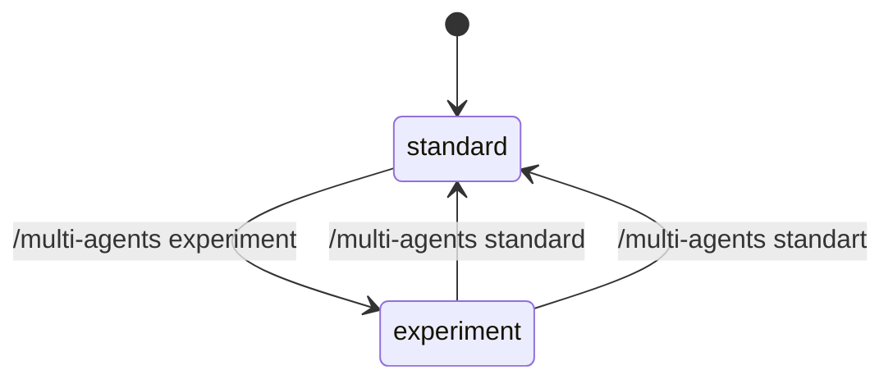

切换规则：

- `standard -> experiment`
  - 若当前没有 active map，则下一次需要 multi-agent 协作时创建 `ActionMapInstance`。
  - 若当前已有 active map，则继续使用该 map。
  - 后续 spawn/send/wait 行为由 Map Runtime 包装和约束。
- `experiment -> standard`
  - 停止对新 multi-agent 行为施加 Action Map 约束。
  - 已存在的 `ActionMapInstance` 不删除，只标记为 paused 或 detached。
  - 已运行 subagent 不应被强杀；后续按 standard mailbox 语义处理结果。
- 命令只改变 runtime 行为模式，不应清空 session、compact 历史、rollout 或已有 agent registry。

#### 模式路由

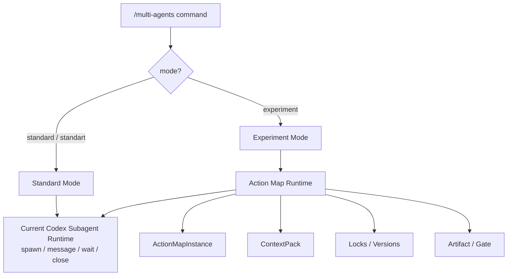

#### 工具行为差异

| 工具/行为 | standard | experiment |
| --- | --- | --- |
| `spawn_agent` | 主 agent 可直接创建子 thread | 由 ready `MapNode` 生成 assignment 后再 spawn/resume |
| `send_message` | 临时消息就是主要协作方式 | 只用于临时协调，正式事实必须写 artifact |
| `wait_agent` | 等 mailbox activity | 等 artifact ingestion / node event / gate event |
| `close_agent` | 关闭指定 subagent | 关闭 agent cursor，并释放锁、更新 node 状态 |
| 结果采纳 | 主 agent 读文本后判断 | Gate 通过后才能推进 node/phase |
| 上下文 | 由 agent 自行读取或继承 | Runtime 分配 versioned `ContextPack` |
| 并发写 | 依赖人为约束 | 由 lock/version/write scope 控制 |

这个开关是架构安全阀：实验模式可以逐步建设、测试和回退；现有用户体验不被未成熟的 Map Runtime 破坏。

### 为什么需要 Action Map Runtime

当前 Codex-style subagent 基建已经提供：

- 创建子 thread。
- 给子 agent 投递任务。
- 等 mailbox 通知。
- 关闭、恢复、列出 agent。
- 继承权限、cwd、sandbox、模型配置。

但它本质仍是“写信外包”：

```text
主 agent
  -> spawn 子 agent
  -> 子 agent 自由执行
  -> 子 agent 回一封结果信
  -> 主 agent 凭文本判断下一步
```

这种模式能提升吞吐，但不能自然形成“协同”。缺失点包括：

- 没有共享行动地图，无法判断当前任务缺哪块。
- 没有节点级上下文边界，agent 容易读全量、漏关键、或基于旧信息行动。
- 没有结构化图状态机，任务推进依赖模型自觉。
- 没有版本化读写，多个 agent 容易基于过时事实提交结论。
- 没有正式沟通介质，信息散落在 agent 私聊或 mailbox 文本里。
- 没有强制准出，低质量结果可能被主 agent 过早采纳。

Action Map Runtime 的目标是把 loose delegation 升级为 map-driven teamwork。

### 核心原则

| 原则 | 设计含义 |
| --- | --- |
| Map is the source of truth | 图状态是任务事实源，消息不能替代图状态 |
| Templates are parent maps | 维护任务类型模板，不维护一堆固定具体地图 |
| Instances are task-specific | 每次用户任务都要根据 repo、目标、约束生成实例 |
| Process freedom, boundary discipline | 节点内允许 agent 自由探索，节点间由 map 约束 |
| Context is allocated, not dumped | 给 agent 的上下文必须按节点边界分配和标版本 |
| Agents are cursors | agent 可在图上移动，不永久绑定某个节点 |
| Artifacts are durable claims | 正式结论必须沉淀为 artifact |
| Events are state transitions | 所有状态变化必须落为 MapEvent，可 replay |
| Locks protect graph truth | 节点写入必须经过锁和版本检查 |
| Direct chat is secondary | agent 沟通默认通过图，私信只做临时协调 |

### 总体架构

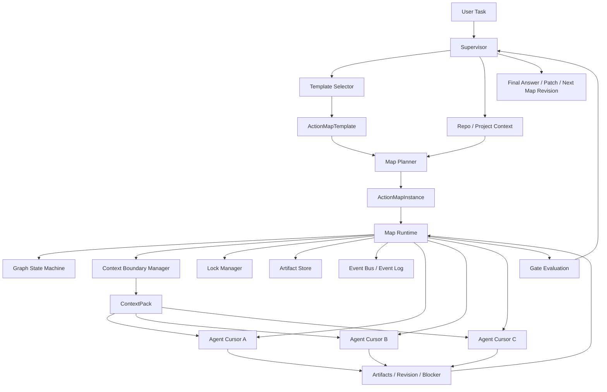

#### 分层

```text
Layer 1: Template Layer
  任务类型父类：架构优化、Bug 诊断、功能创建、重构、性能调查、发布等。

Layer 2: Instance Layer
  当前用户任务的具体行动图：节点、边、上下文、产物、风险、gate。

Layer 3: Runtime Layer
  确定性执行内核：状态机、锁、版本、事件、权限、上下文分配。

Layer 4: Agent Layer
  agent 作为执行游标进入节点，提交 artifact / revision / blocker。

Layer 5: Viewer / Verifier Layer
  只读批判和验证，不直接改图，只提交 concern / verification artifact。
```

### 与 Skills 的关系

Skills 和 Action Map 都像 playbook，但强度不同。

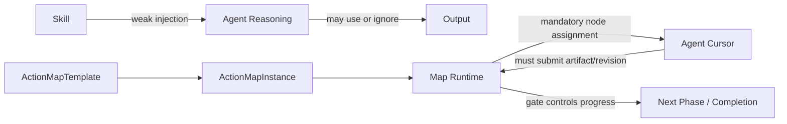

| 维度 | Skill | Action Map |
| --- | --- | --- |
| 生命周期 | 可复用知识包 | 单次任务 runtime 实例 |
| 注入方式 | prompt/context 弱注入 | runtime 强约束 |
| 是否有状态 | 通常没有 | 有图状态、节点状态、版本 |
| 是否可阻断推进 | 通常不能 | gate 可阻断 phase/node |
| 是否要求产物 | 不天然要求 | 节点必须提交 artifact |
| 是否可 replay | 依赖外部日志 | event sourcing 原生支持 |
| 主要作用 | 提升 agent 能力 | 组织小队协作 |

Skill 可以参与模板选择和节点执行。例如 `architecture-scan` skill 可以作为 `ArchitectureOptimizationMapTemplate` 的知识来源，但不能替代 Map Runtime 的状态和约束。

### Action Map Template

模板是父类地图。它定义某类任务的核心方法论，但不绑定具体项目结构。

```rust
pub struct ActionMapTemplate {
    pub id: TemplateId,
    pub name: String,
    pub task_kinds: Vec<TaskKind>,
    pub default_phases: Vec<PhaseTemplate>,
    pub check_surfaces: Vec<CheckSurface>,
    pub artifact_contracts: Vec<ArtifactContract>,
    pub gate_rules: Vec<GateRule>,
    pub revision_rules: Vec<RevisionRule>,
    pub context_policies: Vec<ContextPolicy>,
    pub lock_policies: Vec<LockPolicy>,
    pub escalation_rules: Vec<EscalationRule>,
}
```

第一阶段建议维护这些模板：

| Template | 用途 | 核心方法论 |
| --- | --- | --- |
| `ArchitectureOptimizationMapTemplate` | 架构优化、模块治理、技术债治理 | 现状建模 -> 多维质量扫描 -> 目标对齐 -> 治理方案 -> 迁移验证 |
| `BugDiagnosisMapTemplate` | 复杂 bug 诊断 | 现象固定 -> 假设生成 -> 证据收集 -> 证伪收敛 -> 根因验证 |
| `FeatureCreationMapTemplate` | 新功能设计与实现 | 需求定界 -> 脚手架/日志/测试 -> 实现切片 -> 验证闭环 |
| `RefactorMapTemplate` | 行为保持重构 | 现有行为建模 -> 风险边界 -> 小步迁移 -> 回归验证 |
| `PerformanceInvestigationMapTemplate` | 性能问题 | 基线指标 -> 热点定位 -> 假设实验 -> 改动验证 |
| `ReleaseMapTemplate` | 发布打包 | 版本/产物 -> 构建签名 -> smoke -> 发布记录 |

#### 架构优化模板示例

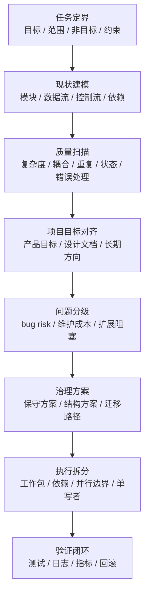

模板只提供骨架。实际任务实例可以把“质量扫描”展开成多个项目相关节点：

```text
quality_scan
  -> module_boundary_scan
  -> dependency_cycle_scan
  -> state_ownership_scan
  -> logging_gap_scan
  -> test_gap_scan
  -> public_api_stability_scan
```

### Action Map Instance

实例是当前用户任务的小队运行状态。

```rust
pub struct ActionMapInstance {
    pub id: ActionMapId,
    pub template_id: TemplateId,
    pub user_goal: String,
    pub project_context_ref: ContextRef,
    pub status: MapStatus,
    pub current_phase: PhaseId,
    pub graph_version: GraphVersion,
    pub nodes: Vec<MapNode>,
    pub edges: Vec<MapEdge>,
    pub artifacts: Vec<ArtifactRef>,
    pub gates: Vec<MapGate>,
    pub open_questions: Vec<OpenQuestion>,
    pub risks: Vec<RiskRecord>,
    pub revisions: Vec<MapRevisionRecord>,
}
```

`MapStatus`：

```text
created
  -> instantiated
  -> running
  -> revising
  -> blocked
  -> verifying
  -> completed
  -> archived
  -> aborted
```

### Map Node

节点是一个行动坐标，不是一个固定 agent。agent 可以进入、离开、移交、回到节点。

```rust
pub struct MapNode {
    pub id: NodeId,
    pub phase: PhaseId,
    pub title: String,
    pub purpose: String,
    pub status: NodeStatus,
    pub dependencies: Vec<NodeId>,
    pub allowed_agent_capabilities: Vec<Capability>,
    pub context_boundary: MapNodeContext,
    pub required_artifacts: Vec<ArtifactKind>,
    pub exit_criteria: Vec<ExitCriterion>,
    pub lock_policy: NodeLockPolicy,
    pub version: NodeVersion,
}
```

节点状态机：

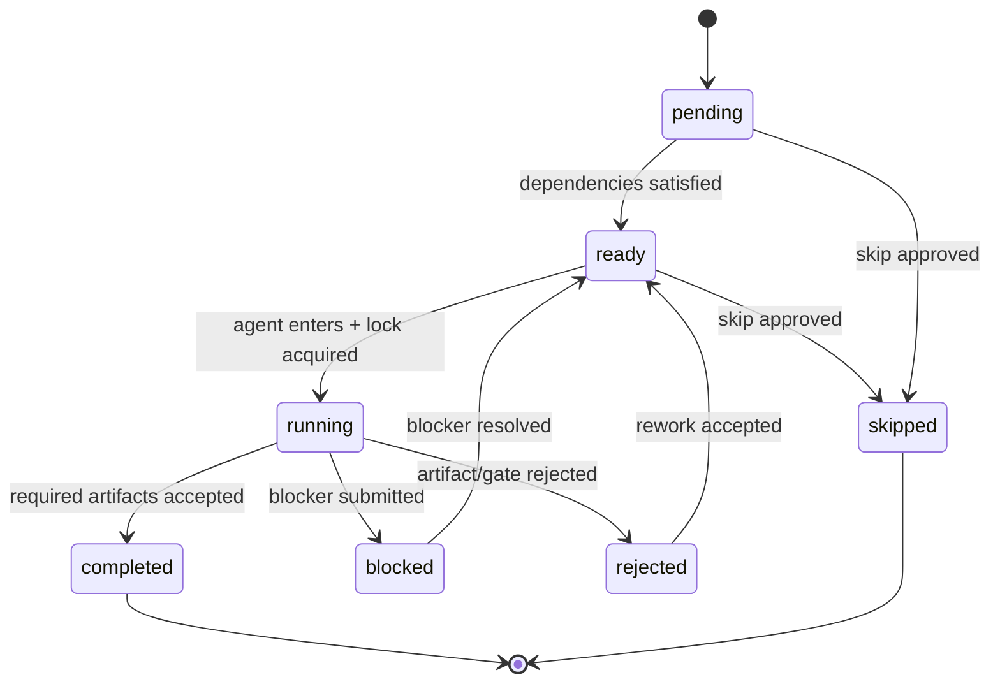

### Agent 是 Cursor，不是节点

agent 在 Action Map 中是可移动执行游标。

```rust
pub struct AgentCursor {
    pub agent_id: AgentId,
    pub current_node_id: Option<NodeId>,
    pub previous_nodes: Vec<NodeId>,
    pub held_locks: Vec<LockId>,
    pub visible_context_version: ContextVersion,
    pub active_assignment: Option<AssignmentId>,
    pub status: AgentCursorStatus,
}
```

移动规则：

```text
agent.enter_node(node):
  - node.status must be ready or running-with-compatible-read
  - agent must have required capabilities
  - ContextPack must be issued for node current version
  - write or intent lock must be acquired if assignment can mutate node

agent.leave_node(node):
  - release read/write/intent locks
  - persist cursor event
  - mark unfinished assignment as returned / blocked / transferred

agent.request_move(target_node):
  - runtime checks graph dependency, permissions, context freshness
  - if accepted, new ContextPack is minted
```

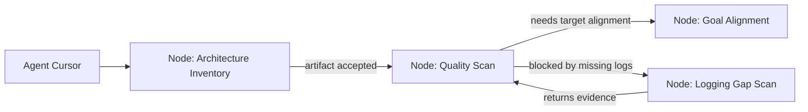

这允许同一个 agent 在多个节点间移动，同时保留每次移动时的上下文版本和锁记录。

### 上下文边界

每个节点必须声明上下文边界。Context Manager 根据节点、图状态和 agent 权限生成 `ContextPack`。

```rust
pub struct MapNodeContext {
    pub required_sources: Vec<ContextSource>,
    pub optional_sources: Vec<ContextSource>,
    pub forbidden_sources: Vec<ContextSource>,
    pub inherited_artifacts: Vec<ArtifactRef>,
    pub output_context: Vec<ContextOutputSpec>,
    pub freshness_policy: FreshnessPolicy,
}

pub struct ContextPack {
    pub id: ContextPackId,
    pub node_id: NodeId,
    pub graph_version: GraphVersion,
    pub node_version: NodeVersion,
    pub source_versions: Vec<SourceVersion>,
    pub artifacts: Vec<ArtifactRef>,
    pub files: Vec<FileContextRef>,
    pub docs: Vec<DocContextRef>,
    pub constraints: Vec<ConstraintRef>,
    pub redactions: Vec<RedactionRecord>,
}
```

上下文不是“给越多越好”，而是要有边界和出处：

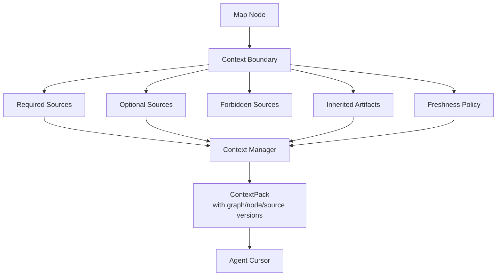

#### Freshness Policy

每个结论都必须知道自己基于哪个版本的图和上下文。

```text
fresh if:
  - graph_version == assignment.graph_version
  - node_version == assignment.node_version
  - all required artifact versions unchanged
  - all required file snapshots unchanged or explicitly refreshed

stale if:
  - upstream artifact changed
  - node dependency changed from skipped to completed
  - target file changed after ContextPack minted
  - gate decision invalidated previous assumption
```

### 读写锁与并发控制

Map Runtime 需要防止经典问题：

- agent A 基于旧图提交结论。
- agent B 已更新节点，但 agent C 仍按旧上下文继续写。
- 多个 agent 同时修改同一节点状态。
- review 结论和 implementation patch 基于不同版本。
- 私聊里达成共识，但图状态没有记录。

锁不是为了把系统变成串行，而是为了保护图状态和正式产物。

#### 锁类型

| Lock | 用途 | 典型持有者 |
| --- | --- | --- |
| `ReadLock` | 读取节点状态和 artifacts，记录读取版本 | explorer / reviewer / viewer |
| `IntentLock` | 声明准备写，防止多个 agent 同时基于旧上下文写同一节点 | implementer / planner |
| `WriteLock` | 提交 artifact、完成节点、提出局部修订 | executor / supervisor |
| `GateLock` | 评估 phase/node gate，期间冻结相关写入 | supervisor / verifier |

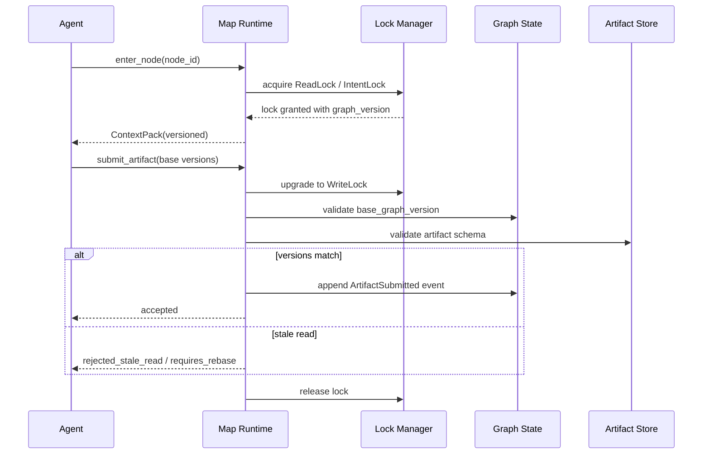

#### 版本化写入

所有正式写入都必须带 base version。

```rust
pub struct MapMutation {
    pub actor: AgentId,
    pub base_graph_version: GraphVersion,
    pub base_node_version: NodeVersion,
    pub base_artifact_versions: Vec<ArtifactVersionRef>,
    pub operation: MapOperation,
}
```

提交结果：

```text
accepted
rejected_stale_read
requires_rebase
conflict_detected
permission_denied
schema_invalid
gate_blocked
```

这与 Optimistic Offline Lock 的思想一致：允许并发读取和执行，但提交前必须验证没有覆盖别人已经改变的状态。

### 图状态机与 Event Sourcing

Map Runtime 不应直接覆盖状态，而应追加事件，然后由 reducer 得到当前图状态。

```rust
pub enum MapEvent {
    MapCreated,
    TemplateSelected,
    MapInstantiated,
    NodeAdded,
    NodeStarted,
    ContextPackIssued,
    LockAcquired,
    ArtifactSubmitted,
    ArtifactAccepted,
    ArtifactRejected,
    NodeBlocked,
    NodeCompleted,
    RevisionProposed,
    RevisionAccepted,
    RevisionRejected,
    ConflictRaised,
    GateEvaluated,
    PhaseAdvanced,
    MapCompleted,
}
```

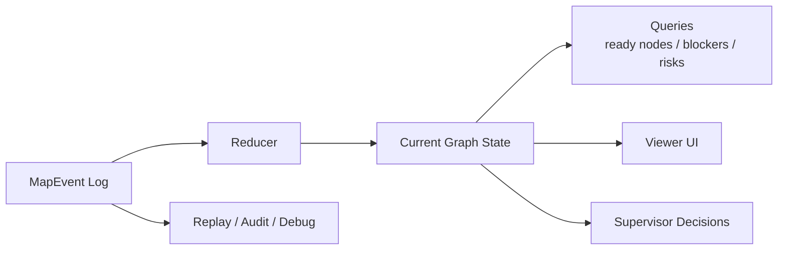

好处：

- 可 replay：重建任意时刻小队如何行动。
- 可审计：知道哪个 agent 在哪个版本提交了什么。
- 可 UI 展示：Web Viewer 可以直接渲染图状态。
- 可调试：multi-agent 失败时可以定位是上下文分配、锁冲突、gate 过早，还是 artifact 质量问题。

### Map Revision

地图实例不是死流程。agent 可以提出修改，但不能直接改图。

```rust
pub struct MapRevisionProposal {
    pub id: RevisionId,
    pub proposer: AgentId,
    pub base_graph_version: GraphVersion,
    pub kind: RevisionKind,
    pub rationale: String,
    pub evidence_refs: Vec<ArtifactRef>,
    pub risk_impact: RiskImpact,
}

pub enum RevisionKind {
    AddNode,
    SplitNode,
    SkipNode,
    ReorderEdge,
    ChangeContextBoundary,
    ChangeRequiredArtifact,
    EscalateToUser,
}
```

修订状态机：

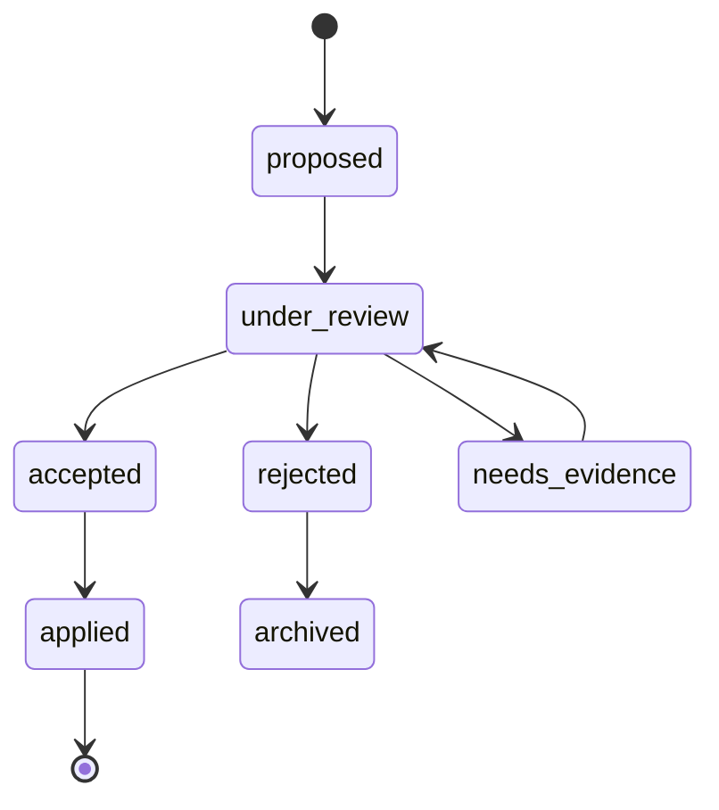

修订规则：

- 添加节点必须说明为什么当前地图覆盖不足。
- 跳过节点必须提交 `skip_reason` 和风险影响。
- 改上下文边界必须使所有受影响 assignment 失效或刷新。
- 改依赖边必须重新计算 ready/running 节点。
- 高风险修订必须触发 Viewer concern 或 Verifier check。

### Gate 设计

Gate 是 Map Runtime 的准出机制。

```rust
pub struct MapGate {
    pub id: GateId,
    pub scope: GateScope,
    pub required_artifacts: Vec<ArtifactKind>,
    pub checks: Vec<GateCheck>,
    pub blocking_concerns: Vec<ConcernRef>,
    pub status: GateStatus,
}
```

Gate 范围：

```text
node_gate
phase_gate
map_completion_gate
patch_apply_gate
user_escalation_gate
```

典型规则：

```text
node can complete if:
  - required artifacts accepted
  - exit criteria satisfied
  - no stale context
  - no unresolved blocking concern

phase can advance if:
  - all required nodes completed or explicitly skipped
  - critical risks = 0
  - conflicts resolved
  - verifier checks pass when required

patch can apply if:
  - patch artifact is selected
  - write scope is exclusive
  - tests/logging plan exists
  - reviewer/verifier concerns resolved
```

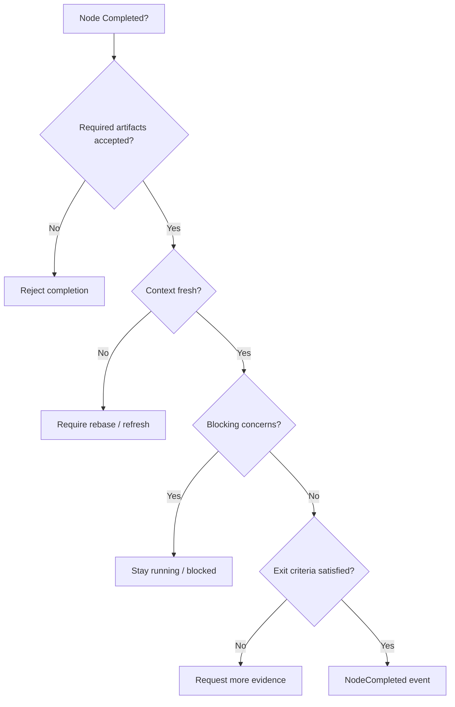

### Agent 间沟通

默认结论：**图本身就是主要沟通介质。**

agent 不应通过自由私聊形成事实共识，因为这会让 Supervisor、Viewer、replay 和后续 agent 无法可靠复盘。正式沟通应该通过图上的 durable objects 完成：

| 需求 | 正式沟通对象 |
| --- | --- |
| 发现问题 | `FindingArtifact` |
| 请求别人处理 | `DependencyRequest` |
| 反对某个结论 | `DisputeArtifact` |
| 需要改地图 | `MapRevisionProposal` |
| 遇到阻塞 | `BlockerArtifact` |
| 需要验证 | `VerificationRequest` |
| 临时风险 | `ViewerConcern` |

直接消息仍可存在，但只能做临时协调：

```text
allowed:
  - clarification
  - handoff notice
  - request_recheck
  - notify_conflict

not allowed as source of truth:
  - final conclusion
  - node completion proof
  - risk dismissal
  - patch selection
  - gate pass reason
```

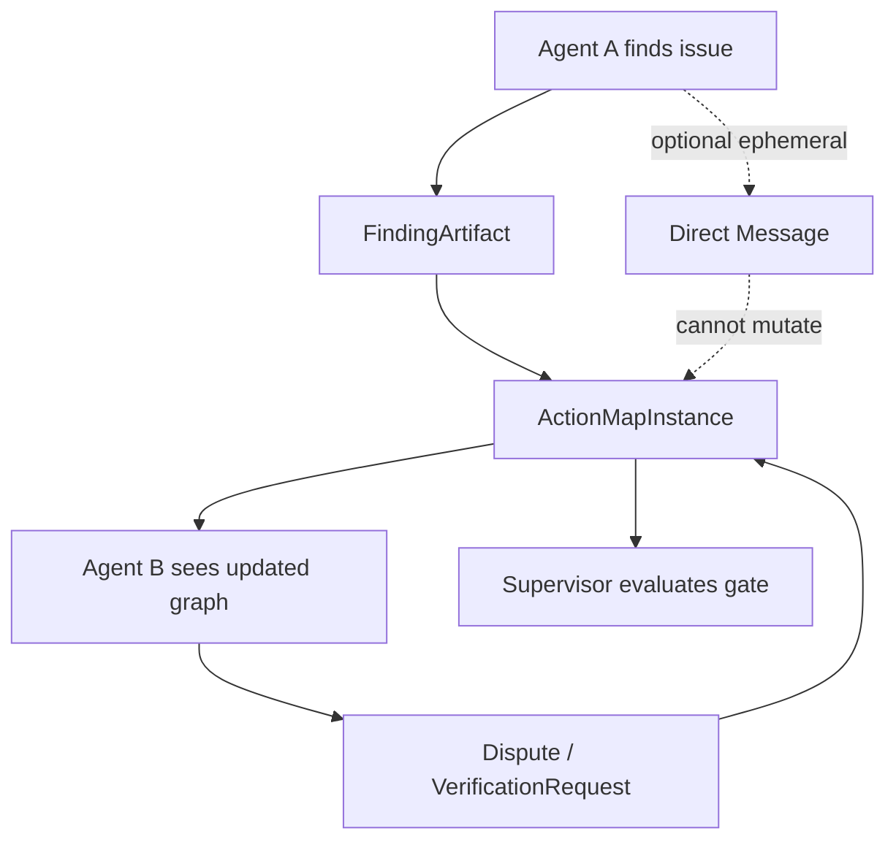

原则：

```text
Map is the source of truth.
Messages are ephemeral hints.
Artifacts are durable claims.
Events are state transitions.
```

### 权限设计

不要先固定角色，先定义 capability。角色只是 capability set。

| Capability | 含义 |
| --- | --- |
| `can_read_node` | 可读取节点和 artifacts |
| `can_enter_node` | 可进入节点执行 |
| `can_submit_artifact` | 可提交 artifact |
| `can_propose_revision` | 可提出地图修订 |
| `can_accept_revision` | 可接受地图修订 |
| `can_mutate_node_state` | 可变更节点状态 |
| `can_acquire_write_lock` | 可获得写锁 |
| `can_evaluate_gate` | 可评估 gate |
| `can_advance_phase` | 可推进 phase |
| `can_override_conflict` | 可处理冲突覆盖 |
| `can_apply_patch` | 可写共享 workspace |

第一阶段可以用这些权限组合：

```text
planner permission:
  can_read_node
  can_propose_revision
  can_submit_artifact

executor permission:
  can_read_node
  can_enter_node
  can_submit_artifact
  can_acquire_write_lock for assigned node

reviewer permission:
  can_read_node
  can_submit_artifact
  can_propose_revision

verifier permission:
  can_read_node
  can_submit_artifact
  can_evaluate_gate for verification gates

supervisor permission:
  can_accept_revision
  can_mutate_node_state
  can_evaluate_gate
  can_advance_phase
  can_override_conflict
  can_apply_patch

viewer permission:
  can_read_node
  can_submit_artifact(ViewerConcern)
  cannot mutate state directly
```

### Runtime 流程

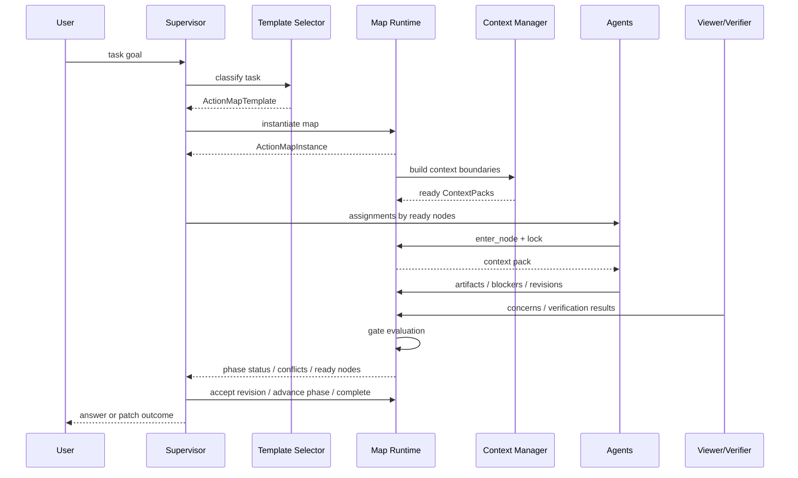

### 与现有 Codex multi-agent 基建的结合

现有基建可以保留为执行 substrate：

| Codex substrate | Map Runtime 中的对应用途 |
| --- | --- |
| `AgentControl` | 创建和管理 AgentCursor 对应的 subagent thread |
| `AgentPath` | agent cursor 的稳定路径标识 |
| `AgentRegistry` | live agent/thread 状态注册表 |
| `InterAgentCommunication` | 临时消息通道，不作为事实源 |
| mailbox | 投递 assignment、通知更新、触发 turn |
| session events | 承载 MapEvent / ArtifactEvent |
| rollout/replay | 回放 map 事件和 artifact 状态 |
| tools/sandbox/approval | capability 和写权限执行基础 |

关键变化不是替换现有 spawn/wait/send，而是在其上新增 Map Runtime：

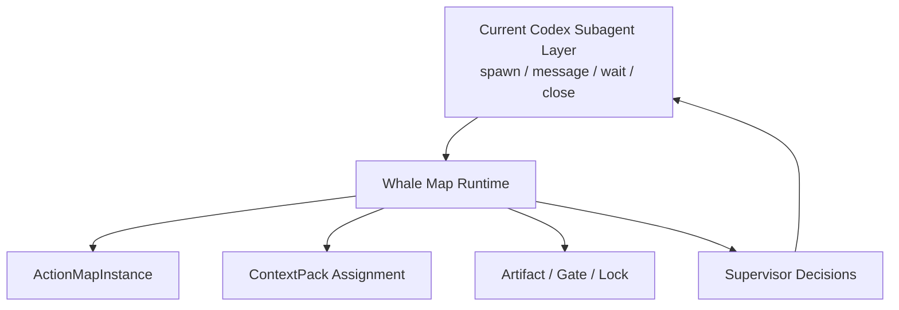

也就是说，`spawn_agent` 不再是“主 agent 临场写信”的自由动作，而应逐步变成：

```text
Supervisor selects ready MapNode
  -> Runtime issues Assignment + ContextPack
  -> AgentControl spawns/resumes subagent
  -> subagent executes within node boundary
  -> subagent submits Artifact / Revision / Blocker
  -> Runtime validates and updates map
```

该变化只在 `experiment` 模式生效。`standard` 模式必须继续保持现状，以便：

- 保留 Codex upstream 行为兼容性。
- 让实验框架可以灰度验证。
- 避免 Action Map 设计不成熟时影响常规 coding agent 使用。
- 允许同一套底座通过 slash command 做 A/B 行为对比。

### 最小可行实现路径

#### MA-MAP-0：可插拔模式开关

- 新增 `/multi-agents` slash command。
- 支持 `standard`、`standart` alias、`experiment`。
- 在 session runtime state 中记录 `MultiAgentMode`。
- 默认值为 `standard`。
- `standard` 路径必须保持当前 Codex subagent 行为不变。
- `experiment` 路径只先打开 Map Runtime 包装层，不要求一次性完成全部 gate/lock/artifact 能力。

退出条件：

- `/multi-agents` 可显示当前模式。
- `/multi-agents standard` 和 `/multi-agents standart` 都进入现状模式。
- `/multi-agents experiment` 可切换到实验模式。
- 关闭实验模式后，现有 spawn/send/wait/close 行为仍按当前代码默认逻辑运行。
- 有 session event 记录模式切换，便于 replay 和问题诊断。

#### MA-MAP-1：只读 Map Instance 与事件

- 新增 `ActionMapTemplate` / `ActionMapInstance` / `MapNode` schema。
- 支持 template 选择和实例化。
- 支持 `MapEvent` append-only log。
- Viewer/UI 可读当前 map 状态。
- agent 仍可用现有 spawn 机制，但每个任务必须关联 node。

退出条件：

- 一个架构优化任务能生成可视化行动图。
- 每个 subagent assignment 都能指向 node。
- 所有 node 状态变化都有 event。

#### MA-MAP-2：Context Boundary 和 ContextPack

- 节点声明 required/optional/forbidden sources。
- Runtime 为 assignment 生成 ContextPack。
- artifact 记录 base graph/node/context version。
- stale context 能被检测。

退出条件：

- agent 结果可追溯到上下文版本。
- 上游 artifact 改变后，下游 assignment 被标记 stale。

#### MA-MAP-3：Artifact 与 Gate

- 节点 completion 必须提交 required artifacts。
- gate 校验 artifact schema、exit criteria、blocking concern。
- `wait_agent` 的结果不再只是 mailbox activity，而要进入 artifact ingestion。

退出条件：

- 主 agent 不能仅凭自然语言把节点标 completed。
- phase advance 必须通过 gate。

#### MA-MAP-4：Locks 和 Revision

- 支持 ReadLock / IntentLock / WriteLock / GateLock。
- 支持 versioned mutation。
- 支持 MapRevisionProposal。
- 冲突进入 `requires_rebase` 或 `conflict_detected`。

退出条件：

- 两个 agent 基于同一节点旧版本提交写入时，至少一个被拒绝或要求 rebase。
- 跳过/拆分/重排节点必须有 revision 记录。

#### MA-MAP-5：图即沟通

- 引入 `DependencyRequest` / `DisputeArtifact` / `BlockerArtifact`。
- 直接消息只能作为 ephemeral hint。
- Supervisor 和 Viewer 只信任 map artifacts/events。

退出条件：

- 一个复杂任务可以不依赖 agent 私聊完成协同。
- Replay 能解释小队为什么推进、阻塞、改图或完成。

---
## 十八、对现有文档的影响

本次设计已同步：

- `docs/plans/2026-04-24-system-architecture.md`：第三章 Multi-Agent First 引用本文，第二十章 Phase 2 拆成 2A-2D。
- `docs/plans/2026-04-25-rust-first-technology-architecture.md`：Rust core 增加 SwarmRuntime / CohortScheduler / ConcurrencyGovernor / `whalecode-swarm`。
- 后续实现时 `crates/whalecode-protocol` 必须先定义 swarm event 和 artifact schema。

---

## 十九、参考来源

外部来源：

1. DeepSeek API Docs — Your First API Call: https://api-docs.deepseek.com/
   用途：确认 `deepseek-v4-flash`、`deepseek-v4-pro`、OpenAI/Anthropic compatible base URL 和旧模型 deprecation 信息。
2. DeepSeek API Docs — Models & Pricing: https://api-docs.deepseek.com/quick_start/pricing
   用途：确认 DeepSeek V4 Flash/Pro 的 1M context、384K max output、thinking、tool calls、cache hit/miss/output pricing。
3. DeepSeek API Docs — Thinking Mode: https://api-docs.deepseek.com/guides/thinking_mode
   用途：确认 thinking toggle、reasoning effort、thinking tool call 的 `reasoning_content` 回传要求。
4. DeepSeek API Docs — Tool Calls: https://api-docs.deepseek.com/guides/tool_calls
   用途：确认 thinking mode 下 tool calls 和 strict mode schema 约束。
5. DeepSeek API Docs — Context Caching: https://api-docs.deepseek.com/guides/kv_cache/
   用途：确认 repeated prefix cache、usage 中 cache hit/miss tokens、64-token unit 和 best-effort 特性。
6. DeepSeek API Docs — Rate Limit: https://api-docs.deepseek.com/quick_start/rate_limit/
   用途：确认动态并发限制、HTTP 429、SSE keep-alive 和 10 分钟未开始推理关闭连接。
7. DeepSeek API Docs — Create Chat Completion: https://api-docs.deepseek.com/api/create-chat-completion
   用途：确认 model enum、thinking 参数、usage 字段和 reasoning token 字段。
8. AutoGen: Enabling Next-Gen LLM Applications via Multi-Agent Conversation: https://arxiv.org/abs/2308.08155
   用途：参考可编程多 Agent conversation、agent 能力组合、tool/human/LLM 混合模式。
9. CAMEL: Communicative Agents for "Mind" Exploration of Large Language Model Society: https://arxiv.org/abs/2303.17760
   用途：参考 role-playing、自主协作和 agent society 行为观察。
10. ChatDev: Communicative Agents for Software Development: https://arxiv.org/abs/2307.07924
    用途：参考软件开发阶段链、communicative dehallucination 和设计/编码/测试协作。
11. MetaGPT: Meta Programming for A Multi-Agent Collaborative Framework: https://arxiv.org/abs/2308.00352
    用途：参考 SOP、assembly line、多角色协作，以及朴素 LLM 串联的 cascading hallucination 风险。
12. AgentVerse: Facilitating Multi-Agent Collaboration and Exploring Emergent Behaviors: https://arxiv.org/abs/2308.10848
    用途：参考动态群体组成和正负社会行为观测。
13. Self-Consistency Improves Chain of Thought Reasoning in Language Models: https://arxiv.org/abs/2203.11171
    用途：参考独立采样多条推理路径再聚合，而不是贪婪单路径。
14. More Agents Is All You Need: https://arxiv.org/abs/2402.05120
    用途：参考 sampling-and-voting 式 agent scaling，并限制其适用边界。
15. Improving Factuality and Reasoning in Language Models through Multiagent Debate: https://arxiv.org/abs/2305.14325
    用途：参考 multi-agent debate 对推理和事实性的潜在提升。
16. Can LLM Agents Really Debate? A Controlled Study of Multi-Agent Debate in Logical Reasoning: https://arxiv.org/abs/2511.07784
    用途：参考 debate 的限制、majority pressure 风险，以及推理强度和多样性的重要性。
17. AgentCoder: Multi-Agent-based Code Generation with Iterative Testing and Optimisation: https://arxiv.org/abs/2312.13010
    用途：参考 Programmer / Test Designer / Test Executor 分离的代码生成闭环。
18. MapCoder: Multi-Agent Code Generation for Competitive Problem Solving: https://openreview.net/forum?id=lG61pruG1Iz
    用途：参考 retrieval、planning、code generation、debugging 的多 Agent 程序合成循环。
19. LLM-Based Multi-Agent Systems for Software Engineering: Literature Review, Vision and the Road Ahead: https://arxiv.org/abs/2404.04834
    用途：参考 LLM-MAS 在 SDLC 的研究地图、能力边界和可信协同缺口。
20. Designing LLM-based Multi-Agent Systems for Software Engineering Tasks: Quality Attributes, Design Patterns and Rationale: https://arxiv.org/abs/2511.08475
    用途：参考 SE 多 Agent 的质量属性、角色协作模式和设计理由。
21. Understanding Agent Scaling in LLM-Based Multi-Agent Systems via Diversity: https://openreview.net/forum?id=9BN2W5BCfE
    用途：参考同质 agent 饱和、多样性带来非冗余信息通道、effective channel 估算。

22. Anthropic — How we built our multi-agent research system: https://www.anthropic.com/engineering/built-multi-agent-research-system
    用途：参考 lead agent 规划并行委派子 agent 的收益和协调挑战；Whale 用 Action Map 约束自由委派。
23. Microsoft AutoGen — Selector Group Chat: https://microsoft.github.io/autogen/stable/user-guide/agentchat-user-guide/selector-group-chat.html
    用途：参考动态选择下一参与者；Whale 将选择依据收敛到 map node readiness。
24. OpenAI Agents SDK — Handoffs: https://openai.github.io/openai-agents-js/guides/handoffs/
    用途：参考 delegation/handoff 语义；Whale 将 handoff 建模为 node assignment。
25. OpenAI Agents SDK — Guardrails: https://openai.github.io/openai-agents-js/guides/guardrails/
    用途：参考 guardrail 机制；Whale 将 guardrail 扩展为 node/phase/tool gate。
26. Martin Fowler — Optimistic Offline Lock: https://martinfowler.com/eaaCatalog/optimisticOfflineLock.html
    用途：参考长事务并发协作中的 stale write 检测，支撑 versioned mutation。
27. Martin Fowler — Event Sourcing: https://www.martinfowler.com/eaaDev/EventSourcing.html
    用途：参考 append-only event log、状态回放和审计，支撑 MapEvent 设计。
本地参考：

| 参考项目 | 本地路径 | 用途 |
|----------|----------|------|
| Codex CLI | `tmp/whalecode-refs/codex-cli` | mailbox、tool parallel gate、context manager、session/thread history |
| OpenCode | `tmp/whalecode-refs/opencode` | permission request、session service、file edit safety |
| Pi | `tmp/whalecode-refs/pi` | agent loop、event bus、JSONL session、web-ui |
| Claude Code from Scratch | `tmp/whalecode-refs/cc-from-scratch` | subagent、skills、MCP 最小边界 |

---

## 二十、执行结论

WhaleCode 的多 Agent 设计应升级为群体协同架构：

1. 用 Flash agent 做大规模并行探索、候选生成和局部实现。
2. 用 Pro agent 做少数关键裁判、合成、根因收敛和对抗审查。
3. 用 DiversityPolicy 确保群体宽度变成非冗余信息通道，而不是同质重复。
4. 用 SharedTaskPack + stable prefix 提升上下文质量和 cache hit 概率。
5. 用 Tournament / Evidence Race / Patch League 把数量转化为质量。
6. 用 EvidenceWeightedConsensus 和 Anti-ConformityProtocol 抵抗错误多数和少数派压制。
7. 用 ConcurrencyGovernor 和 SwarmBudget 防止成本、429 和延迟失控。
8. 用 Artifact-first Message Bus 保持上下文隔离和可 replay。
