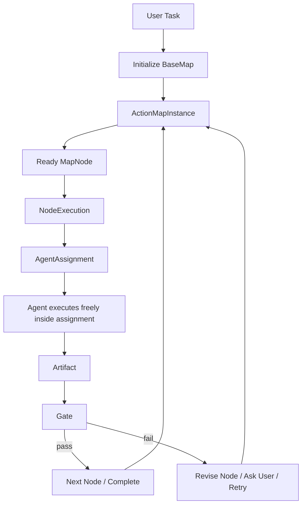
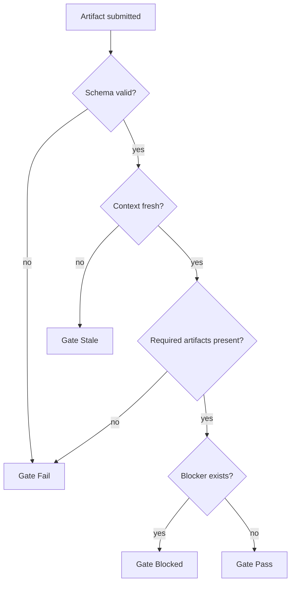

# WhaleCode Multi-Agent 架构设计

日期：2026-04-25
更新：2026-04-30

## 结论

WhaleCode 的 multi-agent 第一版只验证一个核心假设：

```text
Action Map + 结构化 Artifact + Gate
是否比当前写信式 subagent 委派更稳定、更可控、更可复盘。
```

除此之外，所有未经真实任务验证、缺乏强推理实证的概念都不进入核心 runtime。

本文只描述当前要实现和验证的最小 runtime。未被真实任务证明必要的组织形态、投票机制、竞争机制和控制面机制，不在本文保留。

## 最高原则：Occam-first

设计约束：

- 不提前实体化没有被验证的协作概念。
- 不用角色清单解释系统能力。
- 不把 prompt 约定伪装成 runtime contract。
- 不为了“multi-agent first”而制造多 agent 仪式。
- 不维护两套表达同一规则的对象。
- 不让实验模式破坏当前可用的 Codex subagent 默认行为。
- 不设计全局质量分。复杂 agent 任务没有客观准确的单一质量分，系统只能记录证据、验证结果、阻塞点和人工/模型审查意见。

任何新 runtime 概念进入核心前，必须能回答：

```text
+ 没有它，当前系统出现了什么明确失败？
+ 这个失败是否能在真实任务或最小实验中复现？
+ 引入它以后，是否能通过可复现失败、可观察症状或明确人工反馈证明它减少了问题，而不是制造复杂度？
```

答不上来，就不进入核心设计。

## 模式开关

Multi-agent 框架必须可插拔。

```text
/multi-agents standard
  当前默认模式。
  继续使用 Codex-style subagent/thread/message/wait 行为。
  主 agent 可直接 spawn/send/wait/close。
  不强制 Action Map、Artifact、Gate。

/multi-agents standart
  兼容拼写别名，行为等同 standard。
  CLI 应提示 canonical name 是 standard。

/multi-agents experiment
  实验模式。
  启用 Action Map Runtime。
  后续所有 agent 行为必须绑定 map。
```

第一阶段状态应是 session-scoped，不改变全局默认值。runtime 只需要记录当前模式、active map id 和切换 turn。

切换规则：

- `standard -> experiment`：下一次需要 multi-agent 协作时创建或复用 `ActionMapInstance`。
- `experiment -> standard`：停止对新行为施加 Action Map 约束；已运行 subagent 不强杀。
- 切换不清空 session、rollout、compact 历史或 agent registry。
- 每次切换必须写 session event，便于 replay。

Experiment 模式的硬约束：

- agent 每次行动都必须由 map 驱动。
- 行动可以绑定已有 `ActionMapInstance`。
- 如果没有可用 map，runtime 必须先从 `BaseMap` 新建 `ActionMapInstance`。
- 无 map 绑定时，agent 不允许 spawn、接收 assignment、执行工具或提交结果。
- 任何自然语言 follow-up 如果改变任务目标，必须先更新或新建 map，再继续行动。

## 最小运行模型

核心链路只有这些对象：

```text
UserTask
  -> BaseMap
  -> ActionMapInstance
  -> MapNode
  -> NodeExecution
  -> AgentAssignment
  -> Artifact
  -> Gate
  -> MapEvent
```

这些对象的职责边界：

| 对象 | 职责 |
| --- | --- |
| `BaseMap` | 第一版唯一基础地图，只给 agent 一个组织任务的起点 |
| `ActionMapInstance` | 当前任务的小队行动图和事实源 |
| `MapNode` | 一个可执行行动点 |
| `NodeExecution` | 某个节点本次如何执行 |
| `AgentAssignment` | 发给 agent 的具体工作包 |
| `Artifact` | agent 提交的结构化产物，记录证据、结论和限制 |
| `Gate` | 根据可检查条件判断节点或阶段是否可推进 |
| `MapEvent` | 状态变化记录，用于 replay 和审计 |

系统主循环：



并行只是 `NodeExecution` 的一种策略，不再单独抽象成一套组织系统。

## BaseMap

第一版只设计唯一一个 `BaseMap`。它不是领域 map，也不试图覆盖架构、Debug、Feature、Refactor 等不同方法论。

`BaseMap` 的目的只有一个：验证 Action Map Runtime 能否正确组织一次复杂任务。

它给 agent 一个最小起点：

```text
clarify_task
  -> inspect_context
  -> plan_work
  -> execute_work
  -> verify_result
  -> report_result
```

这些节点不是严格流程。runtime 可以根据任务实际情况跳过、拆分或补充节点，但第一版不维护多个父类模板。

`BaseMap` 只定义：

- 初始节点集合。
- 节点之间的默认依赖。
- 每类节点的最小 artifact 要求。
- 最小 gate 条件。

领域 map 是否有价值，必须等 `BaseMap` 跑过真实任务后再判断。

## Action Map Instance

Instance 是当前任务的小队运行状态，也是 experiment 模式的事实源。

```rust
pub struct ActionMapInstance {
    pub id: ActionMapId,
    pub base_map_version: BaseMapVersion,
    pub user_goal: String,
    pub status: MapStatus,
    pub graph_version: GraphVersion,
    pub nodes: Vec<MapNode>,
    pub artifacts: Vec<ArtifactRef>,
    pub events: Vec<MapEventRef>,
}
```

`MapStatus` 第一版只需要：

```text
created -> running -> completed
              |
              -> blocked
              -> paused
              -> aborted
```

不要先做复杂 phase machine。是否需要 phase，等真实任务证明 node/gate 不够用以后再引入。

## MapNode

Node 是行动点，不是角色，也不是 agent。

```rust
pub struct MapNode {
    pub id: NodeId,
    pub title: String,
    pub purpose: String,
    pub status: NodeStatus,
    pub dependencies: Vec<NodeId>,
    pub context_boundary: ContextBoundary,
    pub required_artifacts: Vec<ArtifactKind>,
    pub gate: GateSpec,
    pub version: NodeVersion,
}
```

`NodeStatus` 第一版只需要：

```text
pending -> ready -> running -> completed
                       |
                       -> blocked
ready -> skipped
```

节点完成必须满足：

- required artifacts 已提交。
- gate 通过。
- 没有 stale context。
- 没有 unresolved blocker。

## NodeExecution

`NodeExecution` 只描述一个节点本次怎么执行。

```rust
pub struct NodeExecution {
    pub id: ExecutionId,
    pub node_id: NodeId,
    pub strategy: ExecutionStrategy,
    pub assignments: Vec<AgentAssignment>,
    pub expected_artifacts: Vec<ArtifactKind>,
}

pub enum ExecutionStrategy {
    Single,
    Parallel,
    Review,
    Verify,
}
```

第一版只保留四种策略：

| Strategy | 用途 |
| --- | --- |
| `Single` | 一个 agent 执行节点 |
| `Parallel` | 多个 agent 分片执行同一节点 |
| `Review` | 对已有 artifact 做审查 |
| `Verify` | 对已有 artifact 做验证 |

第一版不做候选竞赛、投票和共识聚合。这些不是最小验证闭环的一部分。

策略选择由 runtime 根据节点决定：

```text
small/simple node -> Single
large/read-only scan -> Parallel
artifact needs critique -> Review
artifact needs proof -> Verify
```

## AgentAssignment

Agent 是执行资源，不是固定角色。

```rust
pub struct AgentAssignment {
    pub id: AssignmentId,
    pub map_id: ActionMapId,
    pub node_id: NodeId,
    pub lease_id: AssignmentLeaseId,
    pub objective: String,
    pub context_pack: ContextPack,
    pub allowed_tools: Vec<ToolName>,
    pub expected_artifact: ArtifactKind,
    pub constraints: Vec<String>,
}
```

agent 可以在 map 上移动，但每次移动都必须生成新的 assignment 和 context pack。assignment 必须同时绑定 `map_id`、`node_id` 和 `lease_id`；只绑定 agent 或 thread 不算 map 驱动。

## Map 驱动执行机制

“每次行动都由 map 驱动”必须由 runtime 强制，不能依赖 agent 自觉。

### 入口拦截

Experiment 模式下，所有会导致 agent 行动的入口都先经过 `MapActionGuard`：

```text
user follow-up
spawn_agent
send_message / followup_task
tool call
artifact submit
close / complete node
```

`MapActionGuard` 的决策：

```text
if mode == standard:
  allow current Codex behavior

if mode == experiment and no active map:
  create ActionMapInstance from BaseMap
  append MapCreated
  continue through map-bound path

if mode == experiment and action has no map_id/node_id/lease_id:
  reject action or convert it into a map update request
```

### Assignment Lease

`AssignmentLease` 是 agent 执行节点的临时许可。没有有效 lease，agent 不能执行工具或提交结果。

```rust
pub struct AssignmentLease {
    pub id: AssignmentLeaseId,
    pub map_id: ActionMapId,
    pub node_id: NodeId,
    pub assignment_id: AssignmentId,
    pub agent_id: AgentId,
    pub issued_at_graph_version: GraphVersion,
    pub issued_at_node_version: NodeVersion,
    pub allowed_tools: Vec<ToolName>,
    pub status: LeaseStatus,
}
```

`LeaseStatus`：

```text
active -> completed
       -> expired
       -> revoked
       -> stale
```

lease 失效条件：

- map 被 paused 或 aborted。
- node 已 completed、skipped 或 blocked。
- node version 改变且 assignment 未刷新。
- agent 尝试使用未授权工具。
- agent 尝试提交不匹配的 artifact 类型。

### Tool Guard

Experiment 模式下，工具调用必须带当前 lease 上下文。

```text
tool_call_allowed if:
  lease.status == active
  tool.name in lease.allowed_tools
  current_graph_version == lease.issued_at_graph_version
  current_node_version == lease.issued_at_node_version
```

失败时不要让模型“自己解释继续做”，runtime 直接返回结构化错误：

```text
MapActionRejected {
  reason: missing_map | missing_node | missing_lease | stale_lease | tool_not_allowed
  required_recovery: create_map | refresh_assignment | request_node_update
}
```

### Artifact Submit Guard

artifact 提交必须引用 assignment：

```text
artifact.map_id == assignment.map_id
artifact.node_id == assignment.node_id
artifact.assignment_id == assignment.id
artifact.base_graph_version == assignment.context_pack.graph_version
artifact.base_node_version == assignment.context_pack.node_version
artifact.kind == assignment.expected_artifact
```

不满足时，artifact 进入 rejected，不允许进入 gate。

### Prompt 注入不是约束

assignment 可以注入到 agent prompt 中，帮助模型理解当前 map/node：

```text
Current map: <map_id>
Current node: <node_id>
Assignment: <assignment_id>
Expected artifact: <kind>
Allowed tools: <tools>
```

但这只是辅助。真正约束来自 `MapActionGuard`、`AssignmentLease`、`Tool Guard` 和 `Artifact Submit Guard`。

### 恢复策略

如果 agent 试图越过 map 行动：

- 缺 map：创建 `BaseMap` 实例，然后重新生成 assignment。
- 缺 node：让 runtime 选择 ready node，或创建 clarify/update node。
- lease stale：刷新 context pack，重新发 assignment。
- tool 不允许：返回拒绝，并要求 agent 提交 `Blocker` 或请求 node update。
- 用户改变目标：暂停当前节点，更新 map，再生成新 assignment。

这些恢复都必须写 MapEvent。

## ContextPack

上下文必须由 runtime 分配，不能让 agent 无限自由继承所有材料。

```rust
pub struct ContextPack {
    pub id: ContextPackId,
    pub graph_version: GraphVersion,
    pub node_version: NodeVersion,
    pub required_sources: Vec<ContextSource>,
    pub artifacts: Vec<ArtifactRef>,
    pub constraints: Vec<String>,
}
```

第一版只做版本检查：

```text
fresh if:
  assignment.graph_version == current.graph_version
  assignment.node_version == current.node_version
  required artifact versions unchanged

stale if:
  upstream artifact changed
  node status changed
  relevant file changed after context pack was issued
```

如果 stale，artifact 不能直接通过 gate，必须刷新或重跑。

## Artifact

正式结论必须是 artifact，不能只是 mailbox 文本。

```rust
pub struct ArtifactEnvelope<T> {
    pub id: ArtifactId,
    pub node_id: NodeId,
    pub assignment_id: AssignmentId,
    pub producer: AgentId,
    pub kind: ArtifactKind,
    pub base_graph_version: GraphVersion,
    pub base_node_version: NodeVersion,
    pub evidence_refs: Vec<ArtifactRef>,
    pub limitations: Vec<String>,
    pub body: T,
}
```

第一版 artifact 类型只保留：

| Artifact | 用途 |
| --- | --- |
| `Finding` | 文件、符号、日志、事实证据 |
| `Analysis` | 对事实的解释或方案分析 |
| `PatchProposal` | 候选改动说明或 patch 引用 |
| `ReviewResult` | 对 artifact 的审查意见 |
| `VerificationResult` | 测试、构建、复现、静态检查结果 |
| `Blocker` | 阻塞原因和需要的输入 |

不做额外评分、投票或共识类产物。

## Gate

Gate 是唯一准出机制。

Gate 不评估“质量分”，只检查明确条件是否满足。它可以阻断明显缺证据、上下文过期、验证缺失或存在 blocker 的节点，但不能声称某个复杂结果已经被客观量化为“高质量”。

```rust
pub struct GateSpec {
    pub required_artifacts: Vec<ArtifactKind>,
    pub checks: Vec<GateCheck>,
}

pub enum GateResult {
    Pass,
    Fail,
    Blocked,
    Stale,
}
```

第一版 gate 只检查：

- artifact 类型是否齐全。
- artifact schema 是否有效。
- base version 是否仍然 fresh。
- required verification 是否通过。
- 是否存在 blocker。
- artifact 是否显式记录关键限制和未验证部分。



## MapEvent

状态变化必须是 append-only event。

```rust
pub enum MapEvent {
    ModeChanged,
    MapCreated,
    NodeAdded,
    NodeStarted,
    AssignmentIssued,
    AssignmentLeaseIssued,
    AssignmentLeaseRevoked,
    MapActionRejected,
    ArtifactSubmitted,
    GateEvaluated,
    NodeCompleted,
    NodeBlocked,
    MapCompleted,
}
```

第一版不要做完整 event sourcing 框架，但事件必须足够 replay 当前任务的关键决策。

## 通信规则

图是主要沟通介质。

```text
Map is the source of truth.
Messages are hints.
Artifacts are durable claims.
Events are state transitions.
```

允许直接消息，但直接消息不能：

- 标记节点完成。
- 证明风险消失。
- 选择 patch。
- 推进 gate。
- 成为最终事实来源。

如果消息内容影响任务结论，必须转成 artifact。

## 与当前 Codex 基建的关系

现有 Codex subagent 机制继续作为执行底座：

| Codex substrate | experiment 模式中的用途 |
| --- | --- |
| `AgentControl` | 创建和管理 subagent thread |
| `AgentPath` | agent 的稳定路径标识 |
| `AgentRegistry` | live agent/thread 状态 |
| mailbox | 临时通知和唤醒 |
| session events | 承载 MapEvent |
| tools/sandbox/approval | 执行工具和权限边界 |
| tool handlers | 插入 `Tool Guard`，拒绝无 lease 或越权工具调用 |

`standard` 模式不变。

`experiment` 模式只是包一层：

```text
Ready MapNode
  -> NodeExecution
  -> AgentAssignment + ContextPack
  -> existing spawn/send/wait runtime
  -> Artifact ingestion
  -> Gate
```

## MVP 实施顺序

### MA-0：模式开关

- 实现 `/multi-agents standard`。
- 实现 `/multi-agents standart` alias。
- 实现 `/multi-agents experiment`。
- session state 记录当前模式。
- 模式切换写 event。
- `standard` 行为保持现状。
- `experiment` 模式下无 active map 时自动从 `BaseMap` 创建 map。
- 所有 agent 行动入口接入 `MapActionGuard`。

验收：关闭 experiment 后，当前 spawn/send/wait/close 行为不变；开启 experiment 后，没有 map 绑定的 agent 行动会被拒绝或先触发 map 创建。

### MA-1：Map 与 Node

- 定义 `ActionMapInstance`。
- 定义 `MapNode`。
- 根据用户任务从唯一 `BaseMap` 初始化最小 map。
- 支持查看当前 map。

验收：一个复杂任务能从 `BaseMap` 初始化出 3-8 个可解释节点，并允许 runtime 根据实际任务跳过、拆分或补充节点。

### MA-2：Assignment 与 ContextPack

- Ready node 可生成 assignment。
- assignment 携带 context pack。
- assignment 生成 active lease。
- 工具调用必须通过 lease 校验。
- artifact 记录 base version。
- stale artifact 被拒绝或要求重跑。

验收：上游节点变化后，下游旧 artifact 不能直接通过 gate；无 active lease 的工具调用和 artifact 提交会被拒绝。

### MA-3：Artifact 与 Gate

- agent 提交结构化 artifact。
- gate 检查 artifact、version、blocker。
- node completion 只能由 gate 触发。

验收：自然语言“我完成了”不能直接完成节点。

### MA-4：Review / Verify 策略

- NodeExecution 支持 `Review`。
- NodeExecution 支持 `Verify`。
- verification 结果可以阻断 gate。

验收：实现类节点在缺少验证时不能完成。

## 参考来源

外部参考只作为背景，不直接生成 runtime 概念。

| 来源 | 本设计中的用法 |
| --- | --- |
| DeepSeek API Docs: https://api-docs.deepseek.com/ | 确认模型、上下文、tool calls、cache、rate limit 能力边界 |
| Anthropic multi-agent research system: https://www.anthropic.com/engineering/built-multi-agent-research-system | 参考委派式多 agent 的工程挑战 |
| Microsoft AutoGen Selector Group Chat: https://microsoft.github.io/autogen/stable/user-guide/agentchat-user-guide/selector-group-chat.html | 参考动态参与者选择，但不采用自由群聊 |
| OpenAI Agents SDK Handoffs: https://openai.github.io/openai-agents-js/guides/handoffs/ | 将 handoff 收敛为 assignment |
| OpenAI Agents SDK Guardrails: https://openai.github.io/openai-agents-js/guides/guardrails/ | 将 guardrail 收敛为 gate |
| Martin Fowler Optimistic Offline Lock: https://martinfowler.com/eaaCatalog/optimisticOfflineLock.html | 参考 stale write 检测 |
| Martin Fowler Event Sourcing: https://www.martinfowler.com/eaaDev/EventSourcing.html | 参考事件化状态变更和 replay |
