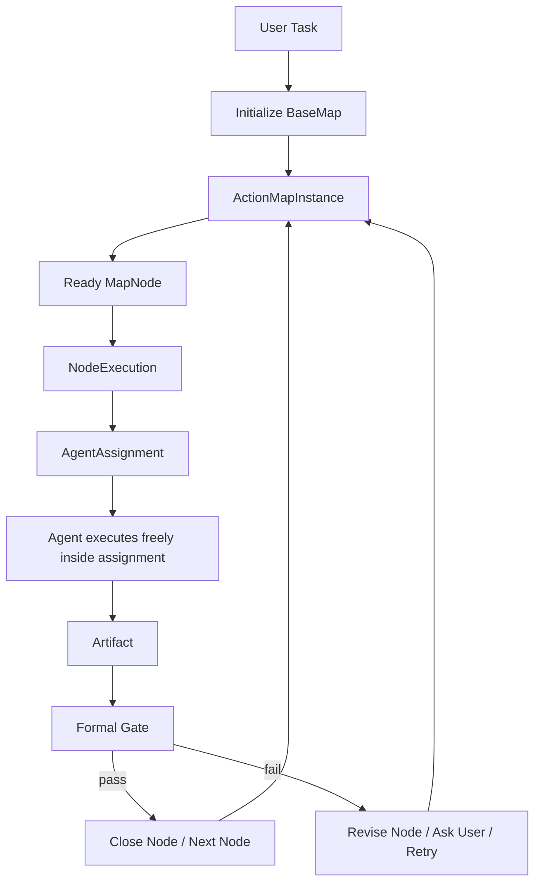
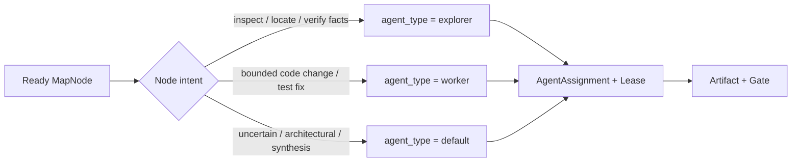
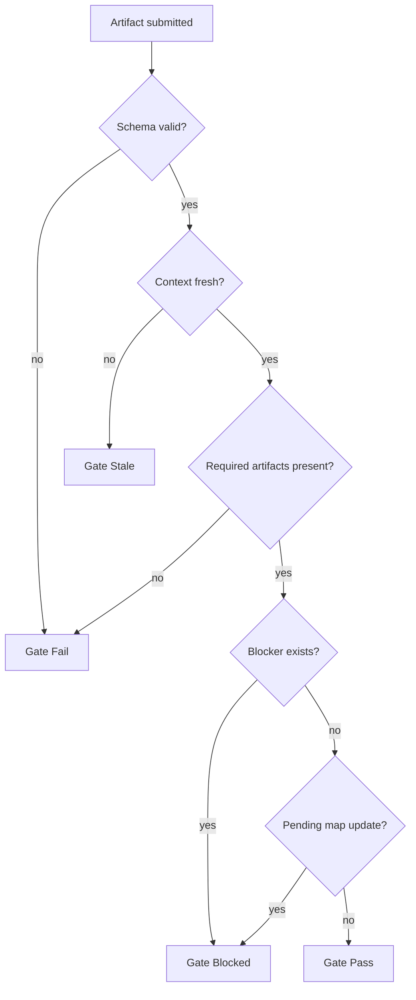
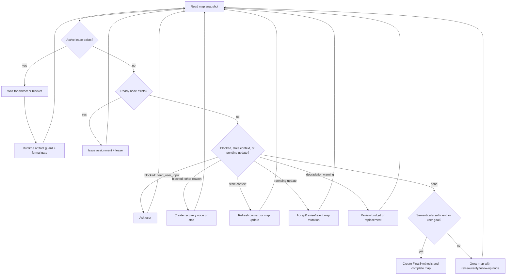
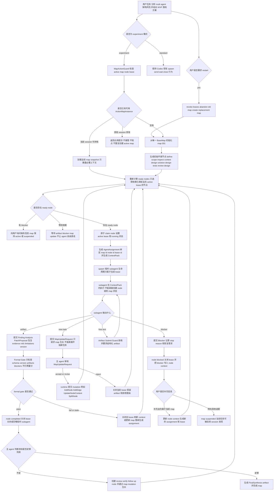

# WhaleCode Multi-Agent 架构设计

日期：2026-04-25
更新：2026-04-30

## 结论

WhaleCode 的 multi-agent 第一版只验证一个核心假设：

```text
Action Map + 结构化 Artifact + Gate
是否比当前写信式 subagent 委派更稳定、更可控、更可复盘。
```

除此之外，所有未经真实任务验证、缺乏强推理实证的概念都不进入核心 runtime。

本文只描述当前要实现和验证的最小 runtime。未被真实任务证明必要的组织形态、投票机制、竞争机制和控制面机制，不在本文保留。

## 最高原则：Occam-first

设计约束：

- 不提前实体化没有被验证的协作概念。
- 不用角色清单解释系统能力。
- 不把 prompt 约定伪装成 runtime contract。
- 不为了“multi-agent first”而制造多 agent 仪式。
- 不维护两套表达同一规则的对象。
- 不让实验模式破坏当前可用的 Codex subagent 默认行为。
- 不设计全局质量分。复杂 agent 任务没有客观准确的单一质量分，系统只能记录证据、验证结果、阻塞点和人工/模型审查意见。

任何新 runtime 概念进入核心前，必须能回答：

```text
+ 没有它，当前系统出现了什么明确失败？
+ 这个失败是否能在真实任务或最小实验中复现？
+ 引入它以后，是否能通过可复现失败、可观察症状或明确人工反馈证明它减少了问题，而不是制造复杂度？
```

答不上来，就不进入核心设计。

## 模式开关

Multi-agent 框架必须可插拔。

```text
/multi-agents standard
  当前默认模式。
  继续使用 Codex-style subagent/thread/message/wait 行为。
  主 agent 可直接 spawn/send/wait/close。
  不强制 Action Map、Artifact、Gate。

/multi-agents standart
  兼容拼写别名，行为等同 standard。
  CLI 应提示 canonical name 是 standard。

/multi-agents experiment
  实验模式。
  启用 Action Map Runtime。
  后续所有 agent 行为必须绑定 map。

/multi-agents restart
  experiment 模式下弃用当前 active/suspended map，并从 BaseMap 重新开始。
  这是可恢复的 replacement，不删除旧 map。
```

第一阶段状态应是 session-scoped，不改变全局默认值。runtime 只需要记录当前模式、active map id 和切换 turn。

切换规则：

- `standard -> experiment`：下一次需要 multi-agent 协作时创建或复用 `ActionMapInstance`。
- `experiment -> standard`：停止对新行为施加 Action Map 约束；当前 active map 进入 `suspended`；已运行 subagent 不强杀。
- 切换不清空 session、rollout、compact 历史或 agent registry。
- 每次切换必须写 session event，便于 replay。
- 如果匹配到的相关 map 正被其他 session active 持有，当前 session 不接管、不抢占、不默认新建重复 map，只提示用户等待或停止 owner session。
- 用户明确要求“丢掉当前 map / 重新开始 / 换个思路重来”时，允许触发 user-requested replacement；旧 map 进入 `abandoned`，新 map 从 `BaseMap` 初始化。

Experiment 模式的硬约束：

- agent 每次行动都必须由 map 驱动，并绑定到 map 中的某个 `MapNode`。
- 行动可以绑定已有 `ActionMapInstance`，但不能只绑定 map 而缺少 node。
- 如果没有可用 map，runtime 必须先从 `BaseMap` 新建 `ActionMapInstance`。
- 无 map/node 绑定时，agent 不允许 spawn、接收 assignment、执行工具或提交结果。
- 子 agent 只能通过 `AgentAssignment + AssignmentLease` 进入某个 node；node 是 map 中的子任务，不是角色、线程或自由消息主题。
- 子 agent 不在 map 或 node 之间移动；每次 node 执行默认创建一个临时 subagent，lease 结束后关闭或忽略。
- 执行中发现的新任务必须先通过 map mutation 生长为 node，不能直接派给 agent。
- 任何自然语言 follow-up 如果改变任务目标，必须先更新或新建 map，再继续行动。

这里的约束只表示“行动必须有 map 坐标和可追踪记录”，不表示 map 可以强迫 agent 继续执行。
agent 发现缺少用户输入、工具权限不足、上下文不足、风险过高或自己无法继续时，可以合法停止并提交 `Blocker`。
此时 runtime 记录 map/node 状态，但不能把停止当成协议失败，也不能要求 agent 编造进展来满足节点完成。

## 最小运行模型

核心链路只有这些对象：

```text
UserTask
  -> BaseMap
  -> ActionMapInstance
  -> MapNode
  -> NodeExecution
  -> AgentAssignment
  -> Artifact
  -> Gate
  -> MapEvent
```

这些对象的职责边界：

| 对象 | 职责 |
| --- | --- |
| `BaseMap` | 第一版唯一基础地图，只给 agent 一个组织任务的起点 |
| `ActionMapInstance` | 当前任务的小队行动图和事实源 |
| `MapNode` | 一个可执行行动点 |
| `NodeExecution` | 某个节点本次如何执行 |
| `AgentAssignment` | 发给 agent 的具体工作包 |
| `Artifact` | agent 提交的结构化产物，记录证据、结论和限制 |
| `Gate` | runtime 执行的形式化准出检查，不判断开放任务质量 |
| `MapEvent` | 状态变化记录，用于 replay 和审计 |

系统主循环：



并行不是 node 内的多人同时执行。第一版的并行来自多个无依赖的 ready nodes 同时被不同临时 subagents claim。
同一个 node 同一时刻只能有一个 active lease。

## Agent Role / Execution Profile

第一版不设计拟人化岗位角色，也不引入 `architect`、`reviewer`、`judge`、`scout` 这类固定小队身份。
角色不是协作核心，`map/node/lease/artifact/gate` 才是协作核心。

Experiment 模式直接复用 Codex base 已有的 `agent_type` 机制，只把它当成执行 profile：

| profile | 定位 | 读写倾向 | 选择规则 |
| --- | --- | --- | --- |
| `default` | 主力综合判断 | 读写均可 | 复杂判断、map 初始化/生长、冲突处理、最终合成、不确定任务 |
| `explorer` | 快速信息收集 | 偏读 | 窄范围代码定位、事实验证、上下文收集 |
| `worker` | 快速代码落地 | 偏写 | 有明确 ownership 的局部实现、修 bug、补测试、机械改造 |

约束：

- 不新增 Whale 自定义岗位角色，除非真实任务证明 `default/explorer/worker` 无法表达执行成本和读写倾向。
- `explorer` 和 `worker` 都是加速器，追求速度和低成本，不承担最终语义判断。
- 复杂、不确定、高风险或需要综合权衡的节点默认使用 `default`。
- 如果无法确定应该选哪个 profile，使用 `default`。
- profile 不能替代 node 约束；即使是 `explorer` 或 `worker`，也必须先获得 node assignment 和 active lease。
- profile 不能改变 artifact/gate 规则；子 agent 的自然语言总结不能因为 role 不同而绕过结构化提交。



## BaseMap

第一版只设计唯一一个 `BaseMap`。它不是领域 map，也不试图覆盖架构、Debug、Feature、Refactor 等不同方法论。

`BaseMap` 的目的只有一个：验证 Action Map Runtime 能否正确组织一次复杂任务。
它不是“计划 -> 实施 -> 验证”的空泛流程，而是一个基础任务解构框架。
它必须帮助主 agent 把用户目标拆成项目开发中常见、可执行、可审查的节点。

它给 agent 一个最小骨架：

```text
clarify_task
  -> inspect_context
  -> plan_work
  -> execute_work
  -> verify_result
  -> report_result
```

这个骨架只是兜底顺序，不应直接原样实例化为 node。
实例化 `ActionMapInstance` 时，主 agent 必须优先从 `BaseMap` 的候选节点库中选择、改写、合并或拆分节点，生成与当前任务匹配的具体 map。
如果初始化结果只有“计划”“实施”“总结”这类泛节点，说明 map 没有提供足够工作驱动力，应重新初始化或补充节点。

候选节点库第一版只覆盖通用项目开发动作，不引入架构、Debug、Feature、Refactor 等领域 map。
候选节点是启发式清单，不是必选清单；主 agent 只能选择对当前任务有实际价值的节点。

| 候选节点 | 典型用途 | 最小 artifact | 常见依赖 |
| --- | --- | --- | --- |
| `define_scope` 确定边界 | 明确用户目标、非目标、成功条件、交付物 | `ScopeSummary` | 无 |
| `inspect_repo_context` 梳理现有基建 | 读取相关代码、文档、配置和现有机制 | `ContextInventory` | `define_scope` |
| `search_external_references` 搜索资料 | 查官方文档、社区实践、竞品行为或失败案例 | `ReferenceNotes` | `define_scope` |
| `identify_constraints` 约束识别 | 提取工程约束、兼容性、性能、权限、发布风险 | `ConstraintList` | `define_scope` |
| `design_solution` 方案设计 | 给出目标架构、模块边界、数据流、状态机 | `DesignProposal` | `inspect_repo_context` |
| `design_logging` 日志设计 | 为新增能力设计可观测点、事件、trace 和排障入口 | `LoggingPlan` | `design_solution` |
| `design_tests` 测试设计 | 设计冒烟、回归、单元、集成或人工验证路径 | `TestPlan` | `design_solution` |
| `review_design` 方案审查 | 审查过度设计、遗漏风险、与现有机制冲突 | `ReviewReport` | `design_solution` |
| `implement_change` 方案实施 | 在明确 ownership 范围内修改代码或文档 | `ChangeArtifact` | `design_solution` |
| `code_review` 代码审查 | 检查行为回归、并发/状态问题、测试缺口 | `CodeReviewReport` | `implement_change` |
| `smoke_test` 冒烟测试 | 验证核心路径是否能跑通 | `SmokeResult` | `implement_change` |
| `regression_test` 回归测试 | 验证既有能力未被破坏 | `RegressionResult` | `implement_change` |
| `final_synthesis` 最终收束 | 汇总结论、证据、限制、风险和下一步 | `FinalSynthesis` | 关键节点完成后 |

候选节点的初始化规则：

- 节点名称必须表达真实工作对象，例如 `inspect_spawn_wait_close_flow`，不要只叫 `inspect_context`。
- 每个 node 必须能被一个临时 subagent 在一次 lease 中推进，过大的节点应拆分。
- 读写性质必须清楚；只读节点优先使用 `explorer`，明确写入节点才使用 `worker`，不确定或综合判断使用 `default`。
- 初始化 map 时一般选择 3-8 个节点；超过 8 个说明任务过大，应优先收敛边界或拆分目标。
- 候选节点可以被改名、合并或拆分，但 artifact 类型和 gate 要求必须随 node 一起保留。
- 无依赖的只读节点可以并行；实施、审查、测试类节点通常应依赖设计或上下文节点。
- 发现新任务时，仍通过 `MapUpdateRequest` 从候选节点库中派生新 node，而不是让 subagent 自由追加工作。

`BaseMap` 只定义：

- 最小骨架。
- 通用候选节点库。
- 候选节点的默认依赖建议。
- 每类节点的最小 artifact 要求。
- 最小 gate 条件。

领域 map 是否有价值，必须等 `BaseMap` 跑过真实任务后再判断。

## Action Map Instance

Instance 是当前任务的小队运行状态，也是 experiment 模式的事实源。

```rust
pub struct ActionMapInstance {
    pub id: ActionMapId,
    pub base_map_version: BaseMapVersion,
    pub user_goal: String,
    pub status: MapStatus,
    pub owner_session_id: Option<SessionId>,
    pub graph_version: GraphVersion,
    pub nodes: Vec<MapNode>,
    pub edges: Vec<MapEdge>,
    pub artifacts: Vec<ArtifactRef>,
    pub events: Vec<MapEventRef>,
}
```

`MapStatus` 第一版只需要：

```text
active -> completed
       -> suspended
       -> abandoned

suspended -> active
          -> abandoned
```

`active` 覆盖 map 已创建且仍在推进、等待、阻塞或生长的所有情况。
`suspended` 表示当前对话焦点已经离开该 map，但任务没有被放弃，后续可以恢复。
`completed` 表示主 agent 已提交 `FinalSynthesis`，且 formal gate 通过。
`abandoned` 表示用户或主 agent 明确放弃继续推进。

不要先做复杂 phase machine。是否需要 phase，等真实任务证明 node/gate 不够用以后再引入。
也不要设计 map 级 `blocked`、`paused` 这类派生状态；它们可以从 node、lease、blocker 和 pending update 计算出来。
topic switch 不等于 abandon。用户在某个话题聊到一半转向另一个话题时，旧 map 应进入 `suspended`，而不是 `abandoned`。

状态切换规则：

| 当前状态 | 触发 | 下一状态 |
| --- | --- | --- |
| `active` | 主 agent 判断当前 user turn 不再属于该 map，但没有放弃证据 | `suspended` |
| `suspended` | 用户回到原话题，或主 agent 匹配到该 map 仍服务当前目标 | `active` |
| `active` | `FinalSynthesis` artifact 存在且 formal gate 通过 | `completed` |
| `active/suspended` | 用户明确取消、目标被不兼容新目标取代、或主 agent 记录无恢复路径 | `abandoned` |

`abandoned` 必须克制使用。单个 node blocked、等待用户输入、context 过期或普通话题切换，都不应让 map abandoned。

### 用户主动弃用与重新开始

用户必须能主动放弃当前 map 并重新开始。
第一版不删除旧 map，也不尝试在旧 map 上做复杂修复；它执行一个可追踪的 replacement transaction。

触发方式：

```text
/multi-agents restart
```

自然语言也可以触发同一语义，例如：

```text
这个 map 不对，丢掉重新开始。
换一个思路重来。
不要沿用之前那套任务图了，重新建一个。
```

主 agent 识别到明确重开意图后，不应继续修补旧 map，也不应把这当成普通 topic switch。
runtime 必须执行同一个原子事务：

```text
input:
  current_map.status in [active, suspended]
  current_map.owner_session_id == current_session_id or current_map.status == suspended

transaction:
  revoke all active leases for current_map
  close or ignore temporary subagents created by those leases
  current_map.status = abandoned
  current_map.abandon_reason = user_requested_restart
  current_map.owner_session_id = None
  create new_map from BaseMap
  new_map.created_from = current_map.id
  new_map.restart_reason = user_request
  new_map.owner_session_id = current_session_id
  new_map.status = active

events:
  AssignmentLeaseRevoked
  AgentStopped
  MapAbandoned
  MapCreated
  MapReplaced
```

如果用户只要求“停止当前任务，不要继续”，但没有要求重开，则只执行 abandon，不创建 replacement map：

```text
current_map.status = abandoned
current_map.abandon_reason = user_requested_stop
current_map.owner_session_id = None
```

如果当前 session 命中的是另一个 session 正在持有的 active map，当前 session 不能替用户弃用它：

```text
if matched_map.status == active
and matched_map.owner_session_id != current_session_id:
  reject restart
  tell user the map is occupied by another session
```

弃用不是删除。
旧 map 的 artifacts、events、blockers 和 final partial notes 必须保留，方便审计和显式按 id/title 搜索。
但 `abandoned` map 默认不进入普通候选，避免污染新 map 初始化。

## Map 与 Session

Session 拥有执行上下文，Map 拥有任务状态。
第一版的硬约束是：

```text
map.status == active
=> map.owner_session_id == current active owner session
```

同一个 map 同一时刻只能被一个 session 持有并运行。
这是为了保护 node exclusive claim、assignment lease、mailbox、tool execution 和 context freshness 的一致性。

Map 可以跨 session 发现，但不能跨 session 并发运行：

```text
discoverable != claimable
```

第一版只做发现和提示，不做 ownership transfer、steal、live handoff 或接管逻辑。

| MapStatus | 可被其他 session 发现 | 可被其他 session 持有运行 | 行为 |
| --- | --- | --- | --- |
| `active` 且 owner 是当前 session | yes | yes | 继续使用当前 map |
| `active` 且 owner 是其他 session | yes | no | 拒绝接管，提示用户等待或停止 owner session |
| `suspended` | yes | yes, after user confirmation | 可恢复为当前 session 的 active map |
| `completed` | yes | no by default | 可引用结果；继续工作应新建 follow-up map |
| `abandoned` | maybe | no | 默认不提示，除非用户明确按 title/id/keyword 搜索 |

当新 session 的用户输入命中另一个 session 正在运行的 active map 时，runtime 不应自动新建重复 map，也不应尝试接管：

```text
if matched_map.status == active
and matched_map.owner_session_id != current_session_id:
  do not resume
  do not claim
  do not create competing active map by default
  tell user the map is occupied by another session
```

提示应是机械状态，不伪装成 agent 结论：

```text
发现已有相关任务正在另一个 session 中运行：

Map: <title>
Owner session: <session_id>
Status: active
Last updated: <time>
Current node: <node_title>

请先停止该 session 的运行，或等待它 completed/suspended 后再继续。
```

MapIndex 只保存可检索 metadata，不等于 active runtime：

```rust
pub struct MapIndexEntry {
    pub map_id: ActionMapId,
    pub title: String,
    pub user_goal_summary: String,
    pub keywords: Vec<String>,
    pub status: MapStatus,
    pub owner_session_id: Option<SessionId>,
    pub last_active_at: Timestamp,
    pub updated_at: Timestamp,
    pub top_nodes_summary: Vec<String>,
    pub blockers_summary: Vec<String>,
    pub artifact_summary_refs: Vec<ArtifactRef>,
    pub workspace_id: WorkspaceId,
    pub repo_ref: Option<RepoRef>,
    pub index_visibility: IndexVisibility,
    pub privacy_scope: PrivacyScope,
}
```

`MapIndexEntry` 就是 map 的 manifest。
它用于渐进式暴露，不是完整 map。
完整 `MapSnapshot` 只有在当前 session 已持有该 map，或用户确认继续 suspended map / 引用 completed map 后，才按需加载。

第一版 map discovery 采用 tools 暴露方式的同类设计：

```text
MapManifest / MapIndexEntry
  -> metadata filter
  -> keyword/BM25 search
  -> top K manifests
  -> main agent decides whether to ask user
  -> load MapSnapshot only after confirmation or ownership check
```

V1 明确不做：

- semantic search。
- embedding index。
- full snapshot scan。
- 对所有历史 map 做全量语义匹配。
- 自动恢复语义相似的 map。

默认检索范围必须先被 metadata 限界：

```text
workspace_id == current_workspace
repo_ref compatible with current repo/branch
status in [active, suspended]
privacy_scope allows current session
index_visibility in [hot, warm]
updated_at within retention window
```

`completed` map 默认只在用户有明显继续/之前/上次/引用结果等意图，或 keyword/title/id 明确命中时进入候选。
`abandoned` map 默认不进入候选。

`index_visibility` 不是 map 状态，只是检索层策略：

| Visibility | 行为 |
| --- | --- |
| `hot` | 当前 workspace 默认检索 |
| `warm` | 近期 suspended / active 相关任务可检索 |
| `cold` | 只在显式历史查询或 title/id/keyword 命中时检索 |
| `hidden` | 默认不检索 |

MapIndex 刷新也要克制，避免每个细节污染检索。
第一版只在关键事件刷新 manifest：

- `MapCreated`
- `MapSuspended`
- `MapResumed`
- `MapCompleted`
- `MapAbandoned`
- `FinalSynthesis` 更新
- major blocker added/resolved

原则：

```text
map_search is BM25/keyword over manifest metadata.
MapSnapshot is lazy-loaded.
Map discovery can suggest; it cannot claim, resume, or duplicate active work by itself.
```

第一版禁止：

- live transfer。
- ownership stealing。
- 同一 matched task 自动创建第二个 active map。
- subagent thread 跨 session 迁移。
- 多 session 共享同一个 active map。

## MapNode

Node 是 map 中的子任务和行动点，不是角色，也不是 agent。

子 agent 不能直接绑定在 map 根上行动，必须绑定到一个具体 `MapNode`。
subagent 不跨 node 移动，也不作为长期工作者保留在 map 中。
runtime 每次执行 node 时生成新的 assignment 和 lease，并为该 lease 创建临时 subagent。
这样 map 才能回答三个问题：当前 lease 正在解决哪个子任务、使用了哪份上下文、产物应该归属到哪里。

```rust
pub struct MapNode {
    pub id: NodeId,
    pub title: String,
    pub purpose: String,
    pub status: NodeStatus,
    pub active: bool,
    pub origin_node_id: Option<NodeId>,
    pub group_label: Option<String>,
    pub context_boundary: ContextBoundary,
    pub context_state: NodeContextState,
    pub required_artifacts: Vec<ArtifactKind>,
    pub gate: GateSpec,
    pub active_lease: Option<AssignmentLeaseId>,
    pub version: NodeVersion,
}
```

第一版 node 是平面图节点，不支持嵌套 node。
不要设计 `children`、runtime parent/child status 传播或 parent gate。
如果需要表达某些 node 来自同一次拆分或同一主题，只使用 `origin_node_id` 和 `group_label` 这类展示/追溯 metadata，不参与 runtime 状态机。

`dependencies` 不放在 `MapNode` 内部，而是由 `ActionMapInstance.edges` 表达。
这样 node 保持为子任务状态容器，图关系由 map 统一维护。

```rust
pub struct NodeContextState {
    pub source_refs: Vec<ContextRef>,
    pub inherited_artifacts: Vec<ArtifactRef>,
    pub local_notes: Vec<NodeNote>,
    pub blockers: Vec<ArtifactRef>,
}
```

Node 持有与该子任务相关的上下文状态，subagent 只在 assignment lease 期间临时执行：

| 所有者 | 持有内容 |
| --- | --- |
| `MapNode` | context boundary、context pack source refs、inherited artifacts、local notes、blockers、active lease、node version |
| `Subagent` | 单次 lease 内的临时推理过程、工具执行过程、最终提交的 artifact |

任何新 assignment 继续某个 node 时，都必须从 node 的 `context_state` 和 inherited artifacts 恢复工作，而不是依赖前一个 subagent 的私有记忆。
subagent 停止、失败或被关闭后，node 仍保留可由新 assignment 接手的状态。

同一时刻一个 node 最多只能被一个 active lease 持有：

```text
node.active_lease == none      -> runtime may issue assignment
node.active_lease == lease_id  -> node is claimed; other agents cannot claim it
```

这里的持有是 active execution lease，不是永久所有权。
一个 node 历史上可以被多次 assignment 接手，但每个时间点只能有一个 active lease。

`NodeStatus` 第一版只需要：

```text
pending -> ready -> running -> completed
                       |
                       -> blocked
ready -> pending
```

节点在协议层关闭必须满足：

- required artifacts 已提交。
- formal gate 通过。
- context fresh。
- 没有 unresolved blocker。

`completed` 只表示该 node 满足当前 map 协议下的形式化关闭条件，不表示开放任务已经被 runtime 客观证明“正确完成”或“高质量完成”。
开放任务的语义充分性由主 agent 对照 user goal、artifacts、limitations 和 blockers 判断。

agent 停止不等于节点完成：

- 需要用户补充信息时，agent 提交 `Blocker(stop_reason=need_user_input)`，node 进入 `blocked`。
- agent 判断无法继续时，agent 提交 `Blocker`，node 进入 `blocked`。
- 用户补充信息或 map 更新后，runtime 创建新的 assignment 和临时 subagent 继续；不复用旧 subagent 跨 lease 执行。

`running` 表示 node 已被某个 active lease claim。
只有当前 lease 对应的 subagent 能提交该 node 的 artifact；其他 subagent 必须等待 lease 完成、失效或被 revoke。

状态切换只能由 runtime 写入，agent 只能通过 artifact、Blocker、MapUpdateRequest 或用户 follow-up 间接触发。

| 当前状态 | 触发 | 下一状态 | 写入者 |
| --- | --- | --- | --- |
| `pending` | 所有上游依赖完成 | `ready` | runtime |
| `ready` | map update 新增未完成上游依赖 | `pending` | runtime |
| `ready` | active lease 原子签发成功 | `running` | runtime |
| `running` | 当前 lease 提交 required artifacts 且 gate pass | `completed` | runtime |
| `running` | 当前 lease 提交 `Blocker` | `blocked` | runtime |
| `blocked` | blocker 被用户补充、map update 或恢复 artifact 解决 | `ready` | runtime |
| `running` | 用户目标或上游 artifact 变化使 assignment 过期 | `pending` 或 `ready` | runtime |

stale 不再是 node 状态。它是 context/version 检查结果。
如果 `running` node 的 context 过期，runtime 必须先 revoke 当前 lease，再根据依赖是否满足把 node 重新计算为 `pending` 或 `ready`。
如果 node 不再需要，runtime 不新增 `skipped` 状态；应通过 map update 移除其依赖影响，并在事件中记录原因。
agent 不能自己把 node 标记为 `completed`、`blocked`、`pending` 或 `ready`。

## MapEdge

第一版只保留有向依赖边，不引入无向边。

```rust
pub struct MapEdge {
    pub from: NodeId,
    pub to: NodeId,
    pub kind: EdgeKind,
}

pub enum EdgeKind {
    DependsOn,
}
```

语义：

```text
A -> B means B depends on A.
B cannot become ready or claimed until A is completed.
```

可并行不需要显式边表达。
两个 node 之间没有依赖路径，且都满足 ready 条件时，runtime 可以把它们同时派给不同临时 subagents。

```text
ready_nodes = nodes where:
  status == ready
  active_lease == none
  all upstream dependency edges point from completed nodes
```

不要用无向边表达“可并行”。无向边容易混淆为共享上下文、冲突关系、同阶段、审查关系或协作关系。
这些关系如果未来被真实任务证明必要，应作为明确的 relation 类型另行设计；第一版不做。

## Map Growth

初始 map 由主 agent 基于 `BaseMap` 创建，但 `ActionMapInstance` 在执行过程中必须允许生长。
生长只表示对当前任务图做最小必要修改，不表示引入领域 map、phase machine 或自由规划器。

允许的第一版 map mutation：

| Mutation | 用途 |
| --- | --- |
| `AddNode` | 执行中发现必须新增的子任务 |
| `AddEdge` | 新 node 或旧 node 之间新增有向依赖 |
| `UpdateNodeContext` | 用户补充信息、artifact 或 blocker 改变 node 上下文 |
| `SplitNode` | node 过大，需要拆成多个 sibling nodes |

谁可以创建新 node：

| 来源 | 能做什么 | 不能做什么 |
| --- | --- | --- |
| 主 agent | 初始化 map；根据用户 follow-up 或 artifact 请求接受、修正或拒绝 map mutation | 不能绕过 runtime 直接改状态 |
| subagent | 通过 `MapUpdateRequest` 或 `Blocker` 请求新增、拆分或更新 node | 不能直接创建 node，不能直接改 edge/status，不能自行执行新发现的工作 |
| runtime | 校验并提交 mutation，写入 graph_version 和 MapEvent | 不能凭空生成业务判断，只能执行已被主 agent 接受的 mutation |
| user follow-up | 改变目标、补充信息、确认 blocker | 不直接编辑内部图；由主 agent 转成 map update |

流程：

```text
subagent discovers new work
  -> submit MapUpdateRequest artifact
  -> main agent accepts, revises, or rejects it
  -> runtime validates and applies mutation
  -> new node becomes visible in flat graph
```

subagent 可以请求 map 生长，但没有 map 结构写权限。
这条规则避免局部执行者把图扩成只服务自己局部视角的任务集合。

提交 map mutation 的最小规则：

```text
MapUpdateRequest:
  base_graph_version: <version>
  reason: <why this map change is needed>
  mutations:
    - AddNode | AddEdge | UpdateNodeContext | SplitNode
  affected_nodes: <ids>
  evidence_refs: <artifact ids or user turn ids>
```

runtime 接受 mutation 前必须检查：

- `base_graph_version` 仍然 fresh。
- 新增 node 有明确 purpose、context boundary、required artifacts 和 gate。
- 新增 edge 不形成 cycle。
- 如果影响 running node，先 revoke active lease。
- 被影响的下游 assignment/artifact 必须因为 version mismatch 被拒绝或要求重跑。

提交成功后：

```text
graph_version += 1
append MapEvent::MapUpdated
append NodeAdded / EdgeAdded / NodeReplaced / NodeStatusChanged as needed
recompute ready_nodes
```

map 生长的关键约束：

- 新任务必须先变成 node，才能派给 agent。
- 新 node 默认 `pending`；只有依赖满足且无 active lease 时才能 `ready`。
- 如果新任务与当前 running node 无依赖关系，它可以成为 sibling node，并与其他 ready nodes 并行被 claim。
- 如果新任务是当前 node 的前置条件，当前 node 应进入 `blocked` 或回到 `pending`，等待新 node 完成。
- map 生长不能直接把任何 node 标记为 completed；完成仍只能来自 artifact + gate。

第一版不做嵌套 node。
`SplitNode` 不是创建 parent/children，而是把一个过大的 node 替换为多个平面 sibling nodes：

```text
SplitNode(A):
  A.active = false
  AddNode(A1, origin_node_id = A, group_label = A.title)
  AddNode(A2, origin_node_id = A, group_label = A.title)
  redirect incoming/outgoing edges as needed
  append NodeReplaced(old=A, new=[A1, A2])
```

被 split 的旧 node 保留为历史和审计目标，但不再进入 `ready_nodes`，也不能再被 subagent claim。
不要为了 split 增加 `skipped`、`parent_completed` 或 child status propagation。

## Map Degradation Budget

Map 可以生长，但生长失控、成本过高或负面结果过多时，可能说明当前思路已经劣化。
劣化预算不是质量分，也不是自动判死刑；它只是 runtime 对成本和负面信号的机械预警。

原则：

```text
High cost is a warning, not a verdict.
Replacement is a controlled recovery path, not automatic failure handling.
```

第一版只使用可稳定计数的信号，不做语义矛盾识别：

| Signal | 含义 |
| --- | --- |
| `node_count` | 当前 map 节点数 |
| `map_update_count` | map mutation 次数 |
| `recovery_node_count` | 为恢复、澄清、返工创建的节点数 |
| `blocker_count` | `Blocker` artifact 数量 |
| `failed_gate_count` | formal gate fail 次数 |
| `revoked_lease_count` | lease 被 revoke 次数 |
| `version_mismatch_count` | artifact/context version mismatch 次数 |
| `tool_call_count` | 工具调用次数 |
| `agent_turn_count` | agent turn 数 |
| `wall_clock_minutes` | map active 执行耗时 |
| `context_pack_total_tokens` | context pack 累计 token 估算 |

预算档位：

| Signal | Low | Medium | High |
| --- | ---: | ---: | ---: |
| `node_count` | 8 | 18 | 35 |
| `map_update_count` | 4 | 10 | 20 |
| `recovery_node_count` | 2 | 5 | 10 |
| `blocker_count` | 2 | 5 | 10 |
| `failed_gate_count` | 2 | 5 | 10 |
| `revoked_lease_count` | 2 | 5 | 10 |
| `version_mismatch_count` | 3 | 8 | 16 |
| `tool_call_count` | 40 | 120 | 300 |
| `agent_turn_count` | 12 | 35 | 80 |
| `wall_clock_minutes` | 20 | 60 | 180 |
| `context_pack_total_tokens` | 80k | 250k | 700k |

触发规则：

```text
degradation_warning if:
  any hard limit exceeded
  OR at least 3 soft limits exceeded
```

第一版 hard limits：

- `wall_clock_minutes`
- `context_pack_total_tokens`
- `tool_call_count`

预算升级：

| 当前预算 | 触发 warning 后的行为 |
| --- | --- |
| `low` | 向主 agent 发出内部 warning；主 agent 可升级到 `medium` 或创建恢复 node |
| `medium` | 向主 agent 发出 warning；主 agent 必须记录 `DegradationReview`，可升级到 `high` |
| `high` | 暴露给用户，除非 policy 已经明确允许或拒绝 replacement |

用户策略：

| Policy | 行为 |
| --- | --- |
| `ask` | high 预算仍触发 warning 时询问用户 |
| `auto_allow_replace` | 主 agent 可在记录理由后创建 replacement map |
| `auto_deny_replace` | 不允许 replacement，只能继续修补、降 scope 或停止说明 |

默认 policy 是 `ask`。

结构：

```rust
pub enum DegradationBudget {
    Low,
    Medium,
    High,
}

pub enum DegradationPolicy {
    Ask,
    AutoAllowReplace,
    AutoDenyReplace,
}

pub struct MapDegradationSignals {
    pub node_count: usize,
    pub map_update_count: usize,
    pub recovery_node_count: usize,
    pub blocker_count: usize,
    pub failed_gate_count: usize,
    pub revoked_lease_count: usize,
    pub version_mismatch_count: usize,
    pub tool_call_count: usize,
    pub agent_turn_count: usize,
    pub wall_clock_minutes: u64,
    pub context_pack_total_tokens: usize,
}
```

high 预算仍触发 warning 时，用户可见提示应说明不确定性：

```text
当前任务已经超过 high 劣化预算。
这可能说明任务本身非常复杂，也可能说明当前 map 的思路已经产生严重偏差。
是否允许换一个思路重新创建 map，只选择性继承已确认材料？
```

Map replacement：

```text
old_map.status = abandoned
old_map.abandon_reason = superseded_by_replacement
new_map.created_from = old_map.id
```

只允许选择性 carry over：

- explicit user constraints
- verified facts
- fresh and useful artifacts
- unresolved blockers still relevant

不 carry over：

- noisy recovery nodes
- stale context packs
- speculative branches
- failed branches
- low-confidence artifacts

状态上不新增 `degraded`。
`degraded` 是 replacement reason，不是 `MapStatus`。
第一版不做自动检测 replacement；runtime 只发 warning 和执行主 agent 选择的 replacement transaction。

## NodeExecution

`NodeExecution` 只描述一个节点本次怎么执行。

```rust
pub struct NodeExecution {
    pub id: ExecutionId,
    pub node_id: NodeId,
    pub strategy: ExecutionStrategy,
    pub assignments: Vec<AgentAssignment>,
    pub expected_artifacts: Vec<ArtifactKind>,
}

pub enum ExecutionStrategy {
    Single,
    Review,
    Verify,
}
```

第一版只保留三种策略：

| Strategy | 用途 |
| --- | --- |
| `Single` | 一个 agent 执行节点 |
| `Review` | 对已有 artifact 做审查 |
| `Verify` | 对已有 artifact 做验证 |

第一版不做候选竞赛、投票和共识聚合。这些不是最小验证闭环的一部分。

策略选择由 runtime 根据节点决定：

```text
small/simple node -> Single
artifact needs critique -> Review
artifact needs proof -> Verify
```

如果任务需要并行扫描，runtime 应优先把工作拆成多个 sibling nodes，再由不同临时 subagents 分别 claim。
不要让多个 subagents 同时 claim 同一个 node。

## AgentAssignment

Agent 是一次 lease 的临时执行资源，不是固定角色，也不是会在 map 中移动的长期成员。

```rust
pub enum AgentExecutionProfile {
    Default,
    Explorer,
    Worker,
}

pub struct AgentAssignment {
    pub id: AssignmentId,
    pub map_id: ActionMapId,
    pub node_id: NodeId,
    pub lease_id: AssignmentLeaseId,
    pub execution_profile: AgentExecutionProfile,
    pub objective: String,
    pub context_pack: ContextPack,
    pub allowed_tools: Vec<ToolName>,
    pub expected_artifact: ArtifactKind,
    pub constraints: Vec<String>,
}
```

每个 assignment 都必须同时绑定 `map_id`、`node_id` 和 `lease_id`；只绑定 agent 或 thread 不算 map 驱动。
第一版默认一个 assignment lease 对应一个临时 subagent。
lease 内可以继续使用同一个 live thread 完成 `send_message`、`wait_agent`、`close_agent` 等生命周期操作，但 lease 结束后该 subagent 不再接收新 node。
如果同一 node 后续仍需要更多工作，runtime 必须生成新的 assignment、context pack 和 lease，再 spawn 新的临时 subagent。
`execution_profile` 只记录本次 assignment 应使用的 Codex `agent_type`，用于 spawn、event 和 replay；它不是 node status，也不是 agent 身份。

## Map 驱动执行机制

“每次行动都由 map 驱动”必须由 runtime 强制，不能依赖 agent 自觉。

### 入口拦截

`MapActionGuard` 不是一套新调度器，而是现有入口上的轻量校验层。第一版只接入已经存在的 Codex V2 multi-agent handler：

```text
spawn_agent handler
send_message / followup_task handler
wait_agent handler
close_agent handler
session user follow-up handling
```

普通 shell/read/edit 等工具暂不逐个重写。第一版通过 assignment prompt、allowed tool policy、现有 sandbox/approval 和 artifact gate 管住结果；只有真实任务证明需要更细粒度工具拦截时，才扩展到通用 tool dispatcher。

`MapActionGuard` 的决策：

```text
if mode == standard:
  allow current Codex behavior

if mode == experiment and no active map:
  create ActionMapInstance from BaseMap
  append MapCreated
  continue through map-bound path

if mode == experiment and action has no map_id/node_id/lease_id:
  reject action or convert it into a map update request

if mode == experiment and subagent action targets only map_id:
  reject action and require runtime to select or create a ready node
```

### Assignment Lease

`AssignmentLease` 是 subagent 执行节点的临时许可，也是 subagent 生命周期边界。第一版不要新建独立锁系统，优先复用现有 identity：

- `AgentPath` 作为 subagent 在当前 lease 内的稳定路径。
- `task_name` 作为 map node 的路径来源。
- `AgentRegistry` 记录 live subagent thread 与 metadata。
- `SessionSource::SubAgent(ThreadSpawn)` 记录 parent、depth、agent_path、agent_role。
- `CollabAgentSpawnBegin/End`、`CollabAgentInteractionBegin/End`、`CollabWaitingBegin/End` 作为现有 session event。

lease 可以先作为 Map Runtime 中的内存/rollout metadata，绑定 `assignment_id -> AgentPath/ThreadId`，不需要替换 `AgentRegistry`。
签发 active lease 必须是 node claim 的原子动作：

```text
if node.status == ready and node.active_lease == none:
  issue AssignmentLease
  node.active_lease = lease_id
  node.status = running
else:
  reject claim
```

这条规则保证一个 node 同一时刻最多只有一个 active lease 和一个临时 subagent 持有。
lease 关闭、过期或被 revoke 后，runtime 应关闭对应 subagent，或至少不再向该 subagent 派发任何新 node。

```rust
pub struct AssignmentLease {
    pub id: AssignmentLeaseId,
    pub map_id: ActionMapId,
    pub node_id: NodeId,
    pub assignment_id: AssignmentId,
    pub agent_id: AgentId,
    pub issued_at_graph_version: GraphVersion,
    pub issued_at_node_version: NodeVersion,
    pub allowed_tools: Vec<ToolName>,
    pub status: LeaseStatus,
}
```

`LeaseStatus`：

```text
active -> closed
       -> expired
       -> revoked
```

这里的 `closed` 表示 assignment 已经有结构化返回，不等于 node completed。
agent 提交 `Blocker` 后，lease 可以结束，但 node 只进入 `blocked`。

lease 失效条件：

- map 被 completed 或 abandoned。
- map 被 suspended，且 runtime 选择不让既有 lease 继续运行。
- node 已 completed 或 blocked。
- node version 改变且 assignment 未刷新。
- agent 尝试使用未授权工具。
- agent 尝试提交不匹配的 artifact 类型。

### Collab Handler Guard

第一版不拦截所有普通工具调用，只拦截 multi-agent 协作工具和 artifact 提交入口。

```text
collab_action_allowed if:
  lease.status == active
  action in spawn_agent | send_message | followup_task | wait_agent | close_agent | submit_artifact
  current_graph_version == lease.issued_at_graph_version
  current_node_version == lease.issued_at_node_version
```

失败时不要让模型“自己解释继续做”，runtime 直接返回结构化错误：

```text
MapActionRejected {
  reason: missing_map | missing_node | missing_lease | stale_lease | action_not_allowed
  required_recovery: create_map | refresh_assignment | request_node_update
}
```

### Artifact Submit Guard

artifact 提交必须引用 assignment：

```text
artifact.map_id == assignment.map_id
artifact.node_id == assignment.node_id
artifact.assignment_id == assignment.id
artifact.base_graph_version == assignment.context_pack.graph_version
artifact.base_node_version == assignment.context_pack.node_version
artifact.kind == assignment.expected_artifact || artifact.kind == Blocker || artifact.kind == MapUpdateRequest
```

不满足时，artifact 进入 rejected，不允许进入 gate。

### Prompt 注入不是约束

assignment 可以注入到 agent prompt 中，帮助模型理解当前 map/node：

```text
Current map: <map_id>
Current node: <node_id>
Assignment: <assignment_id>
Expected artifact: <kind>
Allowed tools: <tools>
```

但这只是辅助。真正约束来自 `MapActionGuard`、`AssignmentLease`、collab handler 校验和 `Artifact Submit Guard`。

### 恢复策略

如果 agent 试图越过 map 行动：

- 缺 map：创建 `BaseMap` 实例，然后重新生成 assignment。
- 缺 node：让 runtime 选择 ready node，或创建 clarify/update node。
- lease stale：刷新 context pack，重新发 assignment。
- tool 不允许：返回拒绝，并要求 agent 提交 `Blocker` 或请求 node update。
- 发现新任务：要求 agent 提交 `MapUpdateRequest`，由主 agent 接受后 runtime 提交 map mutation。
- agent 主动停止：接收 `Blocker`，结束当前 lease，把 node 标记为 `blocked`。
- 用户改变目标：暂停当前节点，更新 map，再生成新 assignment。

这些恢复都必须写 MapEvent。

## ContextPack

上下文必须由 runtime 分配，不能让 agent 无限自由继承所有材料。

```rust
pub struct ContextPack {
    pub id: ContextPackId,
    pub graph_version: GraphVersion,
    pub node_version: NodeVersion,
    pub required_sources: Vec<ContextSource>,
    pub artifacts: Vec<ArtifactRef>,
    pub constraints: Vec<String>,
}
```

第一版只做版本检查：

```text
fresh if:
  assignment.graph_version == current.graph_version
  assignment.node_version == current.node_version
  required artifact versions unchanged

stale if:
  upstream artifact changed
  node status changed
  relevant file changed after context pack was issued
```

如果 stale，artifact 不能直接通过 gate，必须刷新或重跑。

## Artifact

正式结论必须是 artifact，不能只是 mailbox 文本。

```rust
pub struct ArtifactEnvelope<T> {
    pub id: ArtifactId,
    pub node_id: NodeId,
    pub assignment_id: AssignmentId,
    pub producer: AgentId,
    pub kind: ArtifactKind,
    pub base_graph_version: GraphVersion,
    pub base_node_version: NodeVersion,
    pub evidence_refs: Vec<ArtifactRef>,
    pub limitations: Vec<String>,
    pub body: T,
}
```

第一版 artifact 类型只保留：

| Artifact | 用途 |
| --- | --- |
| `Finding` | 文件、符号、日志、事实证据 |
| `Analysis` | 对事实的解释或方案分析 |
| `PatchProposal` | 候选改动说明或 patch 引用 |
| `ReviewResult` | 对 artifact 的审查意见 |
| `VerificationResult` | 测试、构建、复现、静态检查结果 |
| `Blocker` | 合法停止记录：需要用户输入、工具/上下文不足、风险过高或无法继续的原因 |
| `MapUpdateRequest` | 请求 map 生长或修正：新增、拆分、补充 node context |
| `DegradationReview` | 主 agent 对劣化 warning 的判断、升级预算或 replacement 建议 |
| `FinalSynthesis` | 主 agent 对 user goal、关键 artifacts、limitations 和 residual risks 的最终语义收束 |

不做额外评分、投票或共识类产物。

## Gate

Gate 是 runtime 的形式化准出机制。

Gate 不评估“质量分”，也不判断开放任务在语义上是否已经充分完成。它只检查明确、有限、可机械判断的协议条件是否满足。
它可以阻断明显缺证据、上下文过期、验证缺失、存在 blocker 或存在 pending map update 的节点，但不能声称某个复杂结果已经被客观证明为“正确”“完整”或“高质量”。

Gate 只约束“节点是否满足协议关闭条件”，不约束“agent 是否可以停止”。当 agent 提交 `Blocker` 时，runtime 应记录合法停止原因，并把 node 保持在 `blocked`，而不是继续驱动 agent 硬做。
当 agent 提交 `MapUpdateRequest` 时，它进入 map mutation 流程，不直接关闭 node；只有 mutation 被提交且当前 node 仍满足 formal gate，node 才能进入 `completed`。

runtime 可以判断：

- artifact schema 是否有效。
- artifact 是否属于当前 map/node/assignment。
- artifact base graph/node version 是否 fresh。
- required artifact 类型是否齐全。
- 是否存在 unresolved `Blocker`。
- 是否存在 pending `MapUpdateRequest`。
- 是否存在 stale context。
- 如果 node 要求验证，是否存在 fresh `VerificationResult`。

runtime 不能判断：

- 架构方案是否真的优雅。
- bug 根因是否真的唯一。
- 代码改动是否最佳。
- 开放任务是否已经语义上完全解决。
- agent 的分析是否“质量足够高”。

复杂语义判断如果需要模型参与，必须先变成 artifact，例如 `ReviewResult`、`VerificationResult` 或 `Analysis`。
runtime gate 只检查这些 artifact 是否存在、fresh、属于当前 node，并不把模型审查意见直接等同于客观质量证明。

```rust
pub struct GateSpec {
    pub required_artifacts: Vec<ArtifactKind>,
    pub checks: Vec<GateCheck>,
}

pub enum GateResult {
    Pass,
    Fail,
    Blocked,
    Stale,
}
```

第一版 formal gate 只检查：

- artifact 类型是否齐全。
- artifact schema 是否有效。
- base version 是否仍然 fresh。
- required verification 是否通过。
- 是否存在 blocker。
- 是否存在未处理的 map update request。
- artifact 是否显式记录关键限制和未验证部分。



原则：

```text
Agent can produce evidence for gate.
Runtime owns formal gate evaluation.
Main agent owns semantic sufficiency judgment for the user goal.
```

## MapEvent

状态变化必须是 append-only event。

```rust
pub enum MapEvent {
    ModeChanged,
    MapCreated,
    MapUpdated,
    MapSuspended,
    MapResumed,
    MapAbandoned,
    MapOwnershipRejected,
    MapDegradationWarning,
    MapBudgetUpgraded,
    MapReplaced,
    NodeAdded,
    EdgeAdded,
    NodeReplaced,
    NodeStarted,
    NodeStatusChanged,
    AssignmentIssued,
    AssignmentLeaseIssued,
    AssignmentLeaseRevoked,
    MapActionRejected,
    ArtifactSubmitted,
    AgentStopped,
    UserInputRequested,
    GateEvaluated,
    NodeCompleted,
    NodeBlocked,
    MapCompleted,
}
```

第一版不要做完整 event sourcing 框架，但事件必须足够 replay 当前任务的关键决策。

## 主 Agent 进度控制

主 agent 是 map coordinator，不是 gate executor。
它通过读取 map snapshot 掌控整体进度，由 runtime 执行状态机、lease、artifact guard 和 formal gate。

主 agent 每轮应读取：

```text
map.status
graph_version
suspended maps that may match current topic
ready_nodes
running_nodes + active_leases
blocked_nodes
pending MapUpdateRequests
degradation warnings and budget
completed nodes
stale artifacts or stale context packs
final goal coverage
```

控制循环：



开放任务的语义充分性由主 agent 负责判断。
如果 formal gate 通过但主 agent 认为证据不足，它不应要求 runtime 给质量打分，而应让 map 生长：

```text
AddNode: 审查方案是否遗漏关键风险
AddNode: 验证结论是否能被测试复现
AddNode: 对比另一种实现路径
AddNode: 请求用户确认范围
```

map 完成条件：

```text
Map can complete only when:
- no active leases
- no pending MapUpdateRequest
- no unresolved blocker that affects user goal
- no stale context or stale artifact that affects user goal
- all required nodes are completed
- FinalSynthesis artifact exists
- FinalSynthesis formal gate passes
```

`FinalSynthesis` 是主 agent 对 user goal、已完成 artifacts、limitations 和 residual risks 的最终语义收束。
runtime 只检查它的 schema、freshness、归属和阻塞状态；用户任务是否足够回答，由主 agent 承担责任并在最终回复中显式说明限制。

## 通信规则

图是主要沟通介质。

```text
Map is the source of truth.
Messages are hints.
Artifacts are durable claims.
Events are state transitions.
```

允许直接消息，但直接消息不能：

- 标记节点完成。
- 证明风险消失。
- 选择 patch。
- 推进 gate。
- 成为最终事实来源。

如果消息内容影响任务结论，必须转成 artifact。

## Prompt 合同

Prompt 不是强约束，强约束由 runtime guard、lease、artifact gate 执行。但 prompt 必须把当前 map/node/assignment 说明清楚，否则 agent 很难正确行动。

第一版复用现有注入点：

| 现有机制 | Prompt 用法 |
| --- | --- |
| `multi_agent_v2.usage_hint_text` | 主 agent 看到 experiment 模式规则和 map-first 工作方式 |
| `developer_instructions` | 注入当前模式、active map 摘要、当前节点约束 |
| `build_agent_spawn_config(... base_instructions ...)` | 子 agent 继承基础行为规则 |
| `spawn_agent.message` | 传递 assignment-specific prompt |
| `InterAgentCommunication.content` | 临时 follow-up 或 completion 文本，不能替代 artifact |

### 主 agent prompt

主 agent 在 experiment 模式下必须收到短规则：

```text
You are operating in WhaleCode multi-agents experiment mode.
Every agent action must be bound to an ActionMapInstance.
If no active map exists, create one from BaseMap before delegating work.
When creating a map, select concrete nodes from the BaseMap candidate node catalog.
Avoid generic nodes such as plan, execute, summarize when a more specific project-development node applies.
Do not treat free-form messages as completed work.
A node can close only through accepted artifacts and formal gate evaluation.
Stopping is allowed when you need user input, hit a tool/context limit, or cannot proceed.
When stopping, submit a Blocker artifact with the reason and the next needed input.
Gate is a formal protocol check, not a quality or semantic-completeness judgment.
The main agent is responsible for deciding whether artifacts are sufficient for the user goal.
If degradation warnings are raised, review whether to upgrade the budget, repair the map, ask the user, or replace the map.
If the user explicitly asks to abandon the current map or restart, request a user-requested replacement transaction instead of repairing the old map.
Do not invent quality scores. Record evidence, limitations, blockers, and verification results.
```

中文等价要求：

```text
当前是 multi-agents experiment 模式。
所有 agent 行动必须绑定 ActionMapInstance。
没有 active map 时，先从 BaseMap 创建 map，再委派。
创建 map 时，优先从 BaseMap 候选节点库选择具体节点。
不要在可以使用更具体项目开发节点时生成“计划”“实施”“总结”这类泛节点。
自然语言消息不能直接代表节点完成。
节点只能通过 artifact + formal gate 在协议层关闭。
需要用户输入、遇到工具/上下文限制或无法继续时，可以停止。
停止时必须提交 Blocker artifact，说明原因和下一步需要的信息。
Gate 只是形式化协议检查，不判断质量或语义完成度。
主 agent 负责判断 artifact 是否足以回答用户目标。
收到劣化 warning 时，必须评估是升级预算、修补 map、询问用户，还是创建 replacement map。
用户明确要求弃用当前 map 或重新开始时，触发 user-requested replacement transaction，不要继续修补旧 map。
不要编造质量分，只记录证据、限制、阻塞和验证结果。
```

### Assignment prompt

子 agent 的 `spawn_agent.message` 必须由 assignment 生成，而不是让主 agent 临场自由写一封任务信。

最小结构：

```text
Map: <map_id>
Node: <node_id> - <node_title>
Assignment: <assignment_id>
Lease: <lease_id>
Agent type: <default | explorer | worker>
Lifecycle: temporary subagent for this lease only

Objective:
<one concrete objective>

Context:
- graph_version: <version>
- node_version: <version>
- required sources: <short list>
- inherited artifacts: <ids or none>

Allowed actions:
<allowed tools / read-write scope / explicit constraints>

Expected artifact:
kind: <Finding | Analysis | PatchProposal | ReviewResult | VerificationResult | Blocker | MapUpdateRequest | DegradationReview | FinalSynthesis>
must include:
- evidence_refs
- limitations
- files or commands inspected, when applicable
- verification run, when applicable

Do not:
- work outside this node without a new assignment
- expect to receive another node after this lease closes
- claim the node is complete
- hide blockers
- keep working after you know the assignment is blocked
- start newly discovered work before requesting a map update
- create or edit map nodes directly
- invent quality scores
```

### Artifact submission prompt

当 agent 准备提交结果时，prompt 应要求它按 artifact 结构输出，而不是写总结信：

```text
Submit an artifact for the current assignment.
Use the expected artifact kind.
Include the assignment id, map id, node id, evidence refs, limitations, and any blockers.
If you need user input, hit a tool/context limit, or cannot proceed, submit a Blocker artifact instead.
The Blocker must include: stop_reason, what was tried, what is missing, and the exact question or recovery needed.
If you discover new work that must be tracked before execution, submit a MapUpdateRequest instead.
```

### Map update prompt

用户 follow-up 改变任务目标时，主 agent 不应直接继续执行，而应先更新 map：

```text
The user changed or refined the task.
Before delegating more work, update the active ActionMapInstance:
- keep completed nodes unchanged unless invalidated
- bump affected node versions if assumptions changed
- revoke active leases when their context is no longer fresh
- add or revise nodes only as needed
- add edges for real dependencies only
- never use undirected edges for parallelism
- issue new assignments after the map update
```

### Prompt 失败处理

如果 agent 输出绕过 map 的自然语言结果，runtime 不应让模型自己判断是否通过，而应返回恢复提示：

```text
Your response was not accepted because it was not submitted as an artifact for the active map node.
Submit the expected artifact, a Blocker artifact, or a MapUpdateRequest artifact for assignment <assignment_id>.
```

## 与当前 Codex 基建的关系

现有 Codex subagent 机制继续作为执行底座：

| Codex substrate | experiment 模式中的用途 |
| --- | --- |
| `AgentControl` | 继续负责 spawn/resume/send/close subagent thread |
| `AgentPath` | 复用为当前 lease 对应 subagent thread 的路径锚点 |
| `AgentRegistry` | 继续记录 live subagent/thread 状态；Map Runtime 不替换它 |
| `SessionSource::SubAgent(ThreadSpawn)` | 继续承载 parent、depth、agent_path、role 元数据 |
| mailbox | 临时通知和唤醒 |
| collab session events | 复用 spawn/message/wait/close begin/end 事件，追加 map metadata |
| tools/sandbox/approval | 继续执行工具和权限边界 |
| multi_agents_v2 handlers | 插入轻量 `MapActionGuard`，不重写通用工具系统 |

`standard` 模式不变。

`experiment` 模式只是包一层：

```text
Ready MapNode
  -> NodeExecution
  -> AgentAssignment + ContextPack
  -> existing multi_agents_v2 spawn/send/wait/close runtime
  -> Artifact ingestion
  -> Gate
```

具体落点：

- `spawn_agent`：在 `spawn.rs` 创建 child 前，确保有 active map、ready node、assignment；禁止只以 map 为目标创建 child；把 `task_name` 约束为 node-derived path。
- `send_message` / `followup_task`：在 `message_tool.rs` 发送 mailbox 前，校验 target agent 是否有 active assignment lease。
- `wait_agent`：继续复用 mailbox seq 等待；experiment 模式下等待结果必须进入 artifact ingestion，不能只靠自然语言完成节点。
- `close_agent`：继续复用 `AgentControl::close_agent`；experiment 模式下同时 revoke assignment lease。
- user follow-up：如果当前 turn 切到其他话题，active map 进入 `suspended`；如果 turn 回到 suspended map 的目标，runtime 将其恢复为 `active`。
- map discovery：当前 session 处理新 user goal 前可检索 MapIndex；如果命中其他 session 持有的 active map，只返回占用提示，不接管。
- completion notification：复用现有 child-to-parent `InterAgentCommunication`，把它视为 artifact ingestion 的输入来源之一。
- events：优先扩展现有 collab event payload 或追加轻量 map event，不新增并行事件总线。

## 运行推演

假设用户开启实验模式后提出任务：

```text
帮我分析 WhaleCode 当前 multi-agent 架构，找出实现风险，并给出第一阶段落地方案。
```

系统实际运行应像一个 map-bound 派工系统，而不是自由群聊。
subagent 不是在 map 中移动的长期成员，而是每个 assignment lease 创建一次的临时执行进程。



图中省略的运行注释：

- 并行来自多个 ready nodes；每个 node 同一时刻只有一个 active lease，不允许一个 node 内多个 agent 抢写。
- node 持有上下文；subagent 的私有记忆不能成为后续执行依据。
- map 可以生长；但只有主 agent 接受 `MapUpdateRequest` 后，runtime 才能提交 mutation。
- lease 是锁和生命周期边界；lease 结束后，临时 subagent 不再接收新的 node。

### Step 1：模式切换

用户输入 `/multi-agents experiment` 后，runtime 只更新 session-scoped mode，并写入 `ModeChanged` event。
它不清空上下文，不杀已有 subagent，也不改变 `standard` 的默认行为。

### Step 2：从 BaseMap 初始化工作地图

当主 agent 准备处理复杂任务时，`MapActionGuard` 发现当前没有 active map，于是从唯一 `BaseMap` 创建 `ActionMapInstance`。
第一版不选择领域 map，但必须从 `BaseMap` 候选节点库中挑选具体节点，组织出 3-8 个可解释、可执行、可审查的节点：

```text
map_001:
  user_goal: 分析 multi-agent 架构风险并给出 MVP 落地方案
  status: active

node_1: define_scope - 明确 multi-agent runtime 的目标 边界 非目标 成功条件
node_2: inspect_repo_context - 梳理现有 spawn send wait close session event registry 基建
node_3: design_solution - 设计 map node lease artifact gate 的最小接入方案
node_4: design_logging - 设计 map event assignment lease gate 的日志与 trace
node_5: design_tests - 设计 experiment 模式的冒烟测试和回归测试
node_6: review_design - 审查方案是否过度设计 是否复用现有机制
node_7: final_synthesis - 汇总 MVP 顺序 风险 限制和下一步

edges:
node_1 -> node_2
node_2 -> node_3
node_3 -> node_4
node_3 -> node_5
node_3 -> node_6
node_4 -> node_7
node_5 -> node_7
node_6 -> node_7
```

如果 runtime 后续把 `node_2` 拆成 `node_2a: inspect_spawn_wait_close_flow` 和 `node_2b: inspect_session_event_registry`，这两个节点是平面 sibling nodes，不是 `node_2` 的内部子节点。
它们通过 `origin_node_id = node_2` 保留追溯信息；没有依赖路径且都 ready 时，就可以分别被不同临时 subagents claim。

### Step 3：ready node 生成 assignment

runtime 为 ready node 生成 assignment，而不是让主 agent 临时写自由任务信：

```text
Map: map_001
Node: node_2 - 梳理现有 multi-agent 基建
Assignment: assign_002
Lease: lease_002
Agent type: explorer
Lifecycle: temporary subagent for this lease only

Objective:
梳理当前 Codex-derived multi-agent 基建中可复用的 spawn/send/wait/close、registry 和 event 能力。

Context:
- graph_version: 1
- node_version: 1
- required sources: multi-agent docs, collab handler files
- inherited artifacts: artifact_001

Expected artifact:
kind: Finding
```

同时创建 active `AssignmentLease`，绑定 `assignment_id -> AgentPath/ThreadId`，并按 `execution_profile=explorer` spawn 一个临时 subagent。
subagent 后续通过 `send_message`、`wait_agent`、`close_agent` 或 artifact submission 时，都必须带着这个 map/node/lease 坐标。
该 subagent 只服务 `lease_002`；lease 关闭、过期或被 revoke 后，runtime 关闭它，或至少不再向它派发任何新 node。

### Step 4：subagent 执行并提交 artifact

subagent 在 `ContextPack` 边界内读取材料，提交结构化产物：

```text
Artifact: artifact_002
kind: Finding
map_id: map_001
node_id: node_2
assignment_id: assign_002
base_graph_version: 1
base_node_version: 1

findings:
- 现有基建已有 spawn/send/wait/close 入口。
- AgentRegistry 继续记录 live thread 状态。
- CollabAgentSpawn/Interaction/Waiting event 可复用为 map event 的底层证据。

limitations:
- 第一版尚未逐个拦截普通 shell/read/edit 工具。
```

`Artifact Submit Guard` 检查 map、node、assignment、version 和 artifact kind。
通过后 artifact 才能进入 gate。

### Step 5：formal gate 只决定 node 能否协议关闭

Formal gate 检查明确条件：

- artifact schema 有效。
- required artifact 已提交。
- graph/node version 仍然 fresh。
- 没有 unresolved blocker。
- limitation 已记录。

如果通过，runtime 写入：

```text
ArtifactSubmitted
GateEvaluated(Pass)
NodeCompleted
AssignmentLeaseClosed(lease_002)
SubagentClosedOrIgnored
```

然后 `node_2` 进入 `completed`，依赖它的后续 node 才能进入 `ready`。
这只表示 `node_2` 满足协议关闭条件，不表示 runtime 已经判断“架构梳理质量足够高”。
如果主 agent 认为证据仍不足，应创建 review、verify 或 follow-up node，而不是让 gate 做主观质量判断。
新的 review、verify 或 follow-up node 仍然会生成新的 assignment/lease，并 spawn 新的临时 subagent。

### Step 6：执行中发现新任务，map 生长

如果执行 `node_2` 时，subagent 发现“artifact ingestion 入口不清楚，必须新增一个专门的源码定位任务”，它不能直接开始做新任务，也不能直接创建 node。
正确返回是 `MapUpdateRequest`：

```text
Artifact: artifact_003
kind: MapUpdateRequest
map_id: map_001
node_id: node_2
assignment_id: assign_002
base_graph_version: 1

reason:
需要先定位 artifact ingestion 入口，否则 node_3 的风险分析缺少实现锚点。

mutations:
- AddNode:
    id: node_2a
    title: 定位 artifact ingestion 入口
    purpose: 找到 completion notification 如何转成 artifact ingestion
    required_artifacts: [Finding]
    gate: source refs present
- AddEdge:
    from: node_2a
    to: node_3

affected_nodes:
- node_3
```

主 agent 判断该请求合理后，runtime 提交 mutation：

```text
graph_version: 1 -> 2
NodeAdded(node_2a)
EdgeAdded(node_2a -> node_3)
NodeStatusChanged(node_3: pending)
ready_nodes recomputed
```

如果 `node_2a` 没有未完成上游依赖且没有 active lease，它会进入 `ready`，之后才能被新的临时 subagent claim。
这就是 map 生长：新发现的任务先成为 node，再通过 assignment 派发。
提出 `MapUpdateRequest` 的 subagent 不会直接转去执行 `node_2a`；它的当前 lease 仍只属于 `node_2`。

### Step 7：subagent 可以合法停止

如果执行 `node_3` 时，subagent 发现需要用户确认“第一版是否只约束 multi-agent 协作入口，还是普通 shell/read/edit 也要强拦截”，它不应该硬编结论。
正确返回是 `Blocker`：

```text
Artifact: artifact_004
kind: Blocker
map_id: map_001
node_id: node_3
assignment_id: assign_004

stop_reason: need_user_input
what_was_tried:
- 已检查 MapActionGuard 设计。
- 已检查 artifact gate 设计。
- 已检查普通工具暂不逐个重写的约束。

what_is_missing:
- 用户是否接受第一版只强约束 multi-agent 协作入口。

question:
- 第一版是否只要求 spawn/send/wait/close/artifact map-bound？
- 还是要求 shell/read/edit 也必须绑定 map/node/lease？
```

runtime 接收后：

```text
lease_004: closed
node_3: blocked
blocker.stop_reason: need_user_input
map_001: active

events:
- ArtifactSubmitted(Blocker)
- UserInputRequested
- AgentStopped
- NodeBlocked
- AssignmentLeaseClosed
```

这不是协议失败。map 只是记录工作状态，不能强迫 agent 继续执行。
`node_3.context_state` 保存 blocker、已检查材料和限制；停止的 subagent 不再持有后续工作上下文。

### Step 8：用户补充后继续

用户回答：

```text
第一版只管 multi-agent 协作入口，普通工具先靠 prompt 和 artifact gate 约束。
```

runtime 判断这是对当前 blocker 的补充，而不是全新任务。
它更新 map：

```text
graph_version: 2 -> 3
node_3: blocked -> ready
old lease: closed
new assignment: assign_005
new lease: lease_005
new temporary subagent spawned
```

新的 `ContextPack` 带上 `artifact_004` 和用户补充信息。
runtime 为 `node_3` 创建新的 assignment/lease，并 spawn 一个新的临时 subagent 继续执行。
这个 subagent 通过 node context 和 inherited artifacts 接手任务，不依赖旧 subagent 的私有记忆。

### Step 9：无法继续的停止分支

如果 subagent 不是需要用户输入，而是判断自己无法继续，也提交 `Blocker`：

```text
kind: Blocker
stop_reason: unable_to_proceed
what_was_tried:
- searched handlers
- checked docs
- inspected session events

what_is_missing:
- cannot locate artifact ingestion implementation

recovery_needed:
- main agent should inspect code locally
- or create a new node to locate artifact ingestion path
```

runtime 结果：

```text
lease: closed
node: blocked
subagent: stopped
```

主 agent 可以选择自己处理、重新派发、创建新的 search node，或回到用户说明阻塞。

### Step 10：用户主动弃用并重新开始

如果用户认为当前 map 的思路已经不对，可以直接要求重开：

```text
这个 map 已经偏了，丢掉它，重新开始。
```

这不是普通 follow-up，也不是 topic switch。
主 agent 不应继续修补旧 map，而应请求 runtime 执行 user-requested replacement：

```text
old_map: map_001
old_status: active
event: AssignmentLeaseRevoked for active leases
event: MapAbandoned(reason = user_requested_restart)

new_map: map_002
created_from: map_001
status: active
event: MapCreated
event: MapReplaced(old = map_001, new = map_002)
```

新 map 重新从 `BaseMap` 候选节点库初始化。
旧 map 不删除，后续仍可按 id/title 显式搜索，但默认不再参与普通 map 候选。

### 推演结论

这套机制的运行边界是：

- `map` 决定下一步工作在哪里发生。
- `assignment` 决定 agent 本次具体做什么。
- `lease` 决定 agent 是否有权对 node 产生产物。
- `artifact` 决定 agent 的结果是否可被 runtime 消费。
- `MapUpdateRequest` 允许执行中发现的新任务生长为 node。
- `gate` 决定 node 是否满足形式化关闭条件。
- `Blocker` 允许 agent 合法停止，而不是为了通过流程编造进展。
- 主 agent 负责判断整个 user goal 是否已经语义上足够完成。

第一版要验证的核心假设是：multi-agent 协作能否从自由写信，升级为 map-bound 的可追踪小组作业，同时不把 agent 锁死在流程里。

## MVP 实施顺序

### MA-0：模式开关

- 实现 `/multi-agents standard`。
- 实现 `/multi-agents standart` alias。
- 实现 `/multi-agents experiment`。
- 实现 `/multi-agents restart`。
- session state 记录当前模式。
- 模式切换写 event。
- `standard` 行为保持现状。
- `experiment` 模式下无 active map 时自动从 `BaseMap` 创建 map，并选择或创建 ready node。
- `spawn_agent`、`send_message`、`followup_task`、`wait_agent`、`close_agent` 入口接入 `MapActionGuard`。

验收：关闭 experiment 后，当前 spawn/send/wait/close 行为不变；开启 experiment 后，没有 map/node 绑定的 agent 行动会被拒绝或先触发 map + node 创建；`/multi-agents restart` 能弃用当前 map 并创建 replacement map。

### MA-1：Map 与 Node

- 定义 `ActionMapInstance`。
- 定义 `MapNode`。
- 定义有向 `MapEdge`。
- 定义 `NodeStatus` 状态机和 runtime-only 状态切换规则。
- 定义 `MapUpdateRequest` 和 map mutation 提交流程。
- 根据用户任务从唯一 `BaseMap` 初始化最小 map。
- 支持查看当前 map。
- 支持 user-requested replacement transaction，旧 map `abandoned`，新 map 从 `BaseMap` 初始化，事件可 replay。

验收：一个复杂任务能从 `BaseMap` 初始化出 3-8 个可解释节点和有向依赖边；执行中发现的新任务能通过 `MapUpdateRequest` 生长为新 node；任何 subagent assignment 都能追溯到唯一 node；用户明确要求重新开始时，旧 map 不删除但默认退出候选，新 map 记录 `created_from`。

### MA-2：Assignment 与 ContextPack

- Ready node 可生成 assignment。
- assignment 携带 context pack。
- assignment 生成 active lease，并原子 claim node。
- multi-agent 协作工具必须通过 lease 校验。
- artifact 记录 base version。
- version-mismatched artifact 被拒绝或要求重跑。

验收：上游节点变化后，下游旧 artifact 不能直接通过 gate；无 active lease 的 multi-agent 协作工具调用和 artifact 提交会被拒绝；同一个 node 无法同时签发两个 active leases。

### MA-3：Artifact 与 Gate

- agent 提交结构化 artifact。
- formal gate 检查 artifact schema、version、blocker、pending update 和 required artifact presence。
- node protocol closure 只能由 formal gate 触发。
- agent 提交 `Blocker` 时，assignment 可以结束，但 node 只能进入 `blocked`。

验收：自然语言“我完成了”不能直接完成节点；自然语言“我需要用户补充信息/我无法继续”必须被记录为 `Blocker`，而不是被当成异常协议失败；runtime 不输出质量分，也不声明开放任务已被客观证明完成。

### MA-4：Review / Verify 策略

- NodeExecution 支持 `Review`。
- NodeExecution 支持 `Verify`。
- `ReviewResult` / `VerificationResult` 是 gate 的输入证据，不是 runtime 的主观质量判断。
- verification artifact 缺失可以阻断 formal gate。

验收：实现类节点在缺少验证时不能完成。

## 参考来源

外部参考只作为背景，不直接生成 runtime 概念。

| 来源 | 本设计中的用法 |
| --- | --- |
| DeepSeek API Docs: https://api-docs.deepseek.com/ | 确认模型、上下文、tool calls、cache、rate limit 能力边界 |
| Anthropic multi-agent research system: https://www.anthropic.com/engineering/built-multi-agent-research-system | 参考委派式多 agent 的工程挑战 |
| Microsoft AutoGen Selector Group Chat: https://microsoft.github.io/autogen/stable/user-guide/agentchat-user-guide/selector-group-chat.html | 参考动态参与者选择，但不采用自由群聊 |
| OpenAI Agents SDK Handoffs: https://openai.github.io/openai-agents-js/guides/handoffs/ | 将 handoff 收敛为 assignment |
| OpenAI Agents SDK Guardrails: https://openai.github.io/openai-agents-js/guides/guardrails/ | 将 guardrail 收敛为 gate |
| Martin Fowler Optimistic Offline Lock: https://martinfowler.com/eaaCatalog/optimisticOfflineLock.html | 参考 stale write 检测 |
| Martin Fowler Event Sourcing: https://www.martinfowler.com/eaaDev/EventSourcing.html | 参考事件化状态变更和 replay |
