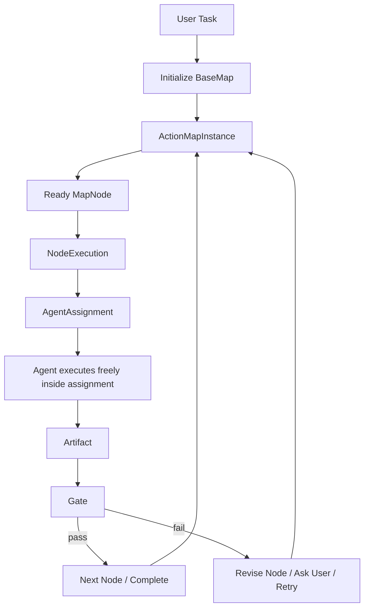
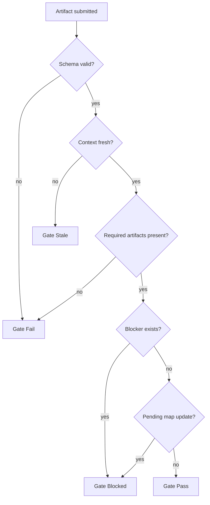
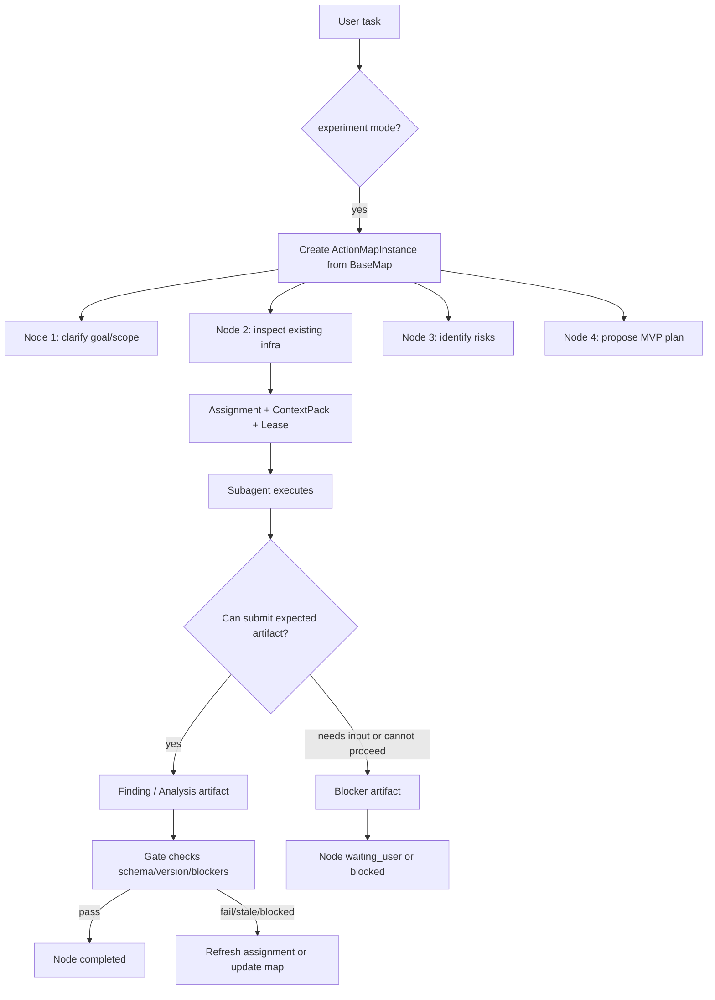

# WhaleCode Multi-Agent 架构设计

日期：2026-04-25
更新：2026-04-30

## 结论

WhaleCode 的 multi-agent 第一版只验证一个核心假设：

```text
Action Map + 结构化 Artifact + Gate
是否比当前写信式 subagent 委派更稳定、更可控、更可复盘。
```

除此之外，所有未经真实任务验证、缺乏强推理实证的概念都不进入核心 runtime。

本文只描述当前要实现和验证的最小 runtime。未被真实任务证明必要的组织形态、投票机制、竞争机制和控制面机制，不在本文保留。

## 最高原则：Occam-first

设计约束：

- 不提前实体化没有被验证的协作概念。
- 不用角色清单解释系统能力。
- 不把 prompt 约定伪装成 runtime contract。
- 不为了“multi-agent first”而制造多 agent 仪式。
- 不维护两套表达同一规则的对象。
- 不让实验模式破坏当前可用的 Codex subagent 默认行为。
- 不设计全局质量分。复杂 agent 任务没有客观准确的单一质量分，系统只能记录证据、验证结果、阻塞点和人工/模型审查意见。

任何新 runtime 概念进入核心前，必须能回答：

```text
+ 没有它，当前系统出现了什么明确失败？
+ 这个失败是否能在真实任务或最小实验中复现？
+ 引入它以后，是否能通过可复现失败、可观察症状或明确人工反馈证明它减少了问题，而不是制造复杂度？
```

答不上来，就不进入核心设计。

## 模式开关

Multi-agent 框架必须可插拔。

```text
/multi-agents standard
  当前默认模式。
  继续使用 Codex-style subagent/thread/message/wait 行为。
  主 agent 可直接 spawn/send/wait/close。
  不强制 Action Map、Artifact、Gate。

/multi-agents standart
  兼容拼写别名，行为等同 standard。
  CLI 应提示 canonical name 是 standard。

/multi-agents experiment
  实验模式。
  启用 Action Map Runtime。
  后续所有 agent 行为必须绑定 map。
```

第一阶段状态应是 session-scoped，不改变全局默认值。runtime 只需要记录当前模式、active map id 和切换 turn。

切换规则：

- `standard -> experiment`：下一次需要 multi-agent 协作时创建或复用 `ActionMapInstance`。
- `experiment -> standard`：停止对新行为施加 Action Map 约束；已运行 subagent 不强杀。
- 切换不清空 session、rollout、compact 历史或 agent registry。
- 每次切换必须写 session event，便于 replay。

Experiment 模式的硬约束：

- agent 每次行动都必须由 map 驱动，并绑定到 map 中的某个 `MapNode`。
- 行动可以绑定已有 `ActionMapInstance`，但不能只绑定 map 而缺少 node。
- 如果没有可用 map，runtime 必须先从 `BaseMap` 新建 `ActionMapInstance`。
- 无 map/node 绑定时，agent 不允许 spawn、接收 assignment、执行工具或提交结果。
- 子 agent 只能通过 `AgentAssignment + AssignmentLease` 进入某个 node；node 是 map 中的子任务，不是角色、线程或自由消息主题。
- 执行中发现的新任务必须先通过 map mutation 生长为 node，不能直接派给 agent。
- 任何自然语言 follow-up 如果改变任务目标，必须先更新或新建 map，再继续行动。

这里的约束只表示“行动必须有 map 坐标和可追踪记录”，不表示 map 可以强迫 agent 继续执行。
agent 发现缺少用户输入、工具权限不足、上下文不足、风险过高或自己无法继续时，可以合法停止并提交 `Blocker`。
此时 runtime 记录 map/node 状态，但不能把停止当成协议失败，也不能要求 agent 编造进展来满足节点完成。

## 最小运行模型

核心链路只有这些对象：

```text
UserTask
  -> BaseMap
  -> ActionMapInstance
  -> MapNode
  -> NodeExecution
  -> AgentAssignment
  -> Artifact
  -> Gate
  -> MapEvent
```

这些对象的职责边界：

| 对象 | 职责 |
| --- | --- |
| `BaseMap` | 第一版唯一基础地图，只给 agent 一个组织任务的起点 |
| `ActionMapInstance` | 当前任务的小队行动图和事实源 |
| `MapNode` | 一个可执行行动点 |
| `NodeExecution` | 某个节点本次如何执行 |
| `AgentAssignment` | 发给 agent 的具体工作包 |
| `Artifact` | agent 提交的结构化产物，记录证据、结论和限制 |
| `Gate` | 根据可检查条件判断节点或阶段是否可推进 |
| `MapEvent` | 状态变化记录，用于 replay 和审计 |

系统主循环：



并行不是 node 内的多人同时执行。第一版的并行来自多个无依赖的 ready nodes 同时被不同 agent claim。
同一个 node 同一时刻只能有一个 active lease。

## BaseMap

第一版只设计唯一一个 `BaseMap`。它不是领域 map，也不试图覆盖架构、Debug、Feature、Refactor 等不同方法论。

`BaseMap` 的目的只有一个：验证 Action Map Runtime 能否正确组织一次复杂任务。

它给 agent 一个最小起点：

```text
clarify_task
  -> inspect_context
  -> plan_work
  -> execute_work
  -> verify_result
  -> report_result
```

这些节点不是严格流程。runtime 可以根据任务实际情况跳过、拆分或补充节点，但第一版不维护多个父类模板。

`BaseMap` 只定义：

- 初始节点集合。
- 节点之间的默认依赖。
- 每类节点的最小 artifact 要求。
- 最小 gate 条件。

领域 map 是否有价值，必须等 `BaseMap` 跑过真实任务后再判断。

## Action Map Instance

Instance 是当前任务的小队运行状态，也是 experiment 模式的事实源。

```rust
pub struct ActionMapInstance {
    pub id: ActionMapId,
    pub base_map_version: BaseMapVersion,
    pub user_goal: String,
    pub status: MapStatus,
    pub graph_version: GraphVersion,
    pub nodes: Vec<MapNode>,
    pub edges: Vec<MapEdge>,
    pub artifacts: Vec<ArtifactRef>,
    pub events: Vec<MapEventRef>,
}
```

`MapStatus` 第一版只需要：

```text
created -> running -> completed
              |
              -> blocked
              -> paused
              -> aborted
```

不要先做复杂 phase machine。是否需要 phase，等真实任务证明 node/gate 不够用以后再引入。

## MapNode

Node 是 map 中的子任务和行动点，不是角色，也不是 agent。

子 agent 不能直接绑定在 map 根上行动，必须绑定到一个具体 `MapNode`。
同一个 agent 可以随着新 assignment 移动到不同 node，但任意一次行动都只能属于一个当前 node。
这样 map 才能回答三个问题：这个 agent 正在解决哪个子任务、使用了哪份上下文、产物应该归属到哪里。

```rust
pub struct MapNode {
    pub id: NodeId,
    pub title: String,
    pub purpose: String,
    pub status: NodeStatus,
    pub context_boundary: ContextBoundary,
    pub context_state: NodeContextState,
    pub required_artifacts: Vec<ArtifactKind>,
    pub gate: GateSpec,
    pub active_lease: Option<AssignmentLeaseId>,
    pub version: NodeVersion,
}
```

`dependencies` 不放在 `MapNode` 内部，而是由 `ActionMapInstance.edges` 表达。
这样 node 保持为子任务状态容器，图关系由 map 统一维护。

```rust
pub struct NodeContextState {
    pub source_refs: Vec<ContextRef>,
    pub inherited_artifacts: Vec<ArtifactRef>,
    pub local_notes: Vec<NodeNote>,
    pub blockers: Vec<ArtifactRef>,
}
```

Node 持有与该子任务相关的上下文状态，agent 只临时执行：

| 所有者 | 持有内容 |
| --- | --- |
| `MapNode` | context boundary、context pack source refs、inherited artifacts、local notes、blockers、active lease、node version |
| `Agent` | 临时推理过程、工具执行过程、最终提交的 artifact |

任何 agent 接手 node 时，都必须从 node 的 `context_state` 和 inherited artifacts 恢复工作，而不是依赖前一个 agent 的私有记忆。
agent 停止、失败或被关闭后，node 仍保留可接手状态。

同一时刻一个 node 最多只能被一个 agent 持有：

```text
node.active_lease == none      -> runtime may issue assignment
node.active_lease == lease_id  -> node is claimed; other agents cannot claim it
```

这里的持有是 active execution lease，不是永久所有权。
一个 node 历史上可以被多个 agent 接手，但每个时间点只能有一个 active holder。

`NodeStatus` 第一版只需要：

```text
pending -> ready -> running -> completed
                       |
                       -> blocked
                       -> waiting_user
ready -> skipped
ready -> pending
ready/running/completed -> stale -> ready
```

节点完成必须满足：

- required artifacts 已提交。
- gate 通过。
- 没有 stale context。
- 没有 unresolved blocker。

agent 停止不等于节点完成：

- 需要用户补充信息时，agent 提交 `Blocker`，node 进入 `waiting_user`。
- agent 判断无法继续时，agent 提交 `Blocker`，node 进入 `blocked`。
- `waiting_user` 和 `blocked` 都是合法停止结果，只阻止该 node 被标记为 completed。
- 用户补充信息或 map 更新后，runtime 可以刷新 assignment 并让同一个或其他 agent 继续。

`running` 表示 node 已被某个 active lease claim。
只有当前 lease 对应的 agent 能提交该 node 的 artifact；其他 agent 必须等待 lease 完成、失效或被 revoke。

状态切换只能由 runtime 写入，agent 只能通过 artifact、Blocker、MapUpdateRequest 或用户 follow-up 间接触发。

| 当前状态 | 触发 | 下一状态 | 写入者 |
| --- | --- | --- | --- |
| `pending` | 所有上游依赖完成 | `ready` | runtime |
| `ready` | map update 新增未完成上游依赖 | `pending` | runtime |
| `ready` | active lease 原子签发成功 | `running` | runtime |
| `running` | 当前 lease 提交 required artifacts 且 gate pass | `completed` | runtime |
| `running` | 当前 lease 提交 `Blocker(stop_reason=need_user_input)` | `waiting_user` | runtime |
| `running` | 当前 lease 提交 `Blocker(stop_reason=unable_to_proceed/tool_limit/context_missing)` | `blocked` | runtime |
| `ready` | map update 判定 node 不再需要 | `skipped` | runtime |
| `ready/running/completed` | 用户目标或上游 artifact 变化使假设失效 | `stale` | runtime |
| `stale` | context_state 刷新并重新满足依赖 | `ready` | runtime |

如果 `running` node 被标记为 `stale`，runtime 必须先 revoke 当前 lease，再更新 node。
agent 不能自己把 node 标记为 completed、skipped、blocked 或 stale。

## MapEdge

第一版只保留有向依赖边，不引入无向边。

```rust
pub struct MapEdge {
    pub from: NodeId,
    pub to: NodeId,
    pub kind: EdgeKind,
}

pub enum EdgeKind {
    DependsOn,
}
```

语义：

```text
A -> B means B depends on A.
B cannot become ready or claimed until A is completed.
```

可并行不需要显式边表达。
两个 node 之间没有依赖路径，且都满足 ready 条件时，runtime 可以把它们同时派给不同 agent。

```text
ready_nodes = nodes where:
  status == ready
  active_lease == none
  all upstream dependency edges point from completed nodes
```

不要用无向边表达“可并行”。无向边容易混淆为共享上下文、冲突关系、同阶段、审查关系或协作关系。
这些关系如果未来被真实任务证明必要，应作为明确的 relation 类型另行设计；第一版不做。

## Map Growth

初始 map 由根 agent 基于 `BaseMap` 创建，但 `ActionMapInstance` 在执行过程中必须允许生长。
生长只表示对当前任务图做最小必要修改，不表示引入领域 map、phase machine 或自由规划器。

允许的第一版 map mutation：

| Mutation | 用途 |
| --- | --- |
| `AddNode` | 执行中发现必须新增的子任务 |
| `AddEdge` | 新 node 或旧 node 之间新增有向依赖 |
| `UpdateNodeContext` | 用户补充信息、artifact 或 blocker 改变 node 上下文 |
| `MarkStale` | 用户目标或上游结论变化导致 node 假设失效 |
| `SkipNode` | node 已无必要继续执行 |
| `SplitNode` | node 过大，需要拆成多个 sibling nodes |

谁可以创建新 node：

| 来源 | 能做什么 | 不能做什么 |
| --- | --- | --- |
| 根 agent | 初始化 map；根据用户 follow-up 或 artifact 请求提出 map mutation | 不能绕过 runtime 直接改状态 |
| subagent | 通过 `MapUpdateRequest` 或 `Blocker` 请求新增、拆分或更新 node | 不能直接创建 node，不能直接改 edge/status |
| runtime | 校验并提交 mutation，写入 graph_version 和 MapEvent | 不能凭空生成业务判断，只能执行已被根 agent 接受的 mutation |
| user follow-up | 改变目标、补充信息、确认 blocker | 不直接编辑内部图；由根 agent 转成 map update |

提交 map mutation 的最小规则：

```text
MapUpdateRequest:
  base_graph_version: <version>
  reason: <why this map change is needed>
  mutations:
    - AddNode | AddEdge | UpdateNodeContext | MarkStale | SkipNode | SplitNode
  affected_nodes: <ids>
  evidence_refs: <artifact ids or user turn ids>
```

runtime 接受 mutation 前必须检查：

- `base_graph_version` 仍然 fresh。
- 新增 node 有明确 purpose、context boundary、required artifacts 和 gate。
- 新增 edge 不形成 cycle。
- 如果影响 running node，先 revoke active lease。
- 被影响的下游 assignment/artifact 必须标记 stale 或要求重跑。

提交成功后：

```text
graph_version += 1
append MapEvent::MapUpdated
append NodeAdded / EdgeAdded / NodeStatusChanged as needed
recompute ready_nodes
```

map 生长的关键约束：

- 新任务必须先变成 node，才能派给 agent。
- 新 node 默认 `pending`；只有依赖满足且无 active lease 时才能 `ready`。
- 如果新任务与当前 running node 无依赖关系，它可以成为 sibling node，并与其他 ready nodes 并行被 claim。
- 如果新任务是当前 node 的前置条件，当前 node 应进入 `blocked` 或 `stale`，等待新 node 完成。
- map 生长不能直接把任何 node 标记为 completed；完成仍只能来自 artifact + gate。

## NodeExecution

`NodeExecution` 只描述一个节点本次怎么执行。

```rust
pub struct NodeExecution {
    pub id: ExecutionId,
    pub node_id: NodeId,
    pub strategy: ExecutionStrategy,
    pub assignments: Vec<AgentAssignment>,
    pub expected_artifacts: Vec<ArtifactKind>,
}

pub enum ExecutionStrategy {
    Single,
    Review,
    Verify,
}
```

第一版只保留四种策略：

| Strategy | 用途 |
| --- | --- |
| `Single` | 一个 agent 执行节点 |
| `Review` | 对已有 artifact 做审查 |
| `Verify` | 对已有 artifact 做验证 |

第一版不做候选竞赛、投票和共识聚合。这些不是最小验证闭环的一部分。

策略选择由 runtime 根据节点决定：

```text
small/simple node -> Single
artifact needs critique -> Review
artifact needs proof -> Verify
```

如果任务需要并行扫描，runtime 应优先把工作拆成多个 sibling nodes，再由不同 agent 分别 claim。
不要让多个 agent 同时 claim 同一个 node。

## AgentAssignment

Agent 是执行资源，不是固定角色。

```rust
pub struct AgentAssignment {
    pub id: AssignmentId,
    pub map_id: ActionMapId,
    pub node_id: NodeId,
    pub lease_id: AssignmentLeaseId,
    pub objective: String,
    pub context_pack: ContextPack,
    pub allowed_tools: Vec<ToolName>,
    pub expected_artifact: ArtifactKind,
    pub constraints: Vec<String>,
}
```

agent 可以在 map 上移动，但每次移动都必须生成新的 assignment 和 context pack。assignment 必须同时绑定 `map_id`、`node_id` 和 `lease_id`；只绑定 agent 或 thread 不算 map 驱动。

## Map 驱动执行机制

“每次行动都由 map 驱动”必须由 runtime 强制，不能依赖 agent 自觉。

### 入口拦截

`MapActionGuard` 不是一套新调度器，而是现有入口上的轻量校验层。第一版只接入已经存在的 Codex V2 multi-agent handler：

```text
spawn_agent handler
send_message / followup_task handler
wait_agent handler
close_agent handler
session user follow-up handling
```

普通 shell/read/edit 等工具暂不逐个重写。第一版通过 assignment prompt、allowed tool policy、现有 sandbox/approval 和 artifact gate 管住结果；只有真实任务证明需要更细粒度工具拦截时，才扩展到通用 tool dispatcher。

`MapActionGuard` 的决策：

```text
if mode == standard:
  allow current Codex behavior

if mode == experiment and no active map:
  create ActionMapInstance from BaseMap
  append MapCreated
  continue through map-bound path

if mode == experiment and action has no map_id/node_id/lease_id:
  reject action or convert it into a map update request

if mode == experiment and subagent action targets only map_id:
  reject action and require runtime to select or create a ready node
```

### Assignment Lease

`AssignmentLease` 是 agent 执行节点的临时许可。第一版不要新建独立锁系统，优先复用现有 identity：

- `AgentPath` 作为 agent 在树上的稳定路径。
- `task_name` 作为 map node 的路径来源。
- `AgentRegistry` 记录 live thread 与 agent metadata。
- `SessionSource::SubAgent(ThreadSpawn)` 记录 parent、depth、agent_path、agent_role。
- `CollabAgentSpawnBegin/End`、`CollabAgentInteractionBegin/End`、`CollabWaitingBegin/End` 作为现有 session event。

lease 可以先作为 Map Runtime 中的内存/rollout metadata，绑定 `assignment_id -> AgentPath/ThreadId`，不需要替换 `AgentRegistry`。
签发 active lease 必须是 node claim 的原子动作：

```text
if node.status == ready and node.active_lease == none:
  issue AssignmentLease
  node.active_lease = lease_id
  node.status = running
else:
  reject claim
```

这条规则保证一个 node 同一时刻最多只有一个 agent 持有。

```rust
pub struct AssignmentLease {
    pub id: AssignmentLeaseId,
    pub map_id: ActionMapId,
    pub node_id: NodeId,
    pub assignment_id: AssignmentId,
    pub agent_id: AgentId,
    pub issued_at_graph_version: GraphVersion,
    pub issued_at_node_version: NodeVersion,
    pub allowed_tools: Vec<ToolName>,
    pub status: LeaseStatus,
}
```

`LeaseStatus`：

```text
active -> completed
       -> expired
       -> revoked
       -> stale
```

这里的 `completed` 表示 assignment 已经有结构化返回，不等于 node completed。
agent 提交 `Blocker` 后，lease 可以结束，但 node 只能进入 `blocked` 或 `waiting_user`。

lease 失效条件：

- map 被 paused 或 aborted。
- node 已 completed、skipped、blocked 或 waiting_user。
- node version 改变且 assignment 未刷新。
- agent 尝试使用未授权工具。
- agent 尝试提交不匹配的 artifact 类型。

### Collab Handler Guard

第一版不拦截所有普通工具调用，只拦截 multi-agent 协作工具和 artifact 提交入口。

```text
collab_action_allowed if:
  lease.status == active
  action in spawn_agent | send_message | followup_task | wait_agent | close_agent | submit_artifact
  current_graph_version == lease.issued_at_graph_version
  current_node_version == lease.issued_at_node_version
```

失败时不要让模型“自己解释继续做”，runtime 直接返回结构化错误：

```text
MapActionRejected {
  reason: missing_map | missing_node | missing_lease | stale_lease | action_not_allowed
  required_recovery: create_map | refresh_assignment | request_node_update
}
```

### Artifact Submit Guard

artifact 提交必须引用 assignment：

```text
artifact.map_id == assignment.map_id
artifact.node_id == assignment.node_id
artifact.assignment_id == assignment.id
artifact.base_graph_version == assignment.context_pack.graph_version
artifact.base_node_version == assignment.context_pack.node_version
artifact.kind == assignment.expected_artifact || artifact.kind == Blocker || artifact.kind == MapUpdateRequest
```

不满足时，artifact 进入 rejected，不允许进入 gate。

### Prompt 注入不是约束

assignment 可以注入到 agent prompt 中，帮助模型理解当前 map/node：

```text
Current map: <map_id>
Current node: <node_id>
Assignment: <assignment_id>
Expected artifact: <kind>
Allowed tools: <tools>
```

但这只是辅助。真正约束来自 `MapActionGuard`、`AssignmentLease`、collab handler 校验和 `Artifact Submit Guard`。

### 恢复策略

如果 agent 试图越过 map 行动：

- 缺 map：创建 `BaseMap` 实例，然后重新生成 assignment。
- 缺 node：让 runtime 选择 ready node，或创建 clarify/update node。
- lease stale：刷新 context pack，重新发 assignment。
- tool 不允许：返回拒绝，并要求 agent 提交 `Blocker` 或请求 node update。
- 发现新任务：要求 agent 提交 `MapUpdateRequest`，由根 agent 接受后 runtime 提交 map mutation。
- agent 主动停止：接收 `Blocker`，结束当前 lease，把 node 标记为 `blocked` 或 `waiting_user`。
- 用户改变目标：暂停当前节点，更新 map，再生成新 assignment。

这些恢复都必须写 MapEvent。

## ContextPack

上下文必须由 runtime 分配，不能让 agent 无限自由继承所有材料。

```rust
pub struct ContextPack {
    pub id: ContextPackId,
    pub graph_version: GraphVersion,
    pub node_version: NodeVersion,
    pub required_sources: Vec<ContextSource>,
    pub artifacts: Vec<ArtifactRef>,
    pub constraints: Vec<String>,
}
```

第一版只做版本检查：

```text
fresh if:
  assignment.graph_version == current.graph_version
  assignment.node_version == current.node_version
  required artifact versions unchanged

stale if:
  upstream artifact changed
  node status changed
  relevant file changed after context pack was issued
```

如果 stale，artifact 不能直接通过 gate，必须刷新或重跑。

## Artifact

正式结论必须是 artifact，不能只是 mailbox 文本。

```rust
pub struct ArtifactEnvelope<T> {
    pub id: ArtifactId,
    pub node_id: NodeId,
    pub assignment_id: AssignmentId,
    pub producer: AgentId,
    pub kind: ArtifactKind,
    pub base_graph_version: GraphVersion,
    pub base_node_version: NodeVersion,
    pub evidence_refs: Vec<ArtifactRef>,
    pub limitations: Vec<String>,
    pub body: T,
}
```

第一版 artifact 类型只保留：

| Artifact | 用途 |
| --- | --- |
| `Finding` | 文件、符号、日志、事实证据 |
| `Analysis` | 对事实的解释或方案分析 |
| `PatchProposal` | 候选改动说明或 patch 引用 |
| `ReviewResult` | 对 artifact 的审查意见 |
| `VerificationResult` | 测试、构建、复现、静态检查结果 |
| `Blocker` | 合法停止记录：需要用户输入、工具/上下文不足、风险过高或无法继续的原因 |
| `MapUpdateRequest` | 请求 map 生长或修正：新增、拆分、跳过、标记 stale、补充 node context |

不做额外评分、投票或共识类产物。

## Gate

Gate 是唯一准出机制。

Gate 不评估“质量分”，只检查明确条件是否满足。它可以阻断明显缺证据、上下文过期、验证缺失或存在 blocker 的节点，但不能声称某个复杂结果已经被客观量化为“高质量”。

Gate 只约束“节点是否可以完成”，不约束“agent 是否可以停止”。当 agent 提交 `Blocker` 时，runtime 应记录合法停止原因，并把 node 保持在 `blocked` 或 `waiting_user`，而不是继续驱动 agent 硬做。
当 agent 提交 `MapUpdateRequest` 时，它进入 map mutation 流程，不直接完成 node；只有 mutation 被提交且当前 node 仍满足 gate，node 才能继续进入 completed。

```rust
pub struct GateSpec {
    pub required_artifacts: Vec<ArtifactKind>,
    pub checks: Vec<GateCheck>,
}

pub enum GateResult {
    Pass,
    Fail,
    Blocked,
    Stale,
}
```

第一版 gate 只检查：

- artifact 类型是否齐全。
- artifact schema 是否有效。
- base version 是否仍然 fresh。
- required verification 是否通过。
- 是否存在 blocker。
- 是否存在未处理的 map update request。
- artifact 是否显式记录关键限制和未验证部分。



## MapEvent

状态变化必须是 append-only event。

```rust
pub enum MapEvent {
    ModeChanged,
    MapCreated,
    MapUpdated,
    NodeAdded,
    EdgeAdded,
    NodeStarted,
    NodeStatusChanged,
    AssignmentIssued,
    AssignmentLeaseIssued,
    AssignmentLeaseRevoked,
    MapActionRejected,
    ArtifactSubmitted,
    AgentStopped,
    UserInputRequested,
    GateEvaluated,
    NodeCompleted,
    NodeBlocked,
    MapCompleted,
}
```

第一版不要做完整 event sourcing 框架，但事件必须足够 replay 当前任务的关键决策。

## 通信规则

图是主要沟通介质。

```text
Map is the source of truth.
Messages are hints.
Artifacts are durable claims.
Events are state transitions.
```

允许直接消息，但直接消息不能：

- 标记节点完成。
- 证明风险消失。
- 选择 patch。
- 推进 gate。
- 成为最终事实来源。

如果消息内容影响任务结论，必须转成 artifact。

## Prompt 合同

Prompt 不是强约束，强约束由 runtime guard、lease、artifact gate 执行。但 prompt 必须把当前 map/node/assignment 说明清楚，否则 agent 很难正确行动。

第一版复用现有注入点：

| 现有机制 | Prompt 用法 |
| --- | --- |
| `multi_agent_v2.usage_hint_text` | 根 agent 看到 experiment 模式规则和 map-first 工作方式 |
| `developer_instructions` | 注入当前模式、active map 摘要、当前节点约束 |
| `build_agent_spawn_config(... base_instructions ...)` | 子 agent 继承基础行为规则 |
| `spawn_agent.message` | 传递 assignment-specific prompt |
| `InterAgentCommunication.content` | 临时 follow-up 或 completion 文本，不能替代 artifact |

### 根 agent prompt

根 agent 在 experiment 模式下必须收到短规则：

```text
You are operating in WhaleCode multi-agents experiment mode.
Every agent action must be bound to an ActionMapInstance.
If no active map exists, create one from BaseMap before delegating work.
Do not treat free-form messages as completed work.
A node can complete only through accepted artifacts and gate evaluation.
Stopping is allowed when you need user input, hit a tool/context limit, or cannot proceed.
When stopping, submit a Blocker artifact with the reason and the next needed input.
Do not invent quality scores. Record evidence, limitations, blockers, and verification results.
```

中文等价要求：

```text
当前是 multi-agents experiment 模式。
所有 agent 行动必须绑定 ActionMapInstance。
没有 active map 时，先从 BaseMap 创建 map，再委派。
自然语言消息不能直接代表节点完成。
节点只能通过 artifact + gate 完成。
需要用户输入、遇到工具/上下文限制或无法继续时，可以停止。
停止时必须提交 Blocker artifact，说明原因和下一步需要的信息。
不要编造质量分，只记录证据、限制、阻塞和验证结果。
```

### Assignment prompt

子 agent 的 `spawn_agent.message` 必须由 assignment 生成，而不是让主 agent 临场自由写一封任务信。

最小结构：

```text
Map: <map_id>
Node: <node_id> - <node_title>
Assignment: <assignment_id>
Lease: <lease_id>

Objective:
<one concrete objective>

Context:
- graph_version: <version>
- node_version: <version>
- required sources: <short list>
- inherited artifacts: <ids or none>

Allowed actions:
<allowed tools / read-write scope / explicit constraints>

Expected artifact:
kind: <Finding | Analysis | PatchProposal | ReviewResult | VerificationResult | Blocker | MapUpdateRequest>
must include:
- evidence_refs
- limitations
- files or commands inspected, when applicable
- verification run, when applicable

Do not:
- work outside this node without a new assignment
- claim the node is complete
- hide blockers
- keep working after you know the assignment is blocked
- start newly discovered work before requesting a map update
- invent quality scores
```

### Artifact submission prompt

当 agent 准备提交结果时，prompt 应要求它按 artifact 结构输出，而不是写总结信：

```text
Submit an artifact for the current assignment.
Use the expected artifact kind.
Include the assignment id, map id, node id, evidence refs, limitations, and any blockers.
If you need user input, hit a tool/context limit, or cannot proceed, submit a Blocker artifact instead.
The Blocker must include: stop_reason, what was tried, what is missing, and the exact question or recovery needed.
If you discover new work that must be tracked before execution, submit a MapUpdateRequest instead.
```

### Map update prompt

用户 follow-up 改变任务目标时，根 agent 不应直接继续执行，而应先更新 map：

```text
The user changed or refined the task.
Before delegating more work, update the active ActionMapInstance:
- keep completed nodes unchanged unless invalidated
- mark stale nodes if their assumptions changed
- add or revise nodes only as needed
- add edges for real dependencies only
- never use undirected edges for parallelism
- issue new assignments after the map update
```

### Prompt 失败处理

如果 agent 输出绕过 map 的自然语言结果，runtime 不应让模型自己判断是否通过，而应返回恢复提示：

```text
Your response was not accepted because it was not submitted as an artifact for the active map node.
Submit the expected artifact, a Blocker artifact, or a MapUpdateRequest artifact for assignment <assignment_id>.
```

## 与当前 Codex 基建的关系

现有 Codex subagent 机制继续作为执行底座：

| Codex substrate | experiment 模式中的用途 |
| --- | --- |
| `AgentControl` | 继续负责 spawn/resume/send/close subagent thread |
| `AgentPath` | 复用为 map/node/assignment 对应的稳定路径锚点 |
| `AgentRegistry` | 继续记录 live agent/thread 状态；Map Runtime 不替换它 |
| `SessionSource::SubAgent(ThreadSpawn)` | 继续承载 parent、depth、agent_path、role 元数据 |
| mailbox | 临时通知和唤醒 |
| collab session events | 复用 spawn/message/wait/close begin/end 事件，追加 map metadata |
| tools/sandbox/approval | 继续执行工具和权限边界 |
| multi_agents_v2 handlers | 插入轻量 `MapActionGuard`，不重写通用工具系统 |

`standard` 模式不变。

`experiment` 模式只是包一层：

```text
Ready MapNode
  -> NodeExecution
  -> AgentAssignment + ContextPack
  -> existing multi_agents_v2 spawn/send/wait/close runtime
  -> Artifact ingestion
  -> Gate
```

具体落点：

- `spawn_agent`：在 `spawn.rs` 创建 child 前，确保有 active map、ready node、assignment；禁止只以 map 为目标创建 child；把 `task_name` 约束为 node-derived path。
- `send_message` / `followup_task`：在 `message_tool.rs` 发送 mailbox 前，校验 target agent 是否有 active assignment lease。
- `wait_agent`：继续复用 mailbox seq 等待；experiment 模式下等待结果必须进入 artifact ingestion，不能只靠自然语言完成节点。
- `close_agent`：继续复用 `AgentControl::close_agent`；experiment 模式下同时 revoke assignment lease。
- completion notification：复用现有 child-to-parent `InterAgentCommunication`，把它视为 artifact ingestion 的输入来源之一。
- events：优先扩展现有 collab event payload 或追加轻量 map event，不新增并行事件总线。

## 运行推演

假设用户开启实验模式后提出任务：

```text
帮我分析 WhaleCode 当前 multi-agent 架构，找出实现风险，并给出第一阶段落地方案。
```

系统实际运行应像一个 map-bound 派工系统，而不是自由群聊。



### Step 1：模式切换

用户输入 `/multi-agents experiment` 后，runtime 只更新 session-scoped mode，并写入 `ModeChanged` event。
它不清空上下文，不杀已有 subagent，也不改变 `standard` 的默认行为。

### Step 2：从 BaseMap 初始化工作地图

当根 agent 准备处理复杂任务时，`MapActionGuard` 发现当前没有 active map，于是从唯一 `BaseMap` 创建 `ActionMapInstance`。
第一版不选择领域 map，只按任务组织出 3-8 个可解释节点：

```text
map_001:
  user_goal: 分析 multi-agent 架构风险并给出 MVP 落地方案
  status: running

node_1: 明确目标和边界
node_2: 梳理现有 multi-agent 基建
node_3: 分析 map runtime 接入风险
node_4: 形成 MVP 实施顺序
node_5: 审查方案是否过度设计

edges:
node_1 -> node_2
node_2 -> node_3
node_3 -> node_4
node_4 -> node_5
```

如果 runtime 后续把 `node_2` 拆成 `node_2a: 查 spawn/send/wait/close` 和 `node_2b: 查 session event/registry`，这两个 sibling nodes 之间不需要无向边。
它们没有依赖路径，且都 ready 时，就可以分别被不同 agent claim。

### Step 3：ready node 生成 assignment

runtime 为 ready node 生成 assignment，而不是让根 agent 临时写自由任务信：

```text
Map: map_001
Node: node_2 - 梳理现有 multi-agent 基建
Assignment: assign_002
Lease: lease_002

Objective:
梳理当前 Codex-derived multi-agent 基建中可复用的 spawn/send/wait/close、registry 和 event 能力。

Context:
- graph_version: 1
- node_version: 1
- required sources: multi-agent docs, collab handler files
- inherited artifacts: artifact_001

Expected artifact:
kind: Finding
```

同时创建 active `AssignmentLease`，绑定 `assignment_id -> AgentPath/ThreadId`。
subagent 后续通过 `send_message`、`wait_agent`、`close_agent` 或 artifact submission 时，都必须带着这个 map/node/lease 坐标。

### Step 4：subagent 执行并提交 artifact

subagent 在 `ContextPack` 边界内读取材料，提交结构化产物：

```text
Artifact: artifact_002
kind: Finding
map_id: map_001
node_id: node_2
assignment_id: assign_002
base_graph_version: 1
base_node_version: 1

findings:
- 现有基建已有 spawn/send/wait/close 入口。
- AgentRegistry 继续记录 live thread 状态。
- CollabAgentSpawn/Interaction/Waiting event 可复用为 map event 的底层证据。

limitations:
- 第一版尚未逐个拦截普通 shell/read/edit 工具。
```

`Artifact Submit Guard` 检查 map、node、assignment、version 和 artifact kind。
通过后 artifact 才能进入 gate。

### Step 5：gate 只决定 node 能否完成

Gate 检查明确条件：

- artifact schema 有效。
- required artifact 已提交。
- graph/node version 仍然 fresh。
- 没有 unresolved blocker。
- limitation 已记录。

如果通过，runtime 写入：

```text
ArtifactSubmitted
GateEvaluated(Pass)
NodeCompleted
```

然后 `node_2` 进入 `completed`，依赖它的后续 node 才能进入 `ready`。

### Step 6：执行中发现新任务，map 生长

如果执行 `node_2` 时，subagent 发现“artifact ingestion 入口不清楚，必须新增一个专门的源码定位任务”，它不能直接开始做新任务，也不能直接创建 node。
正确返回是 `MapUpdateRequest`：

```text
Artifact: artifact_003
kind: MapUpdateRequest
map_id: map_001
node_id: node_2
assignment_id: assign_002
base_graph_version: 1

reason:
需要先定位 artifact ingestion 入口，否则 node_3 的风险分析缺少实现锚点。

mutations:
- AddNode:
    id: node_2a
    title: 定位 artifact ingestion 入口
    purpose: 找到 completion notification 如何转成 artifact ingestion
    required_artifacts: [Finding]
    gate: source refs present
- AddEdge:
    from: node_2a
    to: node_3

affected_nodes:
- node_3
```

根 agent 判断该请求合理后，runtime 提交 mutation：

```text
graph_version: 1 -> 2
NodeAdded(node_2a)
EdgeAdded(node_2a -> node_3)
NodeStatusChanged(node_3: pending or stale)
ready_nodes recomputed
```

如果 `node_2a` 没有未完成上游依赖且没有 active lease，它会进入 `ready`，之后才能被某个 agent claim。
这就是 map 生长：新发现的任务先成为 node，再通过 assignment 派发。

### Step 7：agent 可以合法停止

如果执行 `node_3` 时，agent 发现需要用户确认“第一版是否只约束 multi-agent 协作入口，还是普通 shell/read/edit 也要强拦截”，它不应该硬编结论。
正确返回是 `Blocker`：

```text
Artifact: artifact_004
kind: Blocker
map_id: map_001
node_id: node_3
assignment_id: assign_004

stop_reason: need_user_input
what_was_tried:
- 已检查 MapActionGuard 设计。
- 已检查 artifact gate 设计。
- 已检查普通工具暂不逐个重写的约束。

what_is_missing:
- 用户是否接受第一版只强约束 multi-agent 协作入口。

question:
- 第一版是否只要求 spawn/send/wait/close/artifact map-bound？
- 还是要求 shell/read/edit 也必须绑定 map/node/lease？
```

runtime 接收后：

```text
lease_004: completed
node_3: waiting_user
map_001: running, with waiting node

events:
- ArtifactSubmitted(Blocker)
- UserInputRequested
- AgentStopped
- NodeBlocked
```

这不是协议失败。map 只是记录工作状态，不能强迫 agent 继续执行。

### Step 8：用户补充后继续

用户回答：

```text
第一版只管 multi-agent 协作入口，普通工具先靠 prompt 和 artifact gate 约束。
```

runtime 判断这是对当前 blocker 的补充，而不是全新任务。
它更新 map：

```text
graph_version: 2 -> 3
node_3: waiting_user -> ready
old lease: stale or completed
new assignment: assign_005
```

新的 `ContextPack` 带上 `artifact_004` 和用户补充信息。
同一个 agent 或另一个 agent 可以继续执行 `node_3`。

### Step 9：无法继续的停止分支

如果 agent 不是需要用户输入，而是判断自己无法继续，也提交 `Blocker`：

```text
kind: Blocker
stop_reason: unable_to_proceed
what_was_tried:
- searched handlers
- checked docs
- inspected session events

what_is_missing:
- cannot locate artifact ingestion implementation

recovery_needed:
- root agent should inspect code locally
- or create a new node to locate artifact ingestion path
```

runtime 结果：

```text
lease: completed
node: blocked
agent: stopped
```

根 agent 可以选择自己接手、重新派发、创建新的 search node，或回到用户说明阻塞。

### 推演结论

这套机制的运行边界是：

- `map` 决定下一步工作在哪里发生。
- `assignment` 决定 agent 本次具体做什么。
- `lease` 决定 agent 是否有权对 node 产生产物。
- `artifact` 决定 agent 的结果是否可被 runtime 消费。
- `MapUpdateRequest` 允许执行中发现的新任务生长为 node。
- `gate` 决定 node 是否能完成。
- `Blocker` 允许 agent 合法停止，而不是为了通过流程编造进展。

第一版要验证的核心假设是：multi-agent 协作能否从自由写信，升级为 map-bound 的可追踪小组作业，同时不把 agent 锁死在流程里。

## MVP 实施顺序

### MA-0：模式开关

- 实现 `/multi-agents standard`。
- 实现 `/multi-agents standart` alias。
- 实现 `/multi-agents experiment`。
- session state 记录当前模式。
- 模式切换写 event。
- `standard` 行为保持现状。
- `experiment` 模式下无 active map 时自动从 `BaseMap` 创建 map，并选择或创建 ready node。
- `spawn_agent`、`send_message`、`followup_task`、`wait_agent`、`close_agent` 入口接入 `MapActionGuard`。

验收：关闭 experiment 后，当前 spawn/send/wait/close 行为不变；开启 experiment 后，没有 map/node 绑定的 agent 行动会被拒绝或先触发 map + node 创建。

### MA-1：Map 与 Node

- 定义 `ActionMapInstance`。
- 定义 `MapNode`。
- 定义有向 `MapEdge`。
- 定义 `NodeStatus` 状态机和 runtime-only 状态切换规则。
- 定义 `MapUpdateRequest` 和 map mutation 提交流程。
- 根据用户任务从唯一 `BaseMap` 初始化最小 map。
- 支持查看当前 map。

验收：一个复杂任务能从 `BaseMap` 初始化出 3-8 个可解释节点和有向依赖边；执行中发现的新任务能通过 `MapUpdateRequest` 生长为新 node；任何 subagent assignment 都能追溯到唯一 node。

### MA-2：Assignment 与 ContextPack

- Ready node 可生成 assignment。
- assignment 携带 context pack。
- assignment 生成 active lease，并原子 claim node。
- multi-agent 协作工具必须通过 lease 校验。
- artifact 记录 base version。
- stale artifact 被拒绝或要求重跑。

验收：上游节点变化后，下游旧 artifact 不能直接通过 gate；无 active lease 的 multi-agent 协作工具调用和 artifact 提交会被拒绝；同一个 node 无法同时签发两个 active leases。

### MA-3：Artifact 与 Gate

- agent 提交结构化 artifact。
- gate 检查 artifact、version、blocker。
- node completion 只能由 gate 触发。
- agent 提交 `Blocker` 时，assignment 可以结束，但 node 只能进入 `blocked` 或 `waiting_user`。

验收：自然语言“我完成了”不能直接完成节点；自然语言“我需要用户补充信息/我无法继续”必须被记录为 `Blocker`，而不是被当成异常协议失败。

### MA-4：Review / Verify 策略

- NodeExecution 支持 `Review`。
- NodeExecution 支持 `Verify`。
- verification 结果可以阻断 gate。

验收：实现类节点在缺少验证时不能完成。

## 参考来源

外部参考只作为背景，不直接生成 runtime 概念。

| 来源 | 本设计中的用法 |
| --- | --- |
| DeepSeek API Docs: https://api-docs.deepseek.com/ | 确认模型、上下文、tool calls、cache、rate limit 能力边界 |
| Anthropic multi-agent research system: https://www.anthropic.com/engineering/built-multi-agent-research-system | 参考委派式多 agent 的工程挑战 |
| Microsoft AutoGen Selector Group Chat: https://microsoft.github.io/autogen/stable/user-guide/agentchat-user-guide/selector-group-chat.html | 参考动态参与者选择，但不采用自由群聊 |
| OpenAI Agents SDK Handoffs: https://openai.github.io/openai-agents-js/guides/handoffs/ | 将 handoff 收敛为 assignment |
| OpenAI Agents SDK Guardrails: https://openai.github.io/openai-agents-js/guides/guardrails/ | 将 guardrail 收敛为 gate |
| Martin Fowler Optimistic Offline Lock: https://martinfowler.com/eaaCatalog/optimisticOfflineLock.html | 参考 stale write 检测 |
| Martin Fowler Event Sourcing: https://www.martinfowler.com/eaaDev/EventSourcing.html | 参考事件化状态变更和 replay |
