# Action Map Runtime 架构设计

日期：2026-04-30

## 结论

WhaleCode 的 multi-agent 协同不应被定义为“主 agent 给子 agent 写信外包任务”，而应被定义为：

```text
用户始终面对一个超级小队；
小队围绕一张可执行、可维护、可审计的 Action Map 行动；
agent 在节点内保持开放域探索自由；
Map Runtime 对节点状态、上下文边界、锁、产物、修订和阶段门施加强约束。
```

`Action Map` 是 WhaleCode multi-agent 的核心 runtime 对象。它不是普通文档、不是长 prompt、也不是 Skills 的替代品，而是任务执行期间的小队共享操作系统。

Action Map Runtime 必须是可插拔实验框架，而不是一次性替换现有 multi-agent 行为。默认模式继续使用当前 Codex subagent 协作方式；只有显式切换到实验模式时，才启用 Action Map Runtime。

```text
Skill
  = 弱注入 playbook
  = agent 可以读、可以参考、可以忽略
  = 不天然产生状态和约束

Action Map Template
  = 任务类型父类模板
  = 提供领域方法论、默认阶段、检查面、artifact 和 gate

Action Map Instance
  = 当前用户任务的运行时地图
  = 根据模板、项目实际上下文、用户目标实例化

Map Runtime
  = 维护 Action Map Instance 的确定性内核
  = 控制状态机、上下文分配、读写锁、修订、事件和准出规则
```

## 可插拔模式开关

WhaleCode 需要同时保留两套 multi-agent 行为模式：

```text
standard
  = 当前默认模式
  = Codex-style subagent/thread/message/wait 行为
  = 主 agent 可自由 spawn/send/wait/close
  = 不强制 Action Map、artifact、gate、lock

experiment
  = 实验模式
  = 启用 Action Map Runtime
  = subagent assignment 必须绑定 MapNode
  = 正式结论必须通过 Artifact / MapEvent / Gate
  = agent 行动受 ContextPack、锁、版本和权限约束
```

命令入口：

```text
/multi-agents
  显示当前模式、可选模式、当前 session 是否已有 ActionMapInstance。

/multi-agents standard
  切回现状模式。正式枚举名为 standard。

/multi-agents standart
  兼容用户拼写别名，行为等同 standard。CLI 输出应提示 canonical name 是 standard。

/multi-agents experiment
  启用实验模式。后续 multi-agent 行为进入 Action Map Runtime。
```

### 模式状态

模式应先做成 session-scoped runtime switch，避免影响用户既有全局工作流。

```rust
pub enum MultiAgentMode {
    Standard,
    Experiment,
}

pub struct MultiAgentRuntimeState {
    pub mode: MultiAgentMode,
    pub active_map_id: Option<ActionMapId>,
    pub switched_at_turn: TurnId,
    pub switched_by: SwitchSource,
}
```

后续可增加配置项作为默认值：

```toml
[multi_agents]
default_mode = "standard"
```

但第一阶段不应让实验模式默认开启。

### 模式切换语义

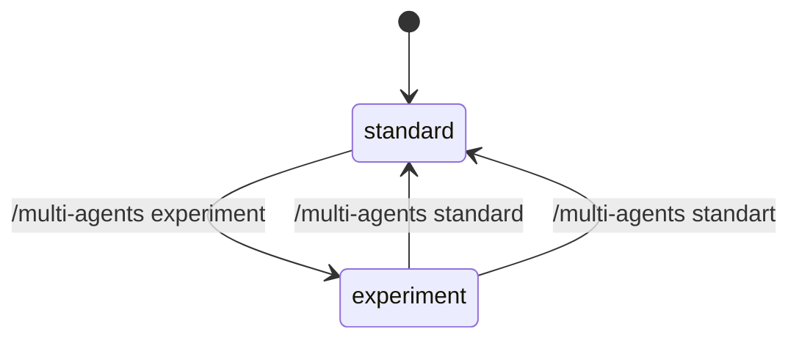

切换规则：

- `standard -> experiment`
  - 若当前没有 active map，则下一次需要 multi-agent 协作时创建 `ActionMapInstance`。
  - 若当前已有 active map，则继续使用该 map。
  - 后续 spawn/send/wait 行为由 Map Runtime 包装和约束。
- `experiment -> standard`
  - 停止对新 multi-agent 行为施加 Action Map 约束。
  - 已存在的 `ActionMapInstance` 不删除，只标记为 paused 或 detached。
  - 已运行 subagent 不应被强杀；后续按 standard mailbox 语义处理结果。
- 命令只改变 runtime 行为模式，不应清空 session、compact 历史、rollout 或已有 agent registry。

### 模式路由

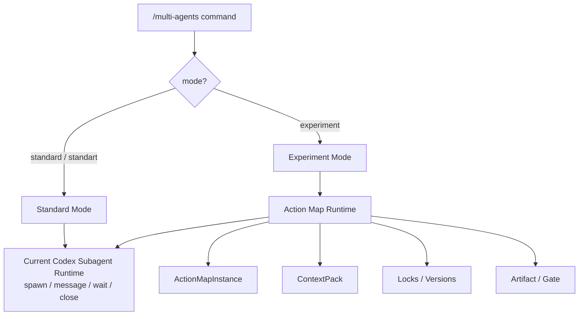

### 工具行为差异

| 工具/行为 | standard | experiment |
| --- | --- | --- |
| `spawn_agent` | 主 agent 可直接创建子 thread | 由 ready `MapNode` 生成 assignment 后再 spawn/resume |
| `send_message` | 临时消息就是主要协作方式 | 只用于临时协调，正式事实必须写 artifact |
| `wait_agent` | 等 mailbox activity | 等 artifact ingestion / node event / gate event |
| `close_agent` | 关闭指定 subagent | 关闭 agent cursor，并释放锁、更新 node 状态 |
| 结果采纳 | 主 agent 读文本后判断 | Gate 通过后才能推进 node/phase |
| 上下文 | 由 agent 自行读取或继承 | Runtime 分配 versioned `ContextPack` |
| 并发写 | 依赖人为约束 | 由 lock/version/write scope 控制 |

这个开关是架构安全阀：实验模式可以逐步建设、测试和回退；现有用户体验不被未成熟的 Map Runtime 破坏。

## 为什么需要 Action Map Runtime

当前 Codex-style subagent 基建已经提供：

- 创建子 thread。
- 给子 agent 投递任务。
- 等 mailbox 通知。
- 关闭、恢复、列出 agent。
- 继承权限、cwd、sandbox、模型配置。

但它本质仍是“写信外包”：

```text
主 agent
  -> spawn 子 agent
  -> 子 agent 自由执行
  -> 子 agent 回一封结果信
  -> 主 agent 凭文本判断下一步
```

这种模式能提升吞吐，但不能自然形成“协同”。缺失点包括：

- 没有共享行动地图，无法判断当前任务缺哪块。
- 没有节点级上下文边界，agent 容易读全量、漏关键、或基于旧信息行动。
- 没有结构化图状态机，任务推进依赖模型自觉。
- 没有版本化读写，多个 agent 容易基于过时事实提交结论。
- 没有正式沟通介质，信息散落在 agent 私聊或 mailbox 文本里。
- 没有强制准出，低质量结果可能被主 agent 过早采纳。

Action Map Runtime 的目标是把 loose delegation 升级为 map-driven teamwork。

## 核心原则

| 原则 | 设计含义 |
| --- | --- |
| Map is the source of truth | 图状态是任务事实源，消息不能替代图状态 |
| Templates are parent maps | 维护任务类型模板，不维护一堆固定具体地图 |
| Instances are task-specific | 每次用户任务都要根据 repo、目标、约束生成实例 |
| Process freedom, boundary discipline | 节点内允许 agent 自由探索，节点间由 map 约束 |
| Context is allocated, not dumped | 给 agent 的上下文必须按节点边界分配和标版本 |
| Agents are cursors | agent 可在图上移动，不永久绑定某个节点 |
| Artifacts are durable claims | 正式结论必须沉淀为 artifact |
| Events are state transitions | 所有状态变化必须落为 MapEvent，可 replay |
| Locks protect graph truth | 节点写入必须经过锁和版本检查 |
| Direct chat is secondary | agent 沟通默认通过图，私信只做临时协调 |

## 总体架构

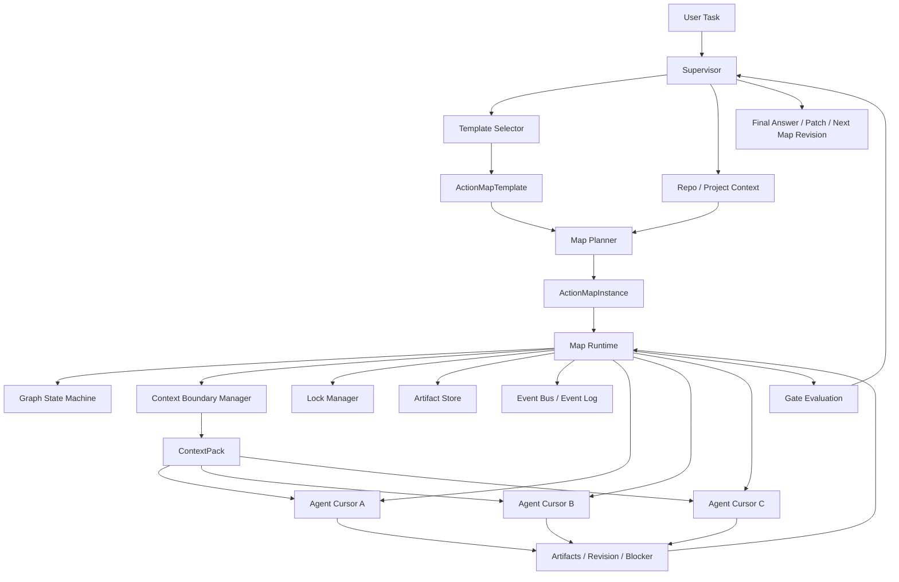

### 分层

```text
Layer 1: Template Layer
  任务类型父类：架构优化、Bug 诊断、功能创建、重构、性能调查、发布等。

Layer 2: Instance Layer
  当前用户任务的具体行动图：节点、边、上下文、产物、风险、gate。

Layer 3: Runtime Layer
  确定性执行内核：状态机、锁、版本、事件、权限、上下文分配。

Layer 4: Agent Layer
  agent 作为执行游标进入节点，提交 artifact / revision / blocker。

Layer 5: Viewer / Verifier Layer
  只读批判和验证，不直接改图，只提交 concern / verification artifact。
```

## 与 Skills 的关系

Skills 和 Action Map 都像 playbook，但强度不同。

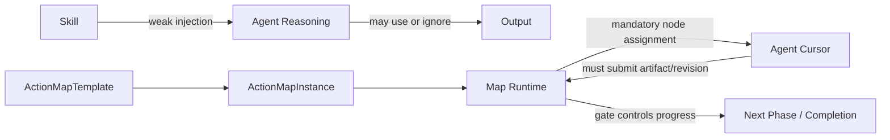

| 维度 | Skill | Action Map |
| --- | --- | --- |
| 生命周期 | 可复用知识包 | 单次任务 runtime 实例 |
| 注入方式 | prompt/context 弱注入 | runtime 强约束 |
| 是否有状态 | 通常没有 | 有图状态、节点状态、版本 |
| 是否可阻断推进 | 通常不能 | gate 可阻断 phase/node |
| 是否要求产物 | 不天然要求 | 节点必须提交 artifact |
| 是否可 replay | 依赖外部日志 | event sourcing 原生支持 |
| 主要作用 | 提升 agent 能力 | 组织小队协作 |

Skill 可以参与模板选择和节点执行。例如 `architecture-scan` skill 可以作为 `ArchitectureOptimizationMapTemplate` 的知识来源，但不能替代 Map Runtime 的状态和约束。

## Action Map Template

模板是父类地图。它定义某类任务的核心方法论，但不绑定具体项目结构。

```rust
pub struct ActionMapTemplate {
    pub id: TemplateId,
    pub name: String,
    pub task_kinds: Vec<TaskKind>,
    pub default_phases: Vec<PhaseTemplate>,
    pub check_surfaces: Vec<CheckSurface>,
    pub artifact_contracts: Vec<ArtifactContract>,
    pub gate_rules: Vec<GateRule>,
    pub revision_rules: Vec<RevisionRule>,
    pub context_policies: Vec<ContextPolicy>,
    pub lock_policies: Vec<LockPolicy>,
    pub escalation_rules: Vec<EscalationRule>,
}
```

第一阶段建议维护这些模板：

| Template | 用途 | 核心方法论 |
| --- | --- | --- |
| `ArchitectureOptimizationMapTemplate` | 架构优化、模块治理、技术债治理 | 现状建模 -> 多维质量扫描 -> 目标对齐 -> 治理方案 -> 迁移验证 |
| `BugDiagnosisMapTemplate` | 复杂 bug 诊断 | 现象固定 -> 假设生成 -> 证据收集 -> 证伪收敛 -> 根因验证 |
| `FeatureCreationMapTemplate` | 新功能设计与实现 | 需求定界 -> 脚手架/日志/测试 -> 实现切片 -> 验证闭环 |
| `RefactorMapTemplate` | 行为保持重构 | 现有行为建模 -> 风险边界 -> 小步迁移 -> 回归验证 |
| `PerformanceInvestigationMapTemplate` | 性能问题 | 基线指标 -> 热点定位 -> 假设实验 -> 改动验证 |
| `ReleaseMapTemplate` | 发布打包 | 版本/产物 -> 构建签名 -> smoke -> 发布记录 |

### 架构优化模板示例

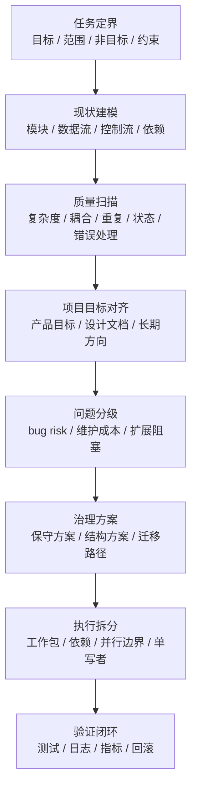

模板只提供骨架。实际任务实例可以把“质量扫描”展开成多个项目相关节点：

```text
quality_scan
  -> module_boundary_scan
  -> dependency_cycle_scan
  -> state_ownership_scan
  -> logging_gap_scan
  -> test_gap_scan
  -> public_api_stability_scan
```

## Action Map Instance

实例是当前用户任务的小队运行状态。

```rust
pub struct ActionMapInstance {
    pub id: ActionMapId,
    pub template_id: TemplateId,
    pub user_goal: String,
    pub project_context_ref: ContextRef,
    pub status: MapStatus,
    pub current_phase: PhaseId,
    pub graph_version: GraphVersion,
    pub nodes: Vec<MapNode>,
    pub edges: Vec<MapEdge>,
    pub artifacts: Vec<ArtifactRef>,
    pub gates: Vec<MapGate>,
    pub open_questions: Vec<OpenQuestion>,
    pub risks: Vec<RiskRecord>,
    pub revisions: Vec<MapRevisionRecord>,
}
```

`MapStatus`：

```text
created
  -> instantiated
  -> running
  -> revising
  -> blocked
  -> verifying
  -> completed
  -> archived
  -> aborted
```

## Map Node

节点是一个行动坐标，不是一个固定 agent。agent 可以进入、离开、移交、回到节点。

```rust
pub struct MapNode {
    pub id: NodeId,
    pub phase: PhaseId,
    pub title: String,
    pub purpose: String,
    pub status: NodeStatus,
    pub dependencies: Vec<NodeId>,
    pub allowed_agent_capabilities: Vec<Capability>,
    pub context_boundary: MapNodeContext,
    pub required_artifacts: Vec<ArtifactKind>,
    pub exit_criteria: Vec<ExitCriterion>,
    pub lock_policy: NodeLockPolicy,
    pub version: NodeVersion,
}
```

节点状态机：

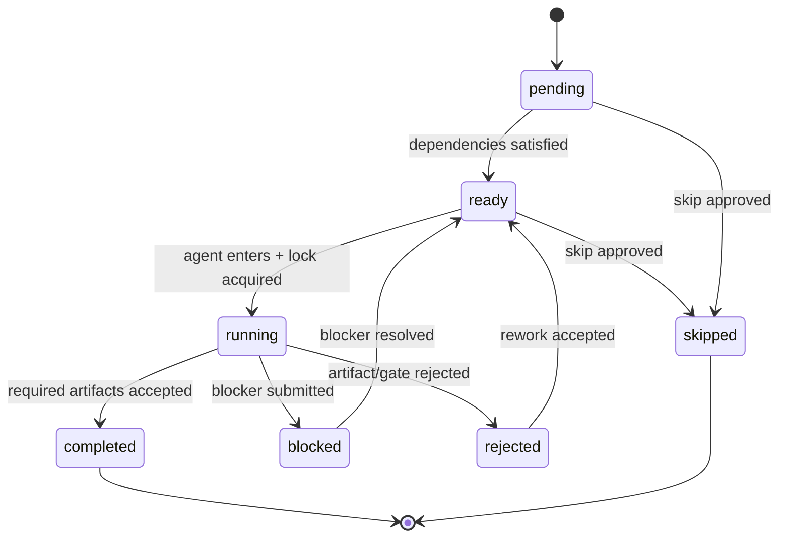

## Agent 是 Cursor，不是节点

agent 在 Action Map 中是可移动执行游标。

```rust
pub struct AgentCursor {
    pub agent_id: AgentId,
    pub current_node_id: Option<NodeId>,
    pub previous_nodes: Vec<NodeId>,
    pub held_locks: Vec<LockId>,
    pub visible_context_version: ContextVersion,
    pub active_assignment: Option<AssignmentId>,
    pub status: AgentCursorStatus,
}
```

移动规则：

```text
agent.enter_node(node):
  - node.status must be ready or running-with-compatible-read
  - agent must have required capabilities
  - ContextPack must be issued for node current version
  - write or intent lock must be acquired if assignment can mutate node

agent.leave_node(node):
  - release read/write/intent locks
  - persist cursor event
  - mark unfinished assignment as returned / blocked / transferred

agent.request_move(target_node):
  - runtime checks graph dependency, permissions, context freshness
  - if accepted, new ContextPack is minted
```

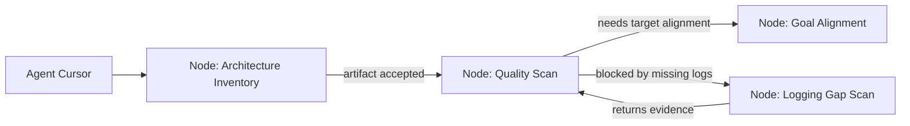

这允许同一个 agent 在多个节点间移动，同时保留每次移动时的上下文版本和锁记录。

## 上下文边界

每个节点必须声明上下文边界。Context Manager 根据节点、图状态和 agent 权限生成 `ContextPack`。

```rust
pub struct MapNodeContext {
    pub required_sources: Vec<ContextSource>,
    pub optional_sources: Vec<ContextSource>,
    pub forbidden_sources: Vec<ContextSource>,
    pub inherited_artifacts: Vec<ArtifactRef>,
    pub output_context: Vec<ContextOutputSpec>,
    pub freshness_policy: FreshnessPolicy,
}

pub struct ContextPack {
    pub id: ContextPackId,
    pub node_id: NodeId,
    pub graph_version: GraphVersion,
    pub node_version: NodeVersion,
    pub source_versions: Vec<SourceVersion>,
    pub artifacts: Vec<ArtifactRef>,
    pub files: Vec<FileContextRef>,
    pub docs: Vec<DocContextRef>,
    pub constraints: Vec<ConstraintRef>,
    pub redactions: Vec<RedactionRecord>,
}
```

上下文不是“给越多越好”，而是要有边界和出处：

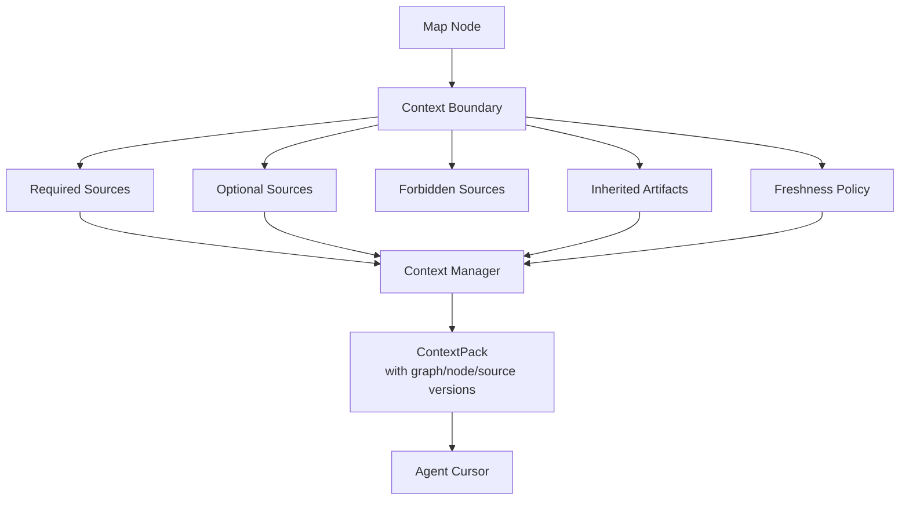

### Freshness Policy

每个结论都必须知道自己基于哪个版本的图和上下文。

```text
fresh if:
  - graph_version == assignment.graph_version
  - node_version == assignment.node_version
  - all required artifact versions unchanged
  - all required file snapshots unchanged or explicitly refreshed

stale if:
  - upstream artifact changed
  - node dependency changed from skipped to completed
  - target file changed after ContextPack minted
  - gate decision invalidated previous assumption
```

## 读写锁与并发控制

Map Runtime 需要防止经典问题：

- agent A 基于旧图提交结论。
- agent B 已更新节点，但 agent C 仍按旧上下文继续写。
- 多个 agent 同时修改同一节点状态。
- review 结论和 implementation patch 基于不同版本。
- 私聊里达成共识，但图状态没有记录。

锁不是为了把系统变成串行，而是为了保护图状态和正式产物。

### 锁类型

| Lock | 用途 | 典型持有者 |
| --- | --- | --- |
| `ReadLock` | 读取节点状态和 artifacts，记录读取版本 | explorer / reviewer / viewer |
| `IntentLock` | 声明准备写，防止多个 agent 同时基于旧上下文写同一节点 | implementer / planner |
| `WriteLock` | 提交 artifact、完成节点、提出局部修订 | executor / supervisor |
| `GateLock` | 评估 phase/node gate，期间冻结相关写入 | supervisor / verifier |

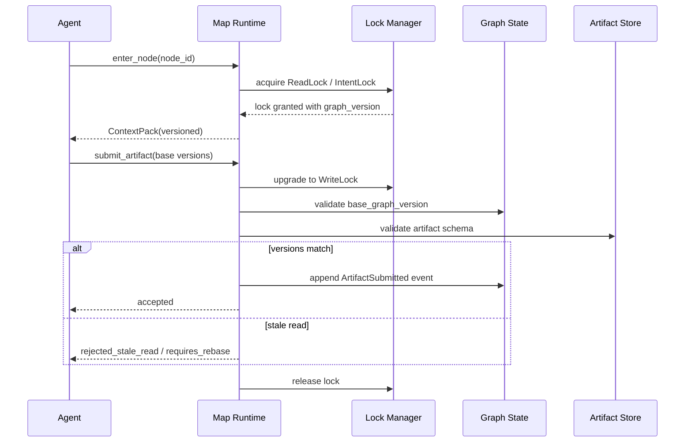

### 版本化写入

所有正式写入都必须带 base version。

```rust
pub struct MapMutation {
    pub actor: AgentId,
    pub base_graph_version: GraphVersion,
    pub base_node_version: NodeVersion,
    pub base_artifact_versions: Vec<ArtifactVersionRef>,
    pub operation: MapOperation,
}
```

提交结果：

```text
accepted
rejected_stale_read
requires_rebase
conflict_detected
permission_denied
schema_invalid
gate_blocked
```

这与 Optimistic Offline Lock 的思想一致：允许并发读取和执行，但提交前必须验证没有覆盖别人已经改变的状态。

## 图状态机与 Event Sourcing

Map Runtime 不应直接覆盖状态，而应追加事件，然后由 reducer 得到当前图状态。

```rust
pub enum MapEvent {
    MapCreated,
    TemplateSelected,
    MapInstantiated,
    NodeAdded,
    NodeStarted,
    ContextPackIssued,
    LockAcquired,
    ArtifactSubmitted,
    ArtifactAccepted,
    ArtifactRejected,
    NodeBlocked,
    NodeCompleted,
    RevisionProposed,
    RevisionAccepted,
    RevisionRejected,
    ConflictRaised,
    GateEvaluated,
    PhaseAdvanced,
    MapCompleted,
}
```

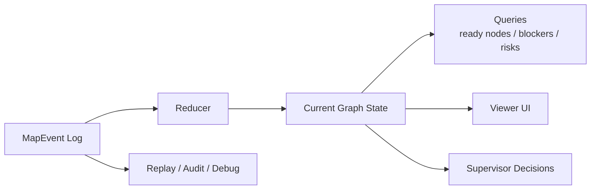

好处：

- 可 replay：重建任意时刻小队如何行动。
- 可审计：知道哪个 agent 在哪个版本提交了什么。
- 可 UI 展示：Web Viewer 可以直接渲染图状态。
- 可调试：multi-agent 失败时可以定位是上下文分配、锁冲突、gate 过早，还是 artifact 质量问题。

## Map Revision

地图实例不是死流程。agent 可以提出修改，但不能直接改图。

```rust
pub struct MapRevisionProposal {
    pub id: RevisionId,
    pub proposer: AgentId,
    pub base_graph_version: GraphVersion,
    pub kind: RevisionKind,
    pub rationale: String,
    pub evidence_refs: Vec<ArtifactRef>,
    pub risk_impact: RiskImpact,
}

pub enum RevisionKind {
    AddNode,
    SplitNode,
    SkipNode,
    ReorderEdge,
    ChangeContextBoundary,
    ChangeRequiredArtifact,
    EscalateToUser,
}
```

修订状态机：

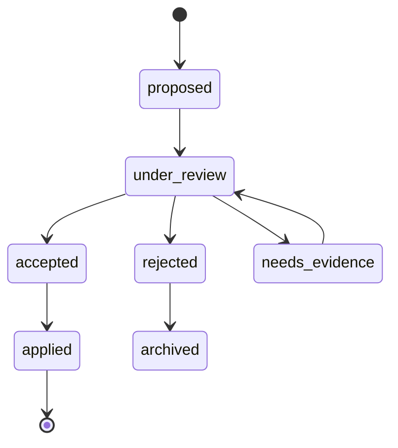

修订规则：

- 添加节点必须说明为什么当前地图覆盖不足。
- 跳过节点必须提交 `skip_reason` 和风险影响。
- 改上下文边界必须使所有受影响 assignment 失效或刷新。
- 改依赖边必须重新计算 ready/running 节点。
- 高风险修订必须触发 Viewer concern 或 Verifier check。

## Gate 设计

Gate 是 Map Runtime 的准出机制。

```rust
pub struct MapGate {
    pub id: GateId,
    pub scope: GateScope,
    pub required_artifacts: Vec<ArtifactKind>,
    pub checks: Vec<GateCheck>,
    pub blocking_concerns: Vec<ConcernRef>,
    pub status: GateStatus,
}
```

Gate 范围：

```text
node_gate
phase_gate
map_completion_gate
patch_apply_gate
user_escalation_gate
```

典型规则：

```text
node can complete if:
  - required artifacts accepted
  - exit criteria satisfied
  - no stale context
  - no unresolved blocking concern

phase can advance if:
  - all required nodes completed or explicitly skipped
  - critical risks = 0
  - conflicts resolved
  - verifier checks pass when required

patch can apply if:
  - patch artifact is selected
  - write scope is exclusive
  - tests/logging plan exists
  - reviewer/verifier concerns resolved
```

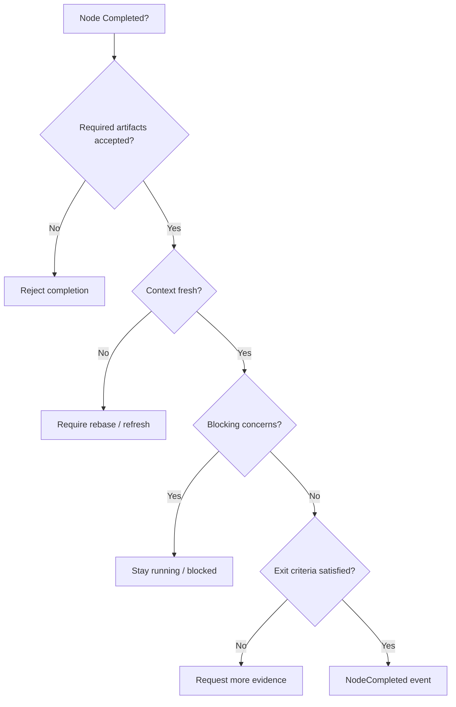

## Agent 间沟通

默认结论：**图本身就是主要沟通介质。**

agent 不应通过自由私聊形成事实共识，因为这会让 Supervisor、Viewer、replay 和后续 agent 无法可靠复盘。正式沟通应该通过图上的 durable objects 完成：

| 需求 | 正式沟通对象 |
| --- | --- |
| 发现问题 | `FindingArtifact` |
| 请求别人处理 | `DependencyRequest` |
| 反对某个结论 | `DisputeArtifact` |
| 需要改地图 | `MapRevisionProposal` |
| 遇到阻塞 | `BlockerArtifact` |
| 需要验证 | `VerificationRequest` |
| 临时风险 | `ViewerConcern` |

直接消息仍可存在，但只能做临时协调：

```text
allowed:
  - clarification
  - handoff notice
  - request_recheck
  - notify_conflict

not allowed as source of truth:
  - final conclusion
  - node completion proof
  - risk dismissal
  - patch selection
  - gate pass reason
```

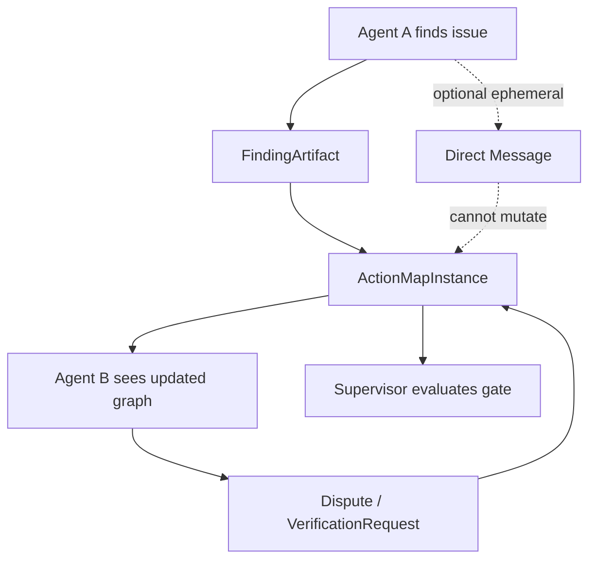

原则：

```text
Map is the source of truth.
Messages are ephemeral hints.
Artifacts are durable claims.
Events are state transitions.
```

## 权限设计

不要先固定角色，先定义 capability。角色只是 capability set。

| Capability | 含义 |
| --- | --- |
| `can_read_node` | 可读取节点和 artifacts |
| `can_enter_node` | 可进入节点执行 |
| `can_submit_artifact` | 可提交 artifact |
| `can_propose_revision` | 可提出地图修订 |
| `can_accept_revision` | 可接受地图修订 |
| `can_mutate_node_state` | 可变更节点状态 |
| `can_acquire_write_lock` | 可获得写锁 |
| `can_evaluate_gate` | 可评估 gate |
| `can_advance_phase` | 可推进 phase |
| `can_override_conflict` | 可处理冲突覆盖 |
| `can_apply_patch` | 可写共享 workspace |

第一阶段可以用这些权限组合：

```text
planner permission:
  can_read_node
  can_propose_revision
  can_submit_artifact

executor permission:
  can_read_node
  can_enter_node
  can_submit_artifact
  can_acquire_write_lock for assigned node

reviewer permission:
  can_read_node
  can_submit_artifact
  can_propose_revision

verifier permission:
  can_read_node
  can_submit_artifact
  can_evaluate_gate for verification gates

supervisor permission:
  can_accept_revision
  can_mutate_node_state
  can_evaluate_gate
  can_advance_phase
  can_override_conflict
  can_apply_patch

viewer permission:
  can_read_node
  can_submit_artifact(ViewerConcern)
  cannot mutate state directly
```

## Runtime 流程

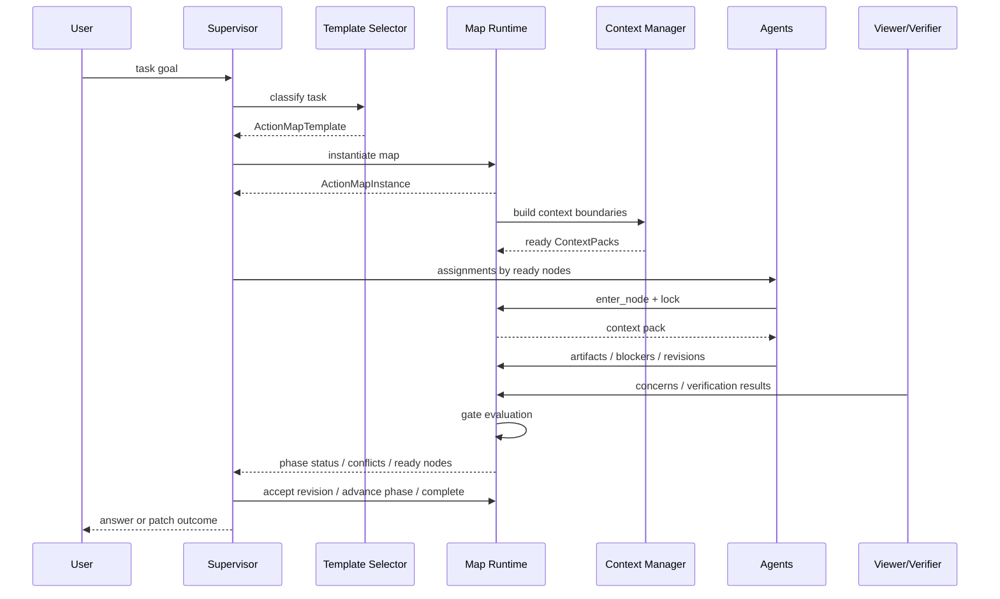

## 与现有 Codex multi-agent 基建的结合

现有基建可以保留为执行 substrate：

| Codex substrate | Map Runtime 中的对应用途 |
| --- | --- |
| `AgentControl` | 创建和管理 AgentCursor 对应的 subagent thread |
| `AgentPath` | agent cursor 的稳定路径标识 |
| `AgentRegistry` | live agent/thread 状态注册表 |
| `InterAgentCommunication` | 临时消息通道，不作为事实源 |
| mailbox | 投递 assignment、通知更新、触发 turn |
| session events | 承载 MapEvent / ArtifactEvent |
| rollout/replay | 回放 map 事件和 artifact 状态 |
| tools/sandbox/approval | capability 和写权限执行基础 |

关键变化不是替换现有 spawn/wait/send，而是在其上新增 Map Runtime：

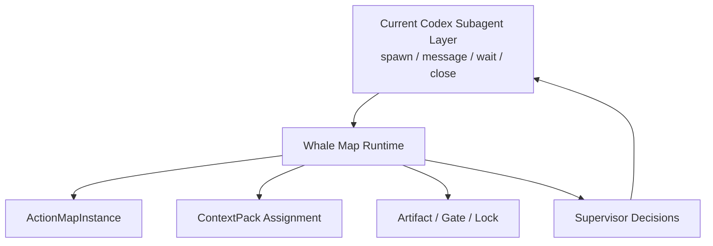

也就是说，`spawn_agent` 不再是“主 agent 临场写信”的自由动作，而应逐步变成：

```text
Supervisor selects ready MapNode
  -> Runtime issues Assignment + ContextPack
  -> AgentControl spawns/resumes subagent
  -> subagent executes within node boundary
  -> subagent submits Artifact / Revision / Blocker
  -> Runtime validates and updates map
```

该变化只在 `experiment` 模式生效。`standard` 模式必须继续保持现状，以便：

- 保留 Codex upstream 行为兼容性。
- 让实验框架可以灰度验证。
- 避免 Action Map 设计不成熟时影响常规 coding agent 使用。
- 允许同一套底座通过 slash command 做 A/B 行为对比。

## 最小可行实现路径

### MA-MAP-0：可插拔模式开关

- 新增 `/multi-agents` slash command。
- 支持 `standard`、`standart` alias、`experiment`。
- 在 session runtime state 中记录 `MultiAgentMode`。
- 默认值为 `standard`。
- `standard` 路径必须保持当前 Codex subagent 行为不变。
- `experiment` 路径只先打开 Map Runtime 包装层，不要求一次性完成全部 gate/lock/artifact 能力。

退出条件：

- `/multi-agents` 可显示当前模式。
- `/multi-agents standard` 和 `/multi-agents standart` 都进入现状模式。
- `/multi-agents experiment` 可切换到实验模式。
- 关闭实验模式后，现有 spawn/send/wait/close 行为仍按当前代码默认逻辑运行。
- 有 session event 记录模式切换，便于 replay 和问题诊断。

### MA-MAP-1：只读 Map Instance 与事件

- 新增 `ActionMapTemplate` / `ActionMapInstance` / `MapNode` schema。
- 支持 template 选择和实例化。
- 支持 `MapEvent` append-only log。
- Viewer/UI 可读当前 map 状态。
- agent 仍可用现有 spawn 机制，但每个任务必须关联 node。

退出条件：

- 一个架构优化任务能生成可视化行动图。
- 每个 subagent assignment 都能指向 node。
- 所有 node 状态变化都有 event。

### MA-MAP-2：Context Boundary 和 ContextPack

- 节点声明 required/optional/forbidden sources。
- Runtime 为 assignment 生成 ContextPack。
- artifact 记录 base graph/node/context version。
- stale context 能被检测。

退出条件：

- agent 结果可追溯到上下文版本。
- 上游 artifact 改变后，下游 assignment 被标记 stale。

### MA-MAP-3：Artifact 与 Gate

- 节点 completion 必须提交 required artifacts。
- gate 校验 artifact schema、exit criteria、blocking concern。
- `wait_agent` 的结果不再只是 mailbox activity，而要进入 artifact ingestion。

退出条件：

- 主 agent 不能仅凭自然语言把节点标 completed。
- phase advance 必须通过 gate。

### MA-MAP-4：Locks 和 Revision

- 支持 ReadLock / IntentLock / WriteLock / GateLock。
- 支持 versioned mutation。
- 支持 MapRevisionProposal。
- 冲突进入 `requires_rebase` 或 `conflict_detected`。

退出条件：

- 两个 agent 基于同一节点旧版本提交写入时，至少一个被拒绝或要求 rebase。
- 跳过/拆分/重排节点必须有 revision 记录。

### MA-MAP-5：图即沟通

- 引入 `DependencyRequest` / `DisputeArtifact` / `BlockerArtifact`。
- 直接消息只能作为 ephemeral hint。
- Supervisor 和 Viewer 只信任 map artifacts/events。

退出条件：

- 一个复杂任务可以不依赖 agent 私聊完成协同。
- Replay 能解释小队为什么推进、阻塞、改图或完成。

## 设计参考

- Anthropic 的 multi-agent research system 说明了 lead agent 规划并并行委派子 agent 的价值，也指出多 agent 系统会带来协调、评估和可靠性挑战；Whale 采用它的“规划 + 并行探索”方向，但用 Action Map 取代自由委派作为 source of truth。参考：[How we built our multi-agent research system](https://www.anthropic.com/engineering/built-multi-agent-research-system)。
- AutoGen `SelectorGroupChat` 展示了基于共享上下文动态选择下一发言者的 group chat 模式；Whale 不采用自由广播群聊作为主协作机制，只借鉴“动态参与者选择”，并把选择依据收敛到 map node readiness。参考：[Selector Group Chat](https://microsoft.github.io/autogen/stable/user-guide/agentchat-user-guide/selector-group-chat.html)。
- OpenAI Agents SDK 的 handoffs/guardrails 说明 delegation 与 guardrail 是不同层次；Whale 将 handoff 视为 node assignment，将 guardrail 扩展为 node/phase/tool gate。参考：[Handoffs](https://openai.github.io/openai-agents-js/guides/handoffs/) 和 [Guardrails](https://openai.github.io/openai-agents-js/guides/guardrails/)。
- Optimistic Offline Lock 适合长事务并发协作中的 stale write 检测；Action Map 的 versioned mutation 借鉴该思路。参考：[Optimistic Offline Lock](https://martinfowler.com/eaaCatalog/optimisticOfflineLock.html)。
- Event Sourcing 适合把状态变化记录为事件序列，支持回放和审计；Action Map Runtime 应采用 append-only MapEvent。参考：[Event Sourcing](https://www.martinfowler.com/eaaDev/EventSourcing.html)。
