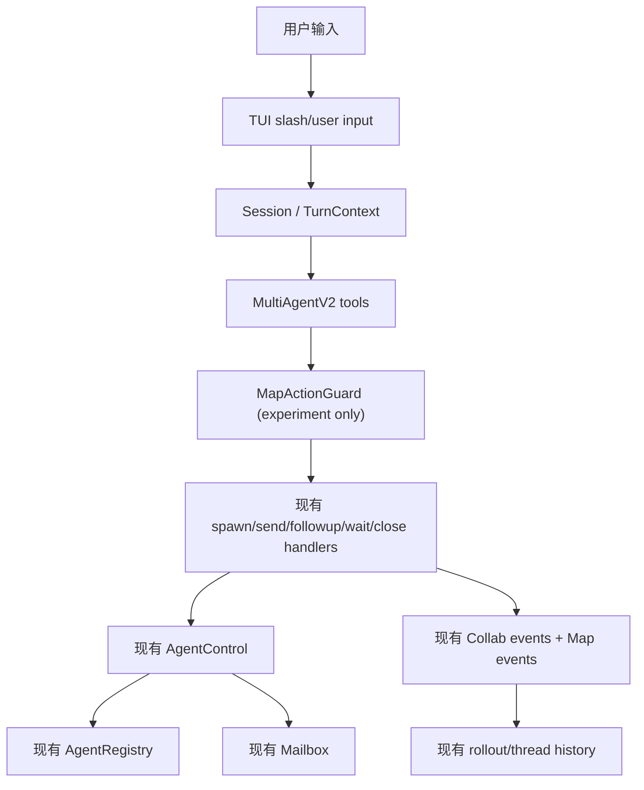
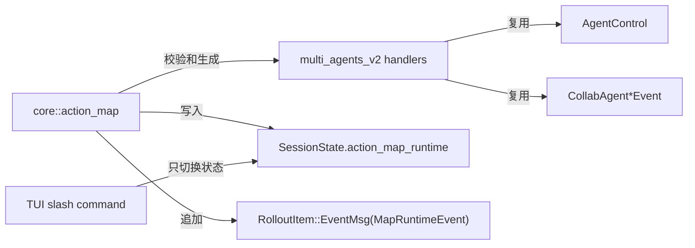
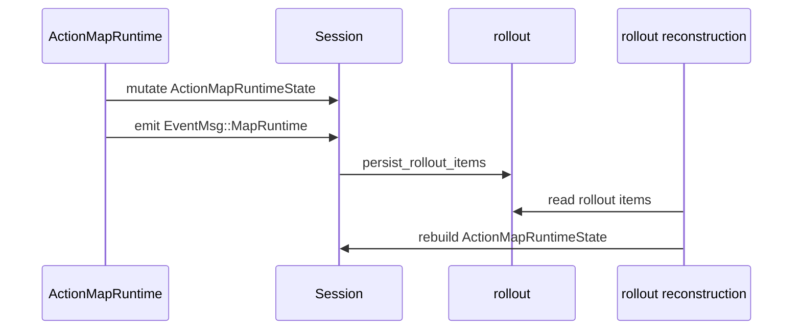
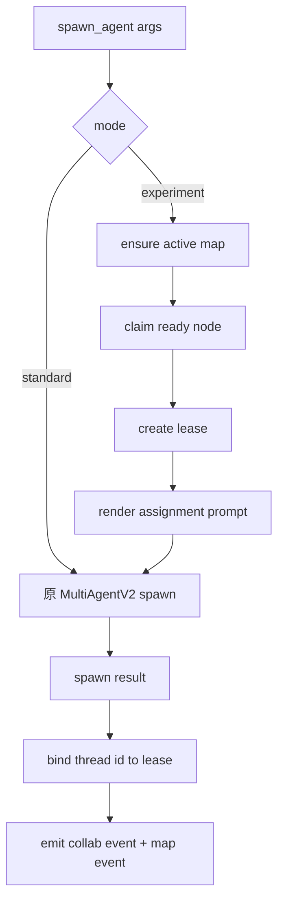

# Action Map Runtime 工程设计

## 当前实现状态（2026-05-01）

本轮工程实现采用“薄约束层”方案，已经落到现有 Codex MultiAgentV2 路径中：

- `/map-mode standard|experiment` 仍然是可插拔开关；standard 不改变原有 MultiAgentV2 行为，experiment 才启用 map-bound hook。
- experiment 模式下，`spawn_agent` 会在现有 handler 内先认领一个 ready node，生成 assignment lease，并把 node/map/lease 约束作为子 agent 的初始任务前缀注入。
- 第一版只内置唯一 `BaseMap` seed，不做领域 map，不做复杂模板继承；默认节点链路为边界确认、代码上下文梳理、方案设计、方案实施、冒烟测试、最终合成。
- 子 agent 完成后复用现有 `AgentControl` completion watcher 和 `AgentStatus::Completed(last_agent_message)`，把 free-form 最终结果写回 node 的 `result_context`。不再设计 `MAP_RESULT` envelope，也不做“质量分”或客观质量 gate。
- `wait_agent` 仍然只等待 mailbox；如果超时，会对当前 Action Map active lease 对应的子 agent 发送进展总结请求，并先 interrupt 当前 turn，让子 agent 以当前进展总结形式收束。
- `close_agent` 成功关闭子 agent 后会释放该 thread 持有的 node lease，避免 node 永久停留在 running。
- `/map-restart` 已接入 TUI 和 core op：弃用当前 active map，并从 BaseMap 创建新 seed map。
- 当前 map/node/lease/result 状态先放在 `SessionState.action_map_runtime`；mode 切换已通过既有 rollout 事件恢复。完整 map mutation replay 仍是后续持久化增强项，第一版不引入独立 DB 或并行 runtime。

因此，下文中早期提到的 `MAP_RESULT` envelope、formal gate、完整 map event replay 等内容只作为历史设计草稿保留；当前代码实现以本节为准。

## 自动化测试方案

测试目标不是做自然语言结果质量评估，而是覆盖 Action Map Runtime 的可执行路径，确保 experiment 模式只作为 MultiAgentV2 的薄约束层存在，standard 模式不受影响。第一版以“关键路径 90% 以上行为分支覆盖”为目标，覆盖点如下：

| 层级 | 覆盖对象 | 自动化断言 |
|---|---|---|
| BaseMap metadata | 候选节点暴露 | `define_scope`、`smoke_test` 等基础候选存在，供初始化使用 |
| runtime mode | standard / experiment / restore | standard 不创建 map；experiment 注入上下文；resume restore 不制造新的切换提示 |
| seed map | 默认节点链路 | 初始只开放第一个 ready node；节点按完成顺序推进 |
| assignment lease | claim / attach / release | 一个 node 同时只能被一个 lease 持有；release 后可重新 claim |
| result ingestion | completed / errored / unknown | completed 写 result 并推进下游；errored 写 blocker 并阻断下游；未知 thread 不污染状态 |
| map lifecycle | restart / completed / abandoned | `/map-restart` 弃用旧 map 并创建新 seed；全节点完成后 map completed |
| timeout summary | wait timeout target | active lease 生成 timeout target；wait timeout 会 interrupt 子 agent 并发送进展总结请求 |
| spawn hook | MultiAgentV2 spawn | experiment spawn 前缀包含 map/node/lease；standard 仍走原路径 |
| completion watcher | 子 agent 完成通知 | 复用 `AgentControl` watcher，把 child final message 写回 node 并释放下游 |
| close hook | close_agent | 关闭子 agent 后释放 node lease，节点可重新被 claim |
| TUI slash | `/map-mode` / `/map-restart` | 命令解析、运行中禁用、非法参数提示、op 分发 |

当前回归入口：

```powershell
rustup run stable cargo test --lib action_map --locked
rustup run stable cargo test --lib multi_agent --locked
rustup run stable cargo test --lib map_mode --locked
rustup run stable cargo test --lib map_restart --locked
```

其中 `multi_agent` 是主回归套件，会覆盖现有 MultiAgentV2 行为和 Action Map hook 的兼容性。若需要更快定位，可按测试名过滤：

```powershell
rustup run stable cargo test --lib action_map_experiment --locked
rustup run stable cargo test --lib action_map_completion_watcher --locked
rustup run stable cargo test --lib action_map_wait_timeout --locked
rustup run stable cargo test --lib action_map_close_agent --locked
```

本文是 `docs/plans/2026-04-25-multi-agent-collaboration-architecture.md` 的工程落地拆解，不重新定义 multi-agent 产品架构。

核心约束只有一条：Action Map Runtime 必须是 Codex MultiAgentV2 的约束层，尽可能复用现有 session、tool handler、agent control、mailbox、rollout、TUI slash command 和 collab event 机制；不得新造一套并行 agent runtime、消息总线、持久化系统或观测事件体系。

## 目标

第一版只验证 `BaseMap -> node -> assignment lease -> temporary subagent -> result -> formal gate` 这条链路能否跑通。

必须做到：

- `/map-mode standard` 关闭实验约束，维持当前 MultiAgentV2 行为。
- `/map-mode experiment` 开启 map-bound 约束，所有 subagent 行动必须绑定 node。
- `/map-restart` 可恢复地 abandoned 当前 map，并从唯一 `BaseMap` 重新初始化。
- subagent 仍由现有 `spawn_agent` 创建，仍由现有 mailbox 通知父 agent，仍由现有 `wait_agent` 等待。
- map/node/result/lease 状态写入现有 session state 和 rollout，可 replay，可观察。
- 不引入语义检索、独立数据库、独立调度器、长期常驻 subagent、复杂角色体系。

非目标：

- 不实现领域 map。
- 不实现 human-friendly `/map-show` 可视化页面。
- 不实现跨 session 接管 active map。
- 不实现质量评分。
- 不替换 Codex `AgentControl`、`AgentRegistry`、`Mailbox`。
- 不把 shell/read/edit 等普通工具在第一版强制 map-bound；第一版只约束 multi-agent 协作工具链。

## 真实基建

当前可复用路径如下：

| 能力 | 现有代码路径 | 复用方式 |
|---|---|---|
| spawn tool schema | `third_party/codex-cli/codex-rs/tools/src/agent_tool.rs` | 继续暴露 `spawn_agent`，不新增 `spawn_node_agent` |
| tool 注册 | `third_party/codex-cli/codex-rs/tools/src/tool_registry_plan.rs` | 继续由 MultiAgentV2 feature 注册 spawn/send/followup/wait/close |
| spawn handler | `third_party/codex-cli/codex-rs/core/src/tools/handlers/multi_agents_v2/spawn.rs` | 在现有 handler 前后加 `MapActionGuard` |
| send/followup handler | `third_party/codex-cli/codex-rs/core/src/tools/handlers/multi_agents_v2/message_tool.rs` | 复用目标解析、`InterAgentCommunication` 和 collab event |
| wait handler | `third_party/codex-cli/codex-rs/core/src/tools/handlers/multi_agents_v2/wait.rs` | 继续等待 mailbox seq；不让 wait 返回完整 result |
| close handler | `third_party/codex-cli/codex-rs/core/src/tools/handlers/multi_agents_v2/close_agent.rs` | 关闭 subagent 时释放 node lease |
| agent 生命周期 | `third_party/codex-cli/codex-rs/core/src/agent/control.rs` | 继续由 `AgentControl` spawn/send/interrupt/close/list |
| completion watcher | `third_party/codex-cli/codex-rs/core/src/agent/control.rs` | 子 agent final message 的主要 result ingestion hook |
| live agent registry | `third_party/codex-cli/codex-rs/core/src/agent/registry.rs` | 继续记录 live thread/path/nickname/role |
| 父子通知 | `third_party/codex-cli/codex-rs/core/src/agent/mailbox.rs` | 完成通知仍进入父 agent mailbox |
| session mutable state | `third_party/codex-cli/codex-rs/core/src/state/session.rs` | 增加 session-scoped map runtime state |
| rollout 持久化 | `third_party/codex-cli/codex-rs/core/src/session/mod.rs` | 复用 `send_event` / `persist_rollout_items` |
| slash command | `third_party/codex-cli/codex-rs/tui/src/slash_command.rs`、`.../chatwidget/slash_dispatch.rs` | 增加 `/map-mode`、`/map-restart`，不占用 `/subagents` |
| collab UI 事件 | `third_party/codex-cli/codex-rs/protocol/src/protocol.rs` | 增加结构化 map event variant，优先复用已有 collab event |

关键判断：

- `wait_agent` 当前只返回 `Wait completed` / `Wait timed out`，不返回子 agent 内容。这符合设计：结果应进入 node 的 `result_context`，主 agent 收到完成通知后按需读取。
- 子 agent 完成时，现有 `AgentStatus::Completed(last_agent_message)` 已经能携带最后一条 agent 消息；Action Map Runtime 的主要 result ingestion hook 应在 `AgentControl::maybe_start_completion_watcher` 生成父 agent 通知之前或旁边，从 `status` 中提取 `MAP_RESULT` envelope，写入 node。模型可见的 mailbox 通知仍只当作“完成触发”，不要把它当成 node 的权威状态源。
- `AgentRegistry` 已经有 path、nickname、role、last task message 和并发计数；Action Map Runtime 不应复制一个 live-agent registry。
- `Mailbox` 已经提供 seq watch 和 drain；Action Map Runtime 不应新增 agent message bus。
- TUI 已经把 `/subagents` / `/multi-agents` 作为 agent thread picker；map 模式命令必须另起 `/map-mode`。



## 工程边界

第一版按“薄约束层”实施。

新增模块建议放在 `core/src/action_map/`：

```text
third_party/codex-cli/codex-rs/core/src/action_map/
  mod.rs
  basemap.rs
  types.rs
  runtime.rs
  guard.rs
  result.rs
  prompt.rs
  events.rs
  tests.rs
```

这个模块只管理 map/node/lease/result 的纯状态和 guard，不直接 spawn thread，也不直接操作 TUI。它通过现有 `Session`、`AgentControl`、tool handler 被调用。

禁止新增：

- `ActionMapAgentManager`
- `ActionMapMailbox`
- `ActionMapScheduler`
- `ActionMapDatabase`
- `ActionMapRoleSystem`
- `ActionMapQualityScorer`

允许新增：

- 轻量 state struct。
- 轻量 event payload。
- tool handler guard。
- prompt rendering helper。
- rollout reconstruction helper。



## 运行状态

### SessionState 扩展

在 `core/src/state/session.rs` 的 `SessionState` 增加：

```rust
pub(crate) action_map_runtime: ActionMapRuntimeState,
```

第一版只做 session-scoped runtime state：

```rust
pub(crate) struct ActionMapRuntimeState {
    pub mode: MapRuntimeMode,
    pub active_map_id: Option<ActionMapId>,
    pub maps: HashMap<ActionMapId, ActionMapInstance>,
    pub leases_by_thread: HashMap<ThreadId, AssignmentLeaseId>,
}

pub(crate) enum MapRuntimeMode {
    Standard,
    Experiment,
}
```

理由：

- `SessionState` 已经是 session-wide mutable state，适合承载当前 active map。
- `Session` 已有 `Mutex<SessionState>`，第一版不需要额外锁体系。
- `leases_by_thread` 只作为现有 thread id 到 node lease 的索引，不替代 `AgentRegistry`。

### 持久化

第一版不新增 map DB。持久化通过现有 rollout 事件完成：

- 每次 map 创建、状态变化、node 状态变化、lease 创建/释放、result 记录，都追加结构化 `EventMsg::MapRuntime(MapRuntimeEvent)`。
- `MapRuntimeEvent` 的序列化类型必须定义在 `codex_protocol::protocol`，否则不能作为 `RolloutItem::EventMsg` 持久化；`core::action_map::events` 只放构造和转换 helper。
- resume/fork 时通过已有 `session/rollout_reconstruction.rs` 流程重建 `ActionMapRuntimeState`，不能指望默认 `EventMsg(_)` 分支自动恢复 map state。
- 跨 session discovery 第一版只暴露 lightweight manifest，不加载完整 map snapshot。

如果后续 map 数量过大，再考虑把 `MapIndexEntry` 镜像到现有 `state_db`，但这不是 MA-0/MA-1 的前置条件。



## 数据结构

数据结构只覆盖协议必要字段。

```rust
pub(crate) struct ActionMapInstance {
    pub id: ActionMapId,
    pub title: String,
    pub status: MapStatus,
    pub owner_session_id: Option<ThreadId>,
    pub base_map_version: String,
    pub nodes: HashMap<MapNodeId, MapNode>,
    pub edges: Vec<MapEdge>,
    pub created_from: Option<ActionMapId>,
    pub events: Vec<MapRuntimeEventId>,
}

pub(crate) enum MapStatus {
    Active,
    Suspended,
    Completed,
    Abandoned,
}
```

```rust
pub(crate) struct MapNode {
    pub id: MapNodeId,
    pub title: String,
    pub status: NodeStatus,
    pub context: NodeContext,
    pub active_lease: Option<AssignmentLeaseId>,
    pub result_context: Vec<NodeResultRef>,
    pub origin_node_id: Option<MapNodeId>,
}

pub(crate) enum NodeStatus {
    Pending,
    Ready,
    Running,
    Blocked,
    Completed,
}
```

```rust
pub(crate) struct MapEdge {
    pub from: MapNodeId,
    pub to: MapNodeId,
}
```

只使用有向边。没有依赖路径的节点天然可并行，不引入无向边。

```rust
pub(crate) struct AssignmentLease {
    pub id: AssignmentLeaseId,
    pub map_id: ActionMapId,
    pub node_id: MapNodeId,
    pub agent_thread_id: Option<ThreadId>,
    pub task_name: String,
    pub issued_at_ms: i64,
    pub timeout_at_ms: Option<i64>,
}
```

```rust
pub(crate) struct NodeResult {
    pub assignment_id: AssignmentLeaseId,
    pub map_id: ActionMapId,
    pub node_id: MapNodeId,
    pub kind: NodeResultKind,
    pub body: String,
    pub source_thread_id: ThreadId,
    pub created_at_ms: i64,
}

pub(crate) enum NodeResultKind {
    Result,
    Blocker,
    MapUpdateRequest,
    TimeoutSummary,
}
```

`body` 第一版保持自由文本或 JSON text，不定义内部 schema。runtime 只检查外层坐标和 kind。

## BaseMap

`BaseMap` 作为静态 metadata 编入 `core/src/action_map/basemap.rs`，初始化 map 时一次性注入给主 agent。

```rust
pub(crate) struct BaseMap {
    pub version: &'static str,
    pub candidate_nodes: &'static [BaseMapCandidateNode],
}

pub(crate) struct BaseMapCandidateNode {
    pub id: &'static str,
    pub title: &'static str,
    pub when_to_use: &'static str,
}
```

候选节点直接来自架构文档，不做动态检索：

- 确定边界
- 梳理代码上下文
- 搜索外部资料
- 识别约束
- 方案设计
- 日志设计
- 测试设计
- 方案审查
- 方案实施
- 代码审查
- 冒烟测试
- 回归测试
- 最终合成

初始化要求：

- 主 agent 从候选节点中选择、改写、合并、拆分。
- 目标是 3-8 个具体节点。
- 如果只生成“计划/实施/总结”，guard 应返回修正提示，不进入执行。

## Guard 接入

### spawn_agent

接入点：`core/src/tools/handlers/multi_agents_v2/spawn.rs`

执行顺序：

1. 解析原始 `SpawnAgentArgs`。
2. 如果 `mode == standard`，完全走现有路径。
3. 如果 `mode == experiment`：
   - 确保存在 active map；没有则创建或要求主 agent 创建。
   - 选择一个 `ready` node。
   - 检查 node 没有 active lease。
   - 检查上游依赖节点均 `completed`。
   - 生成 `AssignmentLease`。
   - 把 `task_name` 约束为 node-derived path，例如 `node_design_solution`。
   - 用 `prompt.rs` 渲染 assignment prompt，替换或包装 `args.message`。
4. 调用现有 `spawn_agent_with_metadata`。
5. spawn 成功后，把 `new_thread_id` 写回 lease，并把 node 置为 `running`。
6. 继续发送现有 `CollabAgentSpawnBegin/EndEvent`，追加 map metadata event。



### send_message / followup_task

接入点：`core/src/tools/handlers/multi_agents_v2/message_tool.rs`

第一版规则：

- standard：不变。
- experiment：
  - target 必须能解析到现有 child thread。
  - target thread 必须有 active lease。
  - message 默认作为 node context 增量写入对应 node。
  - 如果 message 明确携带 `MAP_RESULT` envelope，也可以走 result ingestion；但这不是子 agent final result 的主路径。
  - 如果 message 是继续任务，则必须仍属于同一个 node lease。

不新增 message bus。所有通信仍是 `InterAgentCommunication`。

### wait_agent

接入点：`core/src/tools/handlers/multi_agents_v2/wait.rs`

规则：

- 继续使用 mailbox seq 等待。
- `wait_agent` 不负责返回 result body。
- wait 超时只返回现有 timed_out 信息，同时追加 `MapLeaseWaitTimedOut` event。
- 如果 lease 超过 runtime timeout，由主 agent 决定是否要求 timeout summary、关闭 agent、重派或 `/map-restart`。

### close_agent

接入点：`core/src/tools/handlers/multi_agents_v2/close_agent.rs`

规则：

- 关闭前通过 thread id 找到 lease。
- close 成功后释放 node active lease。
- 如果 node 没有 result，保持 `blocked` 或 `ready` 由主 agent 决定，不自动 completed。

## Result Ingestion

现有 MultiAgentV2 的状态链路已经把 child 最后一条 agent message 放进 `AgentStatus::Completed(last_agent_message)`。第一版不新增结果传输通道，只在这个完成路径旁边做 result ingestion。

准确 hook 是 `core/src/agent/control.rs` 的 completion watcher，而不是 `wait_agent` 或普通 `send_message`：

```text
child TurnComplete
  -> agent_status_from_event
  -> AgentStatus::Completed(last_agent_message)
  -> AgentControl::maybe_start_completion_watcher
  -> parse MAP_RESULT
  -> ActionMapRuntime.record_node_result
  -> send existing parent mailbox notification
```

第一版采用两段式语义：

1. subagent 在最终回复中按 prompt 提交 result envelope。
2. runtime 从 child final message 中解析 envelope，写入 node 的 `result_context`。
3. parent mailbox 收到完成通知，用来唤醒主 agent；通知文本不是 result 的权威存储。
4. 主 agent 后续需要时，通过下一轮 map context 注入看到 node result；如果 result 过大，只注入摘要和 result ref。

最小 envelope：

```text
MAP_RESULT
assignment_id: <lease_id>
map_id: <map_id>
node_id: <node_id>
kind: Result | Blocker | MapUpdateRequest | TimeoutSummary

<自由文本正文>
END_MAP_RESULT
```

设计理由：

- 只约束外壳，不约束正文结构。
- 允许复杂任务返回分析、补丁摘要、证据、日志、失败说明等任意形式。
- 结果属于 node，不属于临时 agent；临时 agent 销毁后 node 仍可接手。
- 不依赖 `wait_agent` 返回内容；`wait_agent` 只负责等待 mailbox 变化。

formal gate 只检查：

- envelope 存在。
- assignment/map/node 坐标匹配。
- lease 仍绑定该 thread。
- result kind 合法。
- `MapUpdateRequest` 不被当成 node completed。

formal gate 不判断质量，不判断任务是否“真的做好”。

主 agent 的结果读取第一版不新增工具。runtime 在 turn 开始前通过现有 pending input / context 注入机制提供当前 active map 的 compact view：

```text
Action Map Context:
map_id: map_001
node_result_available:
- node_2 result_ref result_7 kind Result summary ...
- node_3 result_ref result_8 kind Blocker summary ...
```

如果后续需要查看完整大结果，再把它归入 observability / map viewer 主题，不在第一版新增 terminal 大段展示。

## Prompt 注入

第一版不新建 prompt pipeline。

复用两层：

- tool description hint：当前本地代码已有 `multi_agent_v2.usage_hint_text`，由 `turn_context.rs` 注入到 `spawn_agent` tool description。
- assignment prompt：`spawn_agent.message` 由 `action_map::prompt` 生成，包含 map/node/lease/context/result envelope 规则。

如果后续同步到新版上游提供 root/subagent 分离 hint，则直接把同一套规则映射到上游字段，不新增 Whale 独立 developer-message 注入通道。

主 agent hint：

```text
当前处于 Action Map experiment 模式。
任何 multi-agent 委派前，必须确认存在 active ActionMapInstance 和可执行 MapNode。
不要把工作直接外包给自由 subagent；先把工作落到 node，再创建 assignment lease。
发现新任务时，先提交 map mutation，再派发新的 node。
map 只是工作驱动，不强迫你继续；缺少信息、无法推进或需要用户决策时，可以停止并说明。
```

subagent assignment prompt：

```text
你正在执行一个 Action Map node，不是自由对话。

Map: <map_id>
Node: <node_id> - <node_title>
Assignment: <lease_id>

你只能处理当前 node 范围内的任务。
不要直接创建或修改 map/node。
发现新任务时，提交 MapUpdateRequest。
无法推进时，提交 Blocker。
完成时，提交 MAP_RESULT envelope。

Node context:
<context_pack>
```

## Slash Command

### `/map-mode`

TUI 增加 `SlashCommand::MapMode`，支持 inline args：

```text
/map-mode standard
/map-mode experiment
```

接入点：

- `tui/src/slash_command.rs`：新增 enum、description、inline args、task-running availability。
- `tui/src/bottom_pane/slash_commands.rs`：复用现有 builtin lookup。
- `tui/src/chatwidget/slash_dispatch.rs`：解析参数并发送 core op。
- `protocol/src/protocol.rs`：新增机械 op，例如 `SetMapRuntimeMode { mode }`。
- `core/src/session/mod.rs`：处理 op，更新 `SessionState.action_map_runtime.mode`。

命令只输出机械状态，不伪装成 agent 自然语言回复。

第一版 `/map-mode` 不允许在 root task 正在运行时切换，直接复用现有 `available_during_task = false` 的 slash command gate，避免 active turn 一半按 standard、一半按 experiment 执行。

### Mode Transition Notice

`/map-mode` 不是普通配置项，而是行为协议边界。

切换只影响未来行动，不重写历史、不删除 map、不清空 rollout，也不 retroactively 把旧行为改造成另一种模式。
但下一轮 agent 必须明确知道“历史仍然存在，但当前行动协议已经变了”。

实现方式：

- `SetMapRuntimeMode` 更新 session-scoped `ActionMapRuntimeState`。
- 只有用户显式切换 mode 时，runtime 生成一次性 `pending_transition_notice`。
- 下一次 regular user turn 构造 initial context 时消费这个 notice，并作为 developer-level context 注入。
- resume/rollout reconstruction 只恢复 mode，不生成 transition notice，避免恢复旧 session 后误导 agent 认为用户刚刚切换模式。

`standard -> experiment` 的 notice 语义：

```text
Action Map experiment mode is now active.
Previous standard-mode conversation remains background context only.
Before taking multi-agent action, create or bind an Action Map and a ready node.
Future subagent work must be map/node driven.
```

`experiment -> standard` 的 notice 语义：

```text
Action Map experiment mode is now disabled.
Existing maps, nodes, leases, and results remain historical context only.
Do not continue maintaining the map, require node binding, or follow map-driven protocol unless the user enables experiment mode again.
Continue with the standard Codex multi-agent behavior.
```

这条 notice 不能作为自然语言回复展示给用户；它只约束下一轮模型行为。
如果用户在 map 模式下积累了大量 map/node 上下文后切回 standard，agent 可以参考这些内容作为历史背景，但不得继续按 map 工作法组织行动。

### `/map-restart`

TUI 增加 `SlashCommand::MapRestart`。

行为：

- standard 模式：提示当前未启用 experiment map runtime。
- experiment 且无 active/suspended map：提示没有可重启的 map。
- experiment 且有当前 map：执行 replacement transaction。

`/map-restart` 必须允许用户在任务运行中主动触发，但不能和正在运行的 root turn 并发改同一张 map。
因此工程路径应复用现有 `Op::Interrupt`：

```text
if root task running:
  submit Op::Interrupt
  record pending MapRestart request
  apply replacement after TurnAborted
else:
  apply replacement immediately
```

transaction：

1. revoke 当前 map 所有 active leases。
2. old map 状态置为 `abandoned`，reason = `user_requested_restart`。
3. old map owner 释放。
4. 创建 new map，`created_from = old_map.id`。
5. new map owner = current session。
6. 追加 `MapAbandoned`、`MapCreated`、`MapReplaced` events。

## Map 与 Session

V1 运行规则：

- 一个 active map 同时只能被一个 session 持有。
- active owner 记录在 `ActionMapInstance.owner_session_id`。
- 其他 session 可发现 manifest，但不能接管 active map。
- 如果 session B 命中 session A 正在运行的 active map，只提示占用。

第一版 discovery 不做语义检索。只做：

- title keyword。
- status filter。
- owner filter。
- recently used。
- explicit map id。

实现上先从当前可访问 rollout metadata 生成 `MapIndexEntry`。性能不足时再镜像到已有 `state_db`。

## Map 生长

subagent 不直接新增 node。

流程：

1. subagent 在当前 node result 中提交 `MapUpdateRequest`。
2. runtime 将其写入 node `result_context`，不直接 mutate map。
3. 主 agent 读取并判断。
4. 主 agent 接受后调用 runtime mutation helper。
5. runtime 创建 flat sibling node，必要时添加 directed dependency edge。

不做嵌套 node。用 `origin_node_id` 记录来源即可。

## 劣化信号

劣化只作为 warning，不是质量评分。

第一版在 `ActionMapRuntimeState` 中维护 counters：

- node count。
- active + blocked node ratio。
- total node context bytes。
- result context bytes。
- multi-agent tool call count。
- elapsed wall time。
- restart count。

阈值按低/中/高难度配置成常量。突破预算时只追加 `MapDegradationWarning`，由主 agent 决定升级预算、修补 map、询问用户或建议 `/map-restart`。

## 日志与观测

第一版优先复用 event：

- `CollabAgentSpawnBegin/EndEvent`
- `CollabAgentInteractionBegin/EndEvent`
- `CollabWaitingBegin/EndEvent`
- `CollabCloseBegin/EndEvent`

新增 map event 只记录这些 collab event 不能表达的 map 状态：

```rust
pub enum MapRuntimeEvent {
    ModeChanged,
    MapCreated,
    MapSuspended,
    MapResumed,
    MapCompleted,
    MapAbandoned,
    MapReplaced,
    NodeCreated,
    NodeStatusChanged,
    LeaseCreated,
    LeaseBoundToThread,
    LeaseReleased,
    ResultRecorded,
    MapUpdateRequested,
    MapMutationApplied,
    MapDegradationWarning,
}
```

事件必须带：

- `map_id`
- `node_id` if any
- `lease_id` if any
- `thread_id` if any
- `session_id`
- `source_call_id` if any

这满足日志驱动，但不新建独立 tracing backend。

## Timeout

需要区分两种超时：

- `wait_agent` timeout：一次等待没有收到 mailbox 更新。
- `lease` timeout：某个 node assignment 超过预算。

第一版处理：

1. `wait_agent` timeout 只追加 warning，不改变 node 状态。
2. lease timeout 后，runtime 提供 helper 给主 agent生成 timeout follow-up。
3. 如果 child 空闲，使用现有 `followup_task` 要求它提交 `TimeoutSummary`。
4. 如果 child 忙且需要强制停，优先复用当前代码已有的 `followup_task { interrupt: true }`；该 handler 内部已经调用 `AgentControl::interrupt_agent`，不需要为 timeout 另建 interrupt 通道。
5. summary 仍作为 node result 记录。
6. 主 agent 决定继续、重派、创建 recovery node、询问用户或重启 map。

不新增后台定时调度器。lease timeout 第一版在主 agent 调用 wait/send/spawn/close 或每个 turn 开始时惰性检查。

## 文件级实施计划

### MA-0：模式开关和空 runtime

改动：

- `core/src/action_map/types.rs`
- `core/src/action_map/runtime.rs`
- `core/src/state/session.rs`
- `tui/src/slash_command.rs`
- `tui/src/chatwidget/slash_dispatch.rs`
- `protocol/src/protocol.rs`
- `core/src/session/mod.rs`

验收：

- `/map-mode standard` 和 `/map-mode experiment` 能切换 session state。
- standard 下现有 multi-agent handler 行为不变。
- `/subagents` 仍打开 agent picker。
- runtime state 可写入/恢复 rollout event。

测试：

- TUI slash parser unit test。
- session op handler unit test。
- rollout reconstruction unit test。

### MA-1：BaseMap 和 map/node 状态

改动：

- `core/src/action_map/basemap.rs`
- `core/src/action_map/runtime.rs`
- `core/src/action_map/events.rs`

验收：

- experiment 下可从 BaseMap 创建 3-8 个 node。
- directed dependency edge 能控制 ready/pending。
- `/map-restart` replacement transaction 可 replay。

测试：

- BaseMap candidate metadata test。
- map state transition test。
- restart transaction test。

### MA-2：spawn guard 和 lease

改动：

- `core/src/action_map/guard.rs`
- `core/src/action_map/prompt.rs`
- `core/src/tools/handlers/multi_agents_v2/spawn.rs`

验收：

- experiment 下 spawn 必须绑定 ready node。
- 同一 node 不能同时被两个 active leases 持有。
- task_name 使用 node-derived path。
- spawned thread id 回写 lease。

测试：

- existing multi-agent v2 spawn tests standard mode 不变。
- experiment spawn without node 被拒绝或触发 map 初始化。
- duplicate lease 被拒绝。
- dependency 未完成时不能 claim 下游 node。

### MA-3：result ingestion 和 formal gate

改动：

- `core/src/action_map/result.rs`
- `core/src/agent/control.rs`
- `core/src/tools/handlers/multi_agents_v2/message_tool.rs`
- `core/src/tools/handlers/multi_agents_v2/wait.rs`
- `core/src/tools/handlers/multi_agents_v2/close_agent.rs`

验收：

- result envelope 写入 node `result_context`。
- child final message result 通过 completion watcher 入库，不依赖 `wait_agent` 返回内容。
- `MapUpdateRequest` 记录但不直接 mutate map。
- `Blocker` 使 node 进入 `blocked`。
- close agent 释放 lease。
- wait timeout 不误判 node failed/completed。

测试：

- result parser unit test。
- formal gate unit test。
- wait timeout event test。
- close releases lease test。

### MA-4：map mutation 和端到端冒烟

改动：

- `core/src/action_map/runtime.rs`
- `core/src/session/rollout_reconstruction.rs`
- 相关 integration tests。

验收：

- subagent 提交 MapUpdateRequest 后，主 agent 可接受并生成新 node。
- 新 node 成为 flat sibling，并按 directed edge 进入 pending/ready。
- 端到端任务能完成：map created -> node running -> result recorded -> node completed -> map completed。

测试：

- simulated multi-agent task smoke。
- resume 后 map state restored。
- standard/experiment 回归对照。

## 验证命令

文档阶段只需要：

```powershell
git diff --check
```

进入代码阶段后，每个 MA 至少执行：

```powershell
rustup run stable cargo test -p codex-core multi_agent_v2 --locked
rustup run stable cargo test -p codex-tui slash --locked
```

如 Windows rustup shim 出现权限或路径问题，优先使用本机真实 toolchain 路径和独立 `CARGO_TARGET_DIR=D:\whalecode-alpha\target-test`。

## 风险

| 风险 | 处理 |
|---|---|
| 约束层侵入 standard 模式 | 所有 guard 入口先检查 `mode == experiment`，standard 直接 return existing path |
| map 状态和 AgentRegistry 重复 | map 只记录 lease/thread 绑定，不记录 live agent 全量状态 |
| result 解析过度设计 | 只解析 envelope 外壳，正文自由 |
| rollout replay 复杂 | 第一版只 replay map event，不从自然语言反推状态 |
| TUI 命令污染自然语言路径 | slash command 只输出机械状态，不生成模型回答 |
| upstream 继续变化 | hook 点限制在 MultiAgentV2 handler 和 SessionState，prompt hint 兼容现有 `usage_hint_text` 和未来 root/subagent hint |

## 最小可交付定义

工程第一阶段完成后，应能演示：

1. 用户输入 `/map-mode experiment`。
2. 主 agent 接到复杂任务，runtime 从 BaseMap 创建 active map。
3. 主 agent 派发一个 ready node。
4. `spawn_agent` 创建临时 subagent，node 进入 running。
5. subagent 提交 `MAP_RESULT`。
6. runtime 把 result 写入 node，formal gate 关闭 node。
7. 主 agent 根据 map 继续下一个 ready node 或完成 map。
8. 用户输入 `/map-restart` 后，旧 map abandoned，新 map 从 BaseMap 重新开始。

只要这条链路成立，Action Map Runtime 的核心假设就通过了第一轮工程验证。
