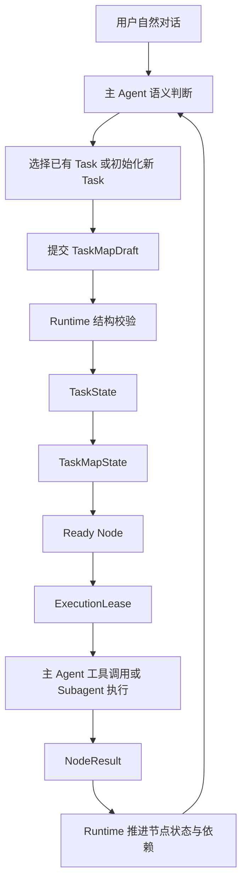
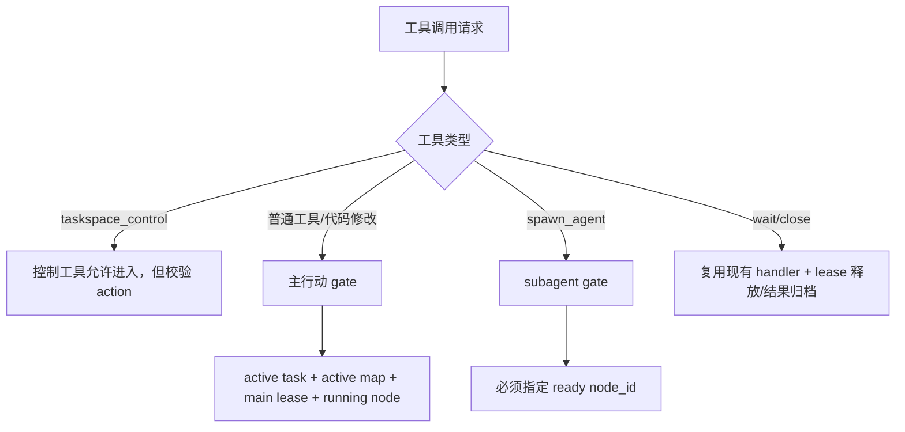
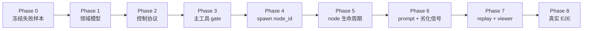

# TaskSpace Runtime 重构实施方案

日期：2026-05-27

## 结论

本方案把当前 TaskSpace 从“工具调用审计标签”重构为真正的任务空间 runtime。

核心变化：

- `Task`、`Map`、`Node`、`Lease`、`Result` 必须拆开建模，不能继续让 `create_node` 同时承担创建 task、创建 node、绑定执行节点三个职责。
- 进入 TaskSpace 后，普通工具调用、代码修改、subagent spawn 都必须处在合法的 `Task -> Map -> Node -> Lease` 执行态。
- Runtime 不做语义路由、不做任务质量评分、不根据关键词选择 task；task routing、map 初始化和 node 选择都由主 agent 完成。
- Runtime 只做结构化协议校验、状态推进、lease 互斥、result 归档、rollout replay、viewer snapshot。
- 第一版继续复用现有 Codex/Whale 基建：`SessionState`、tool dispatch、`spawn_agent` v2、`AgentControl`、mailbox、rollout event、TUI slash、browser viewer。

当前失败不是局部 bug，而是协议抽象不完整：

```text
 /taskspace 生效
 agent 创建一个很宽的 node
 runtime 认为已有 node binding
 后续 70+ 次工具调用都合法写入同一个 node
 尝试创建后续依赖 node 时被未完成依赖阻塞
 subagent 没有发生
= TaskSpace 退化为单节点工具日志
```

重构目标是让这种路径在 runtime 层不再合法。

## 独立对抗审查

本文已经交给 `claude-ds-pro` 做只读对抗审查。审查记录见：

- [2026-05-27-taskspace-runtime-rearchitecture-adversarial-review.md](./2026-05-27-taskspace-runtime-rearchitecture-adversarial-review.md)
- [2026-05-27-taskspace-runtime-rearchitecture-followup-review.md](./2026-05-27-taskspace-runtime-rearchitecture-followup-review.md)

已吸收的阻塞意见：

- 成本信号必须成为 hard maintenance barrier，不能只是 prompt 提醒。
- `single_node_reason` 只能作为审计字段，不能作为 runtime 防线。
- 每个 TaskSpace user turn 必须显式 `route_task`，runtime 不做语义路由。
- 主 agent lease 必须有明确 finish/block/bind 状态机。
- subagent node claim 必须原子化。
- reborn 遇到 running lease 必须拒绝并要求先处理。
- rollout replay 必须有 repair 策略。
- edge 必须区分 `Dependency` 和 `Related`。

二次复核结论：P0/P1 阻塞问题已经清除，可以进入工程实现。残余 P2 风险已作为阶段验收补充到本文。

## 当前实现问题

真实代码路径：

| 问题 | 当前代码落点 | 具体表现 |
| --- | --- | --- |
| `create_node` 职责过大 | `core/src/action_map/runtime.rs::create_node_for_main` | active map 不存在时隐式创建 map，再创建 node，可选绑定当前主行动 |
| 主工具 gate 太弱 | `runtime.rs::prepare_main_tool_call` | 只校验有 active map 和 current main node，不校验 task 是否完成初始化、node 是否有 main lease |
| 主 agent 没有真实 lease | `record_main_tool_result` | 用 `main:<call_id>` 作为 result assignment id，不能表达“主 agent 正持有某 node” |
| 创建 node 与绑定 node 耦合 | `create_node_for_main(bind_current=true)` | 有依赖的后续 node 因上游未完成而无法创建/绑定，agent 失败后仍继续普通工具 |
| subagent 选择 node 由 runtime 顺序抢占 | `prepare_spawn_assignment` | `spawn_agent` 不显式传 node_id，runtime 用 `next_ready_node_id` 自动挑 |
| node 完成主要来自 child result | `record_child_result` | 主 agent 执行的 node 没有明确 `finish_node` 机制，导致依赖无法自然推进 |
| BaseMap 只是弱提示 | `basemap.rs::base_map_metadata_prompt` | agent 可以只创建一个泛化 node 也满足 runtime gate |
| replay 只恢复 mode 风险 | `session/rollout_reconstruction.rs` | TaskSpace 结构化状态应能通过事件完整恢复，而不是仅靠对话摘要 |

## 目标架构



### 职责边界

| 对象 | 职责 | 不做什么 |
| --- | --- | --- |
| `TaskSpaceRuntimeState` | session 内任务空间状态、active task、当前 main lease、序列号、事件恢复 | 不理解用户意图 |
| `TaskState` | 一个持续主题任务，持有目标、上下文、maps、状态 | 不代表单次工具行动 |
| `TaskMapState` | task 内当前或历史行动图 | 不承担用户可见命令语义 |
| `NodeState` | 可执行子任务、上下文、result refs、active lease | 不等同于整个用户请求 |
| `ExecutionLease` | 主 agent 或 subagent 对 node 的互斥执行权 | 不保存完整 agent registry |
| `NodeResult` | 某次执行沉淀到 node 的结果 | 不要求固定 result envelope 内部格式 |
| `Runtime Gate` | 校验结构状态、阻断非法工具调用 | 不判断方案质量或语义正确性 |

## 数据模型重构

优先改造现有 `core/src/action_map/map.rs` 和 `runtime.rs`，不新建平行 runtime。

### TaskSpaceRuntimeState

```rust
pub(crate) struct TaskSpaceRuntimeState {
    pub(crate) mode: MapRuntimeMode,
    pub(crate) tasks: BTreeMap<TaskId, TaskState>,
    pub(crate) active_task_id: Option<TaskId>,
    pub(crate) current_main_lease_id: Option<ExecutionLeaseId>,
    pub(crate) routing_required: bool,
    pub(crate) maintenance_barrier: Option<MaintenanceBarrier>,
    pub(crate) repair_required: Option<TaskSpaceRepairReason>,
    pub(crate) pending_transition_notice: Option<String>,
    pub(crate) bootstrap_required: bool,
    pub(crate) reborn_pending: Option<RebornRequest>,
    pub(crate) next_task_seq: u64,
    pub(crate) next_map_seq: u64,
    pub(crate) next_node_seq: u64,
    pub(crate) next_lease_seq: u64,
    pub(crate) next_result_seq: u64,
}
```

兼容策略：

- 第一阶段可以保留 `ActionMapRuntimeState` 名称，内部字段升级为 TaskSpace 结构，减少跨模块改名成本。
- protocol snapshot 仍可先复用 `ActionMapSnapshot`，但 viewer 文案和 API 包装使用 TaskSpace。
- 完成迁移后再评估是否把 protocol 类型重命名为 `TaskSpaceSnapshot`，避免一次性破坏 app-server schema。

### TaskState

```rust
pub(crate) struct TaskState {
    pub(crate) id: TaskId,
    pub(crate) title: String,
    pub(crate) objective: String,
    pub(crate) status: TaskStatus, // active | pending
    pub(crate) owner_session_id: ThreadId,
    pub(crate) context_summary: String,
    pub(crate) source_refs: Vec<String>,
    pub(crate) open_questions: Vec<String>,
    pub(crate) active_map_id: Option<TaskMapId>,
    pub(crate) maps: BTreeMap<TaskMapId, TaskMapState>,
    pub(crate) last_main_node_id: Option<NodeId>,
    pub(crate) created_at_ms: i64,
    pub(crate) updated_at_ms: i64,
}
```

`TaskStatus` 只保留：

```rust
pub(crate) enum TaskStatus {
    Active,
    Pending,
}
```

不引入 completed/abandoned。复杂任务无法由 runtime 客观判断完成或废弃；用户未来可能随时恢复或追问。

### TaskMapState

```rust
pub(crate) struct TaskMapState {
    pub(crate) id: TaskMapId,
    pub(crate) title: String,
    pub(crate) status: TaskMapStatus,
    pub(crate) base_map_version: String,
    pub(crate) parent_map_id: Option<TaskMapId>,
    pub(crate) historical: bool,
    pub(crate) reborn_reason: Option<String>,
    pub(crate) nodes: BTreeMap<NodeId, NodeState>,
    pub(crate) edges: Vec<MapEdge>,
    pub(crate) leases: BTreeMap<ExecutionLeaseId, ExecutionLease>,
    pub(crate) results: BTreeMap<NodeResultId, NodeResult>,
    pub(crate) cost_signals: MapCostSignals,
}
```

`TaskMapStatus` 第一版只需要：

```rust
pub(crate) enum TaskMapStatus {
    Active,
    Historical,
}
```

Map 不再自动 completed。是否继续使用由 agent 和用户交互决定。

### MapEdge

边必须区分依赖边和关联边。当前代码只有 `from -> to`，这会把所有边都当成依赖。

```rust
pub(crate) struct MapEdge {
    pub(crate) from: NodeId,
    pub(crate) to: NodeId,
    pub(crate) kind: EdgeKind,
}

pub(crate) enum EdgeKind {
    Dependency,
    Related,
}
```

规则：

- `Dependency` 表示 `from` closed 之前，`to` 不得被 bind 或 spawn。
- `Related` 只用于 viewer、上下文提示和人工理解，不参与 ready 推进。
- `refresh_ready_nodes` 只能读取 `Dependency` 边。
- `EdgeDraft` 必须显式带 `kind`；缺省值第一版不允许，避免旧调用误把相关边当依赖。

### NodeState

```rust
pub(crate) struct NodeState {
    pub(crate) id: NodeId,
    pub(crate) title: String,
    pub(crate) status: NodeStatus,
    pub(crate) context: NodeContext,
    pub(crate) active_lease: Option<ExecutionLeaseId>,
    pub(crate) result_context: Vec<NodeResultRef>,
    pub(crate) origin_candidate_id: Option<String>,
    pub(crate) created_by: NodeCreator,
}
```

Node 状态收敛为第一版固定集合：

```rust
pub(crate) enum NodeStatus {
    Pending,
    Ready,
    Running,
    Closed,
    Blocked,
}
```

含义：

| 状态 | 含义 | 是否可 bind |
| --- | --- | --- |
| `Pending` | 依赖未满足 | 否 |
| `Ready` | 可领取 | 是 |
| `Running` | 有 active lease | 否 |
| `Closed` | 该 node 的本次工作包已沉淀结果 | 否 |
| `Blocked` | 当前路径受阻 | 否 |

`Closed` 不可重新 bind。若 agent 需要继续细化同一主题，必须创建 follow-up node，并通过 `origin_node_id` 或 `Related` edge 指向旧 node。这个取舍会增加 node 数量，但能保证 closed result 不被后续行动覆盖。

### ExecutionLease

```rust
pub(crate) struct ExecutionLease {
    pub(crate) id: ExecutionLeaseId,
    pub(crate) task_id: TaskId,
    pub(crate) map_id: TaskMapId,
    pub(crate) node_id: NodeId,
    pub(crate) holder: LeaseHolder,
    pub(crate) started_at_ms: i64,
}

pub(crate) enum LeaseHolder {
    Main { thread_id: ThreadId },
    Subagent { thread_id: Option<ThreadId>, agent_path: Option<String> },
}
```

主 agent 和 subagent 使用同一 lease 语义：

- 一个 node 同时只能有一个 active lease。
- 普通工具调用必须写入当前 main lease。
- subagent spawn 必须创建 subagent lease。
- lease 释放时必须给出 reason。
- lease claim 必须在 `SessionState` 锁内原子完成。检查 node 状态、创建 lease、写入 node.active_lease、更新 `current_main_lease_id` 必须是一个临界区。
- 如果并行工具调用同时 claim 同一个 node，只有第一个成功；后续调用必须收到可恢复错误，而不是复用同一 lease。

### MaintenanceBarrier

成本信号不是质量判断，但突破预算后必须变成硬协议屏障，否则单宽 node 吸收工具调用会重现。

```rust
pub(crate) struct MaintenanceBarrier {
    pub(crate) task_id: TaskId,
    pub(crate) map_id: TaskMapId,
    pub(crate) node_id: NodeId,
    pub(crate) reason: MaintenanceBarrierReason,
    pub(crate) raised_at_ms: i64,
}

pub(crate) enum MaintenanceBarrierReason {
    SingleNodeBudgetExceeded,
    NodeToolResultBudgetExceeded,
    NodePatchBudgetExceeded,
    MapNodeBudgetExceeded,
    BlockerRatioExceeded,
}
```

屏障规则：

- 屏障存在时，普通工具、代码修改、`spawn_agent` 全部拒绝。
- `taskspace_control` 仍可用。
- 解除屏障的动作只有：`finish_node`、`block_node`、`create_nodes` 后 `bind_node` 到更具体节点、`reborn_task`、或 `ask_user`。
- 不提供“忽略屏障继续工具调用”的 bypass。
- 屏障提示只说明成本过高和可选恢复动作，不评价工作质量。
- 第一版只允许一个 active barrier。每次 barrier 解除后，runtime 必须重新扫描 active map 的 cost signals；如果其他 node 已经超预算，应立即设置新的 barrier。

## TaskSpace 控制协议

重构 `core/src/tools/handlers/taskspace_control.rs`。

### 新 action

```rust
#[serde(tag = "action", rename_all = "snake_case")]
enum TaskSpaceControlArgs {
    RouteTask(RouteTaskArgs),
    CreateNode(CreateNodeArgs),
    CreateNodes(CreateNodesArgs),
    BindNode(BindNodeArgs),
    FinishNode(FinishNodeArgs),
    BlockNode(BlockNodeArgs),
    RebornTask(RebornTaskArgs),
}
```

### route_task

用途：每个 TaskSpace 用户 turn 的第一层语义路由。Runtime 不做语义选择，只校验 agent 给出的选择是否引用存在的 task、是否带齐新 task map draft。

```rust
struct RouteTaskArgs {
    decision: TaskRoutingDecision,
}

enum TaskRoutingDecision {
    ContinueTask { task_id: TaskId },
    SwitchTask { task_id: TaskId },
    CreateTask { draft: TaskDraft },
    AskUser { question: String },
}

struct TaskDraft {
    title: String,
    objective: String,
    context_summary: String,
    map: TaskMapDraft,
    single_node_reason: Option<String>,
}
```

规则：

- `/taskspace` 后第一次用户请求必须 `route_task`。
- 每个新的 user turn 默认设置 `routing_required = true`。
- 如果用户 turn 只是继续当前 task，agent 仍需 `route_task(ContinueTask)`，这让 runtime 明确知道当前行动属于哪个 task。
- `ContinueTask`/`SwitchTask` 只引用已有 task；runtime 不做关键词匹配。
- `ContinueTask` 保持 active task 不变，并清除 `routing_required`。如果该 task 没有 main lease，后续仍需 `bind_node`。
- `SwitchTask` 会把旧 active task 置为 `Pending`，把目标 task 置为 `Active`，清空当前 main lease，要求后续 `bind_node`。Runtime 不自动继承旧 task 的 node binding。
- `CreateTask` 内部包含初始 task map draft，替代旧 `init_task`。
- `CreateTask` 成功后创建 task、active map、初始 current main lease，并清除 `routing_required`。
- `AskUser` 是合法停止动作；runtime 记录 open question，不要求 agent 编造 task。

### CreateTask / TaskMapDraft

用途：第一次把用户主题任务转成 task + map + nodes。

约束：

- 宽任务必须提交 3-8 个 node。
- 窄任务允许 1 个 node，但 `single_node_reason` 只作为审计字段，不作为安全防线。
- 单节点 task 会自动进入严格单节点预算：普通工具结果数上限 3，`apply_patch` 上限 0，超过后立即设置 `MaintenanceBarrier::SingleNodeBudgetExceeded`。
- `current_main_local_id` 必须指向一个无未满足依赖的 node。
- runtime 分配正式 task/map/node/lease id。

输入：

```rust
struct TaskMapDraft {
    title: String,
    nodes: Vec<NodeDraft>,
    edges: Vec<EdgeDraft>,
    current_main_local_id: String,
}

struct EdgeDraft {
    from_local_id: String,
    to_local_id: String,
    kind: EdgeKind,
}
```

输出：

```text
TaskSpace task initialized: task-1 map-1 current node node-1 lease lease-1
```

### create_node / create_nodes

用途：已有 task map 生长。

关键修正：

- 创建 pending node 不受依赖完成状态阻塞。
- 只有 `bind_node` 才受依赖状态和 lease 互斥约束。
- `create_nodes` 用于一次性添加多个后续节点，避免模型一条条调用造成中间态混乱。

### bind_node

用途：主 agent 显式领取一个 ready node。

约束：

- node 必须属于 active task 的 active map。
- node status 必须是 `Ready`。
- node 没有 active lease。
- 当前不能已有 main lease。如果已有 main lease，必须先 `finish_node` 或 `block_node`。
- maintenance barrier 存在时，只有在本次 bind 是 `create_nodes` 拆分后的恢复动作时允许。
- 成功后创建 `LeaseHolder::Main`，node 转为 `Running`。
- `current_main_lease_id` 指向该 lease。

### finish_node

用途：主 agent 显式结束当前 main node。

输入：

```rust
struct FinishNodeArgs {
    node_id: String,
    result_summary: String,
    next_node_id: Option<String>,
}
```

语义：

- result_summary 作为 free-form node result 写入 node。
- result body 可以 free-form，但 event 必须结构化携带 `NodeResultId`、task/map/node/lease 坐标、kind、source thread，确保 replay 和 viewer 可追溯。
- 释放 main lease。
- node 进入 `Closed`。
- refresh dependencies，把满足依赖的 pending nodes 变为 ready。
- 如果 `next_node_id` 存在，runtime 尝试在同一 state lock 内立即 bind。
- 如果 `next_node_id` 已被并发 lease 抢占或仍不可 ready，finish 仍然成功，但 main agent 进入 idle：`current_main_lease_id = None`，普通工具继续被 gate 阻断，agent 必须重新 `bind_node`、`create_nodes`、`ask_user` 或停止。
- 如果没有可 bind node，main agent 进入 idle；这不是 runtime 错误，agent 可以停止、询问用户或总结。

### block_node

用途：主 agent 或 subagent 表示节点无法继续。

语义：

- 写入 blocker result。
- 释放 lease。
- node 进入 `Blocked`。
- runtime 不强迫继续执行。
- developer context 下轮提醒 agent 需要拆新节点、询问用户、或 reborn。

### reborn_task

用途：执行 `/task-reborn` 后，由主 agent 基于 reborn context 创建新 map。

约束：

- 必须存在 `reborn_pending`。
- active map 上不得存在 running lease。若存在，`reborn_task` 必须拒绝并返回 running lease 列表，要求 agent 先 `wait_agent`、`close_agent`、`block_node` 或等子 agent 完成。
- 不删除旧 map。
- 旧 map 置为 historical。
- 新 map 由 agent 提交 draft，runtime 校验结构。
- 成功后 active_map_id 指向新 map，并创建当前 main lease。

running subagent 不能被 reborn 静默丢弃。它们要么先完成并写回旧 map，要么被显式 close 并释放 lease。

## Runtime Gate 设计

### Gate 分层



### 普通工具 gate

`prepare_main_tool_call` 必须改为：

1. 如果不是 TaskSpace experiment，放行。
2. 如果是 `taskspace_control`，放行到 control handler。
3. 否则必须满足：
   - `routing_required == false`。
   - `repair_required == None`。
   - `maintenance_barrier == None`。
   - active task 存在。
   - active map 存在。
   - `current_main_lease_id` 存在。
   - lease holder 是 `Main`。
   - lease node status 是 `Running`。
4. 不满足则返回给模型：

```text
TaskSpace requires task/map/node initialization before ordinary tools.
Call taskspace_control(action=route_task) first, or bind a ready node.
```

如果上一条 `taskspace_control` 失败，不能因为已有旧 binding 就继续普通工具；runtime 应把错误放入 developer context，要求模型修复控制状态。

main agent idle 是合法状态：没有 main lease 时，agent 可以直接回复用户、询问用户、或调用 `taskspace_control` 维护 task/map；但不能调用普通工具或修改代码。

### subagent gate

TaskSpace 模式下 `spawn_agent` schema 需要增加可选 `node_id`。

规则：

- 如果 ready node 数量为 1，允许省略 `node_id`，runtime 使用唯一 ready node。
- 如果 ready node 数量大于 1，必须显式传 `node_id`。
- 如果 `node_id` 指向 pending/running/closed/blocked，拒绝。
- claim 指定 node 必须在 `SessionState` 锁内原子完成。
- spawn 成功后 attach lease；spawn 失败释放 lease。

这把语义选择权交给 agent，不让 runtime 按顺序抢 node。

## Prompt 与 developer context

### TaskSpace 开启后无 task

developer context 必须强制：

```text
TaskSpace is active and no active task exists.
Before any ordinary tool or subagent, route the user's request:
1. If it belongs to an existing task, call route_task with ContinueTask or SwitchTask.
2. Otherwise call taskspace_control(action=route_task, decision=create_task).
For broad engineering tasks, create_task must include 3-8 concrete nodes from BaseMap candidates.
A one-node task is allowed only for narrow work and receives a strict single-node budget; single_node_reason is audit-only.
```

### 有 active task 但无 main lease

```text
TaskSpace active task exists but the main agent holds no node lease.
Call taskspace_control(action=bind_node) for a ready node, or create/split nodes if no ready node fits.
Ordinary tools are blocked until the main agent holds a node lease.
```

### 每轮 task routing required

```text
TaskSpace requires task routing for this user turn.
Inspect the exposed task manifest and call taskspace_control(action=route_task) before ordinary tools.
Runtime will not choose a task for you.
```

### maintenance barrier

```text
TaskSpace maintenance barrier is active for node <node_id>: <reason>.
Ordinary tools and spawn_agent are blocked.
Resolve by finishing the node, blocking it, creating/splitting nodes and binding a narrower ready node, reborn the task, or asking the user.
```

### broad node 劣化提示

Runtime 不判断质量，但可以判断成本信号：

| 信号 | 默认阈值 | 说明 |
| --- | --- | --- |
| 单 node main tool results | 12 | 超过后提醒拆分或 finish |
| 单 node apply_patch 次数 | 3 | 实施过宽风险 |
| active map nodes | 20 | 可能需要 reborn 或合并 |
| blocked/timeout ratio | 30% | 路径可能劣化 |
| task runtime minutes | 60 | 提醒用户或 agent 评估路径 |

触发后 developer context 必须提示，且 gate 必须阻断普通工具：

```text
The current node is absorbing too much work. Ordinary tools are blocked until you finish, split, block, reborn, or ask the user.
```

不自动失败，不自动 reborn，但也不允许继续普通工具绕过屏障。

## Repair 策略

TaskSpace 必须能从不完整 rollout、旧版本状态和异常中保守恢复。Repair 不是语义修复，只是防止 runtime 伪造有效状态。

| 损坏情况 | 恢复策略 |
| --- | --- |
| `active_task_id` 指向不存在 task | 清空 active task，设置 `repair_required = MissingActiveTask`，要求下一轮 `route_task` |
| task 的 `active_map_id` 不存在 | task 保持 pending，设置 `repair_required = MissingActiveMap` |
| `current_main_lease_id` 不存在 | 清空 main lease，主 agent 进入 idle，普通工具 gate 阻断 |
| lease 指向不存在 node | 释放该 lease，记录 repair event |
| node.active_lease 指向不存在 lease | 清空 node.active_lease，node 从 running 降级为 ready |
| edge 引用不存在 node | 忽略该 edge，记录 repair event |
| replay 遇到未知新事件 | 保留 raw event，不改变 state |

进入 `repair_required` 后，只有 `taskspace_control` 可用。agent 必须 route、reborn、或询问用户；runtime 不自动创建 task/map/node。

## Rollout、压缩与恢复

### Event sourcing

新增或扩展 `MapRuntimeEvent`：

- `TaskCreated`
- `TaskRouted`
- `TaskStatusChanged`
- `MapCreated`
- `MapActivated`
- `NodeCreated`
- `NodeStatusChanged`
- `LeaseCreated`
- `LeaseAttached`
- `LeaseReleased`
- `NodeResultRecorded`
- `TaskRebornRequested`
- `TaskRebornApplied`
- `CostSignalRaised`
- `MaintenanceBarrierRaised`
- `MaintenanceBarrierCleared`
- `TaskSpaceRepairApplied`

要求：

- 所有 runtime 状态变化都由 event 表达。
- `rollout_reconstruction.rs` 必须能 replay 出完整 TaskSpace state。
- resume 时不重复发送 transition notice。
- compaction 后 developer context 从结构化 state 生成，不依赖自然语言摘要。

### 压缩策略

压缩不能破坏 task/map/node 结构。

保留：

- task id/title/objective/status。
- active map id。
- node id/title/status/context summary/result refs。
- result summary。
- source refs。
- open questions/blockers。
- cost signals。

不保留到 prompt：

- 完整 shell 输出。
- 完整 apply_patch body。
- 旧 map 全量结果。
- 已进入 historical map 的长上下文。

Viewer/API 可以按需读取完整 snapshot；prompt 注入只给 active task pack。

## Viewer 与 API

继续复用当前 TUI viewer 技术路径：

- `/taskspace` 自动打开或打印 viewer URL。
- `/task-show` 再次打开 viewer。
- `thread/taskspace/read` 返回结构化 snapshot。

Snapshot 应升级为：

```text
TaskSpaceSnapshot
  mode
  active_task_id
  tasks[]
    task summary
    active_map_id
    maps[]
      nodes[]
      edges[]
      leases[]
      results[]
      cost_signals
```

第一阶段可以通过兼容字段填充旧 `ActionMapSnapshot`，但 viewer 内部应按 taskspace 概念渲染。

## 分阶段实施计划

### Phase 0：冻结当前问题和回归样本

目标：先把失败模式固化，防止重构后自欺。

改动：

- 新增真实 rollout 分析 fixture 或自动化测试，记录“单宽 node 吸收 70+ 工具调用”的失败路径。
- 回归脚本必须在旧实现上能观察到失败信号，在新实现上断言该路径被 gate 或 maintenance barrier 阻断。
- 更新 `docs/testing/2026-05-08-action-map-real-user-e2e.md`，把“多 node + lease + subagent”列为必须验收。

验收：

- 有自动化失败样本，不只文档化。
- E2E 报告必须统计 node 数、main lease、subagent lease、单 node result 数。
- broad task 单节点吸收超过预算时，普通工具被拒绝。

### Phase 1：领域模型重构

目标：把 task/map/node/lease 拆开。

主要文件：

- `core/src/action_map/map.rs`
- `core/src/action_map/runtime.rs`
- `protocol/src/protocol.rs`
- `app-server-protocol/src/protocol/v2.rs`

实施：

1. 引入 `TaskState`、`TaskMapState`、`ExecutionLease`。
2. 保留外部 `ActionMapRuntimeState` 名称作为过渡壳。
3. 主 agent lease 从 `current_main_node_id` 改为 `current_main_lease_id`。
4. snapshot 先兼容旧结构，再逐步扩展 task 字段。

验收：

- 单元测试覆盖 task 创建、map 创建、node 状态、main lease 创建/释放。
- standard mode 行为不变。

### Phase 2：taskspace_control 协议与 node 生命周期重做

目标：从 `create_node/bind_node` 升级为 task routing、map 初始化、node 生命周期控制。必须在主工具硬 gate 上线前完成 `route_task`、`bind_node`、`finish_node`、`block_node`，避免 running node 无法离开的中间态。

主要文件：

- `core/src/tools/handlers/taskspace_control.rs`
- `core/src/action_map/runtime.rs`
- tool schema 注册处

实施：

1. 新增 `route_task`，包含 `ContinueTask/SwitchTask/CreateTask/AskUser`。
2. `CreateTask` 内提交初始 `TaskMapDraft`，替代旧 `init_task`。
3. 新增 `finish_node`、`block_node`。
4. `create_node/create_nodes` 只允许用于已有 task。
5. 创建 pending node 不要求依赖完成。
6. `bind_node` 在已有 main lease 时拒绝，要求先 finish/block。
7. 旧 `create_node` 首节点隐式建 map 行为标记为 deprecated，最终删除。

验收：

- 每个 TaskSpace user turn 未 route 时普通工具被拒绝，必须 `route_task`。
- `CreateTask` broad task 单节点会进入严格预算，不把 `single_node_reason` 当防线。
- 有依赖 pending node 可以创建，但不能 bind。
- finish 上游后下游 dependency pending -> ready；related edge 不影响 ready。
- block 不推进下游。

### Phase 3：主工具 gate 重构

目标：普通工具必须运行在 main lease 上。

主要文件：

- `core/src/tools/parallel.rs`
- `core/src/session/mod.rs`
- `core/src/action_map/runtime.rs`

实施：

1. `prepare_main_tool_call` 检查 routing、repair、maintenance barrier 和 main lease。
2. `record_main_tool_result` 写入当前 main lease。
3. 控制工具失败后阻断普通工具，直到控制状态修复。
4. apply_patch、shell、read 等普通工具统一走该 gate。

验收：

- TaskSpace active + no main lease 时 shell/apply_patch 被拒绝。
- main lease 上的工具结果写入正确 node。
- taskspace_control 自身不会被 gate 阻断。
- maintenance barrier 存在时普通工具和 spawn_agent 都被拒绝。
- 在 Phase 4/5 完成前，TaskSpace 模式下 spawn 暂时只允许唯一 ready node 场景，避免过渡期并发 claim 语义不完整。

### Phase 4：spawn_agent 显式 node 绑定

目标：subagent 不再由 runtime 自动抢 ready node。

主要文件：

- `core/src/tools/handlers/multi_agents_v2/spawn.rs`
- `tools/src/agent_tool.rs`
- `core/src/action_map/runtime.rs`

实施：

1. `spawn_agent` schema 增加 `node_id`。
2. 多个 ready node 时省略 `node_id` 拒绝。
3. spawn 成功 attach lease，失败 release lease。
4. subagent assignment prompt 包含 task/map/node/lease 坐标。
5. subagent 仍禁止维护 map，结果 free-form 写回 node。

验收：

- 两个 ready node 时 `spawn_agent` 不带 node_id 失败。
- 指定 ready node 成功创建 subagent lease。
- subagent completion 写 result 并释放 lease。

### Phase 5：并发、reborn 与 lease 回收

目标：补齐并发 claim、reborn 与 running lease、close/wait 回收路径。

主要文件：

- `core/src/action_map/runtime.rs`
- `core/src/tools/handlers/taskspace_control.rs`
- `core/src/tools/handlers/multi_agents_v2/close_agent.rs`
- `core/src/tools/handlers/multi_agents_v2/wait.rs`

实施：

1. 所有 node claim 在 session state 锁内原子执行。
2. 两个并行 spawn 指向同一 node 时只有一个成功。
3. `finish_node(next_node_id)` 绑定失败时主 agent 进入 idle。
4. reborn 遇到 running lease 时拒绝并返回 lease 列表。
5. close/wait 完成后释放 subagent lease，并归档结果或 blocker。

验收：

- 并行 spawn same node 只有一个成功。
- reborn running map 失败且不丢结果。
- close_agent 释放 lease，node 进入可定义的 blocked/ready 状态。
- finish 后无 next node 时 agent 可以正常停止，不算 runtime 错误。

### Phase 6：prompt、BaseMap、劣化信号

目标：让模型每轮看到正确协议，不再把 BaseMap 当弱建议。

主要文件：

- `core/src/action_map/basemap.rs`
- `core/src/action_map/runtime.rs::build_developer_context`

实施：

1. `BaseMap` metadata 一次性暴露给 `route_task(CreateTask)`。
2. developer context 根据状态生成不同指令。
3. 增加 cost signal counters。
4. 单 node 吸收过多 work 时先阻断普通工具，要求 finish/split/block/reborn。

验收：

- 初始 broad task prompt 明确要求 3-8 nodes。
- 单 node result 超阈值后普通工具被拒绝。
- 阈值提示不包含质量评分。

### Phase 7：rollout replay、compaction、viewer

目标：TaskSpace 不依赖自然语言上下文存活。

主要文件：

- `core/src/session/rollout_reconstruction.rs`
- `core/src/session/mod.rs`
- `tui/src/app/action_map_viewer.rs`
- `app-server-protocol/src/protocol/v2.rs`

实施：

1. replay 完整 TaskSpace events。
2. compaction 后从 state 生成 active task pack。
3. 实现 repair 策略，损坏引用进入 `repair_required` 而不是伪造状态。
4. viewer 展示 task list、active map、graph、leases、results、cost signals。
5. viewer polling 不打断展开/缩放 UI 状态。

验收：

- resume 后 active task/map/node/lease 可恢复。
- replay 损坏状态时进入 repair-required，普通工具被阻断。
- `/task-show` 能看到最新 graph。
- compaction 后普通工具仍需合法 main lease。

### Phase 8：真实 E2E 验收

目标：用真实 Whale 对话证明设计生效。

主要文件：

- `scripts/run-action-map-real-user-e2e.ps1`
- `scripts/run-tui-taskspace-viewer-e2e.ps1`
- `docs/testing/2026-05-08-action-map-real-user-e2e.md`

验收指标：

| 指标 | 最低要求 |
| --- | --- |
| broad task 初始 node 数 | >= 3 |
| task routing event | >= 1 |
| main lease | >= 1 |
| subagent lease | >= 1 |
| spawn_agent | >= 1 |
| 单 node result 数 | 不超过阈值；超过则必须出现 maintenance barrier |
| viewer graph | 有多节点和边 |
| rollout replay | resume 后 snapshot 一致 |
| result replay 坐标 | 每个 result 有 task/map/node/lease 坐标 |

真实场景：

```text
/taskspace
检查项目架构质量，提出优化重构方案，并在确认后执行第一阶段重构
```

期望行为：

1. agent 调用 `route_task(CreateTask)`，创建多个节点。
2. agent 绑定“梳理代码上下文”或类似节点。
3. 探索结果写入该节点。
4. agent finish 当前节点。
5. agent 对“方案审查/测试设计”等节点至少 spawn 一个 subagent。
6. viewer 展示多节点 graph、lease、result。

## 迁移策略

### 兼容旧命令

保留：

- `/taskspace`
- `/task-show`
- `/task-reborn`

不恢复：

- `/map-mode`
- `/map-node`
- `/map-show`

如果旧命令仍可见，必须从 slash registry 移除或改成机械提示新命令。

### 兼容旧状态

旧 rollout 中只有 `map_created/node_result_recorded` 的 session：

- 可以只恢复为 legacy single-map snapshot。
- 一旦用户继续在 TaskSpace 中行动，要求 agent 执行 `route_task(CreateTask)` 或 `reborn_task` 迁移到新结构。
- 不尝试自动把旧 single node 拆成多个 node。

### 命名策略

内部 Rust 模块短期仍可叫 `action_map`，因为它是历史代码路径。

产品和 prompt 文案统一叫：

- TaskSpace
- task
- task map
- node
- lease

不要再对用户说 `map mode`。

## 风险与防线

| 风险 | 防线 |
| --- | --- |
| 重构范围过大导致标准模式回归 | 所有 gate 先判断 `MapRuntimeMode::Standard` 并立即放行；保留 standard 回归测试 |
| 新协议过严导致 agent 卡死 | control tool 永远可用；block_node/ask user 是合法停止路径 |
| 模型仍创建宽节点 | `CreateTask` 单节点只允许严格预算；超预算 maintenance barrier 硬阻断后续普通工具 |
| runtime 误做语义路由 | 所有 task routing 只能由 agent 输出；runtime 不实现关键词匹配 |
| viewer/API 一次改名破坏 app-server | 先兼容旧 `ActionMapSnapshot`，再增加 TaskSpace snapshot |
| subagent 无法自然并行 | 允许主 agent 创建多个 ready node，并显式 spawn 到不同 node |
| 压缩丢结构 | event sourcing replay + state-generated developer context |

## 必须删除或替换的旧假设

- “第一个 `create_node` 可以隐式创建 task/map。”
- “有 current main node 就说明可以普通工具行动。”
- “主 agent 不需要 lease。”
- “node completed 等同 task 完成。”
- “runtime 可以自动选择 subagent 的 ready node。”
- “BaseMap 候选节点只是 prompt 建议。”
- “TaskSpace E2E 只要看到 `map_created` 就算成功。”
- “成本信号只是提示，不阻断行动。”

## 开放问题

这些问题不阻塞第一阶段重构，但必须在实现时保留扩展位：

1. `NodeStatus::Closed` 是否需要拆成 `Done` 和 `Skipped`。
2. `finish_node` 是否允许同时创建后续节点，减少一轮模型调用。
3. `spawn_agent` 的 `node_id` 是否应在 standard mode 中被忽略还是报错。
4. viewer 是否需要 result full body 懒加载 API。
5. 是否需要独立 `TaskSpaceSnapshot` protocol 类型，还是长期兼容 `ActionMapSnapshot`。

## 实施顺序总览



每个 phase 都必须做到：

- 有最小单元测试。
- 有至少一个跨模块回归测试。
- 不破坏 standard mode。
- 更新真实 E2E 报告字段。
- 复杂变更后执行独立对抗审查。
