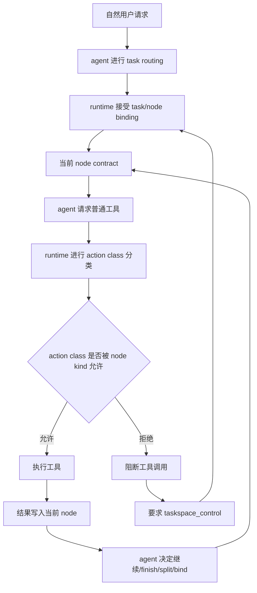
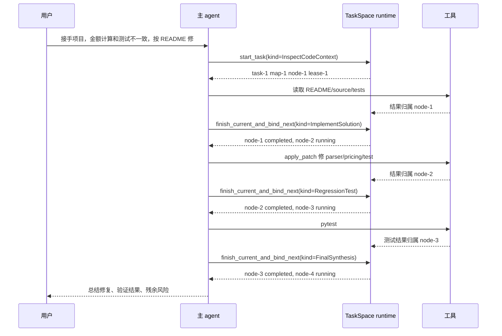
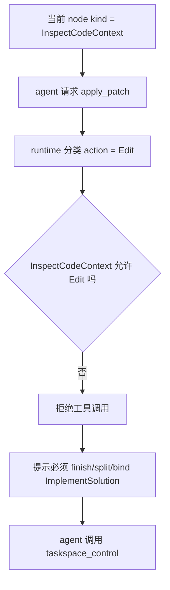

# TaskSpace Map 驱动控制面设计

## 目标

这份文档补充 `2026-05-22-taskspace-runtime-design.md` 和 `2026-05-27-taskspace-runtime-rearchitecture-implementation-plan.md`，专门解决自然用户 E2E 暴露出的核心问题：

```text
TaskSpace 已经能要求 agent 先绑定 task/node 再行动，
但 map 仍然没有真正驱动 agent 的行动策略。
```

换句话说，当前系统做到的是“工具结果归档到 node”，还没有做到“node contract 决定下一步能不能做”。

本设计不改变一个基本原则：runtime 不做任务语义判断，不评价方案质量，不替 agent 做任务路由。runtime 只做结构性约束：当前行动是否被当前 node 的 contract 允许。

## 测试结论

自然用户 E2E：

```text
scripts/run-action-map-real-user-e2e.ps1
```

最近运行结果：

```text
target/real-user-e2e/action-map-natural-user-order-pipeline/20260528-150009-462/artifacts/report.md
```

关键事实：

| 观察 | 结论 |
|---|---|
| 用户 prompt 没有出现 task/map/node/taskspace/subagent 内部概念 | 测试输入是自然用户路径 |
| `first_taskspace_binding_evidence = lease_created` | runtime 已能保证先绑定 task/node 再普通工具调用 |
| `agent_ran_passing_pytest = true` | agent 确实完成了业务修复和测试 |
| `pytest_owned_by_validation_node = true` | 测试结果可以归属到验证节点 |
| `nodes = 2` | map 没有健康生长 |
| 缺 parser/pricing/implementation 语义节点 | agent 没有按任务结构拆解 |
| node-1 回到 `ready`，只有 node-2 completed | node 生命周期不收敛 |

这说明当前 TaskSpace 的失败不是“没生效”，而是“生效层级太低”。它约束了归档位置，但没有约束行动路线。

## 当前问题

### 1. Node 只是容器，不是行动 contract

现在 node 的实际作用接近：

```text
当前工具调用结果写到这个 node 里
```

这不足以驱动 agent。自然 E2E 中 agent 可以在 `Read project context` node 内完成读代码、分析、修改代码的大部分工作，runtime 仍然认为合法，因为只要有 active lease 就放行。

真正需要的是：

```text
当前 node 定义当前允许的行动类型
```

### 2. BaseMap 候选节点是弱提示

BaseMap metadata 暴露了候选节点，例如 inspect、implementation、regression test，但它目前只影响 prompt，不形成硬约束。

结果是 agent 可以创建一个宽泛 node：

```text
Read project context
```

然后把几乎所有行动塞进去。这个行为不违反当前 runtime，但违背 map 驱动目标。

### 3. Node title 被迫承担语义

当前 E2E 只能用 title 正则判断 parser/pricing/implementation/validation 覆盖：

```text
has_parser_node = title contains parser/parse/sku
has_pricing_node = title contains pricing/discount/invoice/shipping
```

这不稳定。title 应该服务人类理解，不应该是 runtime contract。

### 4. Node 切换不是原子推进

最新运行中，node-1 从 running 被切换到 ready，而不是 completed。这暴露两个问题：

- 当前节点没有明确结束语义。
- 切换到新节点没有强制沉淀当前节点结果。

最终 map 会出现大量“有结果但没完成”的 ready node，长期运行会变脏。

### 5. Prompt 无法单独解决驱动力

只加强 prompt 可以让某些模型更愿意拆节点，但这仍然是弱注入。只要 runtime 允许在 inspect node 中修改代码，agent 迟早会为了效率绕过结构。

因此驱动力必须进入 tool gate。

## 设计原则

1. **runtime 只做结构判断**
   runtime 可以判断工具类型和 node contract 是否匹配，但不能判断“这个修复方案好不好”。

2. **node kind 是 contract，title 是展示**
   title 可自由生成；runtime 和测试依赖 `node.kind`。

3. **行动前检查，不靠事后修正**
   不允许先把错误行动写入 node，再靠 review 或 summary 纠正。

4. **阻断后只要求控制动作**
   被 gate 阻断后，agent 不应继续普通工具，而应调用 `taskspace_control` 完成 finish、split、bind、ask user 或 reborn。

5. **第一版只做少量稳定 action class**
   不做复杂语义分类，不引入质量评分。

## 目标架构



关键变化：普通工具调用不再只检查“有没有 current node”，还要检查“当前 node 是否允许这个工具类型”。

## 核心模型

### NodeKind

第一版不追求覆盖所有领域，只使用 BaseMap 的稳定工程节点。

```rust
enum NodeKind {
    DefineScope,
    InspectCodeContext,
    ResearchExternalContext,
    IdentifyConstraints,
    DesignSolution,
    DesignLogging,
    DesignTests,
    ReviewSolution,
    ImplementSolution,
    ReviewCode,
    SmokeTest,
    RegressionTest,
    FinalSynthesis,
    Custom,
}
```

说明：

- `Custom` 允许开放领域任务继续工作，但会受到更严格预算约束。
- `NodeKind` 来自 BaseMap metadata，agent 创建 node 时必须选择一个 kind。
- `title` 可以是自然语言，例如 `Fix invoice discount path`，但 kind 应是 `ImplementSolution`。

### ActionClass

runtime 不理解自然语言任务，只按工具和参数做粗分类。

```rust
enum ActionClass {
    Read,
    Search,
    Edit,
    Test,
    Spawn,
    Wait,
    Review,
    FinalResponse,
    Control,
    Unknown,
}
```

建议分类规则：

| ActionClass | 识别方式 |
|---|---|
| `Control` | `taskspace_control` |
| `Read` | `shell_command` 中的 `Get-Content`、`ls`、`rg --files`、只读查询；只读 MCP/tool |
| `Search` | `rg`、search tool、web search |
| `Edit` | `apply_patch`、文件写入、格式化写回、会修改文件的命令 |
| `Test` | `pytest`、`cargo test`、`npm test`、`go test` 等 |
| `Spawn` | `spawn_agent` |
| `Wait` | `wait_agent`、`close_agent` |
| `Review` | review 相关命令或只读审查 agent |
| `FinalResponse` | 最终回复前的内部检查 |
| `Unknown` | 无法确认是否安全的工具调用 |

`Unknown` 在 TaskSpace 中默认拒绝，除非当前 node kind 是 `Custom` 且风险预算允许。

### NodeContract

每个 NodeKind 映射一个 contract。

```rust
struct NodeContract {
    kind: NodeKind,
    allowed_actions: Vec<ActionClass>,
    discouraged_actions: Vec<ActionClass>,
    max_main_tool_results_before_split_hint: u32,
    requires_summary_on_finish: bool,
    allowed_next_kinds: Vec<NodeKind>,
}
```

第一版 contract：

| NodeKind | 允许行动 | 禁止或强阻断 |
|---|---|---|
| `DefineScope` | Read, Search, Control, FinalResponse | Edit, Test, Spawn |
| `InspectCodeContext` | Read, Search, Control, Spawn | Edit, Test |
| `DesignSolution` | Read, Search, Review, Control, FinalResponse | Edit, Test |
| `DesignTests` | Read, Search, Control | Edit 可选阻断，Test 阻断 |
| `ImplementSolution` | Read, Search, Edit, Test, Control | FinalResponse 需先验证或说明未验证 |
| `ReviewCode` | Read, Search, Review, Control | Edit 默认阻断，除非小修复 explicitly allowed |
| `SmokeTest` | Read, Test, Control | Edit |
| `RegressionTest` | Read, Test, Control | Edit |
| `FinalSynthesis` | Read, FinalResponse, Control | Edit, Test, Spawn |
| `Custom` | Read, Search, Control | Edit/Test/Spawn 需先拆成具体 kind |

这个表不是质量判断，只是行动类型约束。

## Runtime Gate

现有 gate 主要是：

```text
TaskSpace enabled
active task exists
active map exists
current main lease exists
node is running
```

需要扩展为：

```text
TaskSpace enabled
active task exists
active map exists
current main lease exists
node is running
node.kind exists
action_class(tool_call) in node.contract.allowed_actions
```

失败时返回机械错误，不能伪装成 agent 回答：

```text
TaskSpace blocked this tool call.
Current node kind: InspectCodeContext
Requested action class: Edit
Reason: InspectCodeContext does not allow Edit.
Call taskspace_control to finish/split/bind an ImplementSolution node before editing.
```

## 控制动作补充

### create_node 必须带 kind

旧形态：

```json
{
  "action": "create_node",
  "title": "Fix invoice",
  "context_summary": "..."
}
```

新形态：

```json
{
  "action": "create_node",
  "kind": "ImplementSolution",
  "title": "Fix invoice discount and shipping behavior",
  "context_summary": "..."
}
```

runtime 校验：

- `kind` 必须是 BaseMap 暴露的候选 kind 或 `Custom`。
- `Custom` 需要 `custom_kind_reason`。
- 宽泛 title 不影响 runtime，但宽泛 kind 会触发预算。

### start_task 初始 map 必须包含 kind

自然任务启动时，agent 可以先创建较少节点，但初始 node 也必须有 kind：

```json
{
  "action": "start_task",
  "task_title": "Fix order-pipeline amount calculation inconsistencies",
  "task_objective": "...",
  "node_kind": "InspectCodeContext",
  "node_title": "Read project context",
  "node_context_summary": "Read README, source, tests, and identify inconsistencies."
}
```

第一版不强制 start_task 一次性创建 3-8 个节点，因为真实任务初始信息不足。真正的强约束是：当 agent 要修改代码时，必须先进入 implementation node。

### finish_current_and_bind_next

当前 `finish_node` 与 `create_node`/`bind_node` 分离，容易出现中间态。建议新增一个原子控制动作：

```json
{
  "action": "finish_current_and_bind_next",
  "finish_summary": "Found parser and pricing inconsistencies; README is source of truth.",
  "next": {
    "kind": "ImplementSolution",
    "title": "Fix parser normalization and pricing rules",
    "context_summary": "Apply README-aligned fixes to parser, pricing, and conflicting invoice test.",
    "dependency_node_ids": ["node-1"]
  }
}
```

runtime 在同一个 state lock 内完成：

1. 校验当前 main lease。
2. 写入当前 node summary result。
3. 当前 node -> completed。
4. 创建或选择 next node。
5. next node -> running。
6. 新建 main lease。
7. 产生一个完整事件序列。

这样能避免“旧 node 被切回 ready”。

### split_current_node

当 agent 在某个 node 中积累太多工具结果，或准备执行不被当前 node kind 允许的行动时，runtime 可以要求拆分：

```json
{
  "action": "split_current_node",
  "reason": "Need code edits, but current node is InspectCodeContext.",
  "finish_current_summary": "Inspected README/source/tests and identified parser/pricing/test mismatches.",
  "new_nodes": [
    {
      "kind": "ImplementSolution",
      "title": "Fix parser and pricing behavior",
      "context_summary": "..."
    },
    {
      "kind": "RegressionTest",
      "title": "Run order-pipeline regression tests",
      "context_summary": "..."
    }
  ],
  "bind_next_local_id": "implement"
}
```

这比简单拒绝工具更有驱动力：runtime 不告诉 agent 任务语义，但告诉 agent “当前 node contract 不允许这个动作，你必须拆或切换”。

## 行动示例

以自然用户 E2E 的订单项目为例，理想运行不需要用户知道 TaskSpace：



如果 agent 在 `InspectCodeContext` 里直接 `apply_patch`：



## Prompt 设计

TaskSpace developer context 应从“提醒维护 map”升级为“当前 contract 注入”。

### 当前 node 注入

```text
TaskSpace mode is active.

Current binding:
- task_id: task-1
- map_id: map-1
- node_id: node-1
- node_kind: InspectCodeContext
- node_title: Read project context

Allowed action classes for this node:
- Read
- Search
- Control
- Spawn

Blocked action classes:
- Edit
- Test

Before requesting a blocked action, call taskspace_control to finish, split, or bind a suitable node.
```

### Gate error 注入

```text
Your previous tool call was blocked by TaskSpace.

Current node:
- node_id: node-1
- node_kind: InspectCodeContext

Blocked action:
- action_class: Edit
- tool: apply_patch

Required next step:
Call taskspace_control with one of:
- finish_current_and_bind_next(kind=ImplementSolution)
- split_current_node(...)
- bind_node(existing ImplementSolution node)
- ask_user if you cannot decide safely
```

## 与现有机制的关系

| 现有机制 | 处理方式 |
|---|---|
| `taskspace_control` | 继续作为唯一结构化入口，扩展 action 和字段 |
| `prepare_main_tool_call` | 继续作为普通工具 gate，增加 action class + node contract 校验 |
| `record_main_tool_result` | 继续把工具结果写入当前 node |
| `ExecutionLease` | 继续作为当前 node 执行权威 |
| BaseMap metadata | 从弱提示升级为 NodeKind/NodeContract 来源 |
| viewer/export | 增加 node kind、blocked action、contract violation 展示 |
| E2E | 从 title 正则逐步迁移到 node.kind 校验 |

不新增并行 runtime，不新增第二套工具执行系统。

## 分阶段实施

### Phase 1：NodeKind 数据模型

目标：摆脱 title 正则。

改动：

- `Node` 增加 `kind: NodeKind`。
- BaseMap metadata 暴露 candidate node kind。
- `start_task/create_node/create_nodes` 接受 kind。
- snapshot、rollout、viewer 导出 kind。
- 旧 snapshot 缺 kind 时修复为 `Custom` 或根据旧 title best-effort 推断，并记录 repair event。

验收：

- 自然用户 E2E 报告输出 node kind。
- title 改名不影响测试。

### Phase 2：ActionClass 分类

目标：让 runtime 能判断“工具类型”。

改动：

- 在工具 dispatch 前新增 `classify_tool_action(tool_name, args)`。
- 先实现保守规则：apply_patch=Edit，spawn_agent=Spawn，wait=Wait，pytest/cargo test/npm test=Test，Get-Content/rg/ls=Read/Search。
- 无法确定的命令归为 `Unknown`。

验收：

- E2E report 输出每个工具调用的 action class。
- `Unknown` 不应大量出现；出现时可从日志定位。

### Phase 3：NodeContract Gate

目标：让 map 成为行动控制面。

改动：

- `prepare_main_tool_call` 增加 contract 校验。
- 不允许 `InspectCodeContext -> Edit`。
- 不允许 `RegressionTest -> Edit`。
- 不允许 `FinalSynthesis -> Edit/Test/Spawn`。
- gate error 写入 rollout event。

验收：

- 新增负向测试：inspect node 内 `apply_patch` 被拒绝。
- 新增负向测试：test node 内 `apply_patch` 被拒绝。
- 自然用户 E2E 中，agent 必须在修改代码前切到 implementation kind。

### Phase 4：原子 finish/split/bind

目标：解决 node 不收敛。

改动：

- 增加 `finish_current_and_bind_next`。
- 增加 `split_current_node`。
- `bind_node` 在已有 main lease 时继续拒绝，提示先 finish/split/block。
- 当前 node 完成 summary 必须写入 result。

验收：

- 自然用户 E2E 中前序 node 不再回到 ready。
- completed_nodes >= 2。
- implementation/test/final 节点有清晰生命周期。

### Phase 5：Prompt 和 E2E 收敛

目标：验证机制有效，而不是靠提示词侥幸。

改动：

- developer context 注入 current node contract。
- gate error 注入具体 action class 和建议控制动作。
- E2E 从 title coverage 改为 kind coverage。
- 保留 title coverage 作为人类可读性弱指标，不作为主 gate。

验收：

- 自然用户 E2E 在不暴露内部概念的情况下通过：
  - nodes >= 4
  - kind coverage 包含 InspectCodeContext、ImplementSolution、RegressionTest
  - Edit 归属 implementation
  - Test 归属 test
  - 所有前序 node completed 或明确 blocked

## 风险和取舍

### 风险 1：分类过严导致 agent 卡住

缓解：

- 第一版只强约束 Edit/Test/Spawn。
- Read/Search 放宽。
- gate error 提供明确可恢复动作。

### 风险 2：复杂任务无法预先拆清楚

缓解：

- 不要求 start_task 一次性创建完整 map。
- 允许边执行边 split/grow。
- 真正强制的是“行动类型变化前必须切换 node”。

### 风险 3：Custom 被滥用

缓解：

- Custom 默认只允许 Read/Search/Control。
- Custom 中需要 Edit/Test/Spawn 时必须 split 到具体 kind。

### 风险 4：命令分类误判

缓解：

- `apply_patch`、spawn、pytest 等确定性高的先做。
- shell_command 中复杂命令归 `Unknown`，提示 agent 用更明确命令或切换 node。
- 分类结果进入 report，便于校准。

## 不做的事

第一版明确不做：

- 不做质量评分。
- 不做 runtime 语义路由。
- 不用关键词替用户选择 task。
- 不强制 subagent。
- 不创建领域专用 map 模板。
- 不要求所有任务一次性规划完整 DAG。

## 评审问题

需要评审确认的关键点：

1. 是否接受 `NodeKind` 作为 runtime contract，而不是继续依赖 title？
2. 是否接受第一版只强约束 Edit/Test/Spawn，Read/Search 保持宽松？
3. 是否接受 `finish_current_and_bind_next` 作为原子推进动作？
4. 是否接受 `Custom` 默认不能执行 Edit/Test/Spawn，必须 split 到具体 kind？
5. 自然用户 E2E 的目标是否应从 title coverage 迁移到 kind coverage？

## 结论

TaskSpace 下一步不应该继续加强“要维护 map”的 prompt，而应该让 runtime 在普通工具调用前执行：

```text
当前 node kind 是否允许当前 action class？
```

这条约束足够轻量，不要求 runtime 理解任务质量；但它能直接阻止 agent 把读、改、测、总结全部塞进同一个宽泛 node。只有这样，map 才会从“工作记录”变成“行动控制面”。
