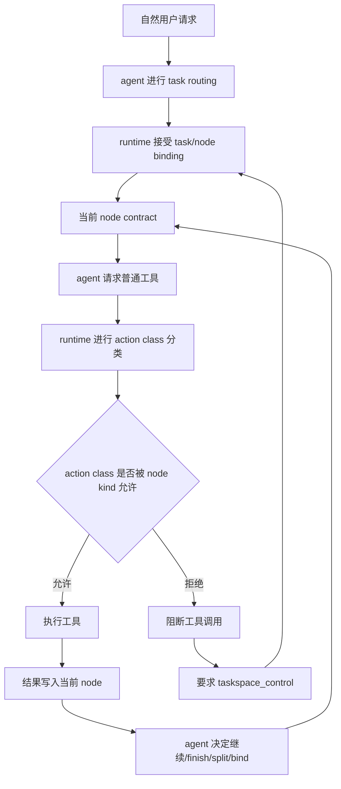
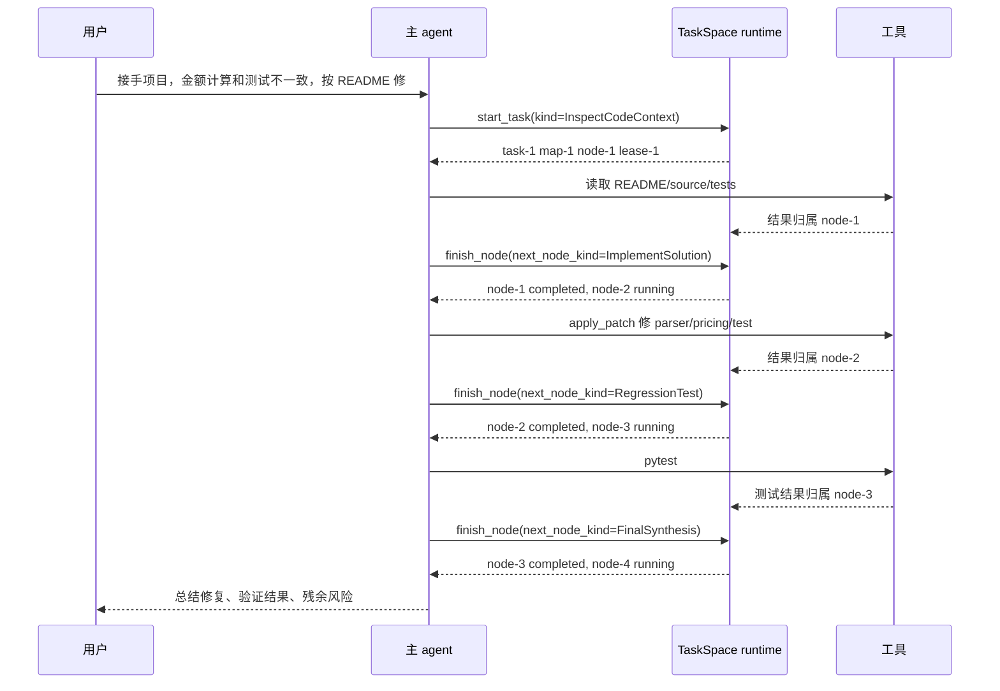
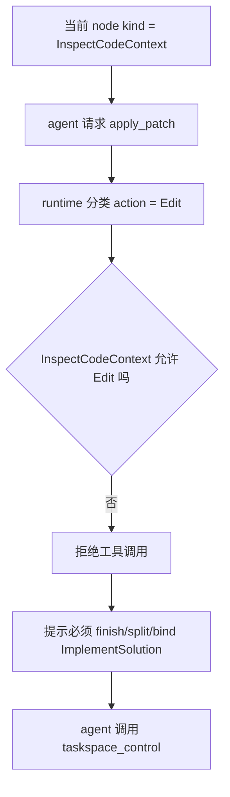
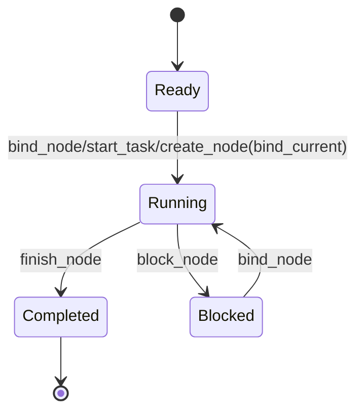
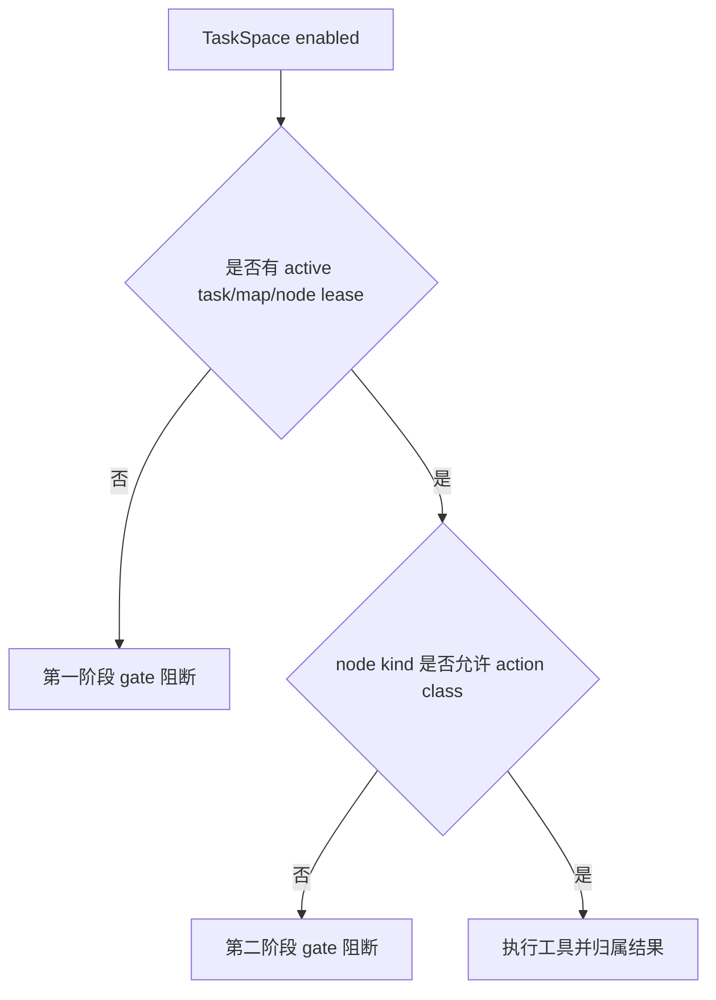

# TaskSpace Map 驱动控制面设计

## 第二次升级重构定位

这是 TaskSpace / Action Map 的第二次升级重构方案。

第一次升级已经解决了基础运行问题：

- `/taskspace` 不再自动创建默认模板 map。
- 自然用户请求进入 TaskSpace 后，agent 必须先创建或绑定 task/node。
- 普通工具结果可以归属到当前 node。
- 验证命令结果可以被观测并归属到验证节点。

第二次升级要解决的是更高一层的问题：

```text
map 不应只是行动之后的记录结构，
而应成为行动之前的控制结构。
```

这次重构的核心交付不是更多节点模板，也不是更强 prompt，而是一个可验证的 runtime 控制面：

```text
node kind + action class + runtime gate
```

只有当当前 node 的 contract 允许当前 action class 时，普通工具才可以执行。否则 runtime 阻断工具调用，并要求 agent 先维护 map：finish、split、bind、ask user 或 reborn。

## 目标

这份文档补充 `2026-05-22-taskspace-runtime-design.md` 和 `2026-05-27-taskspace-runtime-rearchitecture-implementation-plan.md`，专门解决自然用户 E2E 暴露出的核心问题：

```text
TaskSpace 已经能要求 agent 先绑定 task/node 再行动，
但 map 仍然没有真正驱动 agent 的行动策略。
```

换句话说，当前系统做到的是“工具结果归档到 node”，还没有做到“node contract 决定下一步能不能做”。

本设计不改变一个基本原则：runtime 不做任务语义判断，不评价方案质量，不替 agent 做任务路由。runtime 只做结构性约束：当前行动是否被当前 node 的 contract 允许。

## 测试结论

自然用户 E2E：

```text
scripts/run-action-map-real-user-e2e.ps1
```

最近运行结果：

```text
target/real-user-e2e/action-map-natural-user-order-pipeline/20260528-150009-462/artifacts/report.md
```

关键事实：

| 观察 | 结论 |
|---|---|
| 用户 prompt 没有出现 task/map/node/taskspace/subagent 内部概念 | 测试输入是自然用户路径 |
| `first_taskspace_binding_evidence = lease_created` | runtime 已能保证先绑定 task/node 再普通工具调用 |
| `agent_ran_passing_pytest = true` | agent 确实完成了业务修复和测试 |
| `pytest_owned_by_validation_node = true` | 测试结果可以归属到验证节点 |
| `nodes = 2` | map 没有健康生长 |
| 缺 parser/pricing/implementation 语义节点 | agent 没有按任务结构拆解 |
| node-1 回到 `ready`，只有 node-2 completed | node 生命周期不收敛 |

这说明当前 TaskSpace 的失败不是“没生效”，而是“生效层级太低”。它约束了归档位置，但没有约束行动路线。

## 第二次重构成功标准

这次重构完成后，自然用户 E2E 不应只是证明“agent 会创建 node”，而要证明：

| 成功标准 | 说明 |
|---|---|
| 行动先被 map 约束 | 每个普通工具调用前，runtime 都知道当前 task/map/node/kind |
| Edit 不会发生在 inspect node | 代码修改必须先进入 implementation kind |
| Test 不会混入 implementation 主体 | 测试动作必须先切换到 `SmokeTest` 或 `RegressionTest` kind，避免 implementation node 顺手吞掉验证阶段 |
| 宽泛 node 会被迫拆分 | 单个 node 吸收过多工具结果或请求不匹配 action 时，runtime 要求 split/bind |
| 前序 node 能收敛 | 从一个 node 推进到下一个 node 时，前序 node 必须 completed 或 blocked |
| E2E 从 title 判断迁移到 kind 判断 | 测试不再依赖自然语言标题正则作为主 gate |

负向验收同样重要：

| 负向场景 | 预期 |
|---|---|
| `InspectCodeContext` 下调用 `apply_patch` | 阻断 |
| `RegressionTest` 下调用 `apply_patch` | 阻断 |
| 无 current main lease 时普通工具调用 | 阻断 |
| `Custom` node 下请求 Edit/Test/Spawn | 阻断，并要求 split 到具体 kind |
| `taskspace_control` 失败后同轮普通工具继续执行 | 阻断 |

## 当前问题

### 1. Node 只是容器，不是行动 contract

现在 node 的实际作用接近：

```text
当前工具调用结果写到这个 node 里
```

这不足以驱动 agent。自然 E2E 中 agent 可以在 `Read project context` node 内完成读代码、分析、修改代码的大部分工作，runtime 仍然认为合法，因为只要有 active lease 就放行。

真正需要的是：

```text
当前 node 定义当前允许的行动类型
```

### 2. BaseMap 候选节点是弱提示

BaseMap metadata 暴露了候选节点，例如 inspect、implementation、regression test，但它目前只影响 prompt，不形成硬约束。

结果是 agent 可以创建一个宽泛 node：

```text
Read project context
```

然后把几乎所有行动塞进去。这个行为不违反当前 runtime，但违背 map 驱动目标。

### 3. Node title 被迫承担语义

当前 E2E 只能用 title 正则判断 parser/pricing/implementation/validation 覆盖：

```text
has_parser_node = title contains parser/parse/sku
has_pricing_node = title contains pricing/discount/invoice/shipping
```

这不稳定。title 应该服务人类理解，不应该是 runtime contract。

### 4. Node 切换不是原子推进

最新运行中，node-1 从 running 被切换到 ready，而不是 completed。这暴露两个问题：

- 当前节点没有明确结束语义。
- 切换到新节点没有强制沉淀当前节点结果。

最终 map 会出现大量“有结果但没完成”的 ready node，长期运行会变脏。

### 5. Prompt 无法单独解决驱动力

只加强 prompt 可以让某些模型更愿意拆节点，但这仍然是弱注入。只要 runtime 允许在 inspect node 中修改代码，agent 迟早会为了效率绕过结构。

因此驱动力必须进入 tool gate。

## 设计原则

1. **runtime 只做结构判断**
   runtime 可以判断工具类型和 node contract 是否匹配，但不能判断“这个修复方案好不好”。

2. **node kind 是 contract，title 是展示**
   title 可自由生成；runtime 和测试依赖 `node.kind`。

3. **行动前检查，不靠事后修正**
   不允许先把错误行动写入 node，再靠 review 或 summary 纠正。

4. **阻断后只要求控制动作**
   被 gate 阻断后，agent 不应继续普通工具，而应调用 `taskspace_control` 完成 finish、split、bind、ask user 或 reborn。

5. **第一版只做少量稳定 action class**
   不做复杂语义分类，不引入质量评分。

## 目标架构



关键变化：普通工具调用不再只检查“有没有 current node”，还要检查“当前 node 是否允许这个工具类型”。

## 核心模型

### NodeKind

第一版不追求覆盖所有领域，只使用 BaseMap 的稳定工程节点。

```rust
enum NodeKind {
    DefineScope,
    InspectCodeContext,
    ResearchExternalContext,
    IdentifyConstraints,
    DesignSolution,
    DesignLogging,
    DesignTests,
    ReviewSolution,
    ImplementSolution,
    ReviewCode,
    SmokeTest,
    RegressionTest,
    FinalSynthesis,
    Custom,
}
```

说明：

- `Custom` 只作为无法归类时的临时承载，默认只允许 Read/Search/Control。
- `NodeKind` 来自 BaseMap metadata，agent 创建 node 时必须选择一个 kind。
- `title` 可以是自然语言，例如 `Fix invoice discount path`，但 kind 应是 `ImplementSolution`。

### ActionClass

runtime 不理解自然语言任务，只按工具和参数做粗分类。

```rust
enum ActionClass {
    Read,
    Search,
    Edit,
    Test,
    Spawn,
    Wait,
    Review,
    FinalResponse,
    Control,
    Unknown,
}
```

建议分类规则：

| ActionClass | 识别方式 |
|---|---|
| `Control` | `taskspace_control` |
| `Read` | `shell_command` 中的 `Get-Content`、`ls`、`rg --files`、只读查询；只读 MCP/tool |
| `Search` | `rg`、search tool、web search |
| `Edit` | `apply_patch`、文件写入、格式化写回、会修改文件的命令 |
| `Test` | `pytest`、`cargo test`、`npm test`、`go test` 等 |
| `Spawn` | `spawn_agent` |
| `Wait` | `wait_agent`、`close_agent` |
| `Review` | review 相关命令或只读审查 agent |
| `FinalResponse` | 最终回复前的内部检查 |
| `Unknown` | 无法确认是否安全的工具调用 |

`Unknown` 在 TaskSpace 中默认拒绝；即使当前 node kind 是 `Custom`，也要求 agent 使用更明确的工具/命令或先切换到具体 kind。

### NodeContract

每个 NodeKind 映射一个 contract。

```rust
struct NodeContract {
    kind: NodeKind,
    allowed_actions: Vec<ActionClass>,
    discouraged_actions: Vec<ActionClass>,
    max_main_tool_results_before_split_hint: u32,
    requires_summary_on_finish: bool,
    allowed_next_kinds: Vec<NodeKind>,
}
```

第一版 contract：

| NodeKind | 允许行动 | 禁止或强阻断 |
|---|---|---|
| `DefineScope` | Read, Search, Control, FinalResponse | Edit, Test, Spawn |
| `InspectCodeContext` | Read, Search, Control, Spawn | Edit, Test |
| `DesignSolution` | Read, Search, Review, Control, FinalResponse | Edit, Test |
| `DesignTests` | Read, Search, Control | Edit 可选阻断，Test 阻断 |
| `ImplementSolution` | Read, Search, Edit, Control | Test 需切换到 `SmokeTest` 或 `RegressionTest` |
| `ReviewCode` | Read, Search, Review, Control | Edit 默认阻断，除非小修复 explicitly allowed |
| `SmokeTest` | Read, Test, Control | Edit |
| `RegressionTest` | Read, Test, Control | Edit |
| `FinalSynthesis` | Read, FinalResponse, Control | Edit, Test, Spawn |
| `Custom` | Read, Search, Control | Edit/Test/Spawn 需先拆成具体 kind |

这个表不是质量判断，只是行动类型约束。

## Runtime Gate

现有 gate 主要是：

```text
TaskSpace enabled
active task exists
active map exists
current main lease exists
node is running
```

需要扩展为：

```text
TaskSpace enabled
active task exists
active map exists
current main lease exists
node is running
node.kind exists
action_class(tool_call) in node.contract.allowed_actions
```

失败时返回机械错误，不能伪装成 agent 回答：

```text
TaskSpace blocked this tool call.
Current node kind: InspectCodeContext
Requested action class: Edit
Reason: InspectCodeContext does not allow Edit.
Call taskspace_control to finish/split/bind an ImplementSolution node before editing.
```

## 控制动作补充

### create_node 必须带 kind

旧形态：

```json
{
  "action": "create_node",
  "title": "Fix invoice",
  "context_summary": "..."
}
```

新形态：

```json
{
  "action": "create_node",
  "kind": "ImplementSolution",
  "title": "Fix invoice discount and shipping behavior",
  "context_summary": "..."
}
```

runtime 校验：

- `kind` 必须是 BaseMap 暴露的候选 kind 或 `Custom`。
- `Custom` 需要 `custom_kind_reason`。
- 宽泛 title 不影响 runtime，但宽泛 kind 会触发预算。

### start_task 初始 map 必须包含 kind

自然任务启动时，agent 可以先创建较少节点，但初始 node 也必须有 kind：

```json
{
  "action": "start_task",
  "task_title": "Fix order-pipeline amount calculation inconsistencies",
  "task_objective": "...",
  "node_kind": "InspectCodeContext",
  "node_title": "Read project context",
  "node_context_summary": "Read README, source, tests, and identify inconsistencies."
}
```

第一版不强制 start_task 一次性创建 3-8 个节点，因为真实任务初始信息不足。真正的强约束是：当 agent 要修改代码时，必须先进入 implementation node。

### finish_node 原子推进扩展

当前代码已经有 `finish_node`，并支持 `next_node_id` 绑定既有节点。不要再平行新增一套重复动作。

建议扩展 `finish_node`：当 `next_node_id` 缺失，但提供 `next_node_kind`、`next_node_title`、`next_node_context_summary` 时，runtime 在同一个 state lock 内完成“结束当前节点 + 创建下一个节点 + 绑定下一个节点”。

```json
{
  "action": "finish_node",
  "node_id": "node-1",
  "result_summary": "Found parser and pricing inconsistencies; README is source of truth.",
  "next_node_kind": "ImplementSolution",
  "next_node_title": "Fix parser normalization and pricing rules",
  "next_node_context_summary": "Apply README-aligned fixes to parser, pricing, and conflicting invoice test.",
  "next_dependency_node_ids": ["node-1"]
}
```

runtime 在同一个 state lock 内完成：

1. 校验当前 main lease。
2. 写入当前 node summary result。
3. 当前 node -> completed。
4. 使用 `next_node_id` 选择既有 next node，或使用 next node draft 创建 next node。
5. next node -> running。
6. 新建 main lease。
7. 产生一个完整事件序列。

这样能避免“旧 node 被切回 ready”。

### split_current_node

当 agent 在某个 node 中积累太多工具结果，或准备执行不被当前 node kind 允许的行动时，runtime 可以要求拆分：

```json
{
  "action": "split_current_node",
  "reason": "Need code edits, but current node is InspectCodeContext.",
  "finish_current_summary": "Inspected README/source/tests and identified parser/pricing/test mismatches.",
  "new_nodes": [
    {
      "kind": "ImplementSolution",
      "title": "Fix parser and pricing behavior",
      "context_summary": "..."
    },
    {
      "kind": "RegressionTest",
      "title": "Run order-pipeline regression tests",
      "context_summary": "..."
    }
  ],
  "bind_next_local_id": "implement"
}
```

这比简单拒绝工具更有驱动力：runtime 不告诉 agent 任务语义，但告诉 agent “当前 node contract 不允许这个动作，你必须拆或切换”。

## 行动示例

以自然用户 E2E 的订单项目为例，理想运行不需要用户知道 TaskSpace：



如果 agent 在 `InspectCodeContext` 里直接 `apply_patch`：



## Prompt 设计

TaskSpace developer context 应从“提醒维护 map”升级为“当前 contract 注入”。

### 当前 node 注入

```text
TaskSpace mode is active.

Current binding:
- task_id: task-1
- map_id: map-1
- node_id: node-1
- node_kind: InspectCodeContext
- node_title: Read project context

Allowed action classes for this node:
- Read
- Search
- Control
- Spawn

Blocked action classes:
- Edit
- Test

Before requesting a blocked action, call taskspace_control to finish, split, or bind a suitable node.
```

### Gate error 注入

```text
Your previous tool call was blocked by TaskSpace.

Current node:
- node_id: node-1
- node_kind: InspectCodeContext

Blocked action:
- action_class: Edit
- tool: apply_patch

Required next step:
Call taskspace_control with one of:
- finish_node(node_id=current, next_node_kind=ImplementSolution, ...)
- split_current_node(...)
- bind_node(existing ImplementSolution node)
- ask_user if you cannot decide safely
```

## 与现有机制的关系

| 现有机制 | 处理方式 |
|---|---|
| `taskspace_control` | 继续作为唯一结构化入口，扩展 action 和字段 |
| `prepare_main_tool_call` | 继续作为普通工具 gate，增加 action class + node contract 校验 |
| `record_main_tool_result` | 继续把工具结果写入当前 node |
| `ExecutionLease` | 继续作为当前 node 执行权威 |
| BaseMap metadata | 从弱提示升级为 NodeKind/NodeContract 来源 |
| viewer/export | 增加 node kind、blocked action、contract violation 展示 |
| E2E | 从 title 正则逐步迁移到 node.kind 校验 |

不新增并行 runtime，不新增第二套工具执行系统。

## 工程落地设计

这一节按真实代码路径定义实现方案。核心原则是继续复用当前 TaskSpace runtime、`taskspace_control`、tool dispatch gate、session event、viewer/export，不另起一套 map runtime。

### 代码落点总览

| 路径 | 当前职责 | 本轮改造 |
|---|---|---|
| `third_party/codex-cli/codex-rs/core/src/action_map/map.rs` | Task/map/node/lease/result 基础模型 | 增加 `NodeKind`、`ActionClass`，给 `MapNode` 增加 `kind`，给 `NodeResult` 可选增加 `action_class` |
| `third_party/codex-cli/codex-rs/core/src/action_map/basemap.rs` | BaseMap 候选节点 metadata | 候选节点绑定稳定 `NodeKind`，并暴露 kind、说明、推荐场景、默认 contract |
| `third_party/codex-cli/codex-rs/core/src/action_map/contracts.rs` | 当前不存在 | 新增轻量 contract 表：`NodeKind -> NodeContract`，只做静态结构约束 |
| `third_party/codex-cli/codex-rs/tools/src/taskspace_tool.rs` | `taskspace_control` schema | 扩展 `start_task/create_node/finish_node` 字段，不新增第二套控制工具 |
| `third_party/codex-cli/codex-rs/core/src/tools/handlers/taskspace_control.rs` | 解析控制动作并调用 session | 解析 kind 和 next node draft，保持所有状态变化仍进入 runtime |
| `third_party/codex-cli/codex-rs/core/src/session/mod.rs` | Session wrapper，连接工具调度与 runtime | `prepare_action_map_main_tool_call` 从只传 `tool_name` 改成传 `ToolActionDescriptor` |
| `third_party/codex-cli/codex-rs/core/src/tools/parallel.rs` | 工具 dispatch 前后处理 | 在工具执行前分类 action class，并调用 runtime gate；工具执行后继续记录结果 |
| `third_party/codex-cli/codex-rs/core/src/action_map/runtime.rs` | TaskSpace 状态机与 gate | 扩展创建节点、绑定、finish、工具 gate、developer context、事件输出 |
| `third_party/codex-cli/codex-rs/protocol/src/protocol.rs` | TUI/viewer/event 协议 | snapshot node 增加 `kind`；result 或 event 增加 `action_class`；增加 blocked event |
| `scripts/run-action-map-real-user-e2e.ps1` | 自然用户 E2E | 从 title coverage 迁移到 kind/action class/生命周期 coverage |

### 数据模型

`NodeKind` 放在 `action_map/map.rs` 或拆到 `action_map/kind.rs`。如果枚举开始膨胀，再拆文件；第一版保持小而直接。

```rust
#[derive(Clone, Copy, Debug, Eq, PartialEq, Ord, PartialOrd, Serialize, Deserialize)]
#[serde(rename_all = "snake_case")]
pub(crate) enum NodeKind {
    DefineScope,
    InspectCodeContext,
    ResearchExternalContext,
    IdentifyConstraints,
    DesignSolution,
    DesignLogging,
    DesignTests,
    ReviewSolution,
    ImplementSolution,
    ReviewCode,
    SmokeTest,
    RegressionTest,
    FinalSynthesis,
    Custom,
}
```

`MapNode` 增加：

```rust
pub(crate) kind: NodeKind,
```

兼容策略：

- 新建节点必须写入 kind。
- 旧持久化 snapshot 缺 kind 时默认 `Custom`。
- 如果旧节点标题能明确映射到 BaseMap id，可以 best-effort 修复为对应 kind，但修复必须写日志事件，避免静默改变历史语义。

`ActionClass` 不需要理解任务语义，只表达工具行为类别：

```rust
pub(crate) enum ActionClass {
    Read,
    Search,
    Edit,
    Test,
    Spawn,
    Wait,
    Review,
    FinalResponse,
    Control,
    Unknown,
}
```

`NodeResult` 建议增加：

```rust
pub(crate) action_class: Option<ActionClass>,
```

这样 viewer 和 E2E 可以直接验证“Edit 归属 ImplementSolution，Test 归属 RegressionTest”，不再从 tool name 或 title 反推。

### Contract 表

新增 `core/src/action_map/contracts.rs`：

```rust
pub(crate) struct NodeContract {
    pub(crate) kind: NodeKind,
    pub(crate) allowed_actions: &'static [ActionClass],
    pub(crate) max_main_tool_results_before_split_hint: usize,
}

pub(crate) fn contract_for(kind: NodeKind) -> NodeContract {
    match kind {
        NodeKind::InspectCodeContext => NodeContract {
            kind,
            allowed_actions: &[ActionClass::Read, ActionClass::Search, ActionClass::Control],
            max_main_tool_results_before_split_hint: 12,
        },
        NodeKind::ImplementSolution => NodeContract {
            kind,
            allowed_actions: &[ActionClass::Read, ActionClass::Search, ActionClass::Edit, ActionClass::Control],
            max_main_tool_results_before_split_hint: 10,
        },
        NodeKind::RegressionTest => NodeContract {
            kind,
            allowed_actions: &[ActionClass::Read, ActionClass::Test, ActionClass::Control],
            max_main_tool_results_before_split_hint: 8,
        },
        _ => default_contract(kind),
    }
}
```

第一版不要设计复杂的可配置 DSL。静态表更容易审查、测试和回滚。

### 工具 action class 分类

现有 `prepare_main_tool_call(owner_session_id, tool_name)` 只接收工具名，不足以判断 shell 命令是否是 read/edit/test。需要引入一个轻量 descriptor：

```rust
pub(crate) struct ToolActionDescriptor {
    pub(crate) tool_name: String,
    pub(crate) action_class: ActionClass,
    pub(crate) preview: String,
}
```

分类位置放在 `core/src/tools/parallel.rs` 的 dispatch 前，理由是这里最接近 `ToolCall`，能看到工具名和参数；runtime 不应依赖完整 ToolCall 结构。

保守分类规则：

| 规则 | ActionClass |
|---|---|
| `taskspace_control` | `Control`，不走普通工具 gate |
| `apply_patch` | `Edit` |
| `spawn_agent` | `Spawn`，走 subagent assignment gate |
| `wait_agent/close_agent/resume_agent` | `Wait` |
| shell 中包含 `pytest`、`cargo test`、`npm test`、`pnpm test`、`go test` | `Test` |
| shell 中是 `Get-Content`、`Get-ChildItem`、`rg`、`git diff`、`git status`、`Select-String` | `Read` 或 `Search` |
| shell 中出现 `Set-Content`、`Out-File`、重定向写入、`Remove-Item`、`Move-Item`、`git commit`、格式化写回 | `Edit` |
| 无法确定 | `Unknown` |

`Unknown` 在第一版默认阻断，并提示 agent 使用更明确的命令或先切换到更具体 node。这样宁可多一次结构维护，也不要让未知写操作绕过 gate。

### Runtime gate 改造

`runtime.rs::prepare_main_tool_call` 改成：

```rust
pub(crate) fn prepare_main_tool_call(
    &mut self,
    owner_session_id: ThreadId,
    descriptor: &ToolActionDescriptor,
) -> Result<Vec<MapRuntimeEvent>, ActionMapGateError>
```

执行顺序：

1. 非 experiment 模式直接放行。
2. `validate_routing_complete`。
3. `validate_maintenance_barrier`。
4. `validate_main_binding`。
5. 找到当前 `map_id/node_id/lease_id`。
6. 读取 `node.kind`。
7. 查询 `contract_for(node.kind)`。
8. 判断 `descriptor.action_class` 是否允许。
9. 不允许时返回 `ActionMapGateError`，携带可写入 event/log 的结构化信息。

不要只返回字符串错误。建议新增：

```rust
pub(crate) struct ActionMapGateError {
    pub(crate) message: String,
    pub(crate) events: Vec<MapRuntimeEvent>,
}
```

这样 gate 阻断本身也能进入 rollout/viewer，而不是只出现在模型错误流里。

### 控制工具扩展

继续复用 `taskspace_control`。

`start_task` 新增：

```json
{
  "node_kind": "inspect_code_context"
}
```

`create_node` 新增：

```json
{
  "kind": "implement_solution"
}
```

`finish_node` 新增 next node draft：

```json
{
  "action": "finish_node",
  "node_id": "node-2",
  "result_summary": "...",
  "next_node_kind": "regression_test",
  "next_node_title": "Run regression tests",
  "next_node_context_summary": "Run focused regression tests for the files changed in node-2.",
  "next_dependency_node_ids": ["node-2"]
}
```

校验规则：

- `next_node_id` 与 next node draft 二选一，不能同时出现。
- next node draft 必须包含 kind/title/context。
- `finish_node` 只能结束当前 main lease 对应节点，不能结束任意节点。
- `bind_node` 如果当前 main lease 仍存在且目标不是当前节点，必须拒绝，要求先 `finish_node` 或 `block_node`。

### Node 生命周期收敛

当前 `bind_main_node` 会调用 `release_current_main_lease("main_rebound")`，这会让旧 node 回到可继续状态，导致 E2E 中出现“node-1 有结果但回到 ready”的不收敛现象。

新规则：

```text
当前 main lease 存在时：
- bind 当前 node：幂等通过
- bind 其他 node：拒绝
- 想切换：必须 finish_node 或 block_node
```

这样 node 状态转移变成：



`finish_node` 带 next node draft 时，是唯一允许“完成当前节点并立即进入下一节点”的原子路径。

### Developer context 注入

`runtime.rs::build_developer_context` 当前已经暴露 task inventory、routing 要求、active task path 和当前 binding。需要继续注入 contract：

```text
Current TaskSpace node contract:
- node_id: node-2
- node_kind: implement_solution
- allowed_action_classes: read, search, edit, control
- blocked_action_classes: test, spawn, final_response, unknown

Before requesting a blocked action, call taskspace_control(action=finish_node, ...) and bind or create a suitable next node.
```

同时 BaseMap candidate metadata 要增加：

```text
- kind id
- human title
- when_to_use
- allowed action classes
```

这不是让 prompt 单独承担约束，而是让 agent 在触发硬 gate 前知道如何正确维护 map。

### Protocol、viewer 与可观测性

`protocol.rs::ActionMapSnapshotNode` 增加：

```rust
#[serde(default = "default_node_kind")]
pub kind: String,
```

`ActionMapSnapshotResult` 或 `MapRuntimeNodeResultRecordedEvent` 增加 action class。推荐两边都加：

- snapshot result 方便 viewer 渲染历史。
- event 方便实时观察 gate 和归属。

新增事件：

```rust
MapRuntimeEvent::ToolActionBlocked(MapRuntimeToolActionBlockedEvent {
    map_id,
    node_id,
    node_kind,
    tool_name,
    action_class,
    reason,
})
```

viewer 第一版只需要展示：

- node kind badge
- 每个 node 的 action class 统计
- blocked action 列表
- 当前 main lease 所在节点

不要在 viewer 里做语义判断，也不要引入图算法。viewer 只展示 runtime 已经产生的事实。

### E2E 验证迁移

当前自然用户 E2E 的关键不足是 title regex。新测试应改成结构事实：

| 验证项 | 数据来源 |
|---|---|
| 是否先 start/route task | runtime event |
| 是否创建 `inspect_code_context` | snapshot node kind |
| Edit 是否只出现在 `implement_solution` | result.action_class + node.kind |
| Test 是否只出现在 `smoke_test/regression_test` | result.action_class + node.kind |
| 前序 node 是否收敛 | node status timeline |
| gate 是否真实阻断错误行动 | blocked event |
| 用户 prompt 是否未暴露内部概念 | prompt transcript |

自然用户 E2E 不应明示 task/map/node。可以保留一套“显式内部协议 E2E”作为底线测试，但不能用它证明机制有效性。

### 兼容与迁移策略

这是 experiment 模式下的重构，不需要为了旧实验状态牺牲约束，但不能让旧 session 崩溃。

策略：

1. 读取旧 snapshot 时缺 kind 默认 `Custom`。
2. `Custom` 只允许 Read/Search/Control。
3. 如果 agent 要在旧 `Custom` node 中 edit/test，runtime 阻断并要求新建具体 kind node。
4. `taskspace_control` 在一段过渡期可接受缺 kind 的 `start_task/create_node`，但会写 repair warning，并默认 `Custom`。
5. 一旦 E2E 稳定，缺 kind 从 warning 升级为硬错误。

### 测试矩阵

单元测试：

- `NodeKind` serde snake_case 兼容。
- 旧 snapshot 缺 kind 能 restore 为 `Custom`。
- `contract_for(InspectCodeContext)` 不包含 `Edit`。
- `contract_for(ImplementSolution)` 不包含 `Test`。
- action classifier 对 `apply_patch/pytest/Get-Content/rg/Set-Content` 分类正确。
- `prepare_main_tool_call` 在 inspect node + edit 时返回 gate error。
- `prepare_main_tool_call` 在 regression node + edit 时返回 gate error。
- `bind_node` 在当前 main lease 存在且目标不同节点时拒绝。
- `finish_node` + next node draft 能完成旧节点、创建新节点、绑定新 lease。

集成测试：

- `taskspace_control(start_task)` 写入 first node kind。
- `taskspace_control(create_node)` 写入 kind 和依赖边。
- `taskspace_control(finish_node + next draft)` 原子推进。
- 普通工具执行前 gate 能阻断，不产生真实 tool side effect。
- gate 通过后，tool result 写入当前 node，并记录 action class。

真实 E2E：

- 保留 `scripts/run-action-map-real-user-e2e.ps1`，输入仍是自然用户问题。
- 新增一个复杂度更高的沙盒项目，至少包含“读项目 -> 设计修改 -> 改代码 -> 跑测试 -> 修测试失败 -> 回归 -> 总结”的自然推进。
- 报告主 gate 从 nodes/title 改为 kind/action class/status timeline。
- 必须能看到 map 健康生长，而不是只有归档。

## 分阶段实施

### Phase 0：现状保护与失败用例固化

目标：在重构前把当前失败形态变成稳定回归用例，避免后续只是让报告变绿。

改动：

- 保留 `run-action-map-real-user-e2e.ps1` 作为自然用户有效性门槛。
- 增加两个负向 fixture：
  - inspect node 中请求 edit 必须失败。
  - test node 中请求 edit 必须失败。
- 报告继续输出：
  - first binding evidence
  - action attribution
  - pytest owner node
  - node status timeline

验收：

- 当前自然用户 E2E 仍然失败，失败原因保持为 map 健康生长不足。
- 负向 fixture 能证明 runtime gate 真正阻断工具执行，而不是只在 prompt 中建议。

### Phase 1：NodeKind 数据模型

目标：摆脱 title 正则。

改动：

- `Node` 增加 `kind: NodeKind`。
- BaseMap metadata 暴露 candidate node kind。
- `start_task/create_node` 接受 kind。
- snapshot、rollout、viewer 导出 kind。
- 旧 snapshot 缺 kind 时修复为 `Custom` 或根据旧 title best-effort 推断，并记录 repair event。

验收：

- 自然用户 E2E 报告输出 node kind。
- title 改名不影响测试。

### Phase 2：ActionClass 分类

目标：让 runtime 能判断“工具类型”。

改动：

- 在工具 dispatch 前新增 `classify_tool_action(tool_name, args)`。
- 先实现保守规则：apply_patch=Edit，spawn_agent=Spawn，wait=Wait，pytest/cargo test/npm test=Test，Get-Content/rg/ls=Read/Search。
- 无法确定的命令归为 `Unknown`。

验收：

- E2E report 输出每个工具调用的 action class。
- `Unknown` 不应大量出现；出现时可从日志定位。

### Phase 3：NodeContract Gate

目标：让 map 成为行动控制面。

改动：

- `prepare_main_tool_call` 增加 contract 校验。
- 不允许 `InspectCodeContext -> Edit`。
- 不允许 `RegressionTest -> Edit`。
- 不允许 `FinalSynthesis -> Edit/Test/Spawn`。
- gate error 写入 rollout event。

验收：

- 新增负向测试：inspect node 内 `apply_patch` 被拒绝。
- 新增负向测试：test node 内 `apply_patch` 被拒绝。
- 自然用户 E2E 中，agent 必须在修改代码前切到 implementation kind。

### Phase 4：原子 finish/split/bind

目标：解决 node 不收敛。

改动：

- 扩展 `finish_node` 支持 next node draft，完成原子推进。
- 增加 `split_current_node`。
- `bind_node` 在已有 main lease 时继续拒绝，提示先 finish/split/block。
- 当前 node 完成 summary 必须写入 result。

验收：

- 自然用户 E2E 中前序 node 不再回到 ready。
- completed_nodes >= 2。
- implementation/test/final 节点有清晰生命周期。

### Phase 5：Prompt 和 E2E 收敛

目标：验证机制有效，而不是靠提示词侥幸。

改动：

- developer context 注入 current node contract。
- gate error 注入具体 action class 和建议控制动作。
- E2E 从 title coverage 改为 kind coverage。
- 保留 title coverage 作为人类可读性弱指标，不作为主 gate。

验收：

- 自然用户 E2E 在不暴露内部概念的情况下通过：
  - nodes >= 4
  - kind coverage 包含 InspectCodeContext、ImplementSolution、RegressionTest
  - Edit 归属 implementation
  - Test 归属 test
  - 所有前序 node completed 或明确 blocked

## 最小可交付切片

第二次重构可以先交付一个最小闭环，不必一次实现所有 contract。

最小闭环只要求：

1. `NodeKind` 支持 `InspectCodeContext`、`ImplementSolution`、`RegressionTest`、`FinalSynthesis`、`Custom`。
2. `ActionClass` 支持 `Read`、`Edit`、`Test`、`Control`、`Unknown`。
3. runtime 阻断：
   - `InspectCodeContext -> Edit`
   - `RegressionTest -> Edit`
   - `FinalSynthesis -> Edit/Test`
   - `Custom -> Edit/Test`
4. 支持 `finish_node` 携带 next node draft，完成原子推进。
5. 自然用户 E2E 至少产生：

```text
InspectCodeContext -> ImplementSolution -> RegressionTest
```

这个切片能直接验证 map 驱动力，不需要先引入复杂 subagent、多领域 map、质量评分或完整 DAG 治理。

## 与第一次升级的边界

第一阶段已经建立了 TaskSpace 的存在性约束：

```text
没有 task/node binding，就不能普通工具调用。
```

第二阶段建立 TaskSpace 的行动约束：

```text
有 task/node binding，但 node kind 不允许当前 action，也不能普通工具调用。
```

二者关系如下：



这能保证第二次重构不会推翻第一次重构，而是在同一条工具执行路径上增加更细的结构约束。

## 风险和取舍

### 风险 1：分类过严导致 agent 卡住

缓解：

- 第一版只强约束 Edit/Test/Spawn。
- Read/Search 放宽。
- gate error 提供明确可恢复动作。

### 风险 2：复杂任务无法预先拆清楚

缓解：

- 不要求 start_task 一次性创建完整 map。
- 允许边执行边 split/grow。
- 真正强制的是“行动类型变化前必须切换 node”。

### 风险 3：Custom 被滥用

缓解：

- Custom 默认只允许 Read/Search/Control。
- Custom 中需要 Edit/Test/Spawn 时必须 split 到具体 kind。

### 风险 4：命令分类误判

缓解：

- `apply_patch`、spawn、pytest 等确定性高的先做。
- shell_command 中复杂命令归 `Unknown`，提示 agent 用更明确命令或切换 node。
- 分类结果进入 report，便于校准。

## 不做的事

第一版明确不做：

- 不做质量评分。
- 不做 runtime 语义路由。
- 不用关键词替用户选择 task。
- 不强制 subagent。
- 不创建领域专用 map 模板。
- 不要求所有任务一次性规划完整 DAG。

## 评审问题

需要评审确认的关键点：

1. 是否接受 `NodeKind` 作为 runtime contract，而不是继续依赖 title？
2. 是否接受第一版只强约束 Edit/Test/Spawn，Read/Search 保持宽松？
3. 是否接受复用并扩展 `finish_node` 作为原子推进动作，而不是新增平行动作？
4. 是否接受 `Custom` 默认不能执行 Edit/Test/Spawn，必须 split 到具体 kind？
5. 自然用户 E2E 的目标是否应从 title coverage 迁移到 kind coverage？

## 结论

TaskSpace 下一步不应该继续加强“要维护 map”的 prompt，而应该让 runtime 在普通工具调用前执行：

```text
当前 node kind 是否允许当前 action class？
```

这条约束足够轻量，不要求 runtime 理解任务质量；但它能直接阻止 agent 把读、改、测、总结全部塞进同一个宽泛 node。只有这样，map 才会从“工作记录”变成“行动控制面”。
