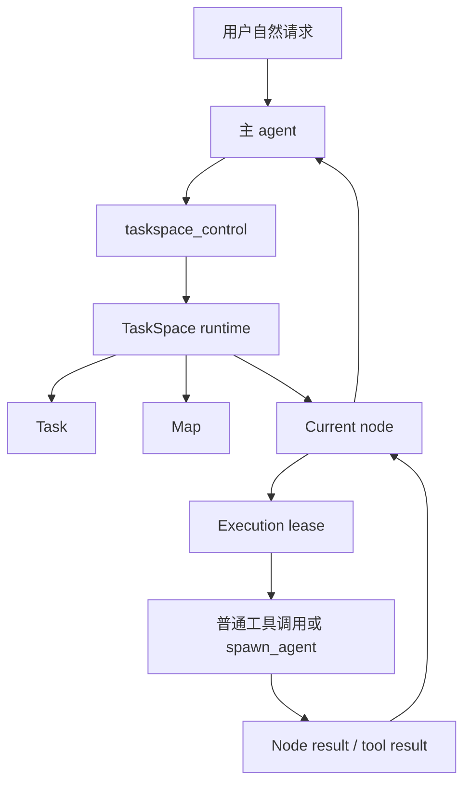
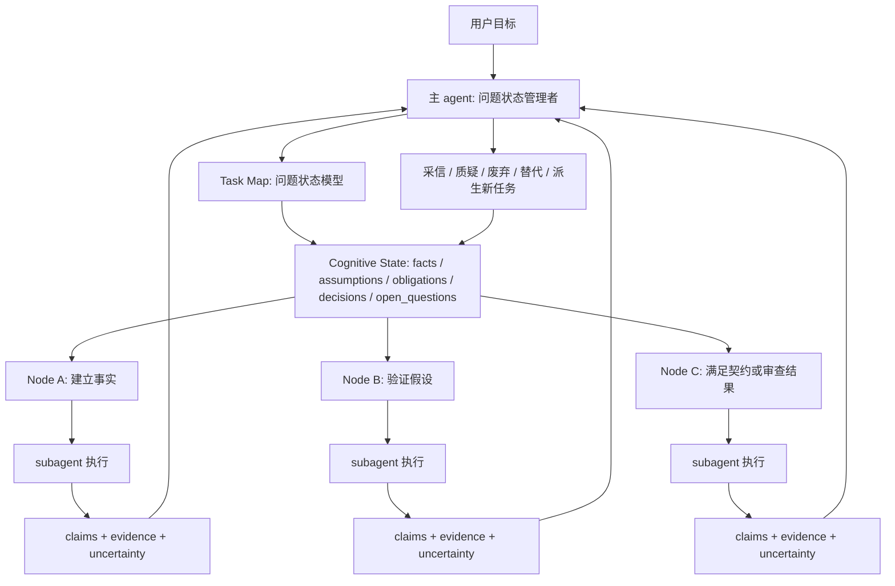

# TaskSpace E3 负收益后问题状态与模型管理重构基线

日期：2026-06-04

## 结论摘要

本轮 E3 外部 benchmark 没有证明 TaskSpace 收益，反而暴露出当前设计的核心偏差：

```text
当前已经做到：agent 必须绑定 task/map/node 行动。
尚未做到：主 agent 必须以问题状态与模型管理者身份，维护事实、假设、证据、契约、决策和不确定性。
```

因此下一阶段不能继续把重点放在“更多 gate”或“更复杂状态机”上，也不能停留在“Planner 化”这种浅层理解上。TaskSpace 要从行动记录系统升级为长任务可靠性层，即能够管理问题状态、错误前提、输出契约和结果采信的 problem-solving runtime。

新的核心定位：

```text
主 agent = 问题状态与模型管理者 / 认知控制器 / 验收责任人
subagent = 证据包生产者 / node executor / investigator / implementer
task map = 持久化、可观察、可增长、可审查的问题状态模型
node = 受边界约束的认知或工程状态转换单元
node result = claims + evidence + artifact delta + uncertainty + validity
```

## 背景证据

本设计基线来自 `2026-06-03` 的完整 E3 run：

- 外部 Terminal-Bench paired run：20 pair。
- `standard` 成功率：14/20。
- `taskspace` 成功率：9/20。
- valid E3 pair 中：`taskspace_better = 0`，`standard_better = 5`，`no_clear_delta = 9`。
- TaskSpace 平均 walltime、tool call、node 数量明显更高。
- `jsonl-aggregator` 是最关键负例：TaskSpace 平均 node 数 13.2，成功率 3/5；standard 成功率 5/5。

测试结论不是“TaskSpace 方向被证伪”，而是：

```text
TaskSpace 已具备机制可运行性和可观察性，但当前 map 行为模式没有转化为产品收益。
```

## 2026-06-04 外部讨论吸收结论

外部讨论对本文件原始“Planner 化重构”做了重要修正：Planner 只是工作表象，真正缺失的是认知控制层。

吸收后的核心判断：

```text
TaskSpace 的资产不是“多了 map/node”，
而是“多了一个可审查、可修正、可继承的问题状态”。
```

因此 map 不应只管理 node/edge graph，而应管理五类核心状态：

| 对象 | 作用 | 示例 |
|---|---|---|
| `facts` | 已观察到的事实 | `input file exists at /data/events.jsonl` |
| `assumptions` | 尚未验证但暂用的前提 | `dates may be mixed ISO and US formats` |
| `obligations` | 必须满足的任务契约 | `output must be UTF-8 without BOM` |
| `decisions` | 已做出的路线选择 | `use Python parser instead of shell awk` |
| `open_questions` | 阻塞或风险问题 | `which file is authoritative input?` |

后续所有 task、node、result、viewer 和 benchmark 设计，都应围绕这五类状态是否被正确建立、转换、采信、质疑和废弃展开。

同时，TaskSpace 不应依赖前置复杂度评估器。真实复杂度通常在执行中暴露，前置评估既昂贵又不稳定。更合理的机制是：

```text
用户视角：TaskSpace 可以保持开启。
内部执行：默认 direct/light kernel，发现局部性破裂或风险信号后 promote 到完整问题状态模型。
```

这不是让用户频繁切换模式，而是 TaskSpace 内部的成本控制和可靠性升级策略。

## 负收益后的关键讨论结论

### 固定成本不是首要矛盾

TaskSpace 启动和调度天然有成本。复杂任务在执行前往往无法可靠判断复杂度，因此不能把“简单任务必须不更慢”作为第一优化门槛。

当前更重要的目标是：

- 中高复杂任务是否提升成功率。
- 更弱模型是否因 TaskSpace 获得能力上限提升。
- TaskSpace 是否减少上下文混乱、错误前提扩散、重复阅读和无序探索。

因此下一阶段优先关注成功率和行为质量，而不是先压低启动成本。

### 当前 map 是行动台账，不是问题状态模型

当前 TaskSpace 的实际协作方式更接近：

```text
主 agent 自己读文件、写代码、跑命令
  -> runtime 要求这些动作绑定到 node
  -> map 记录行动和结果
```

这让 map 很容易退化成行动日志。agent 为了继续调用工具而创建 node，为了继续推进而完成 node，node 粒度自然下沉到行动步骤。

预期协作方式应该是：

```text
主 agent 理解用户目标
  -> 创建或选择 task
  -> 建立当前问题状态
  -> 区分 facts / assumptions / obligations / decisions / open questions
  -> 创建能改变问题状态的高内聚 node
  -> 委派 subagent 执行 node
  -> 从 claims + evidence + uncertainty 获取反馈
  -> 质疑、采信、废弃或替代 result
  -> 更新问题状态模型
  -> 直到问题解决
```

### node 粒度应该是高内聚状态转换任务

node 不是非原子操作的拆分，也不是每次工具调用的容器。

更精确地说：

```text
node 是一个受边界约束的认知或工程状态转换单元。
```

每个 node 创建时必须能回答：

```text
它要改变 map 中的什么状态？
它要建立什么事实、验证什么假设、满足什么契约、形成什么决策、解决什么开放问题？
```

合理 node 示例：

- 分析配置加载链路。
- 确认 JSONL 输入数据来源。
- 实现并验证聚合逻辑。
- 审查输出契约和编码兼容性。
- 定位失败根因并给出证据链。

状态转换示例：

| node | 状态变化 |
|---|---|
| 确认 JSONL 输入数据来源 | `open_question -> fact` |
| 审查输出编码契约 | `implicit obligation -> explicit output_contract` |
| 实现聚合逻辑 | `decision + artifact_state` |
| 验证 validator 读取方式 | `assumption -> fact / obligation` |
| 复核失败根因 | `questioned_result -> accepted / invalid` |

不合理 node 示例：

- 读取 README。
- 写一个文件。
- 执行 pytest。
- 总结当前结果。

如果 node 小到只能描述一个工具动作，它就不是 task map 的子任务，而是执行轨迹。

### encoding 失败暴露输出契约缺失

`hello-world` 和 `heterogeneous-dates` 的 TaskSpace 失败主要来自 PowerShell 写文件编码差异：

- 一个输出带 UTF-8 BOM。
- 一个输出成 UTF-16 LE。
- validator 按严格文本读取失败。

这不是 TaskSpace 天然导致编码错误，而是 task/map 层没有把隐式验收条件升级为一等输出契约。

Task 级或 node 级应该能持有：

- 输出文件路径。
- 编码要求。
- validator 读取方式。
- 禁止 BOM / 必须 UTF-8 的约束。
- 最终验收条件。

否则 subagent 或主 agent 会在局部工具选择上引入不可见失败。

输出契约应至少覆盖：

| 契约类型 | 示例 |
|---|---|
| `artifact_contract` | 输出路径、文件名、是否覆盖 |
| `format_contract` | JSONL、CSV、plain text、Markdown |
| `encoding_contract` | UTF-8、no BOM、line ending |
| `schema_contract` | 字段、类型、排序、空值 |
| `validator_contract` | validator 如何读取、比较、判定 |
| `non_goal_contract` | 禁止生成额外文件、禁止 mock hidden input |

这是 TaskSpace 最直接的收益点之一：把 standard agent 可能依赖短上下文直觉处理的隐式约束，显式传给执行 node 和验证 node。

### jsonl 幻觉暴露事实来源约束不足

`jsonl-aggregator` 中，TaskSpace agent 在误解数据来源后自行生成 JSONL，并基于自己生成的数据完成自检。该现象属于 LLM 自欺和环境模型幻觉，单次样本不能证明 TaskSpace 天然更容易幻觉。

但它证明当前 TaskSpace 没有阻止错误前提扩散：

- 错误前提进入 map 后继续生长。
- blocked/completed 不能表达“这个前提可能是错的”。
- node result 被主 agent 采信过快。
- 缺少数据 provenance 和输入合法性验证。

TaskSpace 应该成为反幻觉结构，而不是错误前提的放大器。

必须补入最小 truth maintenance 规则：

```text
observation != fact
assumption != fact
self_generated_data != task_input_data
unknown provenance != accepted fact
```

错误写法：

```text
Known fact: input file is missing, so generated sample data.
```

正确拆分：

```text
Observation: did not find expected input file at path X.
Assumption: maybe task expects generated sample data.
Risk: benchmark may provide hidden validator input.
Open question: what is the authoritative data source?
Forbidden downstream use: generated sample data cannot be treated as benchmark input.
```

### BaseMap 方法论没有生效的原因

之前已经设计过 BaseMap candidate nodes 和拆解方法论 prompt，但它没有稳定转化为行为。

原因：

- 它只是 developer context / prompt，仍是弱注入。
- 它没有进入 task/map/node 的数据结构。
- `taskspace_control` 的字段以自由文本为主，无法承载强语义契约。
- runtime 只校验是否存在 task/map/node/lease，不校验是否形成任务模型。
- 当前 node kind 更接近行动阶段，容易诱导 `inspect -> implement -> test -> summarize`。
- 某些 maintenance barrier 会提示创建 narrower follow-up node，可能反向推动 node 过细。
- 旧测试主要验证机制可运行，没有验证 map 建模质量。

结论：

```text
方法论不能只写在 prompt 里，必须进入 task/map/node/result 的结构、工具协议和 runtime 工作流。
尤其要进入 facts、assumptions、obligations、decisions、open_questions 与 claims/evidence/validity。
```

## 当前 agent-map 协作机制

### 当前链路



runtime 当前负责：

- 要求普通工具调用前存在 active task/map/node。
- 要求当前 action 符合 node kind。
- 要求主 agent 或 subagent 持有合法 lease。
- 记录 node、edge、result、event。
- 暴露 viewer snapshot。

runtime 当前不负责：

- 判断任务语义。
- 判断 node 是否高内聚。
- 判断 map 是否表达了正确问题模型。
- 判断数据来源是否真实。
- 判断 node result 是否可信。
- 选择 task 或 node。

### 目标链路



目标状态下，主 agent 的默认动作不是一线工具调用，而是问题状态管理操作：

- route task。
- start task。
- maintain facts / assumptions / obligations / decisions / open_questions。
- create state-transforming node。
- assign node to subagent。
- inspect node result。
- consume claims + evidence。
- mark result validity。
- update map。
- synthesize final answer。

## 新设计原则

### 问题状态管理优先

TaskSpace 模式下，主 agent 默认身份不是一线 worker，也不只是会拆任务的 Planner，而是问题状态与模型管理者。

它的职责是：

- 维护当前问题模型。
- 区分事实、假设、推论、决策、待验证项。
- 决定哪些 result 可采信。
- 阻止错误前提进入下游。
- 维护输出契约和最终验收路径。
- 判断继续探索是否还有边际收益。

它可以在极小任务或必要复核时亲自执行有限工具，但默认不应作为一线 worker 持续读写跑。

第一版不引入绝对禁令，避免把系统做死；但 runtime 和 prompt 都要把一线执行视为例外，而不是默认路径。

### Map 是问题状态模型

task map 不等同于 todo list，也不等同于执行日志。

task map 至少要表达五类状态：

- `facts`：已观察并被采信的事实。
- `assumptions`：尚未验证但暂用的前提。
- `obligations`：必须满足的任务契约，包括输出契约和非目标约束。
- `decisions`：已做出的路线选择及其证据。
- `open_questions`：阻塞或风险问题。

node、edge、result 是改变这些状态的机制，不是 map 的全部。

### Node 是状态转换单元

node 的最小合格标准：

- 能被一个 subagent 独立执行。
- 有明确输入边界。
- 有明确排除范围。
- 有明确期望产出。
- 有明确 `state_delta_intent`，说明它要改变哪类问题状态。
- 产出能被主 agent 用于更新全局问题模型。

node 不应该对应单次工具调用或单个动作步骤。

建议第一版 `state_delta_intent` 枚举：

| `state_delta_intent` | 含义 |
|---|---|
| `establish_fact` | 建立事实 |
| `test_assumption` | 验证或证伪假设 |
| `satisfy_obligation` | 满足任务契约 |
| `produce_artifact` | 产生产物 |
| `validate_artifact` | 验证产物 |
| `resolve_open_question` | 解决开放问题 |
| `compare_options` | 比较路线 |
| `contain_risk` | 隔离风险 |
| `synthesize_decision` | 形成决策 |

### Result 是证据包

subagent 的观察、命令、证据、失败、假设、产出，都应沉淀在 node context/result 中。

但主 agent 不应消费 summary，而应消费 evidence package：

```text
claims
evidence
artifact_changes
validation
remaining_uncertainty
recommended_map_updates
validity
validity_reason
```

主 agent 从 result 证据包理解全局情况，但不盲信。它可以对结果做有效性标记：

- `accepted`：暂时采信。
- `questioned`：有疑点，需要复核。
- `superseded`：被新证据替代。
- `invalid`：确认错误，不再作为依据。

这不是质量分，也不是 runtime 做客观判断，而是主 agent 对信息可信度的显式管理。

### 用户视角 always-on，内部不是重型 planning always-on

未来 TaskSpace 可以作为默认任务空间能力存在，但内部执行不能默认进入重型 planning。

推荐理解：

```text
用户视角：TaskSpace enabled。
内部执行：direct envelope -> light kernel -> promoted cognitive map -> recovery -> collapsed direct。
```

这不是要求用户理解和切换模式，而是 runtime 内部用低成本 trace 和 sentinel 识别局部性破裂，并在必要时提升为完整问题状态模型。

### Runtime 不做语义选择

runtime 不用关键词、BM25 或语义检索选择 task/node。

runtime 的职责是：

- 暴露 task/map/node inventory。
- 校验结构协议。
- 管理 lease 和互斥。
- 记录 result。
- 维持可观察性。
- 阻止明显违反协议的执行路径。

task routing、map 生成、node 选择、结果采信都由主 agent 执行。

## 问题状态与模型管理重构计划

### Phase P0：确认当前实现边界

目标：把现状和目标差距写清楚，防止继续在旧抽象上补丁式增强。

需要完成：

- 梳理 `taskspace_control` 当前 action 和字段。
- 梳理 runtime gate 当前校验项。
- 梳理 BaseMap prompt 当前注入内容。
- 梳理 subagent spawn 与 node binding 当前路径。
- 梳理 viewer snapshot 中可见的 task/map/node/result 信息。

输出：

- 当前实现边界清单。
- 与本文件目标模型的差距表。

验收：

- 能明确指出哪些能力已经存在，哪些只是 prompt，哪些完全没有工程承载。

### Phase P1：Direct Trace、Light Kernel 与风险哨兵

目标：不引入前置复杂度评估器，用低成本运行时信号识别 direct path 是否已经失去局部性。

Direct mode 不需要完整 map/node/subagent，但需要记录轻量 counters：

```json
{
  "tool_calls": 0,
  "files_read": [],
  "files_modified": [],
  "tests_run": [],
  "validation_failures": 0,
  "open_uncertainty_markers": [],
  "generated_data_events": [],
  "output_write_events": []
}
```

Light Kernel 只保留可升级的骨架：

```json
{
  "objective": "...",
  "success_criteria": "...",
  "observed_facts": [],
  "open_questions": [],
  "risk_flags": [],
  "tool_trace_refs": []
}
```

第一版优先实现三个 sentinel：

| Sentinel | 触发 | 目的 |
|---|---|---|
| Output Contract Sentinel | 写最终输出文件、存在 validator、格式/编码/schema 可能严格比较 | 防止 BOM、编码、schema、路径契约遗漏 |
| Data Provenance Sentinel | 读取、生成、转换数据，或输入来源不明 | 防止自造数据污染最终事实 |
| Failed Hypothesis Sentinel | patch 后测试仍失败、validator mismatch、观察与预期不一致 | 阻止继续围绕旧假设乱试 |

这些不是复杂度评估，而是失控检测。

### Phase P2：Task/Node/Result 结构升级

目标：让方法论进入结构，而不是只停留在 prompt。

Task 级新增或强化字段：

- `objective`：用户目标。
- `success_criteria`：当前成功标准。
- `fact_sources`：输入和事实来源。
- `output_contracts`：输出契约，如文件、格式、编码、validator。
- `known_facts`：已采信事实。
- `assumptions`：尚未验证但暂用的前提。
- `decisions`：关键路线选择。
- `open_questions`：未解决问题。
- `risk_notes`：关键风险和禁止假设。

Node 级新增或强化字段：

- `theme`：主题任务，而不是动作标题。
- `state_delta_intent`：要改变哪类问题状态。
- `scope`：输入边界。
- `excluded_scope`：明确不负责什么。
- `expected_result`：期望产出。
- `evidence_required`：采信前需要什么证据。
- `acceptance_hint`：主 agent 如何判断该 node 产出可用。
- `why_now`：为什么现在需要这个 node。
- `stop_condition`：什么时候应该停止继续探索。

Result 级新增或强化字段：

- `claims`：结果主张。
- `evidence`：证据和来源。
- `changed_artifacts`：修改过的产物。
- `validation`：执行过的验证。
- `remaining_uncertainty`：仍然不确定的问题。
- `recommended_state_updates`：建议写入 map 的状态变化。
- `validity`：主 agent 对结果的当前采信状态。
- `validity_reason`：采信、质疑、替代或废弃原因。

约束：

- 字段可以是自然语言，不做过硬 schema。
- runtime 只校验非空和引用合法，不做语义评分。
- 仍允许简单任务使用轻量 task/node，但必须表达最小成功标准。

### Phase P3：问题状态管理工作流协议

目标：让主 agent 的默认工作模式从“自己执行”转成“维护问题状态并调度证据生产”。

需要新增或改造的控制动作：

- `start_task`：创建 task 时必须带目标、成功标准、事实来源、输出契约和初始问题状态。
- `create_node`：创建 node 时必须表达主题、state_delta_intent、scope、excluded scope、expected result。
- `assign_node`：显式把 node 委派给 subagent。
- `read_node_result`：主 agent 按需读取 node result，而不是全量重扫。
- `mark_result_validity`：标记 node result 的采信状态。
- `update_cognitive_state`：把 accepted result 中的 claims/evidence 写入 facts、assumptions、obligations、decisions、open_questions。
- `revise_map`：基于结果批量调整 node、edge、risk、open question 和 output contract。

第一版可以复用现有 `taskspace_control`，通过新增 action 或扩展参数实现；不新造并行 runtime。

### Phase P4：Promote to TaskSpace

目标：TaskSpace 不依赖前置复杂度评估器，而是在 direct path 暴露局部性破裂或风险后，把已有执行轨迹提升为问题状态模型。

promotion payload 至少包含：

```json
{
  "trigger": "validator_mismatch | input_source_unknown | output_contract_risk | repeated_search | cross_module_dependency",
  "trace_refs": [],
  "objective": "...",
  "success_criteria": [],
  "known_facts": [],
  "assumptions": [],
  "failed_hypotheses": [],
  "fact_sources": [],
  "output_contracts": [],
  "open_questions": [],
  "proposed_nodes": []
}
```

关键要求：

- promotion 必须继承 direct trace，而不是重新开始规划。
- direct trace 中的失败、读取、修改和验证结果，应转化为初始 facts、assumptions、failed hypotheses 和 open questions。
- runtime 不判断语义，只记录触发事件、要求主 agent 生成可审查 promotion payload。

### Phase P5：主 agent 一线执行降级

目标：减少 TaskSpace 退化成“主 agent 自己干活 + map 记账”。

策略：

- TaskSpace 模式下，主 agent 的普通工具调用默认应绑定到少数问题状态管理允许场景：
  - 读取 task/map/node inventory。
  - 轻量复核关键 node result。
  - 执行最终 synthesis 前的少量验证。
  - 简单任务的单节点直接执行。
- 中高复杂任务中，搜索、代码阅读、实现、测试优先通过 node 委派给 subagent。
- 如果主 agent 在同一 node 内连续进行大量普通工具调用，runtime 应触发问题状态管理 maintenance barrier，要求它先总结 node、更新 map、或委派子任务。

注意：

- 不做绝对禁止，否则会破坏小任务效率和异常恢复。
- barrier 的提示不能继续鼓励“创建更细 node”，而应鼓励“采信、质疑、合并、废弃、停止探索，或把 node 改写成能产生新事实/新决策/新 contract 的状态转换任务”。

### Phase P6：事实来源与输出契约

目标：降低错误前提扩散和局部工具选择造成的失败。

机制：

- task 初始化时要求主 agent 显式记录输入来源和输出契约。
- subagent 执行 node 时必须看到该 node 相关的 fact sources 和 output contracts。
- 对数据处理类任务，默认要求先确认输入数据来源，再生成输出。
- 禁止在未说明 provenance 的情况下把自造数据当成真实输入。
- 对文件输出，node context 应能携带编码、格式、路径约束。

runtime 不判断“事实来源是否真的正确”，但可以要求相关字段存在，并让 viewer/audit 可见。

### Phase P7：结果采信与质疑机制

目标：让主 agent 对 node result 保持谨慎信任，避免错误 result 直接污染全局 map。

机制：

- 每个 node result 默认是 `unreviewed` 或 `pending_review`。
- 主 agent 可以标记为 `accepted`、`questioned`、`superseded`、`invalid`。
- 被 `questioned` 的 result 不应作为下游 implementation 的唯一依赖。
- 被 `invalid` 的 result 仍保留在历史中，但不得作为 active map 的有效事实来源。
- `superseded` result 必须指向替代它的新 result 或 node。
- `accepted` result 必须有 claims 和 evidence，不能只是一句 summary。

第一版不需要质量评分，也不需要复杂信任模型。

### Phase P8：Collapse to Direct

目标：TaskSpace 内部进入完整问题状态模型后，不应在不确定性收敛后继续支付重型 planning 成本。

可以降级回 direct/light path 的条件：

- 当前 `open_questions <= 1`。
- 没有 `questioned` result 作为下游唯一依赖。
- output contract 已明确。
- fact source 已明确。
- 下一步是单一局部实现或验证。

这不是退出用户视角的 TaskSpace，而是 TaskSpace 内部成本层级回落。

### Phase P9：Viewer 与 E3 审计升级

目标：让人能看出 TaskSpace 是否真的在管理问题状态，而不是只维护行动图。

viewer 需要展示：

- task 目标和成功标准。
- facts / assumptions / obligations / decisions / open_questions。
- task fact sources。
- task output contracts。
- node 的主题、state_delta_intent、scope、excluded scope、expected result。
- node 依赖关系。
- result claims / evidence / remaining uncertainty / validity。
- questioned/invalid/superseded 的原因。
- 主 agent 是自己执行还是委派执行。

E3 audit 需要新增判断项：

- node 是否是高内聚主题任务。
- node 是否产生了状态变化，而不是只记录动作。
- map 是否表达了问题状态模型，而不是行动日志。
- 主 agent 是否主要在维护问题状态，而不是亲自线性执行。
- subagent result 是否进入 node context 并被主 agent 使用。
- 错误前提是否被及时质疑或隔离。
- 输出契约是否在执行前被显式建模。

## Benchmark 观察指标更新

下一轮 E3 不能只看 pass/fail 和成本，还要观察问题状态管理是否产生认知收益：

| 指标 | 目标 |
|---|---|
| `node_theme_cohesion` | node 是否是高内聚主题任务 |
| `node_state_delta_intent_present` | node 是否声明要改变哪类状态 |
| `atomic_node_ratio` | 过细行动节点占比 |
| `main_direct_tool_ratio` | 主 agent 直接一线工具调用占比 |
| `delegated_node_ratio` | 委派给 subagent 的 node 占比 |
| `result_reuse_rate` | 主 agent 是否利用 node result |
| `source_provenance_present` | 是否建模事实来源 |
| `output_contract_present` | 是否建模输出契约 |
| `questioned_result_count` | 是否出现谨慎质疑机制 |
| `wrong_premise_containment` | 错误前提是否被隔离而非扩散 |
| `map_growth_health` | map 生长是否跟任务复杂度匹配 |
| `new_fact_per_node` | 每个 node 是否产生新事实或新决策 |
| `assumption_to_fact_conversion_rate` | 假设是否被验证，而不是悬空 |
| `contract_reference_rate` | implement/test 是否引用输出契约 |
| `unreviewed_result_dependency_count` | 下游是否依赖未审查 result |
| `self_generated_data_leakage` | 自造数据是否污染最终判断 |
| `decision_trace_completeness` | 关键路线选择是否有证据和放弃理由 |
| `promotion_trigger` | 是什么事件触发升级 |
| `promotion_latency` | 第几个 tool/event 后升级 |
| `collapse_rate` | 不确定性收敛后是否降级 |

这些指标可以先作为 audit 字段，不立即变成硬门槛。

## 设计取舍

### 不引入多角色岗位体系

继续复用 Codex/Whale 现有 subagent 类型：

- `default`
- `explorer`
- `worker`

不新增 Scout/Reviewer/Judge 等类人岗位角色。当前问题不是角色不够多，而是主 agent 没有稳定承担问题状态与模型管理职责。

### 不让 runtime 做语义选择

runtime 不能根据关键词、BM25 或 embedding 自动选择 task/node。语义选择由主 agent 做。

runtime 只提供 inventory 和结构协议。

### 不把质量分引入 runtime

复杂 agent 任务没有客观质量分。结果有效性由主 agent 显式标记，并通过 audit 和测试观察。

### 不追求完全禁止主 agent 执行

主 agent 完全不能执行会带来过度僵硬。第一版目标是默认调度、有限复核、必要时亲自处理简单任务。

### 不引入前置复杂度评估器

复杂度不是稳定输入属性，而是执行过程中逐渐暴露的状态。小 bug 可能暴露架构链路，大请求也可能是局部改动。

第一版不做 `complexity_score`，改用 direct trace、sentinel 和 locality break 信号触发 promotion。

### 不把 TaskSpace 理解成重型 planning always-on

用户视角可以保持 TaskSpace enabled，但内部应允许 direct/light/cognitive-map/recovery/collapsed-direct 的成本层级变化。

## 下一步工程入口

优先改造路径：

1. 复用现有 tool/event/rollout，先补 direct trace counters 和 light kernel。
2. 实现 Output Contract Sentinel、Data Provenance Sentinel、Failed Hypothesis Sentinel。
3. 扩展 `taskspace_control` schema，让 task/node/result 携带 facts、assumptions、obligations、decisions、open_questions、state_delta_intent。
4. 把 node result 从 summary 升级为 claims + evidence + validity。
5. 更新 TaskSpace developer context，把主 agent 明确定位为问题状态与模型管理者。
6. 更新 runtime maintenance barrier 文案，避免鼓励过细 node，改为要求采信、质疑、合并、废弃、停止或重构状态转换。
7. 更新 viewer snapshot 和网页展示，展示 cognitive state 和 result evidence package。
8. 更新 E3 audit 模板和 benchmark report 生成。
9. 重新以 `jsonl-aggregator` 和 `heterogeneous-dates` 做小样本回归，观察是否阻止错误前提扩散和输出契约遗漏。

第一阶段成功标准：

- 中高复杂任务中，主 agent 不再把 map 当行动日志，而是维护问题状态。
- node 标题和上下文能表达高内聚状态转换任务。
- subagent result 能沉淀为 claims + evidence，并被主 agent 显式采信或质疑。
- 输出契约、事实来源、假设和开放问题进入 task/map 可观察状态。
- `jsonl-aggregator` 不再围绕错误前提无限生长。
- `hello-world` / `heterogeneous-dates` 不再因编码契约遗漏失败。
