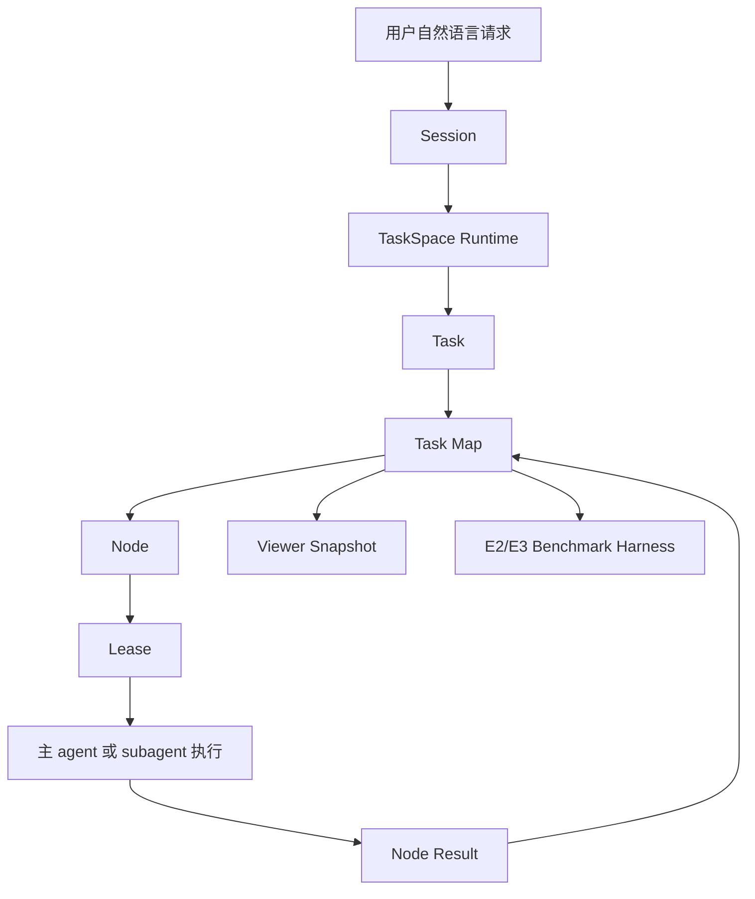
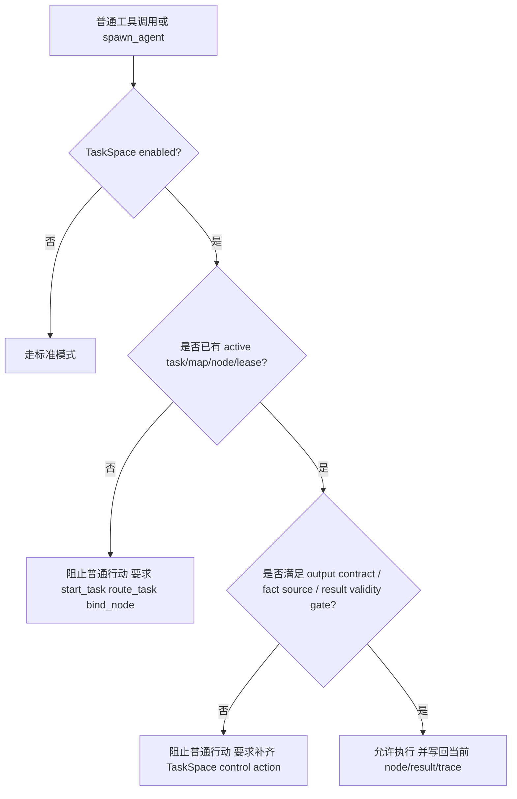
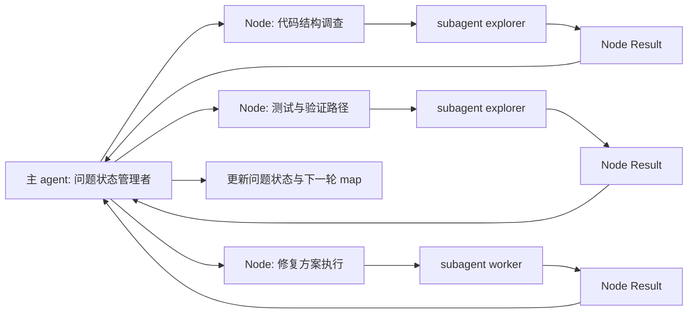
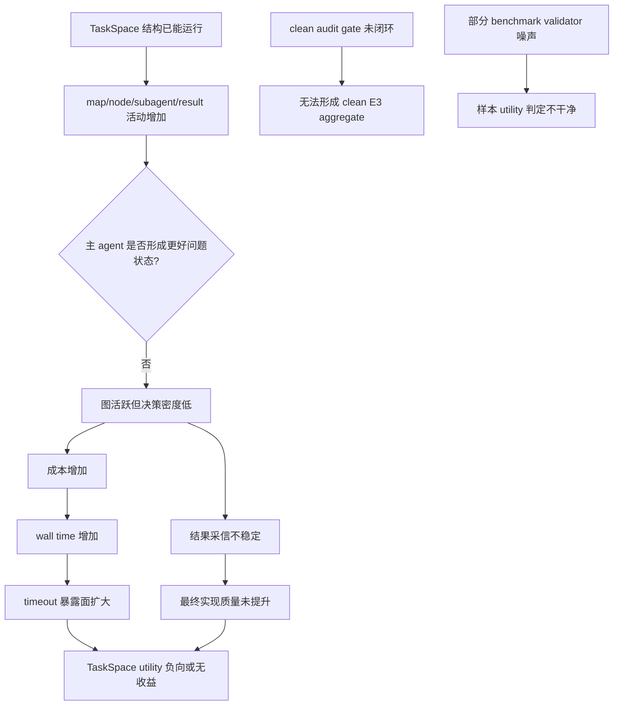

# TaskSpace 0.0.3 架构与问题总结

日期：2026-06-11

## 摘要

TaskSpace 0.0.3 的价值在于证明：TaskSpace 已经不是纯 prompt 或演示机制，而是可以在真实 Whale 执行路径中运行的 runtime。它已经具备 task/map/node/lease/result 建模、主 agent 绑定、subagent 节点 lease、viewer snapshot、E3 benchmark harness、Docker validator cleanup 证据链等基础能力。

但 0.0.3 E3 也明确说明：当前 TaskSpace 还没有证明 utility 正收益。它能稳定“运行”，但没有稳定“更好地解决问题”。当前主要矛盾已经从工程可运行性转移到 TaskSpace 行为质量：map/node/subagent 活动没有稳定转化为更高成功率、更低幻觉、更强问题状态管理。

结论可以压缩成一句话：

```text
0.0.3 证明 TaskSpace 能跑，并修复了 E3 cleanup blocker；
但没有证明 TaskSpace 让 agent 跑得更好。
```

## 背景与定位

TaskSpace 的产品定位来自 [2026-05-22-taskspace-runtime-design.md](./2026-05-22-taskspace-runtime-design.md)：

```text
Session = 用户对话空间
TaskSpace = session 内的任务空间 runtime
Task = 一个持续跟进的主题任务
Task Map = task 内部的行动图
Node = task map 内的可执行工作单元
```

用户不应该直接理解 map/node/lease。用户只看到任务空间：

- `/taskspace`：进入任务空间模式。
- `/task-show`：查看任务空间 viewer。
- `/task-reborn`：让当前 task 在同一目标下换一条执行路径。

内部目标是给 coding agent 增加一个轻量、有状态、可约束的 task 层，使 agent 不再完全依赖线性对话历史解决中高复杂度工程问题。

## 0.0.3 已实现的核心设计

### 总体架构



核心约束：

- 进入 TaskSpace 后，普通工具调用、代码修改、subagent spawn 都必须绑定到合法的 `Task -> Map -> Node -> Lease`。
- runtime 不做语义路由，不根据关键词选择 task，不判断任务质量。
- task routing、map 初始化、node 选择和结果采信由主 agent 完成。
- runtime 负责结构化协议校验、状态推进、lease 互斥、result 归档、rollout replay、viewer snapshot。
- subagent 不是长期角色实体，而是绑定某个 node 的临时执行者；完成后结果写回 node。

### 数据模型

当前真实代码落点主要在：

- `third_party/codex-cli/codex-rs/core/src/action_map/map.rs`
- `third_party/codex-cli/codex-rs/core/src/action_map/runtime.rs`
- `third_party/codex-cli/codex-rs/tools/src/taskspace_tool.rs`
- `third_party/codex-cli/codex-rs/core/src/tools/handlers/taskspace_control.rs`

核心模型：

| 模型 | 当前职责 |
|---|---|
| `TaskState` | 持有 task id、title、objective、status、owner session、active map、map ids、cognitive state |
| `ActionMapInstance` | 持有 map id、task id、status、nodes、edges、leases、results |
| `MapNode` | 持有 node id、title、kind、status、context、active lease、result refs、origin node |
| `AssignmentLease` | 表示主 agent 或 subagent 对某个 node 的临时持有权 |
| `NodeResult` | 记录某次 node 执行结果、action class、tool success、body、evidence package、source thread |
| `TaskSpaceTraceEvent` | append-only 观察事件，用于审计和 viewer，不是权威语义状态 |

当前状态集合：

| 层级 | 状态 |
|---|---|
| Task | `active`、`pending` |
| Map | `active`、`completed`、`abandoned` |
| Node | `pending`、`ready`、`running`、`blocked`、`completed` |

注意：早期设计中曾讨论把 node 终态命名为 `Closed`。当前代码里仍是 `Completed`，但语义上是“本次工作包已经沉淀结果，不应继续覆盖写入”。

### taskspace_control 工具协议

0.0.3 的 `taskspace_control` 已经从早期 map/node 控制扩展到问题状态管理雏形。工具动作包括：

| Action | 用途 |
|---|---|
| `start_task` | 创建新语义 task、active map 和首个 concrete node |
| `route_task` | 主 agent 从 task inventory 中选择已有 task，runtime 只校验 id |
| `create_node` | 在当前 active task path 中创建 concrete node |
| `bind_node` | 让主 agent 绑定一个可执行 node |
| `finish_node` | 写入当前 main node 的结果，并可绑定或创建下一个 node |
| `block_node` | 写入 blocker，让 node 停止推进 |
| `record_output_contract` | 记录输出契约 |
| `record_fact_source` | 记录事实来源 |
| `record_fact` | 记录 active facts |
| `mark_result_validity` | 对 node/result 做 accepted/questioned/invalid 标记 |

工具描述中已经明确主 agent 的角色：

```text
The main agent is the TaskSpace problem-state and model manager.
```

这意味着 0.0.3 的设计方向已经从“planner”推进到“问题状态与模型管理者”。主 agent 不是亲自做所有战场动作，而是负责维护问题模型、派发节点、采信或质疑结果、更新 task map。

### Runtime gate

0.0.3 的 runtime gate 目标是阻止 agent 退回普通线性执行：



这个 gate 的正确边界是：

- runtime 只校验结构协议是否满足；
- runtime 不判断 task 应该选哪个；
- runtime 不判断 result 是否真实有价值；
- result validity 由主 agent 显式标记，runtime 负责让这个标记可追踪、可审计、可阻断后续错误引用。

### subagent 与 node 的关系

0.0.3 延续此前设计：

- 一个 node 同时只能有一个 active lease。
- subagent spawn 必须绑定 node lease。
- subagent 结果写回 node 的 result context。
- 主 agent 可以从 node result 中读取结果，但不应盲信；它需要决定 accepted/questioned/invalid。

理想协作模型：



### 观测与测试基建

0.0.3 已经建立了较完整的 TaskSpace 评估链路：

- TaskSpace viewer：通过 `/task-show` 查看 task/map/node/result/lease。
- E2/E3 harness：真实 Whale 执行、paired standard/taskspace 对比、外部 validator。
- Terminal-Bench adapter：materialize 原始样本，隔离 validator source。
- Remote asset preflight：未证明等价的外部资产 fail-closed。
- Docker validator cleanup：记录 runtime manifest、label、proof nonce、cleanup artifact。
- E3 run index 与 version registry：用版本号记录每轮样本范围和结果。

0.0.3 关联记录：

- [2026-06-08-taskspace-0.0.3-harness-cleanup-smoke.md](../testing/2026-06-08-taskspace-0.0.3-harness-cleanup-smoke.md)
- [2026-06-09-taskspace-0.0.3-p0-e3-run.md](../testing/2026-06-09-taskspace-0.0.3-p0-e3-run.md)
- [taskspace-version-registry.md](../testing/taskspace-version-registry.md)

## 0.0.3 E3 实测结果

0.0.3 的 P0 E3 run root：

```text
D:\whalecode-alpha\target\bench004-20260608-202551
```

样本范围：

| Sample | Planned pairs | Completed pairs | 备注 |
|---|---:|---:|---|
| `processing-pipeline` | 5 | 5 | 完整执行 |
| `multi-source-data-merger` | 5 | 5 | 完整执行，但 validator timeout 噪声重 |
| `recover-accuracy-log` | 5 | 5 | 完整执行，暴露负向信号 |
| `query-optimize` | 5 | 0 | 因 HuggingFace `oewn.sqlite` 未证明等价被 fail-closed |

诊断性结果：

| 方向 | 数量 |
|---|---:|
| TaskSpace better | 0 |
| Standard better | 3 |
| Both success | 5 |
| Both failed | 7 |

按样本：

| Sample | Standard success | TaskSpace success | 判断 |
|---|---:|---:|---|
| `processing-pipeline` | 3/5 | 2/5 | TaskSpace 没有提升，且成本更高 |
| `multi-source-data-merger` | 0/5 | 0/5 | 双方都 timeout，当前不适合作 utility 主证据 |
| `recover-accuracy-log` | 5/5 | 3/5 | 最清晰负向信号，TaskSpace 两次 public validation timeout |

成本与图行为：

| Sample | Standard wall time | TaskSpace wall time | TaskSpace extra | Nodes | Edges | Subagent spawns | Results |
|---|---:|---:|---:|---:|---:|---:|---:|
| `processing-pipeline` | 1804.7s | 2810.2s | +1005.5s | 59 | 103 | 16 | 118 |
| `multi-source-data-merger` | 400.4s | 2043.9s | +1643.5s | 56 | 60 | 5 | 35 |
| `recover-accuracy-log` | 618.3s | 1915.5s | +1297.2s | 46 | 43 | 5 | 20 |

clean E3 结论：

```text
valid_utility_pairs = 0
```

原因是 artifact audit review gate 仍未完成。当前能做的是诊断性分析，不能宣称 clean E3 utility 通过。

## 已缓解的问题

### Docker cleanup blocker 已修复

0.0.2 暴露过 validator 容器残留并阻塞 driver。0.0.3 的 cleanup smoke 和 P0 E3 run 都没有复现：

- run 后无 `whale.taskspace.terminal_bench=true` 残留容器。
- cleanup artifact 均为 `ok`。
- validator timeout 后仍能按 runtime manifest + label + proof nonce 精确清理。

这说明 0.0.3 的 E3 执行环境可控性比 0.0.2 明显提升。

### Remote asset fail-closed 稳定

`query-optimize` 依赖 HuggingFace `oewn.sqlite`。0.0.3 继续在 preflight 阶段阻止该样本进入 agent execution：

```text
environment_remote_asset_unavailable
remote_asset_equivalence_unproven
```

这是正确行为。它避免把外部网络资产不可控问题混入 agent utility 结论。

### TaskSpace 结构路径真实发生

0.0.3 不只是模拟或 mock。E3 中 TaskSpace 真实发生了：

- map/node 创建；
- subagent spawn；
- node result 写回；
- public validator；
- paired standard/taskspace 对照；
- metrics 与 aggregate report。

因此 0.0.3 暴露的问题是有效问题，不是测试工具空转。

## 当前核心问题

### 1. TaskSpace 没有产生 utility 正收益

0.0.3 的 15 个实际执行 pair 中：

- TaskSpace better = 0；
- Standard better = 3；
- both success = 5；
- both failed = 7。

这说明 TaskSpace 没有证明提高成功率。

直接原因：

- 当前 map/node/subagent 活动没有稳定转化为更好的最终实现。
- 主 agent 虽然被要求维护 task map，但还没有稳定进入“问题状态管理者”工作模式。
- result 被记录了，但未充分变成“下一轮决策依据”。

深层原因：

```text
TaskSpace 当前更像结构化执行轨道；
还不够像问题状态模型。
```

### 2. 图活跃度高，但决策密度低

`processing-pipeline` 是最典型信号：

- 59 nodes；
- 103 edges；
- 16 subagent spawns；
- 118 results；
- TaskSpace 成功率 2/5，低于 Standard 3/5。

这说明 TaskSpace 不是没动，而是动得很多但没有明显收益。

原因判断：

- node 可能仍偏碎，或者被当成工作流水线而不是高内聚主题任务。
- edge 数量增加没有变成更强依赖判断。
- subagent result 数量增加没有变成更可靠的主 agent 决策。
- 主 agent 对 result 的采信、质疑、合并、废弃还不够强。

问题不是“图不够大”，而是“图没有足够解释力和收敛力”。

### 3. TaskSpace 成本明显偏高

三个执行样本中 TaskSpace 都比 Standard 慢很多：

- `processing-pipeline`: +1005.5s
- `multi-source-data-merger`: +1643.5s
- `recover-accuracy-log`: +1297.2s

直接原因：

- TaskSpace 有 map 初始化、routing、node/lease/result 维护成本。
- subagent 调度和等待增加 wall time。
- public validator 在某些样本中重复暴露环境成本。

深层原因：

- 当前 TaskSpace 没有足够强的“成本换收益”机制。
- graph activity 没有稳定减少主 agent 重读、误判或返工。
- 没有足够有效的 pruning / merge / stop strategy。

### 4. TaskSpace 更容易触发 timeout 或验证失败

`recover-accuracy-log`：

- Standard 5/5；
- TaskSpace 3/5；
- 两个 TaskSpace pair public validation timeout。

原因判断：

- TaskSpace 的额外执行路径增加了总耗时和验证暴露面。
- 任务本身 Standard 能稳定完成，TaskSpace 的额外结构反而可能制造偏离。
- 对这类任务，当前 TaskSpace 没能快速识别“直接执行足够好”，也没有把 map 控制在低成本模式。

这不是说 TaskSpace 不适合所有简单任务，而是说明 0.0.3 当前缺少“低摩擦运行”的能力。

### 5. Node 粒度与生命周期仍不稳定

此前我们已确立：node 应该是高内聚主题任务，而不是所有非原子动作都拆开。0.0.3 的 E3 表明这个约束还没有稳定生效。

表现：

- nodes/edges/results 规模偏大；
- result 膨胀后主 agent 不一定更会用；
- follow-up node 与原 node 的边界可能过细；
- finish/block/bind 让结构合法，但不保证语义良好。

原因：

- runtime 只能做结构约束，不能判断 node 是否“好”。
- prompt 层对 node 粒度的方法论仍不足以稳定约束模型行为。
- 缺少图收敛指标和维护动作，例如 merge、prune、collapse、reborn 后的事实迁移策略。

### 6. Result 记录不等于结果采信

0.0.3 已经有 result context、evidence package、result validity 方向，但 E3 说明主 agent 仍没有稳定把 result 转换成可靠决策。

当前风险：

- subagent 返回很多结果，但主 agent 没有充分做验证与合并。
- result body 可能只是摘要，不足以驱动下一步。
- accepted/questioned/invalid 机制存在方向，但还没有成为实际收益。

本质问题：

```text
记录上下文 != 管理问题状态
写回 result != 提升决策质量
```

### 7. Clean E3 audit gate 仍未闭环

0.0.3 的 diagnostic 数据可以分析，但 clean E3 仍是 0 utility pairs。

原因：

- E3 harness 需要 artifact audit review 后才能进入 utility aggregate。
- 当前 audit review 自动化和 validator proof 聚合还不足。
- 因此版本对比仍依赖人工解释 metrics，不能完全机械给出 clean utility 判断。

这会影响后续迭代判断：即使未来某轮出现 TaskSpace better，如果 audit gate 不闭环，也无法形成严格产品证据。

### 8. Benchmark 样本噪声仍需治理

`multi-source-data-merger` 双方 0/5，public validation 都是 124 timeout。

原因可能是：

- validator 运行成本过高；
- 环境依赖噪声；
- 样本本身不适合当前 timeout 预算；
- 或任务对两种模式都太难，无法区分 TaskSpace 效用。

这类样本可以保留为压力测试，但不应作为 utility 主证据。

## 问题因果图



## 当前设计的优点

尽管 utility 未通过，0.0.3 有几个明确优点：

1. 复用了 Codex/Whale 现有 session、tool dispatch、spawn_agent、rollout、viewer、protocol 基建，没有另造一套孤立系统。
2. runtime 与 agent 职责边界相对清楚：runtime 管结构，agent 管语义。
3. task/map/node/lease/result 已经形成可回放、可观测、可测试的状态结构。
4. E3 harness 已能暴露真实负收益，而不是只给 demo 成功案例。
5. Docker cleanup 和 remote asset fail-closed 证明测试基建开始具备工程可信度。

这些是下一轮继续迭代的基础。

## 当前设计的不足

### 架构层不足

- TaskSpace 还没有把“问题状态”变成足够强的 runtime contract。
- 当前约束更偏执行绑定，而不是决策质量约束。
- map/node 增长缺少强收敛机制。
- result validity 还没有形成完整的下游引用阻断链。

### Prompt/行为层不足

- 主 agent 的指挥官/问题状态管理者行为不稳定。
- node 粒度方法论不足。
- subagent 委派边界不够稳定，容易变成成本放大。
- result 回收后缺少稳定的合并、质疑、剪枝动作。

### 测试层不足

- clean E3 audit gate 未闭环。
- 部分样本 validator timeout 噪声过大。
- benchmark 仍需要分层：机制烟测、构造回归、utility 对照、真实复杂任务。
- 需要区分工程环境失败、validator 失败、agent 失败、TaskSpace 行为失败。

## 下一阶段建议

### P0：先修行为质量，不再优先扩 cleanup

0.0.3 已经证明 cleanup blocker 缓解。下一步不应继续优先修 Docker cleanup，除非新 run 再复现残留。

P0 应集中在：

- 主 agent 问题状态管理协议；
- node 粒度与 map 收敛；
- result validity 与 evidence 引用；
- audit gate 闭环。

### P1：把 TaskSpace 从执行图升级为问题状态模型

需要明确 TaskSpace 每轮至少维护：

- 当前任务目标；
- success criteria；
- 已知事实；
- 未验证假设；
- 开放问题；
- 已采信结果；
- 被质疑结果；
- 当前 blocker；
- 下一步最小高价值行动。

这些内容不能只藏在 result body 里，必须进入可观测、可审计、可压缩恢复的结构。

### P2：控制图生长

应增加维护动作和指标：

- node merge；
- node prune；
- result collapse；
- stale branch abandoned；
- high-cost warning；
- reborn 事实迁移；
- graph health budget。

但这些动作要谨慎实现，避免重新过度设计。第一步可以先做 report-only 指标，确认哪些信号真实有用。

### P3：完善 clean E3

必须完成 artifact audit review 自动化或半自动化流程，让 E3 能输出 clean utility aggregate。

最小目标：

- 每个 pair 有固定 audit template；
- audit 能机械读取 validator、diff、changed files、TaskSpace graph、result validity；
- aggregate 能区分 included / excluded / environment failure / manual pending；
- 版本 registry 不再只依赖人工诊断性结论。

### P4：重新治理 benchmark 样本

建议对 P0 样本分层：

| 样本类型 | 用途 |
|---|---|
| validator 稳定、标准能过、复杂度中等 | utility 主证据 |
| 双方都常 timeout | 压力测试，不作 utility 主证据 |
| remote asset 未证明 | fail-closed 机制测试 |
| 标准极易完成的小任务 | TaskSpace 低摩擦回归 |

## 0.0.4 版本目标建议

如果后续定义 0.0.4，建议目标不要写成“提高所有 benchmark 成功率”，而是更具体：

```text
0.0.4 目标：
在不破坏 0.0.3 cleanup 和 fail-closed 基线的前提下，
让 TaskSpace 的问题状态管理可观测、可审计、可压缩恢复，
并在至少一个 validator 稳定的中等复杂样本中减少无效图增长。
```

验收建议：

- Docker cleanup 仍无残留。
- Remote asset fail-closed 仍生效。
- clean audit gate 至少能让部分 eligible pair 进入 aggregate。
- TaskSpace graph health 报告能说明为什么创建这些 node、为什么采信这些 result。
- 至少一个样本中 TaskSpace nodes/results 不再膨胀但成功率不下降。

## 附：0.0.3 结论表

| 维度 | 结论 |
|---|---|
| 工程可运行性 | 通过 |
| Docker cleanup | 已改善 |
| Remote asset fail-closed | 稳定 |
| TaskSpace utility | 未通过 |
| clean E3 | 未通过 |
| 图收敛 | 未通过 |
| 成本控制 | 未通过 |
| 问题状态管理 | 方向正确，但机制不够强 |

最终判断：

```text
0.0.3 是 TaskSpace 工程基建可运行版本，
不是 TaskSpace utility 可信版本。
下一步应围绕问题状态管理和图收敛做 0.0.4，
而不是继续扩大 benchmark 或堆更多 subagent。
```
