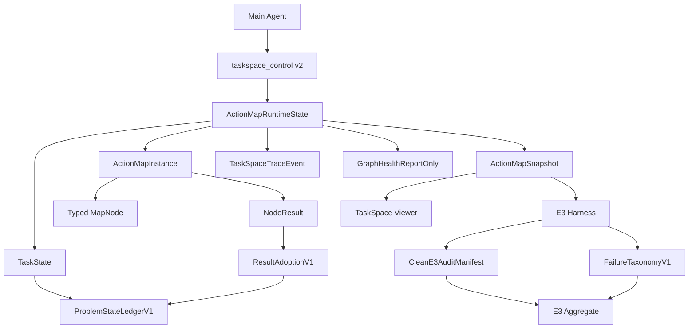

# TaskSpace 0.0.4 工程化实施设计

- Created: 2026-06-11
- Updated: 2026-06-11
- Version: 0.1
- Status: Draft
- Owner / Responsible: WhaleCode core
- Related Systems: TaskSpace runtime, action_map, taskspace_control, TaskSpace viewer, E3 benchmark harness
- Related Links:
  - `docs/plans/taskspace_0_0_4_design_docs/README.md`
  - `docs/plans/taskspace_0_0_4_design_docs/00-design-overview.md`
  - `docs/plans/taskspace_0_0_4_design_docs/13-migration-and-implementation-plan.md`
  - `docs/plans/taskspace_0_0_4_design_docs/14-issue-backlog.md`
  - `docs/plans/2026-06-11-taskspace-0.0.3-architecture-and-issues.md`
- Risk Level: High
- Plan Type: Full

## 1. 背景

TaskSpace 0.0.3 已经证明了机制可跑通，但 E3 暴露出核心负收益：TaskSpace 有时把主 agent 从解决问题拉向维护结构，graph 增长不一定对应问题状态收敛，subagent 结果和节点结果没有稳定进入决策，benchmark aggregate 也不足以支撑 clean utility 结论。

0.0.4 设计包的定位不是继续强化“planner”，而是把 TaskSpace 升级为“问题状态与模型管理”runtime：主 agent 负责语义判断和问题模型，runtime 负责结构合法性、状态持久化、证据引用、审计与可观测性。

## 2. 问题定义

### 2.1 当前行为

- `TaskState` 持有 `TaskCognitiveState`，但该状态偏向松散的 success criteria / facts / output contracts。
- `NodeResultEvidencePackage` 已有 claims、evidence refs、changed artifacts、validator refs、remaining uncertainty、validity，但缺少 adoption 链路，难以证明结果是否进入 fact / hypothesis / decision / criterion。
- `taskspace_control` 已支持 start/route/create/bind/finish/block、record_output_contract、record_fact_source、record_fact、mark_result_validity，但 action 仍偏执行结构，不足以维护完整问题状态。
- runtime 已有 routing/bootstrap/main binding/cognitive preflight/result reviewed/final answer gate，但 gate 的重点仍是“有没有结构”和“有没有 reviewed result”，不是“是否形成可恢复的问题模型”。
- E3 harness 已有 pair report、audit-review、oracle isolation、validator proof、metrics extraction，但 aggregate 仍缺少完整 pair index、failure taxonomy、graph-health 和 clean audit manifest。

### 2.2 期望行为

- 每个 TaskSpace task 都有可恢复的 `ProblemStateLedger`，能回答目标、成功标准、已知事实、开放问题、假设、决策、风险和下一步动作。
- 每个重要结果必须被显式采信、质疑或否定；被采信的结果必须进入 ledger 对象或决策依赖。
- graph health 不阻塞 agent，但能稳定揭示 node 过度碎片化、结果未采信、决策密度低、subagent ROI 低等劣化信号。
- E3 输出能支撑人类复核：每个 pair 的 included / excluded / inconclusive 有清晰依据，失败有分类，关键 artifact 有索引。
- 0.0.3 trace 可读但不迁移；0.0.4 新数据结构通过 version 字段明确兼容边界。

## 3. 目标

1. 以现有 `action_map` runtime 为底座，引入 `ProblemStateLedgerV1`，不新建并行 TaskSpace 存储系统。
2. 扩展 `taskspace_control` 为 v2 action set，保留 v1 action 兼容。
3. 引入 `ResultAdoptionV1`，把 result validity 从“已审查”升级为“是否进入问题模型或决策”。
4. 引入 `GraphHealthReportOnly`，先报告不阻塞。
5. 引入 `CleanE3AuditManifest` 和 `FailureTaxonomyV1`，修正 E3 证据链。
6. 将 hard gate 限定在高确定性结构错误：缺成功标准、final synthesis 前未关闭 blocking open question、invalid/questioned-only result 支撑最终决策、validate node 无验证证据。
7. 保持 TaskSpace 对用户不可见：用户不需要理解 task/map/node/subagent；viewer 是可观测调试面，不是用户操作前置条件。

## 4. 非目标

- 不做自动语义任务路由。runtime 只暴露 task inventory 和结构约束，语义选择仍由主 agent 完成。
- 不做 graph 自动 prune/merge 的 hard mutation。0.0.4 只报告 graph health，必要时提示主 agent 或后续版本处理。
- 不扩展复杂 subagent 角色体系。继续复用 default / explorer / worker。
- 不做 TaskSpace 默认启用策略最终决策。0.0.4 只产出可支持该决策的数据。
- 不把 benchmark 扩展当作 0.0.4 P0。先让现有 E3 证据干净。

## 5. 约束与假设

| Constraint / Assumption | Verification Method | If Assumption Fails |
|---|---|---|
| 复用现有 `ActionMapRuntimeState`、`TaskState`、`ActionMapSnapshot`，不新建第二套 runtime | Phase 0 code mapping review | 拆分为 adapter 层，但仍以现有 runtime 为写入源 |
| v1 snapshot 和 trace 必须继续可读 | protocol serde tests | viewer 标记 legacy，不向旧 trace 写回新字段 |
| 0.0.4 首轮以 report-only 优先 | feature flags and tests | 任何 hard gate 都必须单独开关并有回归测试 |
| E3 harness 继续使用 PowerShell 脚本 | harness test run | 只新增 lib 脚本和 manifest，不替换 runner |
| 单代码文件尽量不超过 500 行 | file length check in review | 新逻辑拆分模块，例如 `ledger.rs`、`graph_health.rs`、`audit_manifest.ps1` |

## 6. 当前代码事实

| Area | Current Entry | Existing Capability | 0.0.4 Engineering Use |
|---|---|---|---|
| Runtime state | `third_party/codex-cli/codex-rs/core/src/action_map/runtime.rs` | mode, routing/bootstrap, task/map/node/lease/result, trace, sentinel, gates | 增加 ledger mutation、adoption、graph health snapshot hooks |
| Core model | `third_party/codex-cli/codex-rs/core/src/action_map/map.rs` | `TaskState`, `ActionMapInstance`, `MapNode`, `NodeResult`, `TaskSpaceTraceEvent` | 扩展 schema version、ledger、result adoption refs |
| Cognitive model | `third_party/codex-cli/codex-rs/core/src/action_map/cognitive.rs` | `TaskCognitiveState`, `EvidenceRef`, `OutputContract`, `FactSource`, `NodeResultEvidencePackage`, `ResultValidity` | 演进为 ProblemStateLedger，避免丢弃已有字段 |
| Node contracts | `third_party/codex-cli/codex-rs/core/src/action_map/contracts.rs` | kind -> allowed action classes, tool-result budget | 引入 typed node finish requirements 和 report-only health metrics |
| Tool handler | `third_party/codex-cli/codex-rs/core/src/tools/handlers/taskspace_control.rs` | v1 action deserialize and dispatch | 增加 v2 action variants，保留 v1 |
| Tool schema | `third_party/codex-cli/codex-rs/tools/src/taskspace_tool.rs` | model-visible schema | 暴露 v2 fields/actions，明确 required/optional |
| Protocol snapshot | `third_party/codex-cli/codex-rs/protocol/src/protocol.rs` | `ActionMapSnapshot*` serde structs | 增加 optional ledger/adoption/health fields with default |
| Viewer | `third_party/codex-cli/codex-rs/tui/src/app/action_map_viewer.rs` | local HTTP server, live `/snapshot.json`, graph UI | 增加 ledger、adoption、health、audit readiness panels |
| Benchmark harness | `scripts/taskspace-benchmark/*.ps1` and `lib/*.ps1` | pair report, audit review, metrics, oracle, external benchmark | 增加 audit manifest、failure taxonomy、graph-health parser、aggregate JSON |

## 7. 目标架构



设计要点：

- `ProblemStateLedgerV1` 是 `TaskState` 的一部分，不从 viewer 或 trace 后处理生成。
- `ResultAdoptionV1` 归属 `NodeResultEvidencePackage` 或独立 result adoption index，但必须通过 snapshot 暴露。
- `GraphHealthReportOnly` 可由 runtime snapshot 派生，也可由 harness 从 snapshot/trace 派生；第一阶段优先 harness 派生，降低 agent 行为风险。
- `CleanE3AuditManifest` 属于 benchmark artifact，不进入 runtime。

## 8. 数据模型设计

### 8.1 ProblemStateLedgerV1

建议新增 `third_party/codex-cli/codex-rs/core/src/action_map/ledger.rs`，并由 `TaskState` 持有：

```text
ProblemStateLedger {
  objective,
  success_criteria[],
  known_facts[],
  open_questions[],
  hypotheses[],
  decisions[],
  risks[],
  blockers[],
  next_best_action,
  updated_at_ms
}
```

与 0.0.3 字段映射：

| 0.0.3 Field | 0.0.4 Field | Migration |
|---|---|---|
| `TaskState.objective` | `ProblemStateLedger.objective` | 新 task 双写；旧 snapshot 只读 legacy |
| `TaskCognitiveState.success_criteria: Vec<String>` | structured `success_criteria[]` | v1 字符串在 viewer 标为 legacy criterion |
| `output_contracts` | `success_criteria` or `known_facts` evidence | 保留原字段，新增 structured criteria |
| `facts` | `known_facts` | v2 action 写 ledger；v1 action 兼容写旧 facts |
| `assumptions` | `hypotheses` | v2 action 显式写 hypothesis |
| `risk_notes` | `risks` | v2 action structured risk |

### 8.2 ResultAdoptionV1

建议在 `NodeResultEvidencePackage` 上增加：

```text
adoption_state: unadopted | accepted_adopted | questioned | invalid | legacy
adopted_by:
  facts[]
  hypotheses[]
  decisions[]
  criteria[]
  validations[]
adoption_reason
adopted_at_ms
```

核心约束：

- `accepted` 不等于 `accepted_adopted`。前者表示主 agent 认为 result 可用，后者表示 result 已进入问题模型或决策链。
- final synthesis 不允许只依赖 `unadopted`、`questioned`、`invalid` result。
- patch/design/validation decision 必须引用 result/fact/hypothesis/criterion 中至少一种。

### 8.3 Typed Node Contract V1

0.0.4 设计文档建议的 canonical kind 是 discover/diagnose/design/patch/validate/synthesize；当前代码已有：

```text
inspect_code_context
implement_solution
smoke_test
regression_test
final_synthesis
custom
```

工程上不应立即大规模重命名，因为现有 prompts、contracts、tests、viewer、E2/E3 都依赖当前 kind。建议：

| 0.0.4 Concept | Runtime Kind 0.0.4 MVP | Notes |
|---|---|---|
| discover / diagnose / design | `inspect_code_context` + `node_purpose` | 先新增 purpose，不破坏 kind gate |
| patch | `implement_solution` | 保持现有 edit gate |
| validate | `smoke_test` / `regression_test` | 保持 validator evidence gate |
| synthesize | `final_synthesis` | 保持 answer-only gate |

后续如果要重命名 kind，应另开 migration PR。

### 8.4 GraphHealthReportOnly

建议新增 report shape：

```text
graph_health_version
task_id
map_id
node_count
edge_count
result_count
decision_count
result_adoption_rate
unreviewed_result_ratio
blocked_node_ratio
open_leaf_node_count
decision_density
subagent_spawn_count
subagent_decision_yield
node_overfragmentation_warning
thin_mode_violation
warnings[]
generated_at_ms
```

0.0.4 P0 中该报告只影响 viewer/harness，不阻断 agent。

## 9. taskspace_control v2 设计

### 9.1 Action Set

保留 v1：

```text
start_task
route_task
create_node
bind_node
finish_node
block_node
record_output_contract
record_fact_source
record_fact
mark_result_validity
```

新增 v2：

```text
record_success_criteria
record_open_question
close_open_question
record_hypothesis
update_hypothesis
record_decision
record_risk
record_next_best_action
adopt_result
record_subagent_plan
classify_failure
```

### 9.2 Handler Strategy

- `TaskSpaceControlArgs` 增加 v2 variants。
- 每个 action 只做结构校验、引用校验和 runtime state mutation，不判断语义正确性。
- v1 action 继续可用，并在内部向 ledger 做弱映射，避免旧 prompt 立即失效。
- tool schema 中明确 action required fields，错误消息必须告诉 agent “缺什么”和“如何补”。

### 9.3 Trace Events

新增或规范化 trace kind：

```text
task_started
task_routed
ledger_success_criteria_recorded
ledger_open_question_recorded
ledger_open_question_closed
ledger_hypothesis_recorded
ledger_hypothesis_updated
ledger_decision_recorded
ledger_risk_recorded
ledger_next_best_action_recorded
result_validity_marked
result_adopted
graph_health_reported
failure_classified
```

## 10. Runtime Gate 设计

### 10.1 现有 Gate 保留

- TaskSpace mode 下 ordinary tool / spawn 前必须完成 task routing / bootstrap。
- ordinary tool 前必须有 active map/node/main lease。
- ordinary tool / spawn 前必须通过 cognitive preflight。
- unreviewed lifecycle result 阻止后续 ordinary work / spawn。
- final answer 隐藏 TaskSpace 内部术语。
- final synthesis 需要 validation after edit。
- subagent tool call 必须绑定 active lease。

### 10.2 0.0.4 新 Gate

| Gate | Initial Mode | Trigger | Blocking Rule |
|---|---|---|---|
| success criteria required | hard | ordinary tool / spawn before criteria | active task 缺 success criteria 阻止 |
| blocking open question | hard for final | final_synthesis / final answer | blocking open question 未关闭或未 defer 阻止 |
| invalid result dependency | hard | record_decision / adopt_result / final | invalid result 不得进入 accepted decision/final |
| questioned-only patch support | hard for patch decision | record_decision(decision_kind=patch) | patch decision 不能只靠 questioned result |
| validate evidence required | hard | finish validate node as accepted | validator_refs 或 validator evidence_refs 必须存在 |
| graph health degradation | report-only | snapshot / harness | 只输出 warning，不阻止 |
| thin mode violation | report-only | graph health | 只记录，不自动降级 |

### 10.3 Feature Flags

建议沿用设计包中的 flags，集中从 config 读取：

```text
taskspace.problem_ledger.enabled
taskspace.schema_v2.enabled
taskspace.gate.final_synthesis.enabled
taskspace.gate.invalid_result.enabled
taskspace.graph_health.enabled
taskspace.audit_manifest.enabled
taskspace.thin_mode.report_only
```

所有 hard gate 均需单测覆盖 enabled/disabled。

## 11. Benchmark 与 Audit 设计

### 11.0 Hard Clean Execution Contract

E3 scoring contract is hard, not advisory:

- Allowed agent outcomes are only `solved`, `wrong`, and `agent_exec_timeout`.
- `agent_exec_timeout` is the only allowed abnormal outcome, and it means the agent exceeded the configured solve budget.
- Docker/WSL/container failure, validator timeout/crash, source/materialization/path/cache/disk/proof/report/parser/lifecycle-marker failure, or missing audit artifact is `engineering_unclean`.
- `public_validation_timeout` is validator infrastructure failure, not `agent_exec_timeout`.
- Any `engineering_unclean` in a comparable E3 run sets `score_valid=false`; reports may keep diagnostic counts, but must not emit score, better/worse, or version utility conclusions.

### 11.1 CleanE3AuditManifest

每个 pair 输出 `audit.yaml` 或 `audit.json`，最少包含：

```text
pair_id
sample_name
standard_run_id
taskspace_run_id
planned
completed
standard_status
taskspace_status
standard_success
taskspace_success
standard_walltime
taskspace_walltime
timeout_budget
validator_command
validator_exit_code
included_in_utility
run_score_valid
engineering_unclean
outcome_standard
outcome_taskspace
exclusion_reason
failure_classification[]
artifact_audit_status
artifact_paths{}
artifact_hashes{}
human_review{}
```

### 11.2 FailureTaxonomyV1

P0 enum：

```text
agent_patch_wrong
agent_no_patch
agent_validation_loop
agent_exec_timeout
subagent_noise_or_unused
node_overfragmentation
result_not_synthesized
validator_slow_or_flaky
environment_noise
engineering_unclean
remote_asset_unavailable
remote_asset_equivalence_unproven
audit_unclean
unknown
```

Classifier 初期可以基于 artifact 和 metrics 做 deterministic best-effort；分类结果需要允许多个标签。

`validator_slow_or_flaky`、`environment_noise`、`engineering_unclean`、`remote_asset_unavailable`、`remote_asset_equivalence_unproven`、`audit_unclean` 和 `unknown` 都必须映射到 run-level `engineering_unclean`，除非它们发生在正式 agent 解题前的 fail-closed preflight 且该样本未进入 E3 scoring scope。

### 11.3 Aggregate

`Write-TaskspaceAggregateReport` 当前是占位输出。0.0.4 需要同时输出：

- `aggregate-report.md`
- `aggregate.json`
- `pair-index.csv` 或 `pair-index.json`
- `failure-taxonomy-summary.json`

`valid_utility_pairs` 只统计 audit clean 且未被 environment/harness blocker 污染的 pair。

aggregate 还必须输出：

- `score_valid`
- `score_invalid_reason`
- `engineering_unclean_count`
- `agent_exec_timeout_count`
- `clean_comparable_pair_count`

当 `score_valid=false` 时，Standard/TaskSpace pass counts 只能是 diagnostic raw counts；score、better/worse 和 0.0.4 vs 0.0.3 utility conclusion 必须为空或显式 invalid。

## 12. Viewer 设计

Viewer 当前已是 live localhost 页面，且 `/snapshot.json` 自动刷新。0.0.4 不应重写 viewer，只加面板：

1. Ledger panel：objective、criteria、open questions、hypotheses、decisions、risks、next best action。
2. Result adoption panel：unreviewed / accepted / adopted / questioned / invalid 统计与列表。
3. Graph health panel：warning、density、adoption rate、blocked/open leaf ratio。
4. Audit readiness panel：当前 snapshot 是否具备 E3 audit 基础字段。

刷新策略延续当前 polling，但 UI state 必须保持：

- 展开/收起状态按 stable id 保存。
- graph pan/zoom state 保存。
- 文本选区存在时暂停 DOM 重绘，避免复制 thread id 被打断。

## 13. 分阶段执行计划

### Phase 0: 代码与设计对齐

#### Objective
确认 0.0.4 设计包和现有实现之间的差异，锁定最小可复用路径。

#### Entry Criteria
已有 0.0.4 设计包；当前分支可编译或至少可读。

#### Entry Criteria Checks
| Entry Criterion | Check Method | Evidence / Output | Owner |
|---|---|---|---|
| 设计包完整 | `Get-ChildItem docs/plans/taskspace_0_0_4_design_docs` | file list | core |
| runtime 入口确认 | inspect action_map files | code mapping table | core |
| harness 入口确认 | inspect taskspace-benchmark scripts | code mapping table | core |

#### Design Approach
只做文档和 mapping，不写代码。

#### Implementation Tasks
- 对照 `13-migration-and-implementation-plan.md` 和 `14-issue-backlog.md`。
- 建立 TS-004 issue 到文件路径的映射。
- 明确不复用/不改动的边界。

#### Deliverables
- 本工程化实施设计文档。

#### Testing And Validation
| Validation Item | Method | Passing Standard |
|---|---|---|
| 文档可追溯 | review links and paths | 每个 P0 issue 有代码入口 |
| 无代码变更 | `git diff --stat` | 仅 docs |

#### Exit Criteria
工程方案可被拆成实现 PR。

#### Review Plan
文档评审；无需代码对抗审查。

#### Risks And Fallback
| Risk | Impact | Trigger Signal | Mitigation | Fallback |
|---|---|---|---|---|
| 设计包与代码事实不一致 | 后续实现返工 | 入口不存在或已有功能重复 | 以代码事实为准修正文档 | 增加 discovery issue |

#### Gate To Next Phase
用户确认开始实现，或直接执行 P0。

### Phase 1: Clean E3 Audit + Failure Taxonomy + Graph Health Report-Only

#### Objective
先修复证据链，让下一轮 E3 的结论可信，再改 agent 行为。

#### Entry Criteria
Phase 0 完成；现有 E3 harness 可运行小样本。

#### Entry Criteria Checks
| Entry Criterion | Check Method | Evidence / Output | Owner |
|---|---|---|---|
| pair artifact path stable | inspect latest E3 output | pair dir layout | core |
| metrics extractor 可读 snapshot | fixture test | parsed metrics object | core |

#### Design Approach
只改 benchmark/harness 和 snapshot 派生分析，不改 runtime gate。

#### Implementation Tasks
- 新增 `scripts/taskspace-benchmark/lib/audit-manifest.ps1`。
- 新增 `scripts/taskspace-benchmark/lib/failure-taxonomy.ps1`。
- 新增 `scripts/taskspace-benchmark/lib/graph-health.ps1`。
- 扩展 pair report 写 `audit.yaml/json`。
- 扩展 aggregate 写 `aggregate.json`、pair index 和 failure summary。

#### Deliverables
- 每个 pair 的 clean audit manifest。
- 每个 TaskSpace run 的 `graph-health.json`。
- aggregate 中可解释的 included/excluded/inconclusive。

#### Testing And Validation
| Validation Item | Method | Passing Standard |
|---|---|---|
| audit manifest fixture | PowerShell unit-style script | required P0 fields present |
| failure taxonomy fixture | deterministic sample artifacts | non-empty classification for failed pair |
| graph health fixture | synthetic graph snapshot | metrics match expected |
| E3 small smoke | 1 sample x 1 pair | artifacts generated without harness error |

#### Exit Criteria
E3 失败不再被报告成 clean utility；每个 pair 都有可复核 artifact index。

#### Review Plan
对 benchmark 脚本变更执行 subagent-vs-review。

#### Risks And Fallback
| Risk | Impact | Trigger Signal | Mitigation | Fallback |
|---|---|---|---|---|
| PowerShell 脚本膨胀 | 维护困难 | 单文件接近 500 行 | 拆分 lib | 暂缓非 P0 字段 |
| 分类误判 | 误导分析 | all unknown 或明显错分 | 多标签 + unknown 保留 | 人工 override |

#### Gate To Next Phase
小规模 E3 smoke 能生成完整 audit/health artifact。

### Phase 2: ProblemStateLedgerV1 + Schema Versioning

#### Objective
把问题状态升级为 first-class runtime state。

#### Entry Criteria
Phase 1 artifact 可用；runtime/protocol tests baseline 可运行。

#### Entry Criteria Checks
| Entry Criterion | Check Method | Evidence / Output | Owner |
|---|---|---|---|
| protocol serde baseline | cargo protocol tests | pass | core |
| runtime action baseline | action_map tests | pass | core |

#### Design Approach
新增 ledger module，扩展 snapshot optional fields。v1 cognitive state 保留，v2 ledger 并行存在但由同一 TaskState 持有。

#### Implementation Tasks
- 新增 `ledger.rs` 数据结构。
- `TaskState` 增加 `problem_ledger`。
- `ActionMapSnapshotTask` 增加 optional ledger field 和 `problem_state_ledger_version`。
- `start_task` 支持 `initial_success_criteria`，并初始化 ledger。
- v1 `record_output_contract` / `record_fact` 向 ledger 弱映射。
- 新增 v2 ledger actions。

#### Deliverables
- ledger 持久化、snapshot、restore。
- taskspace_control v2 最小 action。
- viewer 能显示 ledger basic。

#### Testing And Validation
| Validation Item | Method | Passing Standard |
|---|---|---|
| serde backward compatibility | old snapshot fixture | old snapshot deserializes |
| ledger creation | runtime unit test | start_task creates objective and criteria |
| ledger mutation | tool handler test | record_open_question / record_decision updates ledger |
| missing criteria gate | runtime unit test | ordinary tool blocked when enabled |

#### Exit Criteria
新 task 必有 ledger；旧 task 不崩溃且标 legacy。

#### Review Plan
subagent-vs-review 聚焦数据模型、serde 兼容和 gate 边界。

#### Risks And Fallback
| Risk | Impact | Trigger Signal | Mitigation | Fallback |
|---|---|---|---|---|
| snapshot breaking change | session restore 失败 | protocol tests fail | optional/default fields | feature flag off |
| ledger 与 old cognitive state 双写不一致 | viewer 混乱 | same facts different status | 明确 v2 优先、legacy 只读 | 只显示 ledger |

#### Gate To Next Phase
真实 `whale --taskspace` smoke 可创建带 ledger 的 task。

### Phase 3: ResultAdoptionV1 + Minimal Hard Gates

#### Objective
让 result 明确流向 fact/hypothesis/decision/criterion，解决“结果写了但没被用”的核心问题。

#### Entry Criteria
Phase 2 ledger 可用。

#### Entry Criteria Checks
| Entry Criterion | Check Method | Evidence / Output | Owner |
|---|---|---|---|
| result validity baseline | runtime tests | pass | core |
| ledger refs exist | snapshot smoke | result/fact ids visible | core |

#### Design Approach
扩展 `NodeResultEvidencePackage` 或新增 adoption index。优先扩展现有 result evidence package，减少跨结构同步。

#### Implementation Tasks
- 增加 adoption fields。
- 新增 `adopt_result` action。
- `record_decision` 校验 dependency refs 存在且非 invalid。
- final synthesis 校验最终决策引用干净 evidence。
- harness graph health 统计 adoption rate。

#### Deliverables
- adoption trace events。
- invalid/questioned dependency hard gates。
- result adoption viewer panel。

#### Testing And Validation
| Validation Item | Method | Passing Standard |
|---|---|---|
| adopt accepted result | runtime unit test | result state accepted_adopted |
| invalid decision gate | runtime unit test | record_decision blocked |
| final synthesis gate | runtime unit test | invalid/questioned-only blocked |
| E3 graph health | smoke run | adoption metrics populated |

#### Exit Criteria
主 agent 不能在结构上把 invalid result 带入 final decision。

#### Review Plan
subagent-vs-review 聚焦 gate 是否过严、是否把语义判断错误交给 runtime。

#### Risks And Fallback
| Risk | Impact | Trigger Signal | Mitigation | Fallback |
|---|---|---|---|---|
| hard gate 过早阻塞真实任务 | agent 卡死 | E2 smoke loops on adopt_result | gate flag 分级 | report-only |
| adoption schema 过复杂 | model 不会用 | v2 actions 调用率低 | prompt 示例和错误消息 | 合并 action 简化 |

#### Gate To Next Phase
自然用户 E2 样本中至少能看到 result -> decision/fact 的 adoption 链。

### Phase 4: Typed Node Finish Contracts

#### Objective
减少 node 粒度劣化和错误完成，尤其是 validate/patch/final_synthesis。

#### Entry Criteria
Phase 3 result adoption 可用。

#### Entry Criteria Checks
| Entry Criterion | Check Method | Evidence / Output | Owner |
|---|---|---|---|
| node kind contract baseline | existing contract tests | pass | core |
| graph health detects overfragmentation | fixture | warning emitted | core |

#### Design Approach
不立即替换 NodeKind enum；新增 `node_purpose` 或 finish requirement，在现有 kind 上叠加。

#### Implementation Tasks
- `create_node` 增加 `expected_artifact`、`supports_criteria`、`tests_hypotheses`。
- `finish_node` 增加 produced refs、updated criteria、next best action。
- validate kind finish 必须有 validator evidence。
- final_synthesis kind answer-only gate 保留，并增加 ledger readiness。

#### Deliverables
- typed node finish validation。
- node expected artifact viewer display。
- graph health 中 node overfragmentation warning 更准确。

#### Testing And Validation
| Validation Item | Method | Passing Standard |
|---|---|---|
| validate finish without evidence | unit test | blocked |
| patch finish with changed artifacts | unit test | pass |
| final_synthesis with open blocking question | unit test | blocked |

#### Exit Criteria
node 不再只是“计划/实施/总结”占位，而是有预期产物和 finish 条件。

#### Review Plan
subagent-vs-review 聚焦 node kind 是否过度设计。

#### Risks And Fallback
| Risk | Impact | Trigger Signal | Mitigation | Fallback |
|---|---|---|---|---|
| kind/purpose 双层概念混乱 | prompt 复杂 | agent 频繁传错字段 | schema 示例限制 | 只保留 expected_artifact |

#### Gate To Next Phase
E2 constructed regression 中 graph 结构健康不下降。

### Phase 5: Subagent Contract + Viewer V2 + Thin Mode Report-Only

#### Objective
把 subagent 从“外包读写”变成有 ROI 可观测的 bounded evidence provider，同时不把低复杂度任务拖入重模式。

#### Entry Criteria
Phase 1-4 完成。

#### Entry Criteria Checks
| Entry Criterion | Check Method | Evidence / Output | Owner |
|---|---|---|---|
| spawn assignment trace visible | smoke | lease/result trace | core |
| viewer stable under refresh | browser/manual or UI test | pan/zoom/details stable | core |

#### Design Approach
继续复用 default/explorer/worker。subagent contract 只约束 prompt/result/evidence，不引入岗位角色。

#### Implementation Tasks
- `record_subagent_plan` action。
- spawn prompt 注入 parent task/map/node/lease、expected artifact、acceptance check、max scope。
- result 写回后要求 main agent adopt/question/invalid。
- graph health 统计 subagent decision yield。
- Thin mode 只 report recommendation，不自动切换。
- viewer 增加 health/adoption/ledger UI。

#### Deliverables
- subagent spawn/result/adoption 链路可审计。
- viewer v2 minimal。
- thin mode warning。

#### Testing And Validation
| Validation Item | Method | Passing Standard |
|---|---|---|
| subagent result unused | graph health fixture | warning emitted |
| viewer refresh state | UI smoke | expanded state and graph transform retained |
| thin-mode report | simple task run | warning present, no behavior switch |

#### Exit Criteria
E3 artifacts 能判断 subagent 是贡献证据还是制造噪声。

#### Review Plan
subagent-vs-review 聚焦 subagent 协议是否引入过度岗位化。

#### Risks And Fallback
| Risk | Impact | Trigger Signal | Mitigation | Fallback |
|---|---|---|---|---|
| subagent prompt 过长 | cost 上升 | token usage spike | context bounded | only pass node context |
| viewer 复杂化 | 维护困难 | HTML embedded file 膨胀 | 拆分 static asset 或 keep minimal | 暂只 JSON |

#### Gate To Next Phase
自然 E2/E3 样本中 subagent ROI 可被 artifact 判断。

### Phase 6: E3 Validation And Release Gate

#### Objective
用干净 E3 证据判断 0.0.4 是否缓解 0.0.3 问题。

#### Entry Criteria
Phase 1-5 完成并安装本地 whale。

#### Entry Criteria Checks
| Entry Criterion | Check Method | Evidence / Output | Owner |
|---|---|---|---|
| installed whale build matches repo | `whale --version` / debug model | build proof | core |
| E3 harness smoke passes | small sample | complete artifacts | core |
| audit manifests complete | artifact scan | no missing P0 fields | core |

#### Design Approach
先跑与 0.0.3 可比的固定 E3 范围，再跑 P0 更复杂样本。所有结论按 version registry 记录。

#### Implementation Tasks
- 更新 TaskSpace version registry 到 0.0.4。
- 运行 small E3 smoke。
- 运行 fixed comparable E3。
- 生成 aggregate/report/replay package。
- 更新 E3 run tracking 文档。

#### Deliverables
- 0.0.4 E3 run package。
- 0.0.4 vs 0.0.3 comparison report。
- issue-level follow-up list。

#### Testing And Validation
| Validation Item | Method | Passing Standard |
|---|---|---|
| clean audit | artifact audit | valid utility pairs calculation explainable |
| execution validity | aggregate | any non-agent-timeout engineering anomaly sets `score_valid=false` |
| success rate comparison | aggregate | no score/better/worse emitted when `score_valid=false` |
| cost comparison | metrics | walltime/token if available |
| regression check | unit + smoke | pass |

#### Exit Criteria
能明确回答 0.0.4 对 0.0.3 的问题是否缓解；若存在 Docker/validator/materialization/path/disk/report/audit 等工程异常，则结论必须是 execution invalid，而不是 mechanism failure、agent behavior failure 或 benchmark noise 的能力判断。

#### Review Plan
subagent-vs-review 审查 E3 conclusion，必要时外部 agent 对抗审查。

#### Risks And Fallback
| Risk | Impact | Trigger Signal | Mitigation | Fallback |
|---|---|---|---|---|
| benchmark 环境噪声 | 本次执行无效 | validator timeout/container issue | `score_valid=false` and early abort guardrail | fix engineering issue and rerun whole scoring scope |
| 一次 E3 结果不稳定 | 误判收益 | high variance | repeats and paired comparison | 标记 inconclusive |

#### Gate To Next Phase
0.0.4 结论进入架构复盘，决定 0.0.5 是行为优化、runtime gate、benchmark 扩展还是默认策略。

## 14. Issue Mapping

| Issue | Priority | Files / Modules | Deliverable | Primary Validation |
|---|---|---|---|---|
| TS-004-01 CleanE3AuditManifest | P0 | `scripts/taskspace-benchmark/lib/audit-manifest.ps1`, pair/finalize scripts | `audit.yaml/json` per pair | fixture + E3 smoke |
| TS-004-02 FailureTaxonomyV1 | P0 | `failure-taxonomy.ps1`, pair/aggregate report | failure classes | deterministic fixture |
| TS-004-03 GraphHealthReportOnly | P0 | `graph-health.ps1`, metrics extractor, viewer | `graph-health.json` | synthetic graph fixture |
| TS-004-04 ProblemStateLedgerV1 | P0 | `ledger.rs`, `map.rs`, `runtime.rs`, `protocol.rs` | ledger in TaskState/snapshot | runtime + serde tests |
| TS-004-05 taskspace_control schema v2 | P0 | `taskspace_control.rs`, `taskspace_tool.rs` | v2 actions | handler/schema tests |
| TS-004-06 ResultAdoptionV1 | P0 | `cognitive.rs`, `runtime.rs`, `protocol.rs` | adoption refs/gates | unit tests |
| TS-004-07 TypedNodeKindContractV1 | P0 | `contracts.rs`, `runtime.rs`, `map.rs` | finish requirements | unit tests |
| TS-004-08 SubagentContractV1 | P1 | spawn assignment path, runtime prompts | spawn plan/result chain | E2 natural task |
| TS-004-09 ThinModeClassifierReportOnly | P1 | graph health, benchmark metrics | report-only recommendation | simple task fixture |
| TS-004-10 ViewerV2 | P1 | `action_map_viewer.rs` | ledger/health/adoption UI | browser/UI smoke |

## 15. 测试策略

### 15.1 Rust Unit / Protocol Tests

- `cargo test -p codex-protocol action_map_snapshot`
- `cargo test -p codex-core action_map`
- handler tests for every new `taskspace_control` action。
- gate tests for enabled/disabled feature flags。

### 15.2 PowerShell Harness Tests

- `scripts/taskspace-benchmark/test-harness.ps1`
- `scripts/taskspace-benchmark/test-e3-proof-harness.ps1`
- New tests:
  - audit manifest fixture
  - failure taxonomy fixture
  - graph health fixture
  - aggregate valid utility calculation fixture

### 15.3 E2/E3 Runtime Smoke

- E2: natural user prompt, no TaskSpace terms, verify task/ledger/node/result/adoption appear naturally.
- E3 smoke: 1 sample x 1 pair, verify artifact completeness.
- E3 comparable: 0.0.3 fixed range rerun, compare success/cost/graph health/adoption.

### 15.4 Acceptance Evidence

每个 implementation PR 必须附：

- changed files summary
- relevant test command and output summary
- generated artifact path if harness/viewer affected
- known residual risk
- review result

## 16. 观测与日志

新增 trace/event 必须满足：

- 不写入 raw tool output 或敏感内容，只写 ids、refs、summary、artifact path。
- 每个 ledger mutation 有 trace event。
- 每个 adoption mutation 有 trace event。
- graph health report 有 generated timestamp 和 source snapshot id / run id。
- E3 artifact hash 进入 audit manifest。

## 17. 发布、回滚与兼容

### 17.1 发布

- 所有 0.0.4 新行为默认 behind feature flags。
- Phase 1 audit/graph health 可默认开启，因为不改变 agent 行为。
- hard gate 分阶段开启，并要求可关闭。

### 17.2 回滚

- Runtime schema 新字段必须 optional/default，关闭 feature flag 后不影响 standard mode。
- taskspace_control v1 action 保留。
- 旧 snapshot 不迁移，只 legacy display。
- benchmark 新 artifact 不应破坏旧报告读取。

### 17.3 兼容

- `taskspace_schema_version = taskspace-v2`
- `problem_state_ledger_version = problem-state-ledger-v1`
- `graph_health_version = graph-health-v1`
- `audit_manifest_version = taskspace-e3-audit-v1`

## 18. 风险与缓解

| Risk | Impact | Trigger Signal | Mitigation | Fallback |
|---|---|---|---|---|
| 0.0.4 变成更重的流程负担 | 成本继续负收益 | walltime/token 上升且成功率无改善 | report-only first, measure adoption density | 关闭 hard gates |
| runtime 过度承担语义判断 | 错误阻塞 agent | gate 判断“质量/正确性” | gate 只做结构与引用合法性 | 降级 warning |
| ledger 字段太多导致模型不用 | 机制空转 | v2 action 调用率低 | prompt 示例 + concise schema | 合并 action |
| benchmark 继续不 clean | 无法判断收益 | aggregate valid pairs too low | audit manifest + taxonomy | 标记 inconclusive |
| viewer 嵌入 HTML 过大 | 可维护性差 | file length / review warning | 拆出静态资源或保持极简 | 只提供 JSON |

## 19. Open Questions

1. `ProblemStateLedger` 是否完全替代 `TaskCognitiveState`，还是 0.0.4 期间双持有？本方案建议双持有，v2 优先。
2. `adopt_result` 是否允许一次同时采信到 fact/decision/criterion？本方案允许，但要求引用对象存在。
3. `record_success_criteria` 与现有 `record_output_contract` 的长期关系是否合并？本方案短期兼容，长期以 success criteria 为主。
4. Viewer 是否继续内嵌 HTML？若超过维护阈值，应拆分资源。
5. Thin/standard/deep 是否进入产品模式？0.0.4 只 report，不自动切换。

## 20. 决策记录

| Decision | Rationale |
|---|---|
| 先修 E3 audit，再改 agent 行为 | 没有 clean evidence 就无法判断 0.0.4 是否有效 |
| ledger 挂在 TaskState，不做独立 store | 复用现有 session/snapshot/restore 基建 |
| 不立即改 NodeKind enum | 避免破坏现有 prompt、gate、viewer、tests |
| graph health 先 report-only | 避免 runtime 误判复杂任务并阻塞 |
| result adoption 是 P0 | 直接针对“结果没有进入决策”的核心失效 |

## 21. Plan Quality Checklist

- [x] 问题定义区分当前行为和期望行为。
- [x] 目标可验证，非目标控制范围。
- [x] 事实、假设、约束、风险和开放问题分离。
- [x] 阶段包含进入条件、任务、交付物、验证、退出条件、评审和回滚。
- [x] 高风险未知项前置到 Phase 1 的 audit/graph health。
- [x] hard gate 限定为结构和引用合法性，不让 runtime 判断语义质量。
- [x] 复用现有 runtime、snapshot、viewer、harness。
- [x] 包含 E3 clean evidence 策略。
