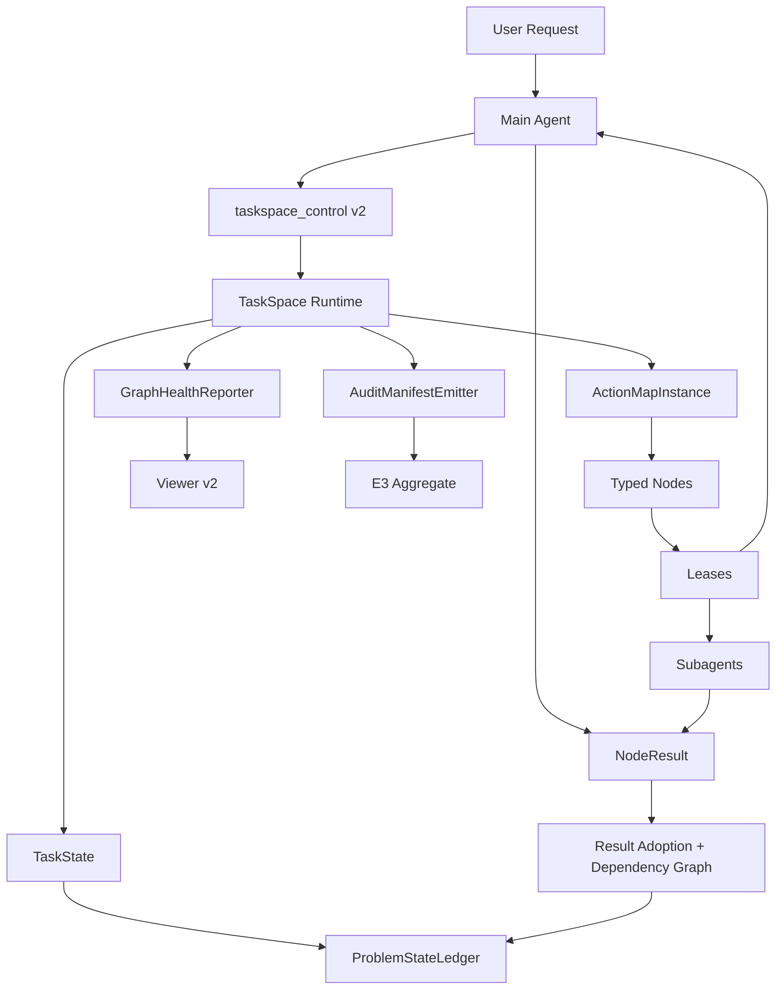
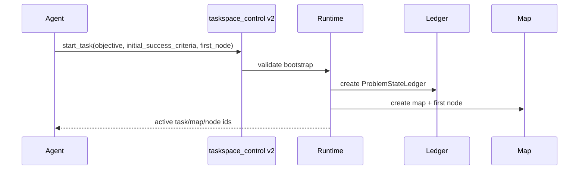
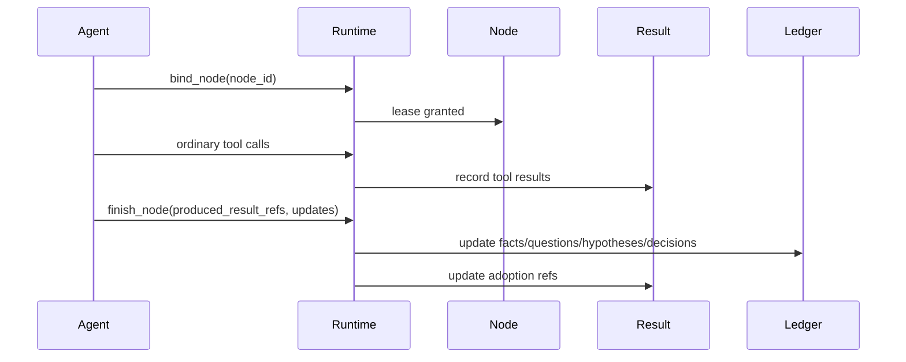
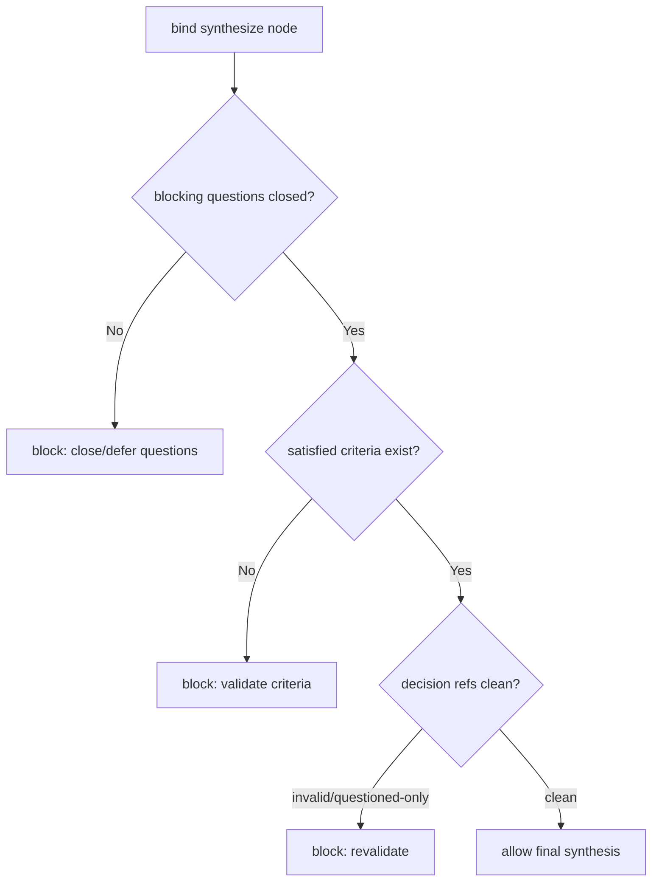

# 03. 系统架构设计

## 1. 总体架构



## 2. 模块职责

### 2.1 TaskState

TaskState 是 task 级权威状态容器。0.0.4 后它不仅持有 task id、title、objective、active map，还持有 ProblemStateLedger。

### 2.2 ProblemStateLedger

ProblemStateLedger 是任务当前问题状态的唯一权威视图。它不是 trace 的派生结果，也不是 viewer 后处理；它必须被 runtime 持久化，并通过 taskspace_control v2 action 更新。

### 2.3 ActionMapInstance

ActionMapInstance 继续持有 nodes、edges、leases、results。0.0.4 增加 decision/result/reference 索引，支持从一个 decision 追溯到 result、fact、hypothesis、criterion。

### 2.4 Typed Nodes

Node 从泛化工作项收紧为认知状态转换单元：discover、diagnose、design、patch、validate、synthesize。

### 2.5 Result Adoption Layer

Result adoption layer 负责维护：

```text
result validity
result adoption state
result -> fact/hypothesis/decision/criterion refs
invalid/questioned taint
```

### 2.6 GraphHealthReporter

GraphHealthReporter 是 report-only 模块。它不阻断 agent，而是输出 graph-health.json 和 viewer warning。

### 2.7 AuditManifestEmitter

AuditManifestEmitter 为每个 E3 pair 输出 audit manifest，并向 aggregate 提供 included/excluded/inconclusive 判定输入。

### 2.8 FailureTaxonomyClassifier

FailureTaxonomyClassifier 基于 run artifact、validator exit code、graph health、diff、cleanup、remote asset status 生成 failure classes。

## 3. 数据流

### 3.1 Task bootstrap



### 3.2 Node execution



### 3.3 Final synthesis



## 4. 权威状态与派生状态

| 状态 | 权威来源 | 派生/展示 |
|---|---|---|
| objective | TaskState | viewer/audit |
| success criteria | ProblemStateLedger | audit readiness |
| node status | ActionMapInstance | graph health |
| result validity | NodeResult evidence package | graph health/adoption |
| result adoption | ResultReferenceGraph | decision view |
| failure taxonomy | AuditManifest/Classifier | aggregate |
| graph health warning | GraphHealthReporter | viewer |

## 5. 兼容策略

0.0.4 引入 `taskspace_schema_version = taskspace-v2`。0.0.3 trace 不回填 ProblemStateLedger，只作为 historical evidence。对于旧 trace，viewer 可显示 “legacy cognitive state incomplete”。

## 6. 错误边界

Runtime 不判断以下内容：

```text
result 的语义是否正确；
patch 是否真正能解决任务；
哪个 hypothesis 更合理；
下一步是否最优。
```

Runtime 只判断：

```text
字段是否存在；
引用对象是否存在；
invalid result 是否被错误引用；
blocking open question 是否未关闭；
node kind finish requirements 是否满足；
audit artifact 是否完整。
```
