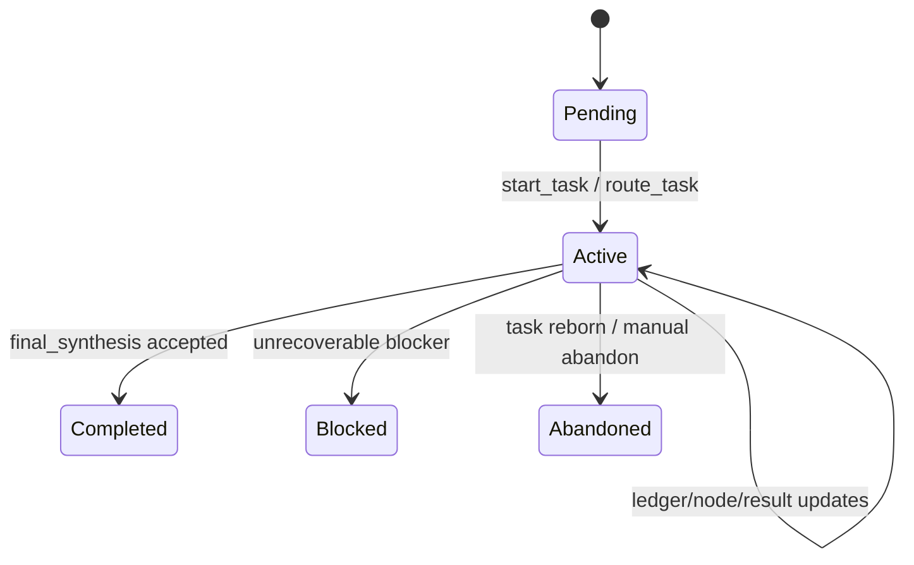
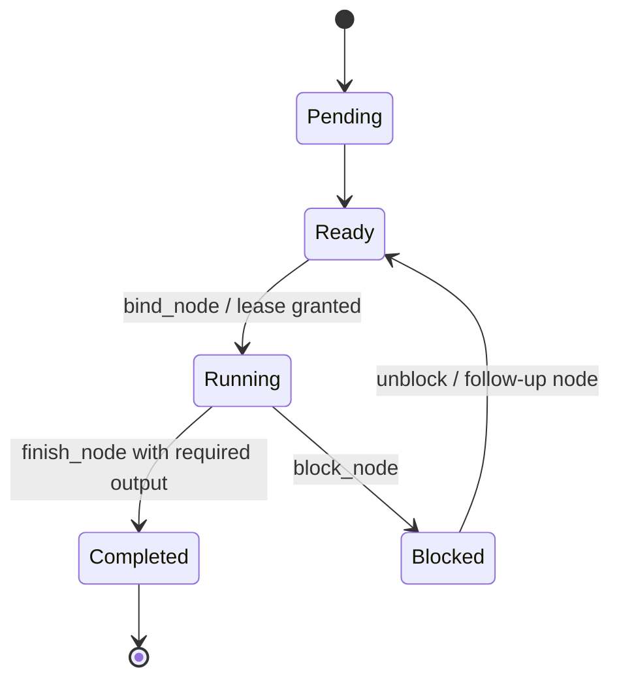

# 06. Runtime Gate 与状态机设计

## 1. Gate 设计目标

Runtime gate 的目标不是让 runtime 判断语义，而是阻止明显不安全的结构行为：

```text
无目标执行
无完成标准执行
依赖 invalid result 决策
questioned result 单独驱动 patch
blocking open question 未关闭就 final synthesis
validate node 没有 validator evidence 就完成
```

## 2. Gate 分级

| 等级 | 含义 | 0.0.4 策略 |
|---|---|---|
| Hard gate | 阻断并返回错误 | 只用于明确危险或 contract 缺失 |
| Soft gate | 允许继续但记录 warning | graph health / viewer 展示 |
| Report-only | 不影响执行，只输出指标 | thin mode、subagent ROI、decision density |

## 3. Task 状态机



## 4. Node 状态机



## 5. Hard gates

### 5.1 Bootstrap gate

普通工具调用前必须满足：

```text
active_task exists
active_map exists
active_node lease exists
objective non-empty
success_criteria non-empty
```

### 5.2 Node kind finish gate

| Node kind | finish_node required |
|---|---|
| discover | relevant files or known facts or open questions |
| diagnose | hypothesis + evidence or explicit rejected hypothesis |
| design | at least one decision or risk/deferral rationale |
| patch | changed artifacts or explicit no-edit rationale |
| validate | command/validator evidence + criterion update |
| synthesize | satisfied/waived criteria + no blocking open questions |

### 5.3 Decision gate

`record_decision` 阻断条件：

```text
depends_on_results contains invalid result
patch decision depends only on questioned results
referenced result_id/fact_id/question_id/criterion_id does not exist
```

### 5.4 Final synthesis gate

阻断条件：

```text
blocking open questions remain open
no success criteria satisfied or waived
final synthesis references invalid result
remaining risks omitted when criteria are waived/questioned
```

### 5.5 Validation gate

validate node finish 必须有：

```text
validator command or test command
exit code or failure reason
stdout/stderr/artifact refs
criteria update
```

## 6. Soft warnings

| Warning | 条件 |
|---|---|
| high_unreviewed_result_ratio | unreviewed / total > 0.60 |
| low_decision_density | decisions / nodes < 0.25 |
| high_blocked_node_ratio | blocked / total > 0.30 |
| subagent_no_adoption | spawn_count > 0 且 adopted_subagent_results = 0 |
| thin_mode_violation | recommended thin 但 node_count > 6 或 spawn_count > 0 |
| validation_loop | validate 失败后重复 validate > 2 次且没有新 decision |
| stale_ready_node | ready node 长时间未绑定且不再被 decision 引用 |

## 7. Spawn gate

0.0.4 建议 spawn 前置条件先做 soft/hard 混合：

Hard：

```text
spawn 必须绑定 ready node；
spawn 必须有 record_subagent_plan；
spawn node 不能已被 main agent active lease 持有。
```

Soft：

```text
没有 why_parallelizable -> warning
没有 expected_artifact -> warning
recommended thin 但 spawn_count > 0 -> warning
```

## 8. Error response 设计

错误响应必须包含：

```text
blocked_action
missing_or_invalid_contract
next_required_taskspace_control_action
example_minimal_fix
```

示例：

```text
TaskSpace blocked final_synthesis.
Reason: blocking open question q-2 remains open.
Required: close_open_question(q-2, evidence_refs=...) or defer it with risk record.
```

## 9. Gate 不应做的事

Runtime 不应：

```text
根据自然语言内容判定 hypothesis 正确；
根据文件名自动决定 node kind；
强制所有 result 都 review；
强制 subagent 一定产生收益；
把 validator timeout 全部归因为 TaskSpace overhead。
```
