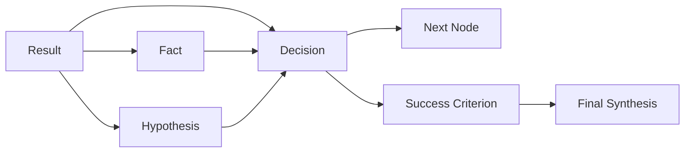

# 07. Result Adoption 与 Dependency Graph 设计

## 1. 背景

0.0.3 已有 result 和 validity，但缺少 adoption 链路。大量 result 是 unreviewed，且 accepted result 未必能追溯到 decision。0.0.4 要把 result 从“执行日志”升级为“可采信证据”。

## 2. 核心对象

```text
NodeResult
├── evidencePackage
│   ├── claims
│   ├── evidenceRefs
│   ├── changedArtifacts
│   ├── validatorRefs
│   ├── remainingUncertainty
│   ├── validity
│   └── validityReason
└── adoption
    ├── adoptionState
    ├── adoptedByFacts
    ├── adoptedByHypotheses
    ├── adoptedByDecisions
    ├── adoptedByCriteria
    └── adoptedByNodes
```

## 3. Validity 与 adoption 区分

| 概念 | 含义 |
|---|---|
| validity | result 本身是否被主 agent 认为可采信 |
| adoption | result 是否实际用于 fact/hypothesis/decision/criterion |

可能状态：

| Validity | Adoption | 含义 |
|---|---|---|
| unreviewed | none | 原始日志，不能支撑 decision |
| accepted | accepted_unused | 被认可但未进入后续决策 |
| accepted | accepted_adopted | 被采信并进入 ledger/decision |
| questioned | questioned | 可触发 cross-check，不能单独支撑 patch |
| invalid | invalid | 禁止进入 synthesis/patch rationale |

## 4. Dependency graph



## 5. Taint 传播

0.0.4 最小 taint 规则：

```text
invalid result -> referencing decision tainted_invalid
questioned result as sole dependency -> decision tainted_questioned
open blocking question -> synthesis_not_ready
criterion questioned/open -> final requires risk/waiver
```

Runtime 不判断语义，只维护显式引用关系。

## 6. Action 流程

### 6.1 Result 被接受并转成 fact

```text
mark_result_validity(result-3, accepted)
adopt_result(result-3, adopted_by.fact=fact-1)
record_fact(fact-1, evidence_refs=[result-3])
```

### 6.2 Result 被接受并支撑 decision

```text
mark_result_validity(result-8, accepted)
record_decision(d-1, depends_on_results=[result-8])
adopt_result(result-8, adopted_by.decisions=[d-1])
```

### 6.3 Result 被质疑

```text
mark_result_validity(result-11, questioned)
create_node(kind=validate, tests_hypotheses=[h-2], depends_on_results=[result-11])
```

### 6.4 Result 被废弃

```text
mark_result_validity(result-12, invalid)
```

后续任何 decision 若引用 result-12，runtime hard error。

## 7. 指标

| 指标 | 公式 | 用途 |
|---|---|---|
| result_adoption_rate | accepted_adopted / accepted_total | 判断 accepted result 是否实际有用 |
| unreviewed_result_ratio | unreviewed / total | 判断 result 噪声量 |
| accepted_unused_ratio | accepted_unused / accepted_total | 判断采信但未使用的浪费 |
| decision_evidence_coverage | decisions_with_refs / total_decisions | 判断 decision 是否有证据 |
| tainted_decision_count | invalid/questioned tainted decisions | 判断风险 |

## 8. 0.0.4 验收

```text
final_synthesis 不得引用 invalid result。
patch decision 不得只依赖 questioned result。
每个 decision 必须有 depends_on_results/facts/questions/criteria 中至少一类引用。
每个 run 输出 result-adoption summary。
```
