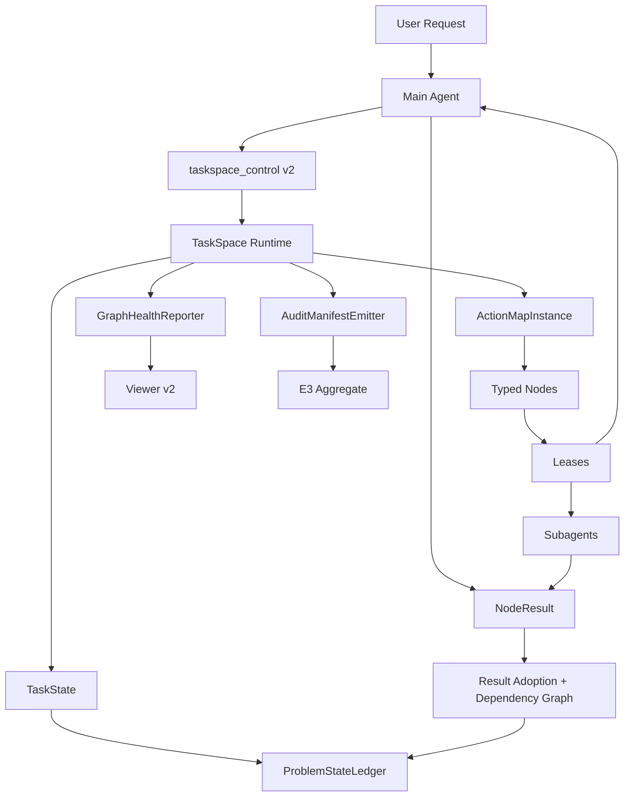
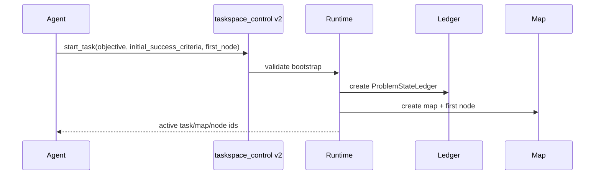
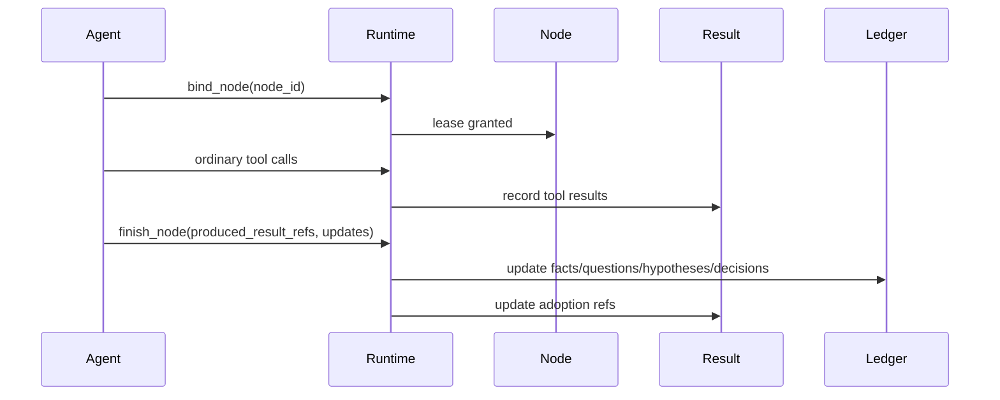
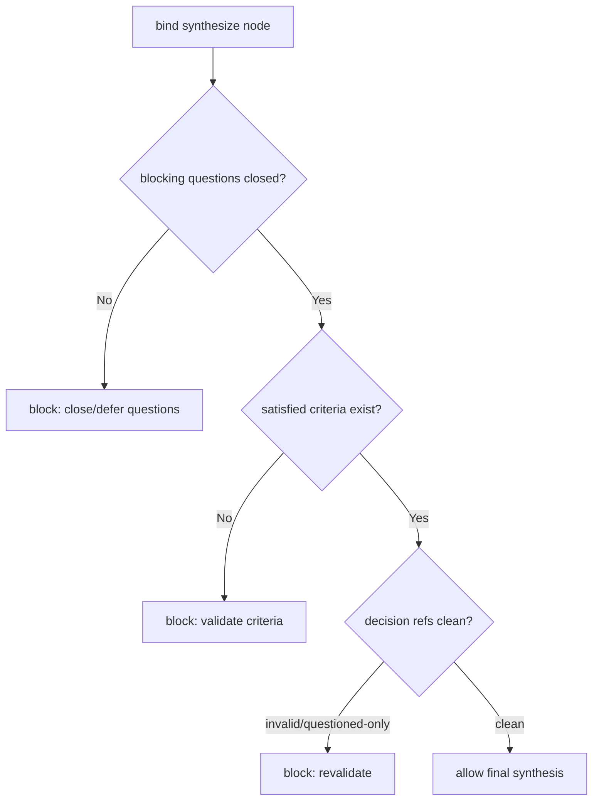
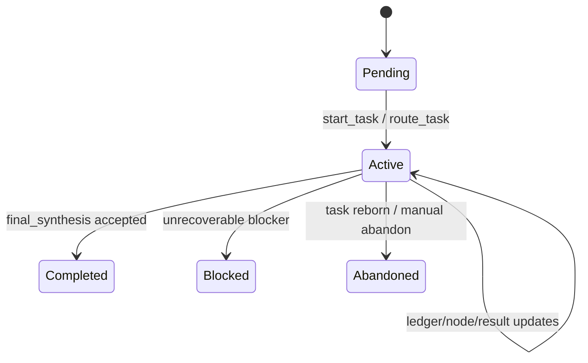
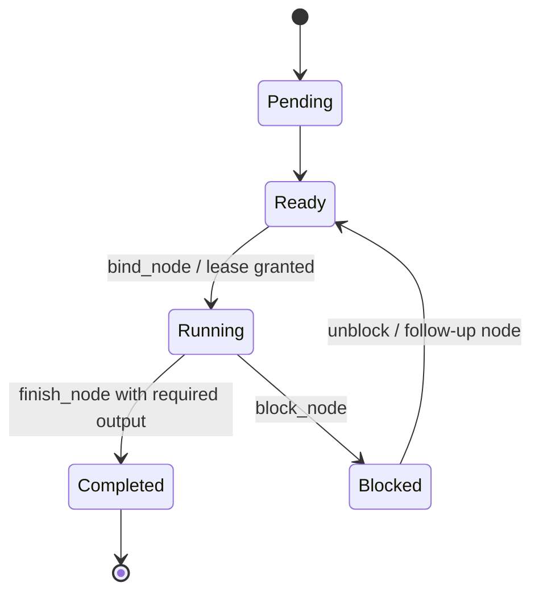
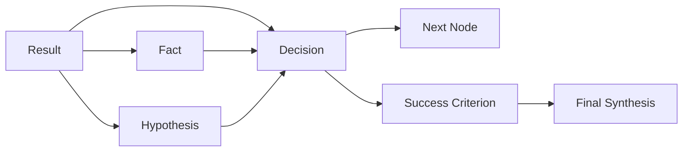

# 00. TaskSpace 0.0.4 总体设计

## 1. 版本定位

TaskSpace 0.0.4 的定位是：

```text
从“结构化执行轨道”升级为“可审计的问题状态 runtime”。
```

0.0.3 的主要价值是证明 runtime 能跑：task、map、node、lease、result、viewer、E3 harness、Docker cleanup、remote asset fail-closed 都已经进入真实执行链路。0.0.4 的主要价值不是继续证明“能跑”，而是证明：这些结构化活动能稳定提高问题状态管理质量，至少能被机械审计。

## 2. 设计原则

### P1：TaskSpace 不是 planner

TaskSpace 不负责替 agent 规划任务，不根据关键词自动选择路线，也不判断语义真假。它负责维护问题状态、结构边界、证据引用、状态推进和 audit artifact。

职责边界：

| 层 | 责任 |
|---|---|
| Runtime | 结构合法性、状态机、gate、trace、引用关系、audit artifact |
| Main agent | 语义判断、路由、问题建模、result 采信、下一步决策 |
| Subagent | 局部证据生产、候选分析、限定范围内的执行 |
| Viewer/Audit | 可恢复、可复盘、可比较、可纳入 clean aggregate |

### P2：先 report-only，再 hard gate

0.0.4 不能一次性加太多硬 gate。硬 gate 只覆盖明确危险路径：缺少 success criteria、invalid result 进入 final synthesis、questioned result 单独支撑 patch decision、final synthesis 前仍有 blocking open question。

其他能力先做 report-only：graph health、decision density、subagent ROI、thin-mode violation。

### P3：Node 是认知状态转换单元

Node 不应只是“读文件/执行命令”的动作包，而应表达一个高内聚状态转换：

```text
unknown -> known
hypothesis -> supported/rejected
open question -> closed/deferred
candidate patch -> validated/invalidated
```

### P4：Result 必须流入 decision

result 只是日志时不会提升 utility。0.0.4 必须建立：

```text
Result -> Fact / Hypothesis / Decision / Criterion / Validation
```

的引用链，并能统计 accepted result 是否真正被 adoption。

### P5：Clean audit 是版本证据链 P0

0.0.3 的 `valid_utility_pairs = 0` 表明，当前无法形成 clean utility 结论。0.0.4 必须让 pair 的 included/excluded/inconclusive 结论可以机械解释。

## 3. 0.0.4 目标

| 目标 | 描述 | 验收 |
|---|---|---|
| Problem state 可观测 | TaskState 持有权威 ProblemStateLedger | 每个 run 有 objective、success criteria、facts、questions、hypotheses、decisions |
| Result adoption 可追踪 | result validity 与 decision 引用关系建立 | final synthesis 不得依赖 invalid/unreviewed 关键 result |
| Graph health 可报告 | 每个 TaskSpace run 输出 graph-health.json | 能看到 node inflation、unreviewed ratio、decision density、subagent yield |
| Clean E3 可纳入 aggregate | 每个 pair 有 audit manifest | `valid_utility_pairs > 0`，或能解释为什么为 0 |
| 低摩擦可识别 | 简单任务不应无解释走 deep graph | 输出 thin/standard/deep report-only 推荐 |

## 4. 非目标

| 非目标 | 原因 |
|---|---|
| 不扩大 benchmark 主样本 | audit gate 未闭环前扩大样本只扩大解释成本 |
| 不新增复杂 subagent role | 当前瓶颈是 result adoption，不是 role 数量 |
| 不做 full automatic planner | 会放大 graph，而非提高决策密度 |
| 不默认开启 TaskSpace | 0.0.3 证据尚不支持 default-on |
| 不实现硬 graph prune/merge | 先用 graph health 识别病灶，再考虑硬动作 |

## 5. P0/P1/P2 范围

### P0

1. CleanE3AuditManifest
2. FailureTaxonomyV1
3. GraphHealthReportOnly
4. ProblemStateLedgerV1
5. ResultAdoptionV1
6. TypedNodeKindContractV1

### P1

1. SubagentContractV1
2. ThinModeClassifierReportOnly
3. ViewerV2

### P2

1. Graph prune/merge/collapse hard action
2. Automatic mode switching
3. Larger benchmark suite
4. More specialized subagent roles

## 6. 成功判据

0.0.4 不要求 TaskSpace 立刻超过 Standard。它必须先满足：

```text
1. clean audit gate 不再全局缺失；
2. 每个 run 有可恢复的问题状态账本；
3. 每个关键 decision 能解释依赖哪些 accepted evidence；
4. 每个 failed pair 有 failure taxonomy；
5. graph health 能指出无效图增长；
6. low-complexity 样本能输出 thin-mode recommendation 和 violation warning。
```


---

# 01. 0.0.3 证据与问题定义

## 1. 证据摘要

0.0.3 已完成工程链路证明，但未完成 utility 证明。关键结论：

```text
TaskSpace 0.0.3 能跑，但没有证明 agent 跑得更好。
```

E3 diagnostic 结果：

| 方向 | 数量 |
|---|---:|
| TaskSpace better | 0 |
| Standard better | 3 |
| Both success | 5 |
| Both failed | 7 |
| clean utility pairs | 0 |

## 2. 0.0.3 样本级证据

下表基于 0.0.3 evidence pack 中的 pair index 与 TaskSpace graph dump 统计。注意：这里的 result_total 是 graph/detail 侧记录的 node result 数，包括 main tool call、result、blocker 等，比高层 run summary 里的聚合 result 口径更细。

| Sample | Standard success | TaskSpace success | TS nodes | TS edges | TS detailed results | Unreviewed results | Accepted results | Direction summary |
|---|---:|---:|---:|---:|---:|---:|---:|---|
| `processing-pipeline` | 3/5 | 2/5 | 59 | 103 | 357 | 297 | 50 | both_success=2, standard_better=1, both_failed=2 |
| `multi-source-data-merger` | 0/5 | 0/5 | 56 | 60 | 214 | 157 | 35 | both_failed=5 |
| `recover-accuracy-log` | 5/5 | 3/5 | 46 | 43 | 175 | 131 | 35 | both_success=3, standard_better=2 |

## 3. 关键观察

### 3.1 success criteria 未成为 contract

外部 graph dump 中三个主要样本的 `success_criteria_total` 均为 0，而 output contract、fact source、fact 已经有一定记录。这说明 0.0.3 的 cognitive state 已经开始记录事实和输出契约，但没有把“完成标准”提升为 first-class contract。

影响：

```text
final synthesis 无法机械判断是否满足任务；
validator/audit 难以知道哪些 artifact 是必须的；
agent 容易把“做了一些事”误当成“任务完成”。
```

### 3.2 result validity 有动作，但 adoption 不足

三个样本中 unreviewed result 占比很高：

| Sample | Unreviewed / Results | 粗略占比 |
|---|---:|---:|
| processing-pipeline | 297 / 357 | 83.2% |
| multi-source-data-merger | 157 / 214 | 73.4% |
| recover-accuracy-log | 131 / 175 | 74.9% |

这不要求所有 result 都必须被 review。问题在于：0.0.3 缺少结构化字段说明“哪些 result 被采信为 decision 的依据”。因此无法判断大量 result 是有效背景，还是纯噪声。

### 3.3 node 仍偏动作化

0.0.3 node kind 主要是：

```text
inspect_code_context
implement_solution
smoke_test
regression_test
final_synthesis
```

这些 kind 能表达执行阶段，但不能表达问题状态转换。例如 `inspect_code_context` 同时承载 discover、diagnose、design、baseline validation、subagent integration，导致节点语义过宽。

### 3.4 recover-accuracy-log 暴露低摩擦问题

`recover-accuracy-log` 中 Standard 5/5，TaskSpace 3/5。两个 TaskSpace 失败 pair 的形态不同：

注意：下表保留 0.0.3 证据包中的 legacy raw labels。按 2026-06-14 硬性 E3 契约，validator timeout / flaky 不能再产生 score-bearing `standard_better`；它应使执行进入 `score_valid=false / engineering_unclean`，只能作为诊断输入。

| Pair | Direction | Nodes | Edges | Results | Failure classes |
|---|---|---:|---:|---:|---|
| pair-003 | standard_better | 16 | 16 | 53 | taskspace_overhead_timeout; validator_slow_or_flaky; node_overfragmentation; subagent_noise_or_unused |
| pair-004 | standard_better | 2 | 1 | 17 | taskspace_overhead_timeout; validator_slow_or_flaky |

这说明 timeout 不能统一归因为“图过大”。0.0.4 需要 failure taxonomy 区分 graph overhead、validator 噪声、patch 错误、验证循环等不同根因。

### 3.5 processing-pipeline 暴露图活跃但决策密度不足

`processing-pipeline` 有较高 graph activity：59 nodes、103 edges、357 detailed results，TaskSpace 2/5，Standard 3/5。失败分类多次出现 `subagent_noise_or_unused`、`agent_patch_wrong`、`node_overfragmentation`。

这说明：

```text
更多节点 / 更多边 / 更多 result / 更多 subagent 并不自动转化为更好 patch。
```

0.0.4 应衡量 decision density 和 result adoption，而不是只统计结构活动量。

## 4. 问题归因

| 问题 | 0.0.3 表现 | 0.0.4 对策 |
|---|---|---|
| 完成标准缺失 | successCriteria 未被稳定使用 | ProblemStateLedgerV1 + start_task gate |
| result 未采信 | unreviewed result 比例高，决策引用缺失 | ResultAdoptionV1 + dependency refs |
| node 语义不清 | inspect_code_context 过载 | TypedNodeKindContractV1 |
| graph 成本不可解释 | nodes/results 膨胀但 utility 未升 | GraphHealthReportOnly |
| subagent ROI 不明 | spawn/result 是否改变 decision 不可查 | SubagentContractV1 |
| timeout 归因混杂 | validator / TaskSpace overhead / agent error 混在一起 | FailureTaxonomyV1 |
| clean utility 缺失 | valid_utility_pairs=0 | CleanE3AuditManifest |

## 5. 0.0.4 设计输入

0.0.4 设计应围绕以下问题建立 contract：

```text
1. 当前任务完成标准是什么？
2. 当前已验证事实是什么？
3. 当前尚未回答的问题是什么？
4. 当前假设及其证据是什么？
5. 当前 patch/design/validation decision 依赖哪些 result？
6. 哪些 result 被 accepted/questioned/invalid？
7. 哪些 node 已经 stale 或未贡献 decision？
8. 当前 run 是否具备 clean audit inclusion 条件？
```


---

# 02. TaskSpace 0.0.4 PRD

## 1. 背景

TaskSpace 0.0.3 完成了 runtime 可运行性验证，但 E3 diagnostic 未证明 utility 正收益。0.0.4 的产品任务不是增加更多执行结构，而是让现有结构成为 agent 可依赖的问题状态管理层。

## 2. 目标用户与角色

| 角色 | 需求 |
|---|---|
| Main agent | 在多步骤工程任务中维护目标、事实、假设、决策、风险，不被线性历史淹没 |
| Runtime | 强制结构合法，维护状态机、result 引用和 audit artifact |
| Subagent | 在限定上下文下生产可采信证据，而不是泛泛建议 |
| Benchmark maintainer | 能机械判断 pair included/excluded，区分 agent failure 和环境/validator failure |
| Human reviewer | 能通过 viewer 快速恢复任务状态和失败原因 |
| Product owner | 能判断 TaskSpace 是否具备进入默认模式或复杂任务模式的证据 |

## 3. 用户故事

### US-1：主 agent 启动任务时明确完成标准

作为 main agent，我必须在 start_task 后记录 objective 和 success criteria，以便后续 patch、validation、final synthesis 都有明确完成标准。

验收：普通工具调用前若 active task 没有 success criteria，runtime 阻断或强告警。

### US-2：主 agent 把调查结果转为问题状态

作为 main agent，我需要把调查结果记录为 known fact、hypothesis、open question 或 decision，而不是只写在 result_summary 中。

验收：finish_node 可以关联 closed_questions、updated_hypotheses、created_decisions。

### US-3：主 agent 不能依赖 invalid result

作为 runtime，我必须阻止 invalid result 进入 final synthesis 或 patch decision。

验收：record_decision 若 depends_on_results 包含 invalid result，返回结构化错误。

### US-4：人类 reviewer 能快速判断图是否健康

作为 reviewer，我需要看到 decision density、unreviewed result ratio、subagent yield、thin mode violation，而不是手动读完整 transcript。

验收：每个 TaskSpace run 输出 `graph-health.json`，viewer 显示 graph health warnings。

### US-5：benchmark 能输出 clean aggregate

作为 benchmark maintainer，我需要每个 pair 都有 audit manifest，能判断 inclusion/exclusion/inconclusive。

验收：0.0.4 E3 aggregate 中 `valid_utility_pairs` 不再因 audit missing 全部为 0；若仍为 0，必须有机械解释。

## 4. 功能需求

### FR-1 ProblemStateLedger

系统必须在 TaskState 中持有权威 ProblemStateLedger，包括：

```text
objective
success_criteria
known_facts
open_questions
hypotheses
decisions
risks
blockers
next_best_action
```

### FR-2 taskspace_control schema v2

新增 action：

```text
record_success_criteria
record_open_question
close_open_question
record_hypothesis
update_hypothesis
record_decision
record_next_best_action
record_risk
classify_failure
record_subagent_plan
```

### FR-3 ResultAdoption

NodeResult 必须支持 adoption 状态：

```text
unreviewed
accepted_unused
accepted_adopted
questioned
invalid
```

### FR-4 TypedNodeKindContract

新增 canonical node kinds：

```text
discover
diagnose
design
patch
validate
synthesize
```

并定义每类 node 的 required output。

### FR-5 GraphHealthReport

每个 run 输出：

```text
node_count
edge_count
result_count
unreviewed_result_ratio
result_adoption_rate
decision_density
blocked_node_ratio
subagent_decision_yield
thin_mode_violation
validation_loop_count
```

### FR-6 CleanE3AuditManifest

每个 pair 输出 audit manifest，包含 standard/taskspace artifact、validator evidence、cleanup evidence、failure taxonomy、inclusion decision。

## 5. 非功能需求

| 需求 | 说明 |
|---|---|
| Backward compatibility | 0.0.3 trace 作为 historical evidence 保留；0.0.4 新 schema versioned |
| Low friction | 低复杂度任务不应强制 deep graph；先输出 report-only classifier |
| Deterministic audit | aggregate 不能依赖散落人工解释 |
| Minimal semantic runtime | runtime 不判断语义真假，只维护显式引用与状态 |
| Fail closed | remote asset 不可证明等价时继续 fail-closed |
| Cleanup preserved | 0.0.3 Docker cleanup 基线不得回退 |

## 6. 验收标准

### Must

```text
每个 TaskSpace run 有非空 success criteria。
每个 TaskSpace run 有 graph-health.json。
每个 pair 有 audit manifest。
每个 failed/timeout pair 有 non-unknown failure taxonomy。
invalid result 不能进入 final synthesis。
blocking open question 未关闭时不能 final synthesis。
```

### Should

```text
recover-accuracy-log 能输出 thin mode recommendation。
processing-pipeline 的 subagent result adoption 可观测。
result_adoption_rate 和 unreviewed_result_ratio 可在 aggregate 中展示。
```

### Could

```text
部分 warning 转 hard gate。
viewer 支持 decision dependency drill-down。
```

## 7. 成功/失败判定

0.0.4 成功不是“TaskSpace 全面胜过 Standard”，而是：

```text
TaskSpace utility 能进入 clean audit 证据链；
TaskSpace graph 能解释自己的存在；
TaskSpace result 能解释自己如何支持 decision；
TaskSpace failure 能被分类和复盘。
```


---

# 03. 系统架构设计

## 1. 总体架构



## 2. 模块职责

### 2.1 TaskState

TaskState 是 task 级权威状态容器。0.0.4 后它不仅持有 task id、title、objective、active map，还持有 ProblemStateLedger。

### 2.2 ProblemStateLedger

ProblemStateLedger 是任务当前问题状态的唯一权威视图。它不是 trace 的派生结果，也不是 viewer 后处理；它必须被 runtime 持久化，并通过 taskspace_control v2 action 更新。

### 2.3 ActionMapInstance

ActionMapInstance 继续持有 nodes、edges、leases、results。0.0.4 增加 decision/result/reference 索引，支持从一个 decision 追溯到 result、fact、hypothesis、criterion。

### 2.4 Typed Nodes

Node 从泛化工作项收紧为认知状态转换单元：discover、diagnose、design、patch、validate、synthesize。

### 2.5 Result Adoption Layer

Result adoption layer 负责维护：

```text
result validity
result adoption state
result -> fact/hypothesis/decision/criterion refs
invalid/questioned taint
```

### 2.6 GraphHealthReporter

GraphHealthReporter 是 report-only 模块。它不阻断 agent，而是输出 graph-health.json 和 viewer warning。

### 2.7 AuditManifestEmitter

AuditManifestEmitter 为每个 E3 pair 输出 audit manifest，并向 aggregate 提供 included/excluded/inconclusive 判定输入。

### 2.8 FailureTaxonomyClassifier

FailureTaxonomyClassifier 基于 run artifact、validator exit code、graph health、diff、cleanup、remote asset status 生成 failure classes。

## 3. 数据流

### 3.1 Task bootstrap



### 3.2 Node execution



### 3.3 Final synthesis



## 4. 权威状态与派生状态

| 状态 | 权威来源 | 派生/展示 |
|---|---|---|
| objective | TaskState | viewer/audit |
| success criteria | ProblemStateLedger | audit readiness |
| node status | ActionMapInstance | graph health |
| result validity | NodeResult evidence package | graph health/adoption |
| result adoption | ResultReferenceGraph | decision view |
| failure taxonomy | AuditManifest/Classifier | aggregate |
| graph health warning | GraphHealthReporter | viewer |

## 5. 兼容策略

0.0.4 引入 `taskspace_schema_version = taskspace-v2`。0.0.3 trace 不回填 ProblemStateLedger，只作为 historical evidence。对于旧 trace，viewer 可显示 “legacy cognitive state incomplete”。

## 6. 错误边界

Runtime 不判断以下内容：

```text
result 的语义是否正确；
patch 是否真正能解决任务；
哪个 hypothesis 更合理；
下一步是否最优。
```

Runtime 只判断：

```text
字段是否存在；
引用对象是否存在；
invalid result 是否被错误引用；
blocking open question 是否未关闭；
node kind finish requirements 是否满足；
audit artifact 是否完整。
```


---

# 04. ProblemStateLedgerV1 详细设计

## 1. 目标

ProblemStateLedgerV1 的目标是把 TaskSpace 的“问题状态”从自然语言 result body 中抽出来，成为 TaskState 的 first-class runtime contract。

它要回答：

```text
当前目标是什么？
完成标准是什么？
已验证事实是什么？
尚未回答的问题是什么？
当前假设是什么？
已经做了哪些决策？
还存在什么风险？
下一步最小高价值行动是什么？
```

## 2. 数据模型

```text
ProblemStateLedger
├── objective
├── success_criteria[]
├── known_facts[]
├── open_questions[]
├── hypotheses[]
├── decisions[]
├── risks[]
├── blockers[]
├── next_best_action
└── updated_at_ms
```

## 3. 字段定义

### 3.1 objective

任务目标，必须由 start_task 初始化。objective 不应只是用户原话，而应是 agent 归纳后的工程目标。

示例：

```text
Recover accuracy logs by generating expected output files and results.json from available logs, then pass the public validator.
```

### 3.2 success_criteria

完成标准。每条标准必须包含：

```text
id
description
kind
status
evidence_refs
```

建议 kind：

```text
artifact
behavior
test
validator
compatibility
performance
user_visible_output
```

状态：

```text
open
satisfied
questioned
waived
```

### 3.3 known_facts

已验证事实，必须有 evidence refs。不得记录“我猜测”式事实；猜测应进入 hypothesis。

### 3.4 open_questions

未解决问题。每个问题要标注是否 blocking。

示例：

```text
q-1: Which files are required by the validator output contract?
blocking: true
```

### 3.5 hypotheses

未完全验证但可推进的问题模型。

字段：

```text
id
statement
confidence
status
evidence_refs
falsification_check
```

状态：

```text
proposed
supported
rejected
superseded
```

### 3.6 decisions

决策是 0.0.4 的关键对象。每个 patch/design/validation/synthesis decision 必须引用 supporting evidence。

字段：

```text
id
decision_kind
decision
rationale
depends_on_results
depends_on_facts
resolves_questions
supports_criteria
risks
```

### 3.7 risks

风险用于记录仍可接受但未完全消除的不确定性。final synthesis 必须展示 remaining risks。

### 3.8 next_best_action

下一步行动不是自由文本计划，而是当前问题状态下的最小高价值行动。

字段：

```text
node_id
action_summary
reason
expected_artifact
blocked_by
```

## 4. 生命周期

### 4.1 初始化

`start_task` 必须提供：

```text
objective
initial_success_criteria
first_node
```

如果没有 initial_success_criteria，runtime 应阻断普通工具调用，要求先补 `record_success_criteria`。

### 4.2 调查阶段

discover / diagnose node 完成后，应至少更新一类 ledger 对象：

```text
known_fact
open_question
hypothesis
risk
```

### 4.3 设计阶段

design node 完成后，必须产生 decision。decision 必须解释它依赖哪些 result/fact/hypothesis。

### 4.4 Patch 阶段

patch node 完成后，必须记录 changed artifacts，并关联 patch decision。

### 4.5 Validate 阶段

validate node 完成后，必须更新 success criteria status。

### 4.6 Synthesize 阶段

final synthesis 前必须满足：

```text
blocking open questions = 0
至少一个 validation criterion satisfied 或 waived
final decision 不依赖 invalid result
remaining risks 已记录
```

## 5. Gate 策略

| 场景 | Gate |
|---|---|
| task 没有 success criteria | 阻断普通工具调用 |
| patch decision 无 evidence refs | hard error 或强告警，建议 0.0.4 初期 hard error 仅限 invalid/questioned 引用 |
| final synthesis 前有 blocking open question | hard error |
| final synthesis 未引用 satisfied criteria | hard error |
| open questions 长期未变化 | graph health warning |

## 6. Viewer 展示

viewer 应优先展示 ledger，而不是只展示 graph：

```text
Objective
Success Criteria
Known Facts
Open Questions
Hypotheses
Decisions
Risks
Next Best Action
```

## 7. 示例：recover-accuracy-log

```yaml
objective: Recover accuracy log outputs and results.json from provided log files.
success_criteria:
  - id: sc-1
    kind: artifact
    description: All expected recovered output files are generated.
    status: open
  - id: sc-2
    kind: validator
    description: Public validator exits with code 0.
    status: open
open_questions:
  - id: q-1
    question: Which source logs determine run boundaries?
    blocking: true
hypotheses:
  - id: h-1
    statement: Accuracy can be reconstructed by grouping judge events by run id.
    confidence: medium
decisions:
  - id: d-1
    decision_kind: patch
    decision: Generate expected output artifacts directly from parsed log files.
    depends_on_results: [result-7, result-8]
```


---

# 05. taskspace_control Schema v2 设计

## 1. 设计目标

0.0.3 的 `taskspace_control` 已能管理 task/node/lease/result，但 action 仍偏执行结构。v2 的目标是把问题状态、证据、假设、决策、风险纳入工具 contract。

## 2. Action 分组

| 分组 | Action |
|---|---|
| Task bootstrap | `start_task`, `route_task`, `record_success_criteria` |
| Problem-state ledger | `record_open_question`, `close_open_question`, `record_hypothesis`, `update_hypothesis`, `record_decision`, `record_risk`, `record_next_best_action` |
| Node control | `create_node`, `bind_node`, `finish_node`, `block_node` |
| Evidence/result | `record_fact_source`, `record_fact`, `mark_result_validity`, `adopt_result` |
| Subagent | `record_subagent_plan` |
| Audit/failure | `classify_failure` |

## 3. 修改现有 action

### 3.1 start_task

0.0.3：

```text
required: task_title, node_title, node_context_summary
optional: task_objective, node_kind, bind_current
```

0.0.4：

```text
required:
  task_title
  task_objective
  initial_success_criteria
  node_kind
  node_title
  node_context_summary
optional:
  bind_current
  initial_open_questions
  initial_risks
```

### 3.2 create_node

新增字段：

```text
expected_artifact
closes_questions
tests_hypotheses
depends_on_results
supports_criteria
risk_flags
mode_hint
```

### 3.3 finish_node

新增字段：

```text
produced_result_refs
closed_questions
updated_hypotheses
created_decisions
updated_criteria
remaining_open_questions
next_best_action
```

### 3.4 mark_result_validity

增强字段：

```text
adoption_target: none | fact | hypothesis | decision | criterion | validation
adoption_refs:
  fact_ids
  hypothesis_ids
  decision_ids
  criterion_ids
```

## 4. 新增 action 设计

### 4.1 record_success_criteria

用途：记录任务完成标准。

```json
{
  "action": "record_success_criteria",
  "criteria": [
    {
      "id": "sc-1",
      "kind": "validator",
      "description": "Public validator exits with code 0",
      "status": "open",
      "evidence_refs": []
    }
  ]
}
```

### 4.2 record_open_question

用途：显式记录当前缺口。

```json
{
  "action": "record_open_question",
  "question_id": "q-1",
  "question": "Which files are required by the expected output contract?",
  "reason": "Needed before patching generated artifacts",
  "blocking": true,
  "opened_by_node_id": "node-1"
}
```

### 4.3 close_open_question

```json
{
  "action": "close_open_question",
  "question_id": "q-1",
  "resolution": "Validator expects six JSONL files and results.json",
  "closed_by_result_id": "result-8",
  "evidence_refs": [{"result_id": "result-8"}]
}
```

### 4.4 record_hypothesis

```json
{
  "action": "record_hypothesis",
  "hypothesis_id": "h-1",
  "statement": "The failure is caused by path-dependent output placement",
  "confidence": "medium",
  "evidence_refs": [{"result_id": "result-5"}],
  "falsification_check": "Run validator after writing outputs in expected directory"
}
```

### 4.5 update_hypothesis

```json
{
  "action": "update_hypothesis",
  "hypothesis_id": "h-1",
  "status": "supported",
  "evidence_refs": [{"result_id": "result-12"}],
  "reason": "Validator failure message matched missing output path"
}
```

### 4.6 record_decision

```json
{
  "action": "record_decision",
  "decision_id": "d-1",
  "decision_kind": "patch",
  "decision": "Generate recovered output files directly from parsed logs",
  "rationale": "All blocking schema questions are closed and required artifacts are known",
  "depends_on_results": ["result-8", "result-12"],
  "depends_on_facts": ["fact-1"],
  "resolves_questions": ["q-1"],
  "supports_criteria": ["sc-1"]
}
```

### 4.7 record_next_best_action

```json
{
  "action": "record_next_best_action",
  "node_id": "node-4",
  "action_summary": "Patch output generation and run public validator once",
  "reason": "Patch decision is recorded and blocking questions are closed",
  "expected_artifact": "Generated output files and validator evidence"
}
```

### 4.8 adopt_result

用于把 accepted result 正式绑定到 ledger 对象。

```json
{
  "action": "adopt_result",
  "result_id": "result-8",
  "adoption_state": "accepted_adopted",
  "adopted_by": {
    "facts": ["fact-1"],
    "decisions": ["d-1"],
    "criteria": ["sc-1"]
  }
}
```

### 4.9 record_subagent_plan

```json
{
  "action": "record_subagent_plan",
  "parent_node_id": "node-3",
  "why_parallelizable": "Parser and validator-schema investigation are independent evidence tracks",
  "expected_artifact": "Schema summary with concrete file refs",
  "acceptance_check": "Main agent will accept only if output cites files or validator lines",
  "max_scope": "read-only inspection, no edits",
  "supports_questions": ["q-2"]
}
```

### 4.10 classify_failure

```json
{
  "action": "classify_failure",
  "failure_classes": ["engineering_unclean", "validator_slow_or_flaky"],
  "reason": "TaskSpace public validator exited 124; under the hard E3 contract this is validator infrastructure failure, not an agent_exec_timeout score outcome",
  "evidence_refs": [{"artifact_ref": "taskspace.validator.stderr.txt"}]
}
```

## 5. 兼容策略

- v1 action 保留；v2 action 加 schema version。
- 旧 `output_contract` 可以映射为 `success_criteria`，但不自动视为 satisfied。
- 旧 `facts` 保留，但没有 decision refs 时 adoption state 仍为 unknown/legacy。
- viewer 对 legacy trace 标记 `schema_incomplete`。

## 6. 错误消息原则

错误应告诉 agent 缺什么，而不是只说 invalid：

```text
TaskSpace final_synthesis blocked: q-2 is still blocking/open. Close or defer the question with evidence before final synthesis.
```

```text
TaskSpace record_decision blocked: depends_on_results contains result-14 marked invalid.
```


---

# 06. Runtime Gate 与状态机设计

## 1. Gate 设计目标

Runtime gate 的目标不是让 runtime 判断语义，而是阻止明显不安全的结构行为：

```text
无目标执行
无完成标准执行
依赖 invalid result 决策
questioned result 单独驱动 patch
blocking open question 未关闭就 final synthesis
validate node 没有 validator evidence 就完成
```

## 2. Gate 分级

| 等级 | 含义 | 0.0.4 策略 |
|---|---|---|
| Hard gate | 阻断并返回错误 | 只用于明确危险或 contract 缺失 |
| Soft gate | 允许继续但记录 warning | graph health / viewer 展示 |
| Report-only | 不影响执行，只输出指标 | thin mode、subagent ROI、decision density |

## 3. Task 状态机



## 4. Node 状态机



## 5. Hard gates

### 5.1 Bootstrap gate

普通工具调用前必须满足：

```text
active_task exists
active_map exists
active_node lease exists
objective non-empty
success_criteria non-empty
```

### 5.2 Node kind finish gate

| Node kind | finish_node required |
|---|---|
| discover | relevant files or known facts or open questions |
| diagnose | hypothesis + evidence or explicit rejected hypothesis |
| design | at least one decision or risk/deferral rationale |
| patch | changed artifacts or explicit no-edit rationale |
| validate | command/validator evidence + criterion update |
| synthesize | satisfied/waived criteria + no blocking open questions |

### 5.3 Decision gate

`record_decision` 阻断条件：

```text
depends_on_results contains invalid result
patch decision depends only on questioned results
referenced result_id/fact_id/question_id/criterion_id does not exist
```

### 5.4 Final synthesis gate

阻断条件：

```text
blocking open questions remain open
no success criteria satisfied or waived
final synthesis references invalid result
remaining risks omitted when criteria are waived/questioned
```

### 5.5 Validation gate

validate node finish 必须有：

```text
validator command or test command
exit code or failure reason
stdout/stderr/artifact refs
criteria update
```

## 6. Soft warnings

| Warning | 条件 |
|---|---|
| high_unreviewed_result_ratio | unreviewed / total > 0.60 |
| low_decision_density | decisions / nodes < 0.25 |
| high_blocked_node_ratio | blocked / total > 0.30 |
| subagent_no_adoption | spawn_count > 0 且 adopted_subagent_results = 0 |
| thin_mode_violation | recommended thin 但 node_count > 6 或 spawn_count > 0 |
| validation_loop | validate 失败后重复 validate > 2 次且没有新 decision |
| stale_ready_node | ready node 长时间未绑定且不再被 decision 引用 |

## 7. Spawn gate

0.0.4 建议 spawn 前置条件先做 soft/hard 混合：

Hard：

```text
spawn 必须绑定 ready node；
spawn 必须有 record_subagent_plan；
spawn node 不能已被 main agent active lease 持有。
```

Soft：

```text
没有 why_parallelizable -> warning
没有 expected_artifact -> warning
recommended thin 但 spawn_count > 0 -> warning
```

## 8. Error response 设计

错误响应必须包含：

```text
blocked_action
missing_or_invalid_contract
next_required_taskspace_control_action
example_minimal_fix
```

示例：

```text
TaskSpace blocked final_synthesis.
Reason: blocking open question q-2 remains open.
Required: close_open_question(q-2, evidence_refs=...) or defer it with risk record.
```

## 9. Gate 不应做的事

Runtime 不应：

```text
根据自然语言内容判定 hypothesis 正确；
根据文件名自动决定 node kind；
强制所有 result 都 review；
强制 subagent 一定产生收益；
把 validator timeout 全部归因为 TaskSpace overhead。
```


---

# 07. Result Adoption 与 Dependency Graph 设计

## 1. 背景

0.0.3 已有 result 和 validity，但缺少 adoption 链路。大量 result 是 unreviewed，且 accepted result 未必能追溯到 decision。0.0.4 要把 result 从“执行日志”升级为“可采信证据”。

## 2. 核心对象

```text
NodeResult
├── evidencePackage
│   ├── claims
│   ├── evidenceRefs
│   ├── changedArtifacts
│   ├── validatorRefs
│   ├── remainingUncertainty
│   ├── validity
│   └── validityReason
└── adoption
    ├── adoptionState
    ├── adoptedByFacts
    ├── adoptedByHypotheses
    ├── adoptedByDecisions
    ├── adoptedByCriteria
    └── adoptedByNodes
```

## 3. Validity 与 adoption 区分

| 概念 | 含义 |
|---|---|
| validity | result 本身是否被主 agent 认为可采信 |
| adoption | result 是否实际用于 fact/hypothesis/decision/criterion |

可能状态：

| Validity | Adoption | 含义 |
|---|---|---|
| unreviewed | none | 原始日志，不能支撑 decision |
| accepted | accepted_unused | 被认可但未进入后续决策 |
| accepted | accepted_adopted | 被采信并进入 ledger/decision |
| questioned | questioned | 可触发 cross-check，不能单独支撑 patch |
| invalid | invalid | 禁止进入 synthesis/patch rationale |

## 4. Dependency graph



## 5. Taint 传播

0.0.4 最小 taint 规则：

```text
invalid result -> referencing decision tainted_invalid
questioned result as sole dependency -> decision tainted_questioned
open blocking question -> synthesis_not_ready
criterion questioned/open -> final requires risk/waiver
```

Runtime 不判断语义，只维护显式引用关系。

## 6. Action 流程

### 6.1 Result 被接受并转成 fact

```text
mark_result_validity(result-3, accepted)
adopt_result(result-3, adopted_by.fact=fact-1)
record_fact(fact-1, evidence_refs=[result-3])
```

### 6.2 Result 被接受并支撑 decision

```text
mark_result_validity(result-8, accepted)
record_decision(d-1, depends_on_results=[result-8])
adopt_result(result-8, adopted_by.decisions=[d-1])
```

### 6.3 Result 被质疑

```text
mark_result_validity(result-11, questioned)
create_node(kind=validate, tests_hypotheses=[h-2], depends_on_results=[result-11])
```

### 6.4 Result 被废弃

```text
mark_result_validity(result-12, invalid)
```

后续任何 decision 若引用 result-12，runtime hard error。

## 7. 指标

| 指标 | 公式 | 用途 |
|---|---|---|
| result_adoption_rate | accepted_adopted / accepted_total | 判断 accepted result 是否实际有用 |
| unreviewed_result_ratio | unreviewed / total | 判断 result 噪声量 |
| accepted_unused_ratio | accepted_unused / accepted_total | 判断采信但未使用的浪费 |
| decision_evidence_coverage | decisions_with_refs / total_decisions | 判断 decision 是否有证据 |
| tainted_decision_count | invalid/questioned tainted decisions | 判断风险 |

## 8. 0.0.4 验收

```text
final_synthesis 不得引用 invalid result。
patch decision 不得只依赖 questioned result。
每个 decision 必须有 depends_on_results/facts/questions/criteria 中至少一类引用。
每个 run 输出 result-adoption summary。
```


---

# 08. Typed Nodes 与 Graph Convergence 设计

## 1. 背景

0.0.3 node kind 偏执行阶段，不能充分表达认知任务。`inspect_code_context` 过载导致 node 粒度不稳定：有时是读文件，有时是诊断，有时是设计，有时是 baseline validation。

0.0.4 的目标是：node 成为“认知状态转换单元”。

## 2. Canonical node kinds

| Kind | 定义 | 典型产出 |
|---|---|---|
| discover | 查明代码结构、文件、接口、运行入口 | relevant files, known facts, open questions |
| diagnose | 定位 bug/root cause 或失败原因 | hypotheses, evidence refs, falsification checks |
| design | 选择修改方案 | decisions, tradeoffs, risks |
| patch | 修改代码/生成 artifact | changed artifacts, patch rationale |
| validate | 运行测试、validator、smoke check | command, exit code, stdout/stderr refs, criterion updates |
| synthesize | 汇总完成状态 | satisfied criteria, accepted decisions, remaining risks |

## 3. 旧 kind 映射

| 0.0.3 kind | 0.0.4 canonical |
|---|---|
| inspect_code_context | discover / diagnose / design |
| implement_solution | patch |
| smoke_test | validate |
| regression_test | validate |
| final_synthesis | synthesize |

0.0.4 可先保留旧 kind，但内部显示 canonical kind。

## 4. Definition of Done

### discover

必须至少产出一类：

```text
relevant_files
known_facts
open_questions
```

### diagnose

必须产出：

```text
hypothesis 或 rejected_hypothesis
evidence_refs
falsification_check 或 next validation action
```

### design

必须产出：

```text
decision
rationale
tradeoff/risk
supporting refs
```

### patch

必须产出：

```text
changed_artifacts
patch_rationale
expected_behavior
```

如果无修改，必须说明 no-edit rationale，并关联 design decision。

### validate

必须产出：

```text
command
exit_code/failure_reason
stdout/stderr/artifact refs
criterion status update
```

### synthesize

必须产出：

```text
satisfied criteria
accepted decisions
remaining risks
excluded/questioned evidence summary
```

## 5. Node 粒度准则

一个好 node 应满足至少一个条件：

```text
关闭一个 open question；
验证/推翻一个 hypothesis；
产生一个 design/patch/validation decision；
交付一个明确 artifact；
消除一个 blocker。
```

反模式：

```text
Read one known file
Continue investigation
Ask subagent to look around
Try something
Fix more issues
```

## 6. Graph convergence

0.0.4 先不实现硬 prune/merge，但要报告：

```text
node_inflation_ratio
stale_ready_nodes
blocked_node_ratio
leaf_nodes_without_result
nodes_without_decision_or_question_effect
```

## 7. Node budgets

report-only budget：

| Mode | Node budget hint | Subagent budget hint |
|---|---:|---:|
| thin | 1-4 | 0 |
| standard | 4-12 | 0-3 |
| deep | 12+ | 3+ with ROI tracking |

超过 budget 不阻断，但输出 warning。

## 8. Reborn 与事实迁移

0.0.4 不建议重做完整 `/task-reborn`，但要定义原则：

```text
accepted facts 可以迁移；
questioned/invalid result 不自动迁移；
open blocking questions 必须重新确认；
decisions 迁移时保留 source refs 和 risk note。
```

## 9. 验收

```text
每个 node 有 canonical kind。
finish_node 根据 kind 检查最小 output。
graph-health.json 包含 node convergence warnings。
viewer 能显示 node kind、expected artifact、closed questions、created decisions。
```


---

# 09. Subagent Contract 与 ROI 设计

## 1. 背景

0.0.3 已将 subagent 绑定到 node lease，这是正确边界。但 E3 结果显示，subagent result 不一定转化为主 agent decision。0.0.4 不增加更多 role，而是要求 subagent 有明确 expected artifact 和 adoption 路径。

## 2. Spawn 原则

允许 spawn 的条件：

```text
1. 子任务可并行，且与主路径存在清晰边界；
2. 子任务能生产明确 artifact；
3. 子任务能验证或推翻特定 hypothesis；
4. 子任务能减少主 agent 上下文压力；
5. 子任务输出有 acceptance check。
```

不建议 spawn：

```text
简单局部 bug；
已知 patch 路径；
只是让另一个 agent “看看”；
validator 已接近 timeout；
当前 task 没有 success criteria；
recommended mode = thin。
```

## 3. record_subagent_plan

spawn 前必须记录：

```text
parent_node_id
why_parallelizable
expected_artifact
acceptance_check
max_scope
supports_questions
tests_hypotheses
depends_on_results
```

## 4. Subagent result contract

subagent 输出应结构化：

```yaml
artifact_type: evidence_summary | patch_candidate | validation_result | risk_review
claims:
  - id:
    statement:
    evidence_refs:
confidence: low | medium | high
limits:
  - what was not checked
recommended_next_action:
changed_artifacts:
validator_refs:
```

## 5. Main agent adoption

主 agent 必须对 subagent result 做三步：

```text
1. mark_result_validity
2. adopt_result 或标记 unused/questioned/invalid
3. 若采用，record_decision / fact / hypothesis 引用该 result
```

## 6. ROI 指标

| 指标 | 公式/含义 |
|---|---|
| spawn_count | subagent spawn 次数 |
| subagent_result_count | subagent result 数 |
| accepted_subagent_results | accepted 的 subagent result |
| adopted_subagent_results | 进入 decision/fact/hypothesis 的 subagent result |
| decisions_supported_by_subagent_results | 被 subagent result 支撑的 decision 数 |
| patches_changed_due_to_subagent_results | subagent result 改变 patch 的次数 |
| subagent_decision_yield | decisions_supported_by_subagent_results / spawn_count |

## 7. Gate 与 warning

Hard gate：

```text
spawn 必须绑定 ready node；
spawn 前必须存在 record_subagent_plan；
spawn node 不得已有 active lease。
```

Soft warning：

```text
expected_artifact 为空；
acceptance_check 为空；
recommended thin 但 spawn_count > 0；
spawn_count > 0 且 adopted_subagent_results = 0。
```

## 8. 示例

```yaml
parent_node_id: node-3
why_parallelizable: Parser behavior and validator output schema are independent tracks.
expected_artifact: Concrete schema summary with file refs and failing validator message refs.
acceptance_check: Accept only if claims cite source files or validator stderr.
max_scope: read-only, no edits.
supports_questions: [q-2]
```

## 9. 验收

```text
每次 spawn 有 plan。
每个 subagent result 有 validity/adoption 状态。
graph-health.json 输出 subagent_decision_yield。
processing-pipeline 这类多 spawn 样本可判断 subagent 是收益还是噪声。
```


---

# 10. Graph Health 与 Viewer v2 设计

## 1. 目标

Graph Health 的目标是回答：

```text
图是否在帮助 agent 收敛？
还是只是在制造活动量？
```

Viewer v2 的目标是让人类和 agent 快速恢复当前问题状态，而不是手动读完整 transcript。

## 2. graph-health.json

每个 TaskSpace run 输出：

```json
{
  "schema_version": "taskspace-graph-health-v1",
  "node_count": 0,
  "edge_count": 0,
  "result_count": 0,
  "decision_count": 0,
  "unreviewed_result_ratio": 0.0,
  "result_adoption_rate": 0.0,
  "decision_density": 0.0,
  "blocked_node_ratio": 0.0,
  "open_question_closure_rate": 0.0,
  "subagent_decision_yield": 0.0,
  "thin_mode_violation": false,
  "warnings": []
}
```

## 3. 指标定义

| 指标 | 公式 | 用途 |
|---|---|---|
| decision_density | decision_count / node_count | 衡量 node 是否转化为决策 |
| result_adoption_rate | accepted_adopted_results / accepted_results | 衡量 accepted result 是否被使用 |
| unreviewed_result_ratio | unreviewed_results / total_results | 衡量 result 噪声 |
| blocked_node_ratio | blocked_nodes / total_nodes | 衡量图收敛问题 |
| node_inflation_ratio | node_count / max(1, decision_count) | 衡量图膨胀 |
| open_question_closure_rate | closed_questions / total_questions | 衡量问题状态推进 |
| subagent_decision_yield | decisions_supported_by_subagent_results / spawn_count | 衡量 subagent ROI |
| validation_rework_count | repeated validate cycles without new decision | 衡量验证循环 |

## 4. Warning taxonomy

```text
high_unreviewed_result_ratio
low_decision_density
high_blocked_node_ratio
node_inflation_high
subagent_no_adoption
thin_mode_violation
validation_loop
synthesis_not_ready
stale_ready_node
decision_tainted_by_questioned_result
```

## 5. Viewer v2 结构

Viewer 不应只展示 node graph。建议分区：

```text
1. Task header
2. ProblemStateLedger
3. Active/blocked node graph
4. Decisions and evidence refs
5. Result validity/adoption summary
6. Subagent ROI summary
7. Graph health warnings
8. Audit readiness
9. Next best action
```

## 6. Viewer 示例

```text
Task: Recover accuracy logs
Mode recommendation: thin

Objective:
  Generate recovered output files and results.json, then pass public validator.

Success Criteria:
  [satisfied] sc-1: Expected output artifacts exist.
  [open]      sc-2: Public validator exits 0.

Open Questions:
  q-1 [closed] Required output file set confirmed by validator.

Hypotheses:
  h-1 [supported] Output reconstruction is determined by parsed judge logs.

Decisions:
  d-1 [patch] Generate artifacts directly from parsed logs.
       depends_on: result-7, result-8

Graph Health:
  nodes=4 edges=3 results=18
  decision_density=0.50
  unreviewed_result_ratio=0.38
  warnings=[]

Next Best Action:
  Run public validator once and update sc-2.
```

## 7. Audit readiness display

Viewer should show:

```text
validator evidence present: yes/no
cleanup artifact present: yes/no
diff present: yes/no
graph health present: yes/no
failure taxonomy present: yes/no
included_in_utility: true/false/inconclusive
```

## 8. 验收

```text
每个 TaskSpace run 输出 graph-health.json。
/task-show 展示 ProblemStateLedger 和 graph health warnings。
viewer 能从 final graph 快速判断卡点。
```


---

# 11. Clean E3 Audit 与 Failure Taxonomy 设计

## 1. 背景

0.0.3 的 E3 diagnostic 可以分析，但 clean utility aggregate 不成立，因为 artifact audit review gate 未闭环。0.0.4 必须建立机械可解释的 pair inclusion/exclusion 规则。

## 1.1 硬性执行有效性契约

0.0.4 之后的 E3 成绩只允许三类 agent outcome：

| Outcome | 解释 | 判分 |
|---|---|---|
| `solved` | agent 完成解题，validator/oracle 干净运行并通过 | 成功 |
| `wrong` | agent 完成解题，validator/oracle 干净运行并判定业务失败 | 失败 |
| `agent_exec_timeout` | agent 没有在规定解题时间内完成 | 允许的 timeout failure |

其他任何异常都不是 agent outcome，而是 `engineering_unclean`。范围包括 Docker/WSL/container 失败、validator timeout/crash、fixture/materialization/source/path/cache/disk/proof/report/parser/lifecycle marker 异常、artifact 缺失、cleanup/proof 不可验证。

硬规则：

- `public_validation_timeout` 属于 validator infrastructure failure，不等于 `agent_exec_timeout`。
- 任一 pair 出现 `engineering_unclean` 时，本次 E3 run 的 `score_valid=false`。
- `score_valid=false` 时 aggregate 只能输出 diagnostic taxonomy，不得输出 Standard vs TaskSpace score、better/worse 或版本收益结论。
- 只有所有 comparable pairs 都是 `solved` / `wrong` / `agent_exec_timeout`，且 validator/oracle 运行干净，才能计算 clean utility score。

## 2. Audit Manifest

每个 pair 输出 `audit.yaml`：

```yaml
audit_version: taskspace-e3-audit-v1
pair_id:
sample_name:
standard:
  success:
  exec_exit_code:
  public_validation_exit_code:
  wall_time_ms:
  changed_files:
  diff_ref:
  validator_stdout_ref:
  validator_stderr_ref:
  cleanup_ok:
taskspace:
  success:
  exec_exit_code:
  public_validation_exit_code:
  wall_time_ms:
  changed_files:
  diff_ref:
  validator_stdout_ref:
  validator_stderr_ref:
  cleanup_ok:
  graph_ref:
  graph_health_ref:
  result_validity_summary:
  decision_summary:
classification:
  included_in_utility:
  run_score_valid:
  outcome_standard:
  outcome_taskspace:
  engineering_unclean:
  exclusion_reason:
  failure_taxonomy:
  utility_direction:
  audit_status:
proof:
  oracle_isolation_ok:
  remote_asset_ok:
  cleanup_ok:
  validator_equivalence_ok:
  human_review_required:
  human_review_completed:
```

## 3. Inclusion 规则

进入 clean utility aggregate 的 pair 必须满足：

```text
standard artifact 完整；
taskspace artifact 完整；
validator evidence 完整；
cleanup ok；
remote asset 不 taint；
diff/changed files 可读取；
audit_status != missing；
failure taxonomy != unknown。
```

## 4. Utility direction

| Direction | 条件 |
|---|---|
| taskspace_better | taskspace_success=true, standard_success=false, no environment taint |
| standard_better | standard_success=true, taskspace_success=false, no environment taint |
| both_success | both success=true |
| both_failed | both success=false，且两侧失败都是 `wrong` 或 `agent_exec_timeout` |
| run_invalid_engineering_unclean | artifact/audit/environment/validator taint；整次 run 不得算分 |

## 5. Failure taxonomy

```text
agent_patch_wrong
agent_no_patch
agent_validation_loop
agent_exec_timeout
subagent_noise_or_unused
node_overfragmentation
result_not_synthesized
validator_slow_or_flaky
environment_noise
engineering_unclean
docker_run_failure
remote_asset_unavailable
remote_asset_equivalence_unproven
audit_unclean
unknown
```

## 6. 自动分类规则

| Signal | Failure class |
|---|---|
| no changed files and failed | agent_no_patch |
| validator repeatedly fails after multiple patches | agent_validation_loop |
| agent process reaches configured solve timeout | agent_exec_timeout |
| high nodes + high blocked ratio | node_overfragmentation |
| spawn_count > 0 and adopted_subagent_results = 0 | subagent_noise_or_unused |
| public validation 124, validator crash, or validator dependency missing | `validator_slow_or_flaky` + `engineering_unclean` |
| remote asset preflight fail-closed | remote_asset_equivalence_unproven |
| audit manifest missing | audit_unclean |
| no rule matches | unknown |

## 7. Aggregate 输出

0.0.4 aggregate 应包含：

```json
{
  "score_valid": false,
  "score_invalid_reason": "engineering_unclean",
  "engineering_unclean_count": 0,
  "agent_exec_timeout_count": 0,
  "clean_comparable_pair_count": 0,
  "valid_utility_pairs": 0,
  "taskspace_better": 0,
  "standard_better": 0,
  "both_success": 0,
  "both_failed": 0,
  "inconclusive": 0,
  "excluded_by_reason": {},
  "failure_taxonomy_summary": {},
  "graph_health_summary": {}
}
```

当 `score_valid=false` 时，`taskspace_better`、`standard_better`、`both_success`、`both_failed` 只能作为 diagnostic raw counts 输出，不能作为成绩或版本结论。

## 8. Manual review

0.0.4 可以允许 manual review，但不能让 aggregate 只依赖人工解释。状态必须明确：

```text
not_required
required_pending
completed_accepted
completed_rejected
```

## 9. 验收

```text
每个 pair 有 audit.yaml。
每个 failed/timeout pair 必须区分 agent_exec_timeout、wrong 和 engineering_unclean。
aggregate 能解释 included/excluded/inconclusive/run_invalid_engineering_unclean。
任一 engineering_unclean 会使 score_valid=false，且报告不能输出有效 better/worse。
valid_utility_pairs 只能来自 clean comparable pairs。
```


---

# 12. Benchmark 与 Release Plan

## 1. Benchmark 分层

0.0.4 不建议扩大 benchmark；应先清洗和分层现有 E3 样本。

| 层 | 用途 | 样本 |
|---|---|---|
| Low-friction regression | 确认 TaskSpace 不拖垮简单/中等直线任务 | recover-accuracy-log |
| Medium utility evidence | 主 utility 观察样本 | processing-pipeline 中 validator 稳定 pair |
| Stress/noisy validator | 压力测试，不作为主 utility 结论 | multi-source-data-merger |
| Fail-closed mechanism | 环境资产不可控验证 | query-optimize |

## 2. 0.0.4 最小复跑矩阵

```text
recover-accuracy-log: 5 pairs
processing-pipeline: 5 pairs
multi-source-data-merger: 2 diagnostic pairs
query-optimize: preflight only
```

## 3. 运行输出要求

每个 pair 必须输出：

```text
audit.yaml
graph-health.json
standard.diff.patch
taskspace.diff.patch
standard.validator stdout/stderr
taskspace.validator stdout/stderr
failure taxonomy
result adoption summary
```

## 4. Release gates

### Gate A：基础安全

```text
Docker cleanup 无残留；
remote asset fail-closed 生效；
validator artifact 可读取。
```

### Gate B：schema/gate 基础

```text
TaskSpace run 有 success criteria；
final synthesis gate 生效；
invalid result gate 生效。
```

### Gate C：audit 基础

```text
valid_utility_pairs > 0，或每个 pair 的 exclusion 原因机械可解释；
failure taxonomy 非 unknown。
```

### Gate D：行为质量

```text
recover-accuracy-log 不出现无解释 deep graph；
processing-pipeline 输出 subagent ROI；
graph health 能捕捉 node_overfragmentation 和 result_not_synthesized。
```

## 5. 成功判断

0.0.4 成功条件：

```text
不是 TaskSpace better > Standard better，
而是 TaskSpace 进入 clean audit + graph health + problem-state 可解释阶段。
```

## 6. 回归风险

| 风险 | 缓解 |
|---|---|
| Gate 过硬导致 agent 卡死 | 先 hard 少量关键 gate，其余 warning |
| Schema 过复杂导致模型不使用 | prompt 中给最小行动模板，viewer 提供状态缺口 |
| Thin mode 分类误导 | 0.0.4 只 report-only，不自动切换 |
| Audit manifest 过重 | 先用已有 artifact 聚合，避免引入人工作业负担 |
| 0.0.3 trace 不兼容 | versioned schema，legacy viewer mode |

## 7. 发布标准

```text
P0 issue 全部完成；
E3 focused rerun 完成；
release note 明确：0.0.4 是 observability/contract 版本，不宣称 utility win；
version registry 记录 clean audit 状态。
```


---

# 13. Migration 与实施计划

## 1. Schema versioning

新增：

```text
taskspace_schema_version = taskspace-v2
problem_state_ledger_version = problem-state-ledger-v1
graph_health_version = graph-health-v1
audit_manifest_version = taskspace-e3-audit-v1
```

0.0.3 trace 不迁移为 v2，只在 viewer 中作为 legacy 展示。

## 2. 数据迁移策略

| 旧字段 | 新字段 | 策略 |
|---|---|---|
| task.objective | ledger.objective | 新 run 直接写入；旧 run legacy display |
| outputContracts | success_criteria | 新 run 建议替换；旧 run可显示为 legacy output contract |
| facts | known_facts | 新 run 保留并加强 evidence refs |
| result validity | result adoption | 新增 adoption refs；旧 result adoption unknown |
| node kind | canonical node kind | 运行时映射 |

## 3. 实施阶段

### Stage 1：Audit / GraphHealth 先落地

目标：不改变 agent 行为，先把证据链补齐。

交付：

```text
audit.yaml
graph-health.json
failure taxonomy classifier
aggregate update
```

### Stage 2：ProblemStateLedger 与 schema v2

目标：改变 agent 必填状态，但只加入少量 hard gate。

交付：

```text
ProblemStateLedger
record_success_criteria
record_open_question
record_decision
record_next_best_action
start_task schema update
```

### Stage 3：ResultAdoption 与 typed node contract

目标：让 result/decision/node 进入引用链。

交付：

```text
adopt_result
result dependency refs
invalid/questioned gates
canonical node kinds
kind-specific finish requirements
```

### Stage 4：Subagent / Thin mode / Viewer v2

目标：可观测协作收益和低摩擦模式。

交付：

```text
record_subagent_plan
subagent ROI metrics
thin/standard/deep classifier report-only
viewer v2
```

## 4. 开发顺序

```text
1. CleanE3AuditManifest
2. FailureTaxonomyV1
3. GraphHealthReportOnly
4. ProblemStateLedgerV1
5. taskspace_control schema v2
6. ResultAdoptionV1
7. TypedNodeKindContractV1
8. SubagentContractV1
9. ThinModeClassifierReportOnly
10. ViewerV2
```

## 5. 回滚策略

| 改动 | 回滚方式 |
|---|---|
| taskspace_control v2 | 支持 schema_version，回退 v1 action |
| hard gate | feature flag 关闭为 warning |
| graph health | 纯 report-only，可安全保留 |
| audit manifest | 不影响 agent execution，可保留 |
| viewer v2 | 保留 legacy viewer |

## 6. Feature flags

```text
taskspace.problem_ledger.enabled
taskspace.schema_v2.enabled
taskspace.gate.final_synthesis.enabled
taskspace.gate.invalid_result.enabled
taskspace.graph_health.enabled
taskspace.audit_manifest.enabled
taskspace.thin_mode.report_only
```

## 7. 最小可交付 0.0.4

如果时间受限，保留：

```text
CleanE3AuditManifest
FailureTaxonomyV1
GraphHealthReportOnly
ProblemStateLedgerV1 minimal
ResultAdoptionV1 minimal final gate
```

推迟：

```text
SubagentContractV1
ThinModeClassifierReportOnly
ViewerV2 full drill-down
graph prune/merge hard actions
```


---

# 14. 0.0.4 Issue Backlog

## P0 Issues

### TS-004-01 CleanE3AuditManifest

目标：每个 E3 pair 输出可机械解释的 audit manifest。

交付：

```text
audit.yaml schema
audit emitter
aggregate inclusion/exclusion logic
manual review status fields
```

验收：

```text
每个 completed pair 有 audit.yaml。
aggregate 能统计 valid_utility_pairs / inconclusive / excluded_by_reason。
```

---

### TS-004-02 FailureTaxonomyV1

目标：每个 failed/timeout pair 有 failure classification。

交付：

```text
failure taxonomy enum
automatic classifier
pair report integration
aggregate summary
```

验收：

```text
failed/timeout pair failure_classification 不为空且不全是 unknown。
```

---

### TS-004-03 GraphHealthReportOnly

目标：每个 TaskSpace run 输出 graph-health.json。

交付：

```text
decision_density
result_adoption_rate
unreviewed_result_ratio
blocked_node_ratio
subagent_decision_yield
thin_mode_violation
warnings
```

验收：

```text
graph-health.json 出现在每个 TaskSpace pair package。
```

---

### TS-004-04 ProblemStateLedgerV1

目标：TaskState 持有权威问题状态账本。

交付：

```text
ProblemStateLedger model
success criteria
open questions
hypotheses
decisions
risks
next best action
trace events
viewer display basic
```

验收：

```text
start_task 后 ledger.objective 和 success_criteria 非空。
```

---

### TS-004-05 taskspace_control schema v2

目标：新增问题状态 action。

交付：

```text
record_success_criteria
record_open_question
close_open_question
record_hypothesis
update_hypothesis
record_decision
record_next_best_action
schema versioning
```

验收：

```text
agent 能通过 taskspace_control v2 更新 ledger。
```

---

### TS-004-06 ResultAdoptionV1

目标：result validity 进入 dependency/adoption 链。

交付：

```text
adoption state
adopt_result action
result -> fact/hypothesis/decision/criterion refs
invalid final gate
questioned patch gate
```

验收：

```text
record_decision 引用 invalid result 时被阻断。
final_synthesis 引用 invalid result 时被阻断。
```

---

### TS-004-07 TypedNodeKindContractV1

目标：node 有 canonical kind 和 definition of done。

交付：

```text
discover/diagnose/design/patch/validate/synthesize
legacy kind mapping
kind-specific finish requirements
viewer display
```

验收：

```text
validate node finish 没有 command/validator evidence 时被阻断。
```

## P1 Issues

### TS-004-08 SubagentContractV1

交付：

```text
record_subagent_plan
spawn justification
expected artifact
acceptance check
subagent result contract
ROI metrics
```

验收：

```text
spawn 前必须有 subagent plan；graph health 输出 subagent_decision_yield。
```

---

### TS-004-09 ThinModeClassifierReportOnly

交付：

```text
complexity classifier
recommended_mode
thin/standard/deep report
thin mode violation warning
```

验收：

```text
recover-accuracy-log 输出 recommended_mode=thin 或解释为什么不是。
```

---

### TS-004-10 ViewerV2

交付：

```text
ProblemStateLedger display
Decision evidence refs
Result adoption summary
Graph health warnings
Audit readiness panel
```

验收：

```text
/task-show 能看到 objective、criteria、questions、decisions、graph health。
```

## P2 Issues

```text
TS-004-11 Graph prune/merge report-to-action design
TS-004-12 Reborn fact migration policy
TS-004-13 Automatic mode switching experiment
TS-004-14 Expanded benchmark suite design
```


---

# 15. 0.0.4 Acceptance Checklist

## 1. Pre-merge checklist

```text
[ ] schema version fields added
[ ] 0.0.3 trace remains readable as legacy
[ ] ProblemStateLedger created on start_task
[ ] start_task requires objective or forces immediate ledger completion
[ ] success criteria exists before ordinary work
[ ] record_decision supports dependency refs
[ ] invalid result cannot be referenced by decision
[ ] final synthesis blocks on open blocking questions
[ ] validate node requires validator/test evidence
[ ] graph-health.json emitted
[ ] audit.yaml emitted
[ ] failure taxonomy emitted
```

## 2. E3 focused rerun checklist

```text
[ ] recover-accuracy-log 5 pairs completed
[ ] processing-pipeline 5 pairs completed
[ ] multi-source-data-merger 2 diagnostic pairs completed or explicitly skipped
[ ] query-optimize preflight fail-closed preserved
[ ] cleanup artifacts ok
[ ] remote asset status recorded
[ ] aggregate includes valid_utility_pairs or mechanical exclusion reasons
```

## 3. Behavior checklist

```text
[ ] low complexity task gets thin mode recommendation
[ ] subagent spawn has plan
[ ] subagent result has validity/adoption status
[ ] every failed pair has failure class
[ ] graph health warnings explain known 0.0.3 failure patterns
[ ] result adoption summary visible in viewer
```

## 4. Release note checklist

```text
[ ] release note states 0.0.4 is observability/contract/audit version
[ ] release note does not claim utility win unless clean aggregate supports it
[ ] known limitations documented
[ ] 0.0.5 candidates documented
```

## 5. Hard no-go conditions

```text
[ ] Docker cleanup regression
[ ] remote asset fail-open regression
[ ] valid_utility_pairs=0 with no mechanical explanation
[ ] final synthesis possible with invalid result dependency
[ ] TaskSpace run can finish without success criteria
```
