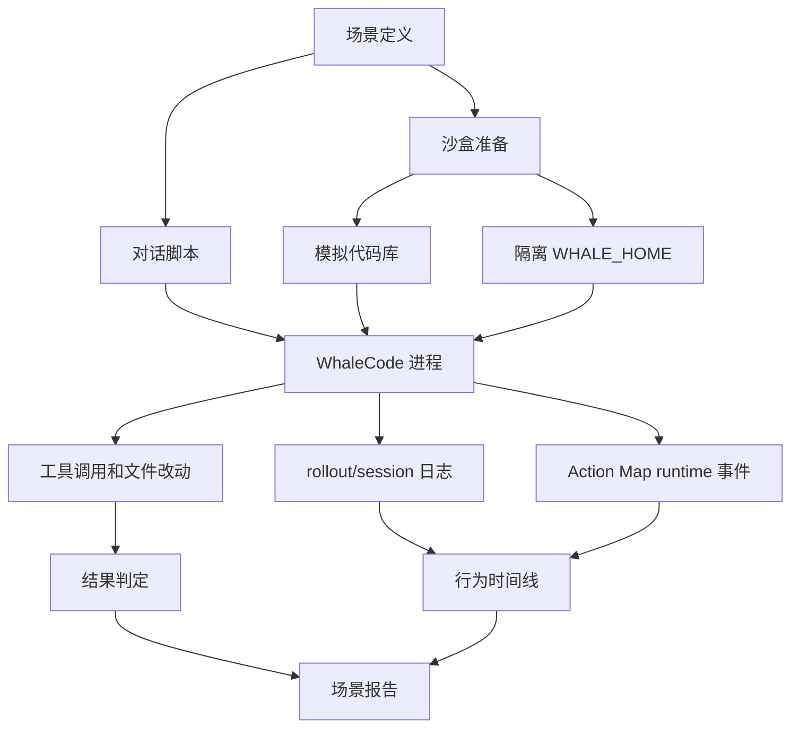
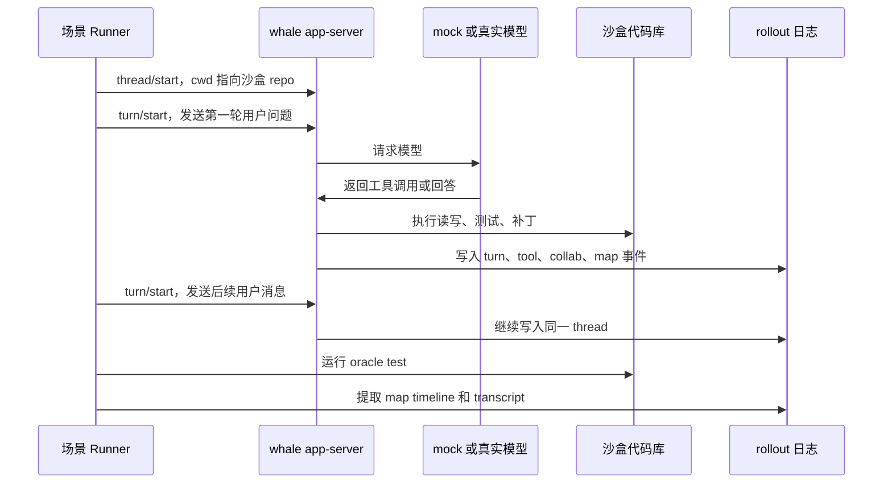

# 沙盒用户场景评测方案设计

Date: 2026-05-07

## 目标

设计一套尽量贴近真实用户解决工程问题的场景评测机制：在隔离沙盒中生成模拟代码库和问题集，通过 WhaleCode 发起多轮交谈，记录它如何理解任务、调用工具、派生 subagent、维护 Action Map，并用可回放证据判断 map runtime 是否按预期工作。

这不是自然语言“质量分”评测。第一版只评估可观察事实：

- 任务结果：测试是否通过、预期文件是否被改、禁止文件是否未被改。
- 行为路径：是否启用 experiment map mode、subagent 是否绑定 node、node 是否按依赖推进。
- 成本信号：turn 数、工具调用数、subagent 数、超时次数、运行时长、token 用量。
- 可观测性：rollout/session 日志能否还原一次任务中 map、node、lease、result 的变化。

## 当前真实路径

第一版必须复用已有基建，不新造 agent runtime、消息总线或独立持久化系统。

| 能力 | 当前代码路径 | 评测方案复用方式 |
|---|---|---|
| CLI 入口 | `third_party/codex-cli/codex-rs/cli` | 用本地构建的 `whale` 或 `cargo run -p codex-cli --bin whale` 做进程级黑盒验证 |
| 多轮会话驱动 | `third_party/codex-cli/codex-rs/app-server-test-client` | 复用 V2 `thread/start`、`turn/start`、`resume` 能力驱动多轮对话 |
| 隔离运行状态 | `WHALE_HOME` | 每个场景 run 使用独立 `WHALE_HOME`，并移除 `CODEX_HOME` |
| mock 模型 | app-server/core 测试中的 mock Responses server | 用确定性模型脚本覆盖 CI 回归路径 |
| 真实模型 | 用户本机 DeepSeek 配置 | 只做手动/探索性观察，不作为 CI 阻塞项 |
| Action Map 状态 | `core/src/action_map/runtime.rs` | 复用 `ActionMapRuntimeState`、BaseMap、lease、result ingestion |
| subagent 创建 | `core/src/tools/handlers/multi_agents_v2/spawn.rs` | 观察现有 `spawn_agent` hook 注入的 map/node/lease 前缀 |
| subagent 结果 | `core/src/agent/control.rs` | 复用 completion watcher，把 child final message 写回 node result |
| session 事件 | `protocol/src/protocol.rs` + rollout | 复用 `EventMsg` 和 rollout JSONL，不新增事件总线 |
| trace 还原 | `rollout-trace` | 后续把场景 run 输出接入现有 trace reducer，而不是单独写可视化数据模型 |

当前实现状态：

- 2026-05-07：阶段 0 已补齐最小 `MapRuntimeEvent` 事件面，map 创建、map 状态切换、node 状态切换、lease 创建/绑定/释放、node result 记录、timeout summary 请求都会进入现有 `EventMsg::MapRuntime` / rollout 路径。
- 2026-05-08：阶段 1 已落地 deterministic app-server 场景骨架，覆盖小型 bugfix 和模糊需求，产出 `report.md`、`diff.patch`、`test-output.txt`、`map-timeline.json`、`provider-requests.json`。
- 2026-05-08：阶段 2 已补上 map runtime 会话级事件路径测试，验证 `map_created`、`node_status_changed`、`lease_created`、`lease_attached`、`node_result_recorded`、`lease_released` 能从 rollout 还原；timeout summary、单 node 单 lease、close/reclaim 继续由现有 `multi_agent` 回归覆盖。
- 2026-05-08：阶段 3 已提供真实模型 exploratory 沙盒脚本 `scripts/run-action-map-exploratory-scenario.ps1`。它不进 CI，只准备沙盒、prompt、独立 `WHALE_HOME` 和报告位置，用户在 TUI 中显式执行 `/map-mode experiment` 后观察真实模型行为。
- 完整 map replay 仍不是第一步目标；当前先保证场景能从 rollout 看到真实 map 推进事实。

## 总体架构



第一版分两种运行模式：

| 模式 | 模型来源 | 用途 | 是否进 CI |
|---|---|---|---|
| deterministic | mock Responses server | 验证 map/runtime/工具/日志路径是否稳定 | 是 |
| exploratory | 用户本机真实模型 | 观察真实交谈质量和 map 使用习惯 | 否 |

## 沙盒目录结构

每次运行创建一个独立 run 目录，建议放在 `target/scenario-runs/`，不提交运行产物。

```text
target/scenario-runs/
  <scenario-id>/
    <run-id>/
      repo/              # 模拟代码库工作区
      whale-home/        # 本次 run 独立 WHALE_HOME
      model/             # mock response 脚本或请求捕获
      artifacts/
        transcript.jsonl # 用户、assistant、工具事件摘要
        rollout.jsonl    # 从 whale-home 中复制出的原始 rollout
        map-timeline.json
        diff.patch
        test-output.txt
        report.md
```

进程环境约束：

```powershell
$env:WHALE_HOME = "<run>/whale-home"
Remove-Item Env:\CODEX_HOME -ErrorAction SilentlyContinue
Remove-Item Env:\OPENAI_API_KEY -ErrorAction SilentlyContinue
Remove-Item Env:\DEEPSEEK_API_KEY -ErrorAction SilentlyContinue
```

deterministic 模式必须写入 run 级 `config.toml`，指向 mock provider，并使用 `approval_policy = "never"`。沙盒文件写入只允许发生在 `<run>/repo` 和 `<run>/whale-home`。

## 场景定义

场景以 manifest 描述，不把评测规则写死在 runner 中。

```toml
id = "bugfix-python-cache-key"
title = "修复缓存 key 导致的测试失败"
difficulty = "low"
mode = "experiment"

[fixture]
kind = "copy"
path = "fixtures/python-cache-key"

[[turns]]
user = "这个项目有一个缓存相关的测试失败，请帮我定位并修复。"

[[turns]]
user = "补一下能防止回归的测试。"

[oracle]
test_command = "pytest -q"
required_changed = ["src/cache.py", "tests/test_cache.py"]
forbidden_changed = ["README.md", "pyproject.toml"]

[expect.map]
mode_changed = "experiment"
requires_node_bound_subagents = true
min_node_results = 1
allow_restart = false
```

字段保持克制：

- `fixture` 只负责创建模拟代码库。
- `turns` 模拟用户多轮交谈。
- `oracle` 验证工程结果，不评估回答文采。
- `expect.map` 验证 map runtime 的行为约束。

## 第一批场景集

第一版不追求数量，先覆盖真实工程路径。

| 场景 | 难度 | 目标 | 关键观察点 |
|---|---|---|---|
| 小型 bugfix | low | 一个明确失败测试，修一处代码 | 是否先读代码/跑测试，是否完成冒烟 |
| 模糊需求 | low | 用户需求缺边界 | 是否停下来问问题，map 状态不强行 completed |
| 多文件重构 | medium | 消除重复逻辑并保持测试通过 | 是否拆出边界、设计、实施、审查、测试节点 |
| 配置型故障 | medium | 失败来自环境/配置而不是业务代码 | 是否用证据定位，避免乱改业务逻辑 |
| 可并行调查 | medium | 多个独立模块各有线索 | 是否生成多个可并行 ready node，subagent 各自绑定 node |
| 超时总结 | medium | mock 子任务迟迟不返回 | 是否触发 timeout summary，主 agent 决定继续/停止 |
| map restart | high | 用户要求放弃当前思路重来 | `/map-restart` 是否 abandoned 旧 map 并创建新 map |
| 复杂 debug | high | 多个误导性失败和部分红鲱鱼 | 是否控制成本，出现劣化信号时暴露给用户 |

## 对话驱动

第一版优先复用 app-server V2 测试客户端，因为它天然支持多轮 thread/turn，比 TUI 自动化更稳定。



TUI 自动化不作为第一版主路径。TUI 适合后续验证 `/map-mode`、`/map-restart` 交互呈现，但不适合作为核心回归入口。

## Map 观测事件

为了观察实际 map 运行，最小事件面需要补齐：

| 事件 | 触发点 | 用途 |
|---|---|---|
| `map_created` | experiment 下首次 spawn 或 `/map-restart` | 确认任务绑定到 map |
| `map_status_changed` | completed / abandoned | 确认生命周期 |
| `node_status_changed` | pending/ready/running/blocked/completed | 还原推进顺序 |
| `lease_created` | subagent spawn 前 claim node | 验证一个 node 同时只能被一个 agent 持有 |
| `lease_attached` | child thread 创建后 | 关联 node 与 subagent thread |
| `lease_released` | close/失败/完成后 | 防止 node 永久 running |
| `node_result_recorded` | completion watcher 写回 result | 记录子 agent 结果已进入 node context |
| `timeout_summary_requested` | wait timeout | 验证超时后强制总结机制 |

这些事件继续使用 `EventMsg::MapRuntime`，不要增加独立日志文件作为权威源。场景报告可以复制和索引 rollout，但权威记录仍来自 session/rollout。

## 判定逻辑

场景报告分三层，不混成一个质量分。

1. 工程结果：
   - oracle 命令退出码。
   - `required_changed` 是否满足。
   - `forbidden_changed` 是否未触碰。
   - 工作区是否只包含预期差异。

2. map 合规：
   - experiment 模式是否生效。
   - subagent spawn 是否带 map/node/lease assignment。
   - 同一 node 是否没有并发双 lease。
   - 依赖未完成的 node 是否没有被 claim。
   - child final message 是否记录成 node result。

3. 行为成本：
   - turn 数。
   - 工具调用数。
   - subagent 数。
   - wait timeout 次数。
   - token 用量。
   - 总耗时。

失败要输出证据，不输出泛泛结论。例如：“`node_status_changed` 中 `implement_solution` 在 `design_solution` completed 前进入 running”，比“map 质量差”更可执行。

## Runner 分阶段实现

### 阶段 0：补齐可观测事件

先补 `MapRuntimeEvent` 的最小事件面，并把 runtime 中已有的 map/node/lease/result 状态变化写入 rollout。没有这一步，沙盒只能观察 mode change，无法验证真实 map 推进。

验收：

- 单元测试覆盖每个事件构造和序列化。
- `rollout_reconstruction` 至少能恢复 mode；完整 map replay 可后续做，但事件必须先持久化。
- `rollout-trace` 不因新增 map event 失败，能标记 `map_runtime` 事件。

状态：已完成。回归入口：

```powershell
rustup run stable cargo test --lib action_map --locked
rustup run stable cargo test --lib multi_agent --locked
rustup run stable cargo test --lib map_mode --locked
rustup run stable cargo test --lib map_restart --locked
```

### 阶段 1：deterministic 场景骨架

新增 repo 内测试 runner 或脚本，先运行 2 个低难度 mock 场景：

- 小型 bugfix。
- 模糊需求。

验收：

- 每个场景创建独立 `repo` 和 `WHALE_HOME`。
- mock provider 请求可捕获。
- 产出 `report.md`、`diff.patch`、`test-output.txt`、`map-timeline.json`。
- CI 可稳定运行，不需要真实 API key。

状态：已完成。实现入口：

- `third_party/codex-cli/codex-rs/app-server/tests/suite/v2/scenario_evaluation.rs`
- `deterministic_scenario_small_bugfix_produces_artifacts_v2`
- `deterministic_scenario_ambiguous_requirement_stops_for_clarification_v2`

验证命令：

```powershell
rustup run stable cargo test -p codex-app-server --test all scenario_evaluation --locked
```

产物目录：

```text
third_party/codex-cli/codex-rs/target/scenario-runs/<scenario-id>/<run-id>/artifacts/
```

### 阶段 2：map runtime 路径覆盖

增加并行调查、timeout summary、map restart 场景。

验收：

- 至少覆盖 `map_created`、`node_status_changed`、`lease_created`、`lease_attached`、`node_result_recorded`、`lease_released`、`timeout_summary_requested`。
- 验证 “subagent 必须绑定 node”。
- 验证 “一个 node 同时只能被一个 agent 持有”。

状态：已完成第一版路径覆盖。实现入口：

- `third_party/codex-cli/codex-rs/core/tests/suite/action_map_scenario_evaluation.rs`
- `map_runtime_conversation_records_node_bound_subagent_events`
- 既有 `core/src/tools/handlers/multi_agents_tests.rs` 覆盖 `action_map_wait_timeout_requests_progress_summary_from_running_node_agent`、`action_map_close_agent_releases_node_lease_for_reclaim` 等路径。

验证命令：

```powershell
rustup run stable cargo test -p codex-core --test all map_runtime_conversation_records_node_bound_subagent_events --locked
rustup run stable cargo test --lib action_map_wait_timeout --locked
rustup run stable cargo test --lib action_map_close_agent --locked
```

说明：当前 `/map-mode experiment` 是 core/TUI 控制面，不是 app-server V2 的 `thread/start` 参数。为了避免为测试新造并行控制面，第一版把“真实 Whale 进程对话”放在 app-server deterministic 场景，把“map runtime 事件和 node-bound subagent 约束”放在 core 会话级测试。

### 阶段 3：真实模型探索

允许用户本机手动运行 exploratory 场景，使用真实 DeepSeek 配置。

验收：

- 不进入 CI。
- 报告标记模型、时间、配置、成本信号。
- 不把自然语言表现压缩成质量分，只保留 transcript 和事实证据。

状态：已完成手动探索入口。实现入口：

```powershell
.\scripts\run-action-map-exploratory-scenario.ps1
.\scripts\run-action-map-exploratory-scenario.ps1 -Launch -Model deepseek-v4-pro
```

脚本会创建：

```text
target/scenario-runs/<scenario-id>/<timestamp>/
  repo/
  whale-home/
  artifacts/
    prompt.txt
    report.md
    rollout.jsonl   # 如果本次 TUI 运行产生了 rollout
```

真实模型路径必须由用户在 TUI 中显式执行 `/map-mode experiment`，再粘贴脚本生成的 `prompt.txt`。这保持 slash command 的真实交互语义，不把 `/map-mode` 伪装成自然语言 prompt。

## 与现有测试的关系

现有 `cargo test --lib action_map/multi_agent/map_mode/map_restart` 覆盖的是 runtime 内部逻辑和 handler hook。沙盒场景覆盖的是端到端行为：

- 是否能从用户问题进入真实 session。
- 是否能在真实工作区读写和运行测试。
- 是否能在多轮会话中持续维护 map mode。
- 是否能从 rollout 还原 map 运行过程。

因此它不是替代单元测试，而是补上“模拟真实用户解决问题”的系统级证据。

## 风险与边界

- deterministic 场景只能证明协议和 runtime 路径，不证明真实模型一定聪明。
- exploratory 场景能观察真实行为，但不能作为稳定回归门禁。
- 第一版不要接入复杂可视化页面；先产出结构化 `map-timeline.json` 和 Markdown 报告。
- 不做语义检索型场景库；场景 manifest 先按目录和 id 发现，数量大以后再考虑索引。
- 不做质量分；所有判断都落到结果、协议、成本和证据。

## 后续扩展

阶段 0-3 第一版已经闭合。后续再扩展时，优先增加更多真实工程 fixtures 和 viewer 可观测页面；不要把场景库升级成语义检索系统，也不要引入自然语言质量分。
