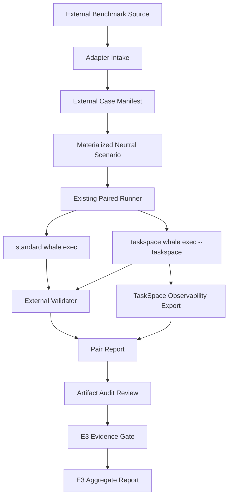

# TaskSpace E3 外部 Benchmark 接入实施计划

日期：2026-06-02

## 2026-06-02 真实试跑后的证据边界修正

`Terminal-Bench` 当前 PowerShell/Git Bash adapter 只允许作为 engineering smoke path 使用。它可以验证 source pin、task.yaml instruction 抽取、fixture materialization、Whale paired runner、pair report 这些链路是否能跑通，但它不是官方 Terminal-Bench Docker runner，也没有证明 validator source / hidden tests / solution 在 agent 执行期间不可读。

因此该路径生成的 manifest 必须满足：

- `external_benchmark.validator_fidelity.official_runner_or_equivalent = false`
- `external_benchmark.validator_fidelity.agent_cannot_read_validator_source = false`
- `external_benchmark.validator_fidelity.e3_eligible = false`
- E3 gate 必须输出 `e3_external_validator_fidelity_unproven`、`e3_external_validator_source_not_isolated` 或等价失败原因。

只有后续实现 Docker 或等价隔离运行环境，并证明 agent 只能访问初始 workspace、不能访问 validator source / hidden tests / solution，Terminal-Bench 才能进入 E3 aggregate。真实试跑还要求 metrics 记录文件级 `changed_file_inventory`，包括 path、status、size 和 SHA256；只记录 `app/` 这类未跟踪目录不满足审计要求。

## 目标

E3 的核心不是继续扩大自建场景，而是把 TaskSpace 放进外部、成熟、可验证的软件工程 benchmark 中做 paired utility 对照。

第一版实施目标：

```text
外部 benchmark 原始任务
  -> Whale standard / taskspace 成对执行
  -> 保持 prompt、fixture、validator、模型、权限、超时一致
  -> 只允许 --taskspace 是 treatment delta
  -> 记录完整执行轨迹和 TaskSpace 图
  -> 外部 validator + artifact audit review
  -> 只在证据满足门槛后进入 E3 aggregate
```

允许得出的结论必须收敛：

```text
TaskSpace 在某类外部真实软件工程任务上出现了可审计的产品收益证据。
```

不允许直接声明：

```text
TaskSpace 默认优于 standard。
TaskSpace 对所有任务都有收益。
某个小样本结果代表真实世界通用表现。
```

## 设计硬约束

1. 不自造 E3 任务集。E3 样本必须来自外部 benchmark 或历史真实失败 corpus。
2. benchmark 原始 instruction 不得改写成 TaskSpace 友好提示。
3. 用户叙事必须自然，不得出现 task、map、node、subagent、parallel 等内部概念暗示。
4. paired 对照中，standard 与 taskspace 的唯一行为差异是 `--taskspace`。
5. 不把 benchmark solution、gold patch、隐藏测试泄露给 agent。
6. 不把外部 benchmark 大量数据复制进仓库；仓库只保存 source pointer、pinned revision、sample id、checksum 和 adapter 元数据。
7. E3 不只看 pass/fail，必须保留轨迹、工具调用、成本、错误、TaskSpace 图健康、artifact audit review。
8. 缺少 artifact audit review 的结果只能是 `E3-candidate`，不能进入 E3 aggregate。
9. 外部环境、Docker、依赖安装失败必须标记为 harness/environment failure，不能混入 agent utility 结论。
10. benchmark 数据不得进入训练语料或提示模板；接入代码只做执行与评估。

## 候选 Benchmark 分层

| 优先级 | Benchmark | 适配价值 | 主要风险 | 第一阶段策略 |
|---|---|---|---|---|
| P0 | DeepSWE | 长程软件工程任务，原始任务，程序化 verifier，多语言，强匹配 TaskSpace | Harbor/Pier 环境与 Whale runner 需要打通；任务成本较高 | 先做 1 个任务 adapter spike，再做 10 任务小样本 |
| P0 | Terminal-Bench 2.x | 面向 terminal agent，原生终端环境，适合验证 Whale 端到端执行 | 任务类型混杂，部分偏 sysadmin/security，不全是 coding | 只抽 coding/file/debug/data-processing 子集 |
| P1 | SWE-bench Multilingual | 300 个真实 PR 派生任务，42 repo，9 语言，验证协议成熟 | Docker 与语言依赖复杂；部分任务可能更偏 issue repair | 先做 adapter 设计，再抽 20 个中等任务 |
| P1 | SWE-rebench | 持续更新、去污染，适合减少记忆化风险 | 数据/任务窗口会变化，版本钉住与可复现要求更高 | 先做 source intake，不急于跑大样本 |
| P2 | SWE-Lancer | 真实 freelance 软件工程任务，现实感强 | 任务获取、许可、运行成本和公开 split 范围需要确认 | 作为 E3 后续现实任务补充 |
| P2 | RoadmapBench | 版本升级、长程、多目标，最能压测 TaskSpace 任务图 | 任务巨大，成本高，初期容易被环境复杂度吞没 | 暂列压力测试，不进入 MVP |
| P2 | SpecBench | 规格设计与审查能力，适合验证 map 方法论 | 非代码执行类，自动 oracle 弱，依赖审计判断 | 作为设计/架构任务专项，不进入第一批 aggregate |
| P3 | SWE-bench Pro | 企业级长程任务，强真实感 | 公开集有限，商业/held-out 不可直接使用，成本高 | 只跟踪公开集可用性 |
| P3 | SWE-Gym | 可执行环境与训练轨迹丰富 | 更偏训练环境，Python 倾向明显，不是首选产品 eval | 不作为 E3 主证据 |
| P3 | SWE-Marathon | 极长程任务，能压测上限 | 任务过大，不适合第一阶段比较 | 未来压力实验 |

参考来源：

- DeepSWE 官方 repo 描述其包含 113 个任务，覆盖 TypeScript、Go、Python、JavaScript、Rust，并使用隔离环境和程序 verifier：https://github.com/datacurve-ai/deep-swe
- Terminal-Bench 官网描述其为 terminal environments 中的 agent benchmark，Terminal-Bench 2.0 有 89 个任务：https://www.tbench.ai/
- SWE-bench Multilingual 官方页描述其有 300 个任务、42 个仓库、9 种语言，并沿用 SWE-bench 风格评估：https://www.swebench.com/multilingual
- SWE-rebench 官方说明其为持续更新、去污染的真实软件工程任务 benchmark：https://swe-rebench.com/about
- SWE-Lancer 官方介绍其包含 1400+ 个 Upwork 真实软件工程任务：https://openai.com/index/swe-lancer/
- RoadmapBench 论文摘要描述其有 115 个版本升级长程任务、17 个仓库、5 种语言：https://arxiv.org/abs/2605.15846
- SpecBench 论文摘要描述其评估规格级推理，样本来自 Kubernetes、React、Rust、TVM、vLLM 等 RFC 过程：https://arxiv.org/abs/2605.30314
- SWE-bench Pro 论文摘要描述其包含 1865 个企业级长程任务，覆盖 41 个维护中仓库：https://arxiv.org/abs/2509.16941

## 总体架构



关键点：

- Adapter 只负责把外部 benchmark 转换成现有 runner 能理解的 scenario 形态。
- Runner 继续复用现有成对执行、变量控制、prompt guard、oracle isolation、metrics extractor、pair report。
- E3 gate 继续复用现有 `Get-TaskspaceEvidenceGate`，但补齐 artifact audit report ingestion。
- Aggregate 不读取 agent 自述，只读取运行 artifact、validator 结果和 audit report。

## 仓库产物规划

### 文档

```text
docs/testing/
  2026-06-02-taskspace-e3-external-benchmark-implementation-plan.md
  2026-06-02-taskspace-e3-real-world-utility-plan.md
  templates/taskspace-e3-human-review.md
```

本文件负责外部 benchmark 接入实施细节；原 E3 real-world utility 文档继续负责证据等级、门槛和结论边界。

### 外部样本目录

```text
benchmarks/taskspace/external/
  README.md
  catalog.json
  deepswe/
    source.json
    samples.lock.json
  terminal-bench/
    source.json
    samples.lock.json
  swebench-multilingual/
    source.json
    samples.lock.json
```

只保存：

- benchmark 名称、官方 URL、repo URL。
- pinned commit / release / dataset revision。
- sample id。
- 原始 instruction checksum。
- validator checksum。
- adapter version。
- license / usage note。

不保存：

- 大量外部任务内容。
- solution / gold patch。
- hidden tests。
- 原始 benchmark 完整数据集。

### Adapter 脚本

```text
scripts/taskspace-benchmark/adapters/
  external-benchmark-common.ps1
  deepswe-adapter.ps1
  terminal-bench-adapter.ps1
  swebench-multilingual-adapter.ps1
```

共同输出一个中立的 `external-case.json`：

```json
{
  "benchmark": "deepswe",
  "benchmark_version": "pinned commit or release",
  "adapter_version": "whale-taskspace-e3-deepswe-v1",
  "sample_id": "external sample id",
  "source_url": "official source url",
  "source_revision": "commit or dataset revision",
  "instruction_path": "...",
  "instruction_sha256": "...",
  "workspace_seed_path": "...",
  "workspace_sha256": "...",
  "validator_command": ["..."],
  "validator_sha256": "...",
  "solution_visible_to_agent": false,
  "notes": "environment/runtime constraints"
}
```

### Runner 入口

现有 `run-taskspace-benchmark.ps1` 只支持 repo 内 `benchmarks/taskspace/scenarios/<id>`。

计划改为：

```text
run-taskspace-benchmark.ps1
  -Scenario <id>               # 保留现有路径
  -ScenarioPath <path>         # 新增，允许 adapter 生成的临时 scenario
```

新增批量外部入口：

```text
scripts/taskspace-benchmark/run-taskspace-external-benchmark.ps1
  -Benchmark deepswe
  -SampleSet samples.lock.json
  -Repeats 5
  -Model deepseek-v4-flash
  -RunRoot target/taskspace-e3-external
```

`run-taskspace-external-benchmark.ps1` 只负责编排：

1. 调用 adapter materialize 一个临时 scenario。
2. 调用现有 paired runner。
3. 收集 pair report。
4. 生成 benchmark-level summary。

## Adapter 设计

### 通用转换规则

外部任务转换为内部 scenario 时，只做格式转换，不改变任务语义：

```text
external instruction -> prompt.txt
external initial workspace -> fixture/
external validator -> oracle.public_validation / external_validator
external metadata -> sample_origin + external_benchmark + e3
```

生成的 `scenario.json` 必须满足现有 schema：

```json
{
  "id": "deepswe__sample_id",
  "level": "L3",
  "evidence_target": "E3",
  "prompt_file": "prompt.txt",
  "fixture_dir": "fixture",
  "narrative_contract": "external benchmark original instruction preserved",
  "mode_delta_contract": "only --taskspace differs",
  "oracle": {
    "hidden_strategy": "external_validator",
    "public_validation": {
      "command": ["powershell", "-NoProfile", "..."]
    }
  },
  "expected": {},
  "thresholds": {},
  "sample_origin": {
    "type": "external_benchmark",
    "source": "deepswe",
    "source_version": "...",
    "sample_id": "...",
    "original_prompt_sha256": "...",
    "original_validator_sha256": "..."
  },
  "external_benchmark": {
    "name": "deepswe",
    "adapter_version": "whale-taskspace-e3-deepswe-v1",
    "original_instruction_file": "prompt.txt",
    "validator_command": ["..."]
  },
  "human_review_required": true,
  "e3": {
    "minimum_repeats": 5,
    "claim_scope": "DeepSWE long-horizon software engineering task subset"
  }
}
```

### DeepSWE Adapter

DeepSWE 任务结构包含：

```text
task.toml
instruction.md
environment/
tests/
solution/
```

第一阶段转换策略：

1. 读取 `task.toml`，提取 repo、base commit、language、image/resource metadata。
2. 读取 `instruction.md`，原样作为 `prompt.txt`。
3. 根据 `task.toml` 准备初始 workspace。
4. 不复制 `solution/` 到 agent workspace。
5. validator 在 agent 完成后应用 `tests/test.patch` 并执行 `tests/test.sh`。
6. 记录 `task.toml`、`instruction.md`、`tests/test.sh`、`tests/test.patch` checksum。

环境路径分两步：

- Spike 阶段：优先挑一个依赖最轻、能在本机 Docker/WSL 稳定运行的任务。
- Pilot 阶段：如果 Harbor/Pier 环境更可靠，则 adapter 负责调用 Harbor/Pier 准备环境，但仍由 Whale paired runner 执行 agent，不把整个评测交给外部 runner。

成功标准：

- 1 个 DeepSWE 样本可以完成 standard/taskspace paired run。
- prompt guard 通过。
- solution 不在 agent workspace。
- validator 可以独立判定两边结果。
- pair report 中 `reported_evidence_level` 至少为 `E3-candidate`；补完 audit 后可进入 `E3`。

### Terminal-Bench Adapter

Terminal-Bench 是 terminal environment 任务集合，适合验证 Whale 作为终端 agent 的真实执行能力。

第一批只选：

- coding
- file-operations
- debugging
- data-processing

暂不选：

- 需要长期 daemon 的 sysadmin 任务。
- 需要复杂网络服务或云资源的任务。
- 主要考安全破解且不贴近 Whale coding 产品目标的任务。
- 本机 Docker/WSL 不稳定的任务。

转换策略：

1. 读取 task instruction，原样作为 `prompt.txt`。
2. 使用 benchmark task environment 生成 `fixture/`。
3. validator 使用原始 verification script。
4. 记录 task category，后续 aggregate 按 category 分层。

成功标准：

- 3 到 5 个任务可稳定 materialize。
- 每个任务 standard/taskspace 各执行一次 smoke。
- 环境失败和 agent 失败可区分。
- 进入 pilot 前验证重复运行 validator 稳定。

### SWE-bench Multilingual Adapter

SWE-bench Multilingual 的价值是语言和 repo 多样性。

第一阶段不直接大规模运行，先做 adapter feasibility：

1. 钉住 dataset revision。
2. 选取 20 个中等复杂度样本，覆盖至少 4 种语言。
3. 记录 issue text checksum。
4. 保留原始 pre-solution repo snapshot。
5. Whale 执行后生成 diff。
6. 使用 SWE-bench 风格测试协议验证。

选择过滤：

- 排除安装时间极长的样本。
- 排除本机无法稳定构建的语言生态样本。
- 排除 validator 不清晰或 flaky 的样本。
- 不因 TaskSpace 偏好过滤任务。

## Artifact Audit Ingestion

当前 runner 里 `HumanReviewCompleted` 仍然硬编码为 `false`，所以 E3 只能停在 `E3-candidate`。

需要新增：

```text
scripts/taskspace-benchmark/lib/audit-report.ps1
```

职责：

1. 读取 pair 对应 audit report。
2. 校验 report 是否引用了必要 artifact。
3. 提取 review decision。
4. 提取 reviewer、date、claim_scope、disagreement。
5. 将结果传给 `Get-TaskspaceEvidenceGate`。

建议 audit report 同时支持 Markdown 与 JSON sidecar：

```text
pair-001/
  audit-review.md
  audit-review.json
```

`audit-review.json` 最小结构：

```json
{
  "reviewer": "codex | reviewer-agent | human",
  "date": "2026-06-02",
  "artifact_basis": [
    "whale-exec.jsonl",
    "metrics.json",
    "pair-report.md",
    "taskspace-observability.json",
    "validation.stdout.log"
  ],
  "decision": "include_taskspace_better",
  "claim_scope": "DeepSWE long-horizon software engineering task subset",
  "disagreement": false,
  "notes": "short audit notes"
}
```

Gate 规则：

- `decision` 为 include 类才允许进入 aggregate。
- exclude 类 decision 只进入 excluded summary。
- audit 缺失 artifact 引用时视为不完整。
- reviewer 不能只复述 agent 最后一条消息，必须基于 artifact。

## 变量控制

每个 pair 必须固定：

| 变量 | 控制方式 |
|---|---|
| Whale binary | 记录 path、version、sha256 |
| model | 两边同一模型 |
| model reasoning config | 两边同一 config override |
| sandbox mode | 两边同一 sandbox |
| timeout | 两边同一 timeout |
| initial workspace | 两边同一 workspace checksum |
| prompt | 两边同一 prompt checksum |
| validator | 两边同一 validator checksum |
| network policy | 两边同一网络策略 |
| benchmark sample | 同一 sample id |
| treatment delta | 只有 taskspace side 多 `--taskspace` |

禁止：

- taskspace side 使用更长 prompt。
- taskspace side 暗示并行、建图、拆节点。
- standard side 禁用工具或减少权限。
- 根据 standard 失败结果再修改 taskspace prompt。

## 抽样策略

### DeepSWE Pilot

```text
样本数：10
repeats：5
模型：deepseek-v4-flash
补充模型：deepseek-v4-pro 只跑争议样本或重点样本
```

分层：

- 至少 3 种语言。
- 至少 2 个中等复杂度样本。
- 至少 2 个高复杂度样本。
- 排除环境无法稳定复现的样本，但必须记录排除原因。

### Terminal-Bench Pilot

```text
样本数：5
repeats：5
模型：deepseek-v4-flash
```

分层：

- coding/file-operations/debug/data-processing 至少覆盖 3 类。
- 只选 validator 明确、运行时间可控的任务。

### SWE-bench Multilingual Pilot

```text
样本数：20
repeats：5
模型：deepseek-v4-flash
```

分层：

- 至少 4 种语言。
- 每种语言至少 3 个样本。
- 先避开明显无法在本地稳定构建的生态。

## 报告结构

每次 benchmark run 生成：

```text
target/taskspace-e3-external/<benchmark>/<timestamp>/
  run-manifest.json
  sample-lock.json
  pairs/
    <sample-id>/repeat-001/
      standard/
      taskspace/
      pair-report.md
      audit-review.md
      audit-review.json
  benchmark-summary.md
  aggregate-report.md
```

`benchmark-summary.md` 必须包含：

- benchmark 名称、版本、source revision。
- sample selection seed。
- included / excluded 样本列表。
- excluded reason 分布。
- standard/taskspace pass rate。
- taskspace better / standard better / no clear delta。
- walltime、tool call、failed tool call 分布。
- TaskSpace graph health 分布。
- audit decision 分布。
- claim scope。
- 不允许泛化声明。

## 测试计划

### Harness Regression

目的：证明接入代码不会破坏现有 E2/E3 runner。

新增测试点：

1. `-ScenarioPath` 与现有 `-Scenario` 结果等价。
2. external manifest 必填字段缺失时 gate 降级为 `E3-candidate`。
3. original prompt checksum 缺失时不能进入 E3。
4. validator checksum 缺失时不能进入 E3。
5. audit-review.json 缺失时不能进入 E3。
6. audit decision 为 exclude 时不能进入 aggregate。
7. solution path 出现在 agent workspace 时直接 fail。
8. taskspace prompt 出现内部概念时 prompt guard fail。
9. environment failure 与 agent failure 能区分。

这些 harness regression 可以使用本地小 fixture，因为它们证明的是工具链稳定性，不作为 E3 产品收益证据。

### External Smoke

目的：证明真实外部 benchmark 能跑通。

1. DeepSWE 1 个样本，standard/taskspace 各 1 次。
2. Terminal-Bench 1 个样本，standard/taskspace 各 1 次。
3. 如果环境缺失，输出明确 environment missing 报告，而不是静默跳过。

### E3 Pilot

目的：形成第一批可审计 E3 evidence。

1. DeepSWE 10 样本 x 5 repeats。
2. Terminal-Bench 5 样本 x 5 repeats。
3. 每个 pair 补 artifact audit。
4. 生成 benchmark aggregate。
5. 只按 claim scope 做结论。

## 实施阶段

### Phase 0：外部接入文档与 catalog

产物：

- 本文档。
- `benchmarks/taskspace/external/README.md`
- `benchmarks/taskspace/external/catalog.json`

验收：

- 每个候选 benchmark 都有 source URL、接入优先级、数据保存策略。
- 明确不保存 solution / hidden tests / 大量 benchmark 数据。

### Phase 1：ScenarioPath 与 external manifest 支持

改动：

- `scenario-manifest.ps1` 增加从绝对路径读取 scenario 的能力。
- `run-taskspace-benchmark.ps1` 增加 `-ScenarioPath`。
- pair report 展示 external benchmark metadata。

验收：

- 现有 E2 scenario 仍可用。
- 临时 scenario path 可用。
- `test-harness.ps1` 覆盖新增路径。

### Phase 2：Audit report ingestion

改动：

- 新增 `audit-report.ps1`。
- runner 支持读取 `audit-review.json`。
- `Get-TaskspaceEvidenceGate` 使用真实 audit completion / decision。
- aggregate report 展示 include/exclude decision 分布。

验收：

- 缺审计时保持 `E3-candidate`。
- 有 include 审计且其他门槛满足时可进入 `E3`。
- exclude 审计不进入 aggregate。

### Phase 3：DeepSWE adapter spike

改动：

- 新增 `deepswe-adapter.ps1`。
- 支持单 sample materialize。
- 支持记录 checksum 和 source metadata。

验收：

- 单个 DeepSWE 样本可完成 paired smoke。
- solution 不泄露。
- validator 可独立运行。
- 失败时能区分 environment / validator / agent / TaskSpace gate。

### Phase 4：Terminal-Bench adapter spike

改动：

- 新增 `terminal-bench-adapter.ps1`。
- 支持 task category filter。
- 支持单 sample materialize。

验收：

- 至少 1 个 coding/file/debug 类任务完成 paired smoke。
- validator 稳定。
- 不把 sysadmin/security 高噪音任务混入第一批。

### Phase 5：E3 Pilot run

执行：

- DeepSWE 10 样本 x 5 repeats。
- Terminal-Bench 5 样本 x 5 repeats。
- 每个 pair 生成 audit-review。

验收：

- aggregate 有足够 pair 进入 E3。
- 报告明确列出 excluded reason。
- 结论只覆盖本批样本与 claim scope。

### Phase 6：SWE-bench Multilingual feasibility

改动：

- 新增 `swebench-multilingual-adapter.ps1`。
- 先只做 materialization 与 validator dry run。

验收：

- 明确本机/容器运行成本。
- 确认是否适合进入第二批 E3。

## 风险与处理

| 风险 | 处理 |
|---|---|
| 外部环境过重，消耗时间远超预期 | 先 spike 单样本，不阻塞 DeepSWE/Terminal-Bench 之外的路径 |
| validator flaky | 标记 `exclude_validator_unclear`，不进入 aggregate |
| solution 泄露 | adapter 做路径检查，发现即 fail |
| prompt 被改写成 TaskSpace 友好 | prompt guard + checksum + audit 双重拦截 |
| Docker/WSL 缺失 | 输出 environment failure，不算 agent 失败 |
| benchmark 许可不清晰 | 只保存 pointer 与 checksum，不复制任务数据 |
| TaskSpace 成本高但效果不清晰 | audit decision 允许 `include_no_clear_delta` |
| 小样本过度解读 | benchmark-summary 强制 claim scope 与禁止泛化 |

## 第一批执行顺序

1. 补 `benchmarks/taskspace/external/` catalog。
2. 实现 `-ScenarioPath`，保持现有 runner 主路径不变。
3. 实现 audit ingestion，让 E3 不再永远卡在 candidate。
4. 做 DeepSWE 单样本 adapter spike。
5. 做 DeepSWE paired smoke。
6. 做 Terminal-Bench 单样本 adapter spike。
7. 做 Terminal-Bench paired smoke。
8. 跑 DeepSWE 10 样本 pilot。
9. 跑 Terminal-Bench 5 样本 pilot。
10. 再决定 SWE-bench Multilingual 是否进入第二批。

## 当前不做

- 不接入所有 benchmark。
- 不把 TaskSpace 图健康强行变成唯一收益指标。
- 不用 LLM judge 替代外部 validator。
- 不让 runtime 做语义任务筛选。
- 不在 benchmark prompt 中暴露 TaskSpace 内部概念。
- 不为了跑分改 Whale agent 行为。
