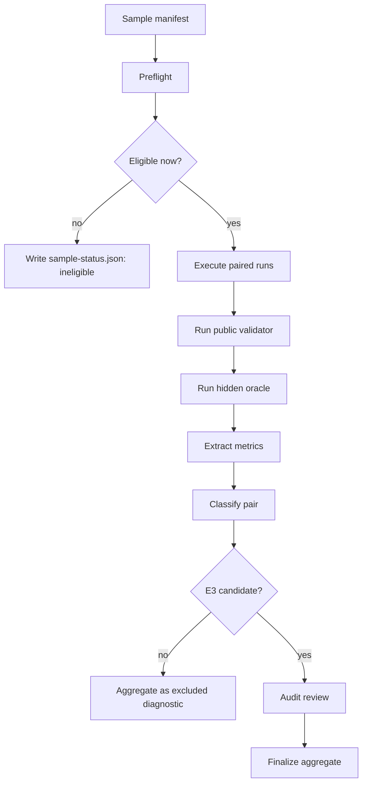

# TaskSpace P0 Benchmark Harness Failure Repair Plan

Created: 2026-06-07
Status: adversarial review integrated
Related COE: `coe/2026-06-07-05-18-taskspace-p0-benchmark-harness.md`
Related run: `D:\whalecode-alpha\target\benchp0-20260607-014707`

## 1. Current Failure Summary

The 2026-06-07 P0 Terminal-Bench attempt did not fail as a clean TaskSpace utility experiment. It failed because the benchmark harness allowed environment and bookkeeping failures to mix with agent-result evidence.

Observed failures:

| Sample | Actual State | Clean E3 Meaning |
|---|---|---|
| `processing-pipeline` | 5 pairs completed; reports are E3-candidate but lack audit review | Candidate evidence only |
| `multi-source-data-merger` | 5 pairs completed; 2 E1, 3 E2-candidate; several need manual review and E3 eligibility inspection | Diagnostic evidence only |
| `recover-accuracy-log` | Prompt guard rejected benchmark domain text containing `multi-agent` | Harness false positive |
| `query-optimize` | Standard side timed out; TaskSpace side produced output; validator build failed on HuggingFace asset; metrics then failed on locked SQLite | Environment/harness failure, not clean utility evidence |

The repair goal is not to make P0 pass by relaxing quality gates. The goal is to make every sample outcome mechanically classifiable before we use P0 as E3 evidence.

## 2. Root Causes

### RC-1 Prompt Guard Conflates Product Leakage With Domain Language

Current prompt guard treats generic terms like `multi-agent` as hard internal leakage. This catches real prompt pollution, but it also rejects external tasks that naturally discuss a multi-agent system.

Evidence:

- `scripts/taskspace-benchmark/lib/prompt-guard.ps1` includes `(?i)\bmulti-agent\b` in hard patterns.
- `recover-accuracy-log/task.yaml` uses `multi-agent system` as benchmark domain content.
- The run failed before agent execution with `Scenario prompt leaks internal TaskSpace concepts: multi-agent`.

### RC-2 External Benchmark Assets Are Not Preflighted Or Localized

`query-optimize` downloads `oewn.sqlite` from HuggingFace during Docker build. That makes the benchmark depend on live external network availability and remote asset persistence.

Evidence:

- `validation.stderr.log` shows `curl: (28) Failed to connect to huggingface.co`.
- The Dockerfile build failed before the validator could run the actual tests.

### RC-3 Metrics Extraction Is Too Fragile For Dirty Benchmark Worktrees

Changed-file inventory calls `Get-FileHash` directly for every changed path. If a large DB, generated artifact, or still-open file is locked, metrics extraction aborts the pair instead of recording partial inventory.

Evidence:

- `metrics-extractor.ps1` hashes directly through `Get-FileHash`.
- `sample-query-optimize.err.log` shows `Get-FileHash` failed on `oewn.sqlite` because another process held the file.

### RC-4 E3 Run Lifecycle Is Missing An Explicit Audit/Finalize Phase

Some pairs reach E3-candidate but are excluded only because human audit is missing. The current run path executes pairs, but the P0 orchestration did not automatically schedule audit review and finalize.

Evidence:

- `processing-pipeline/pair-001/pair-report.md` shows no evidence gate failures but `e3_human_review_not_completed`.

## 3. Design Principles

1. Do not weaken E3 gates to manufacture positive results.
2. Separate sample eligibility, agent execution, validator execution, metrics extraction, audit, and aggregation.
3. Never let environment failure become TaskSpace-vs-standard utility evidence.
4. Prefer explicit ineligible classifications over silent fallback.
5. Preserve all partial artifacts for analysis even when a sample is excluded.
6. Reuse current PowerShell harness modules; do not create a parallel benchmark runner.

## 4. Proposed Architecture



The current scripts mostly cover `D -> K`, but the boundaries are implicit. The repair should make each transition explicit and auditable.

## 5. Repair Workstreams

### Workstream A: Context-Aware Prompt Guard

Change intent:

- Keep hard rejection for Whale internal control terms.
- Downgrade domain-generic terms to `manual_review_required` or allow them through external benchmark metadata.

Suggested classification:

| Pattern Class | Examples | Behavior |
|---|---|---|
| Internal hard leak | `taskspace`, `taskspace_control`, `action map`, `map node`, `spawn_agent`, `/taskspace`, `/task-show`, `bind_node`, `lease_id` | `invalid_prompt=true` |
| Agent-operation soft terms | `multi-agent`, `multiple agents`, `split among agents`, `subagent` | `manual_review_required=true` unless explicitly allowed |
| Domain-allowed terms | sample declares `prompt_guard.allowed_domain_terms=["multi-agent"]` | not invalid; record `allowed_context_hits` |

Implementation sketch:

- Extend scenario manifest schema with optional:
  - `prompt_guard.allowed_domain_terms`
  - `prompt_guard.allowed_domain_regex`
  - `prompt_guard.expected_domain_context`
- Add prompt-source provenance for every scanned prompt span:
  - `source_kind`: `upstream_task | adapter_wrapper | generated_instruction | user_prompt`
  - `source_path`
  - `line_start` / `line_end`
  - `byte_start` / `byte_end`
  - `raw_sha256`
  - `adapted_sha256`
  - `matched_terms`
- Pass those fields into `Invoke-TaskspacePromptGuard`.
- Preserve hard hits only for internal mechanism terms.
- Apply domain allowlists only to pinned upstream benchmark task spans. They must not apply to adapter wrappers, generated prompt text, or Whale-created instructions.
- If a domain-allowed term appears together with operational internal terms such as `/taskspace`, `spawn_agent`, `bind_node`, `node_id`, or `task_id`, keep the prompt invalid.
- Add tests:
  - rejects: "use taskspace_control to create nodes"
  - rejects: "spawn subagents and bind node"
  - rejects: a prompt that mixes legitimate domain phrase `multi-agent system` with `/taskspace` or `bind_node`
  - rejects: an allowlist regex that would match generated wrapper text
  - allows/manual: Terminal-Bench `recover-accuracy-log` task text
  - allows: explicit domain allowlist for `multi-agent system`

### Workstream B: External Asset Preflight And Local Cache

Change intent:

- P0 sample eligibility should be known before agent execution.
- Remote assets must be pinned, cached, and reused locally.
- Reuse the existing Terminal-Bench uv cache pattern; do not introduce an unrelated cache subsystem.

Implementation sketch:

- Add Terminal-Bench adapter preflight:
  - inspect `Dockerfile`, `task.yaml`, and validation source for remote URLs.
  - classify remote assets with URL, source file/line, expected path, required content checksum, size, license/provenance note, and cache key.
- Add local cache directory under the run root or a stable benchmark cache:
  - `target/taskspace-benchmark-cache/terminal-bench/<task>/<sha>/...`
  - For user-specified durable cache, later consider `WHALE_BENCH_CACHE`.
- Integrate this into `scripts/taskspace-benchmark/adapters/terminal-bench-adapter.ps1`, next to the existing `terminal-bench-uv-cache.ps1` dependency cache.
- For remote assets:
  - if cached with verified checksum: inject/copy into materialized fixture before Docker build or rewrite Dockerfile to local `COPY` in the materialized scenario.
  - if not cached and network fetch fails in preflight: mark sample `ineligible_environment_remote_asset_unavailable` before agent execution.
- Add `sample-status.json` with:
  - `sample_id`
  - `status`: `eligible | ineligible | partial | completed`
  - `ineligible_reason`
  - `remote_assets`
  - `preflight_logs`

Do not let a sample start if mandatory remote assets are unavailable.

Important boundary:

- The materialized Dockerfile rewrite must be recorded in `adapter_metadata.remote_assets`.
- `external_runtime_proof` must still prove the validator is equivalent to the pinned Terminal-Bench source. A cache hit is acceptable only when the asset URL, expected checksum, actual checksum, local path, source line, source revision, injection method, Dockerfile transform diff, and post-injection tree hash are recorded.
- A Dockerfile rewrite is not automatically E3-eligible. The sample remains `environment_ineligible_until_equivalence_proven` unless the generated proof ties the rewritten fixture back to the pinned upstream source and content-addressed asset.
- The preflight must also classify non-asset network dependencies separately: base image pulls, `apt`/Ubuntu mirrors, package indexes, and runtime curl/wget calls. These are environment dependencies, not agent-result evidence.

### Workstream C: Non-Fatal Metrics Extraction

Change intent:

- Metrics extraction should never abort an already completed pair.
- File inventory should record hash failures explicitly.

Implementation sketch:

- Replace direct hash calls in changed-file inventory with a helper:
  - retry small number of times with short backoff.
  - if still locked/unreadable, record:
    - `hash_status="unavailable_locked"` or `hash_status="read_error"`
    - `hash_error`
    - file size if available
  - keep `sha256=""`.
- Add pair-level `metrics_warnings`.
- Pair classification rules:
  - hash failure alone does not invalidate agent result.
  - if the locked file is a validator fixture, hidden oracle input, or untrusted remote asset, record a pair/sample `taint` and block E3 inclusion until the artifact is re-readable and hashed.
  - metrics warnings are allowed for non-critical generated files, but critical artifact hash failure is not a soft warning.
- Warning/taint records must include raw exception text, PowerShell `FullyQualifiedErrorId`, HResult when available, retry count, file size before/after retry, and whether the path was inside a volatile directory.
- Tests:
  - locked file does not throw.
  - missing file does not throw.
  - normal file still hashes.

### Workstream D: E3 Run State Machine

Change intent:

Run orchestration should make lifecycle explicit:

```text
preflight -> execute -> classify -> audit -> finalize -> report
```

Implementation sketch:

- Add a run-level `run-status.json`:
  - `schema_version`
  - `run_id`
  - `created_at`
  - `updated_at`
  - `host`
  - `process_owner`
  - `argv`
  - selected environment snapshot
  - sample list
  - per-sample phase
  - per-sample result counts
  - per-sample lock owner and heartbeat
  - stale-lock policy and last resume decision
  - current command needed to resume
  - final aggregate readiness
- Add per-sample `sample-status.json` under the run root, not inside transient pair worktrees:
  - `schema_version`
  - `sample_id`
  - `phase`
  - `phase_started_at`
  - `phase_updated_at`
  - `phase_transition_log_path`
  - `pair_cursor`
  - `attempted_pairs`
  - `completed_pairs`
  - `ineligible_reason`
  - `environment_failure_reason`
  - `last_successful_artifact`
  - `aggregate_report_path`
  - `audit_status`
  - `finalize_idempotency_token`
  - `resume_command`
- Write `run-status.json` and `sample-status.json` atomically: write temp file, flush, then replace.
- Add append-only `events.jsonl` for every phase transition, pair start/end, validator result, metrics warning/taint, audit draft, audit completion, resume decision, and final aggregate inclusion/exclusion.
- Add per-sample lock files with heartbeat. A stale lock can be reclaimed only when the recorded process is gone or heartbeat age exceeds the configured threshold; the reclaim decision must be appended to `events.jsonl`.
- Add or extend a P0 orchestration script that:
  - skips already completed samples by status file.
  - does not rerun completed pairs unless forced.
  - writes an audit draft after execution if E3 candidates exist.
  - never marks audit as completed only because a draft exists.
  - runs finalize only after explicit audit completion or an explicit decision to exclude unaudited candidates.
  - writes a concise final report.
- Preserve current individual scripts:
  - `run-taskspace-e3-external.ps1`
  - `write-taskspace-audit-review.ps1`
  - `finalize-taskspace-e3-run.ps1`

This is orchestration around existing scripts, not a replacement harness.

Audit boundary:

- `write-taskspace-audit-review.ps1` may generate a draft and gather evidence links.
- E3 inclusion requires an explicit audit artifact with reviewer identity, timestamp, reviewed pair list, decision, and attestation that the prompt was not TaskSpace-friendly by construction.
- A generated `audit-review.json` without explicit reviewer completion must stay `audit_required`.

### Workstream E: Pair Classification Semantics

Add stable failure categories:

| Category | Meaning | Aggregate Eligibility |
|---|---|---|
| `prompt_invalid_internal_leak` | prompt reveals internal TaskSpace/test-control concepts | invalid |
| `prompt_domain_term_allowed` | domain term allowed by manifest | eligible |
| `environment_remote_asset_unavailable` | mandatory remote asset unavailable | excluded, environment |
| `validator_environment_failure` | validator could not run due environment/build/dependency | excluded, environment |
| `agent_exec_timeout_no_events` | agent timed out without JSONL events | excluded or diagnostic, depending pair policy |
| `metrics_partial_hash_unavailable` | metrics inventory incomplete but pair evidence preserved | warning |
| `metrics_critical_artifact_unhashed` | critical fixture/oracle/remote asset cannot be hashed | blocked from E3 |
| `docker_build_environment_failure` | Docker build failed before tests reached validator semantics | excluded, environment |
| `docker_backend_unavailable` | Docker daemon/WSL/backend unavailable | excluded, environment |
| `docker_base_image_unavailable` | base image pull or registry access failed | excluded, environment |
| `docker_remote_asset_fetch_failed` | Dockerfile/runtime failed on remote asset download | excluded, environment |
| `audit_required` | E3 candidate awaiting audit | not in aggregate yet |
| `audit_completed_include_*` | audit decision complete | aggregate candidate |

Aggregate reports must split denominators explicitly:

- configured samples
- eligible samples
- ineligible samples
- environment-failed samples
- attempted pairs
- completed pairs
- partial pairs
- E3 candidates
- audit-ready pairs
- E3-included pairs

No percentage may mix environment-ineligible samples with utility candidates without naming the denominator.

## 6. Validation Plan

### Unit/Harness Tests

1. Prompt guard tests:
   - internal control words still fail.
   - `recover-accuracy-log` domain text no longer hard-fails.
   - allowed domain terms are reported.
2. Remote asset preflight tests:
   - fixture with HuggingFace URL is detected.
   - missing cache marks sample ineligible before agent execution.
   - cached asset path is injected into materialized fixture.
   - checksum mismatch blocks the sample.
   - Dockerfile rewrite without equivalence proof blocks E3 inclusion.
   - base image, apt, and package-index network failures are classified separately from remote asset failure.
3. Metrics extraction tests:
   - locked file records warning, no throw.
   - normal changed file still records SHA-256.
   - locked critical fixture records taint and blocks E3 inclusion.
   - volatile benchmark directories are either excluded or recorded as scan warnings without aborting the pair.
4. Run-state tests:
   - interrupted run resumes from next incomplete sample.
   - resume works from every phase: preflight, execute, validate, metrics, classify, audit, finalize.
   - E3 candidates trigger audit/finalize phase.
   - environment-ineligible samples do not count as utility evidence.
   - generated audit draft cannot enter the E3 aggregate without explicit reviewer completion.
5. Prompt provenance tests:
   - upstream raw task phrase `multi-agent system` is allowed only when the sample manifest allows it.
   - the same phrase in adapter-generated instruction text is not covered by the upstream allowlist.
   - malicious prompt text combining domain terms with Whale control commands is rejected.

### Real Smoke Tests

1. `recover-accuracy-log` one pair:
   - Expected: passes prompt guard and starts agent execution.
2. `query-optimize` preflight:
   - Expected without cached DB: sample stops before agent execution with `environment_remote_asset_unavailable`.
   - Expected with cached DB: pair reaches validator and metrics do not fail on hash lock.
3. `processing-pipeline` one pair with audit:
   - Expected: candidate can move into aggregate after audit review.

### P0 Rerun Gate

Only rerun full P0 when:

- all smoke tests above pass.
- run-status/report can prove sample classification.
- no sample relies on live network during agent execution or validator execution.

## 7. Rollout Order

1. Implement prompt guard classification and tests.
2. Implement metrics extraction non-fatal hashing and tests.
3. Implement remote asset preflight classification.
4. Implement run status/resume/audit/finalize orchestration.
5. Run P0 smoke set.
6. Run full P0 only if smoke set is clean.

## 8. Open Questions

1. For `query-optimize`, do we want to support automatic one-time download into a local cache, or require the cache to be prepared explicitly before E3?
   - Recommendation: allow explicit cache preparation; benchmark execution itself should not depend on live network.
2. Should generic `subagent` be hard or soft in prompt guard?
   - Recommendation: hard only when combined with operational verbs or internal tool names; otherwise manual review.
3. Should audit review be automatic or require explicit human confirmation?
   - Recommendation: auto-generate audit draft, but keep E3 aggregate inclusion dependent on completed audit decision.

## 9. Adversarial Review Decisions Integrated

Two fresh internal reviewers challenged the plan before implementation. The accepted changes are:

1. Prompt guard allowlists are source-scoped, not global. This prevents a domain allowlist for Terminal-Bench source text from accidentally allowing generated wrappers or malicious task-control wording.
2. Remote asset caching is content-addressed and proof-carrying. A cached or rewritten Dockerfile is not automatically valid E3 evidence; it needs URL, checksum, source revision, transform diff, local path, and post-injection tree hash.
3. Metrics extraction uses warnings for non-critical bookkeeping failures and `taints` for critical artifact uncertainty. A locked validator fixture cannot be silently downgraded to a warning.
4. The run lifecycle is explicit and resumable. Status files are atomic, events are append-only, and stale locks are handled through recorded heartbeat/reclaim decisions.
5. Audit automation is limited to drafting. E3 aggregate inclusion requires explicit audit completion and reviewer attestation.
6. Docker and Windows operational failures are first-class classifications rather than generic validator failures.
7. Aggregate statistics must show denominator splits so a run cannot look better or worse by mixing skipped, failed, partial, and audited samples.

Deferred but tracked:

- A general benchmark-cache service is not designed here. The immediate scope is Terminal-Bench adapter support using the existing benchmark script structure.
- Browser/UI visualization of benchmark runs is out of scope for this repair; machine-readable artifacts are the priority.

## 10. Expected Outcome

After this repair, a failed P0 run should be useful. It should say precisely:

- which samples were eligible,
- which samples were ineligible and why,
- which pairs reached agent execution,
- which failures came from validator/environment,
- which pairs are E3 candidates,
- which audit decisions are still missing,
- and which data can or cannot be used for TaskSpace utility claims.

That is the minimum bar before using P0 as evidence for TaskSpace effectiveness.
