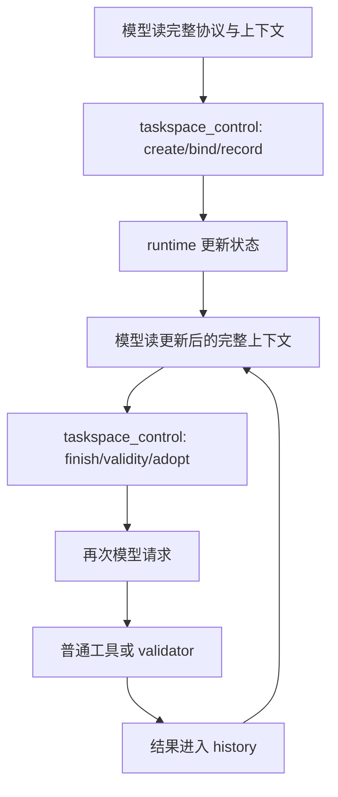
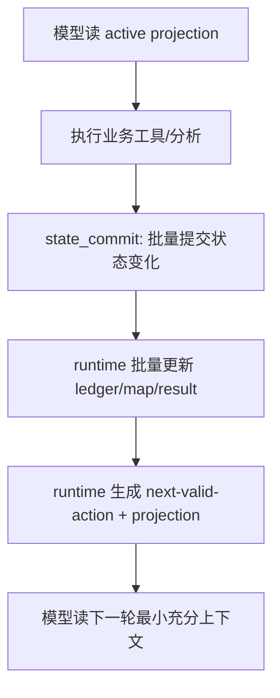

# 02. System Design Overview

## 1. 架构变化总览

v0.0.5 不推翻 v0.0.4 的 ledger / adoption / graph health / audit 基建，而是在其上增加三层：

```text
1. Protocol Compaction Layer
   将细粒度 taskspace_control 调用合并为批量 state_commit。

2. Context Projection Layer
   将完整 TaskSpace state 转换为每轮最小充分工作上下文。

3. Map Self-Management Layer
   为 map 增加 retention、compaction、salience、projection、GC 能力。
```

目标是让 TaskSpace 保持语义状态管理价值，同时不再要求模型每轮读取和维护完整结构。

## 2. 新旧执行路径对比

### v0.0.4 路径



问题：状态维护与工具执行都变成高频模型轮次。

### v0.0.5 目标路径



关键变化：

```text
state 完整性由 runtime 保证；
模型只负责语义判断；
模型不再被迫逐步维护所有 bookkeeping。
```

## 3. 核心模块

| 模块 | 作用 | v0.0.5 新能力 |
|---|---|---|
| `StateCommitV1` | 批量状态提交 | 合并 criteria/node/result/decision/adoption 更新 |
| `ContextProjectionV1` | 模型可见上下文生成 | 只注入 active working set |
| `OutputReferenceV1` | 大输出引用化 | 大 stdout/file content 变成 artifact ref |
| `MapRetentionV1` | 生命周期分类 | active / retained / archived / audit-only |
| `MapCompactionV1` | 语义压缩 | result->fact、node->phase、failure->hypothesis |
| `MapSalienceV1` | 重要性排序 | 决定哪些信息进入 projection |
| `MapGCV1` | 噪音回收 | stale/unreviewed/blocked/no-yield 出 active context |
| `ThinRoutingV1` | 低摩擦路径 | 简单/格式敏感任务先走 thin/verification-first |
| `CostSummaryV1` | 成本观测 | request count、input/request、projection size |

## 4. v0.0.5 runtime 职责重划分

### Runtime 负责

```text
- 保存完整 TaskSpace state
- 接受 state_commit 并做结构校验
- 自动维护 routine bookkeeping
- 根据 map 生成 active projection
- 大输出引用化与 artifact 管理
- graph health 驱动 GC / projection / warning
- 输出 token/time/request 观测指标
```

### 模型负责

```text
- 语义判断
- 选择当前策略
- 解释关键 decision
- 指定要采纳/废弃/延后的结果
- 产出 patch 或验证动作
- 在必要时请求展开 archived evidence
```

### 模型不再负责

```text
- 每个细粒度状态字段逐个调用工具维护
- 反复读取完整 graph / result / protocol
- 记住所有已完成节点和历史工具输出
- 在 gate rejection 中试错寻找合法动作
```

## 5. 核心数据流

```text
Tool output / subagent output / validator output
        ↓
OutputReferenceV1: 摘要 + hash + path + slices
        ↓
StateCommitV1: batch classify/adopt/reject/defer
        ↓
MapCompactionV1: result/fact/decision/criterion 归纳
        ↓
MapRetentionV1 + MapGCV1: active vs archived
        ↓
ContextProjectionV1: 最小充分工作上下文
        ↓
Model next step
```

## 6. Profile 设计

v0.0.5 应保留两个可对照 profile：

| Profile | 用途 |
|---|---|
| `taskspace-v004-legacy` | 兼容回放和对照，不作为默认 |
| `taskspace-v005-compact` | 默认新模式，启用 state_commit、projection、output refs、thin routing |

E3 必须同时能回放 v0.0.4 legacy 指标，避免优化结果与基线不可比。

## 7. 成本控制不是简单 hard stop

v0.0.5 的成本治理顺序：

```text
1. 先减少不必要请求轮次；
2. 再减少每轮上下文；
3. 再通过 routing 避免重型化；
4. 最后才用 budget guardrail 做兜底。
```

budget 不应该替代架构修复。

## 8. 版本边界

v0.0.5 完成后，系统应达到：

```text
TaskSpace 仍能记录完整审计状态；
但模型每轮只看到当前必要状态；
map 具备自我管理机制；
标准上下文替代尚不启用，只在 shadow / metric 中验证。
```
