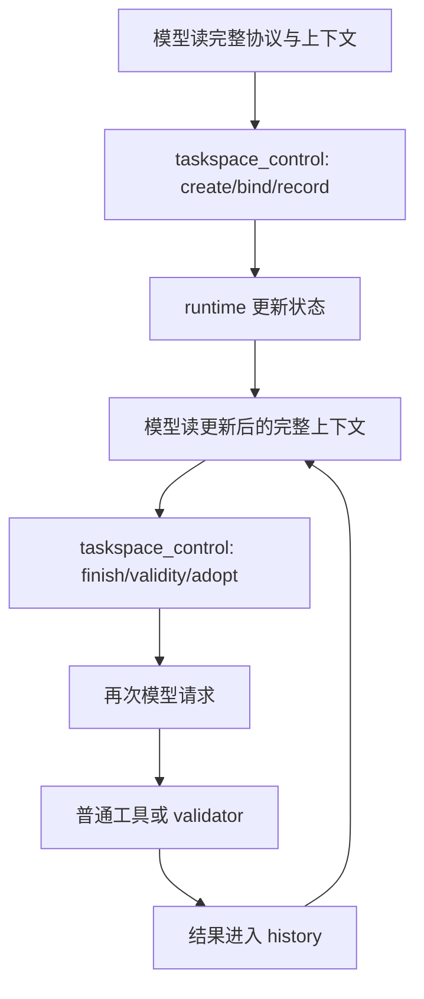
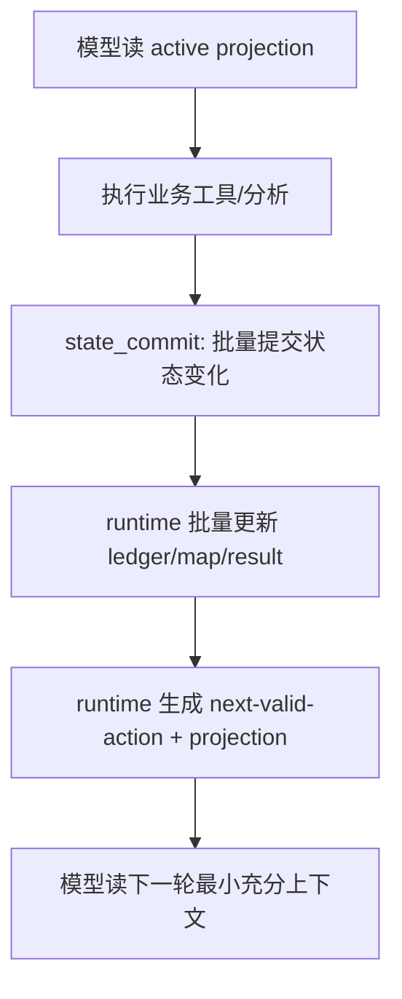

# TaskSpace v0.0.5 Design — All in One

> Correction note 2026-06-17: engineering execution is superseded by
> `13-design-corrections-and-engineering-contract.md`,
> `10-implementation-plan.md`, and `checklists/acceptance-checklist.md`.
> Regenerate this All-in-One before external distribution.

版本：v0.0.5 design draft  
日期：2026-06-16  
主题：Protocol Compaction & Map Self-Management


---

# 00. TaskSpace v0.0.5 Executive Summary

## 1. 版本定位

v0.0.5 不是继续堆 TaskSpace 结构，也不是简单加 budget hard stop。

v0.0.5 的定位是：

```text
TaskSpace v0.0.5 = Protocol Compaction + Context Replay Control + Map Self-Management Foundation
```

它要解决两个问题：

1. **运行成本问题**：v0.0.4 的 TaskSpace 模式相比 Standard 模式出现约 5x agent time 和约 20x direct input+output token；根因已经基本确认，是模型请求轮次约 9.31x 与单请求上下文约 2.16x 的乘法效应。
2. **map 管理能力问题**：当前 map 已经具备 objective / criteria / facts / decisions / adoption / graph health 等结构，但更像模型可见的结构化日志，还没有成为能够替代标准线性上下文的语义工作记忆。

## 2. 两个大目标

### 目标 A：上下文长度与轮次治理

阶段性目标：

```text
TaskSpace 收敛后的 agent walltime <= Standard 的 2x
TaskSpace 收敛后的 direct input+output tokens <= Standard 的 2x
```

这里的“收敛后”指 v0.0.5 新协议、新上下文投影、新大输出引用化、新 thin routing 启用后的 TaskSpace profile，不是 v0.0.4 的 legacy full protocol。

拆解指标：

```text
model_request_count_ratio <= 2.5x
avg_input_per_request_ratio <= 1.25x
uncached_input_ratio <= 2x
output_token_ratio <= 2x
taskspace_control_call_count <= 0.35 * v0.0.4 baseline
large_output_replay_count = 0
```

为什么先看 request count：v0.0.4 的最大乘数是模型请求轮次，而不是单次请求变慢。修复优先级必须从减少模型可见协议轮次开始。

### 目标 B：完善 TaskSpace map 自我管理能力

v0.0.5 不直接替换标准上下文。它要完成替换前置能力：

```text
map 可以保留语义状态；
artifact 可以保留原始证据；
runtime 可以压缩、投影、裁剪 map；
模型只读取当前最小充分状态。
```

本版要建立五类能力：

```text
Retention: 信息保留等级
Compaction: 多条 observation/result 压缩成 fact/decision
Salience: 按当前任务重要性排序
Projection: 每轮只投影 active working set
Garbage Collection: stale/unreviewed/blocked/no-yield 信息出 active context
```

## 3. 非目标

v0.0.5 不做：

| 非目标 | 原因 |
|---|---|
| 不直接用 map 替换标准上下文 | 当前 map 还未证明语义替代率和管理能力足够 |
| 不继续扩 benchmark 样本 | 当前瓶颈是协议成本与 map 管理，不是样本数 |
| 不继续增加 subagent 类型 | subagent ROI 未成立，先修 adoption 和 routing |
| 不做 full automatic planner | 会继续放大模型可见 orchestration loop |
| 不把 budget 作为唯一治理手段 | budget 是保险丝，不是根因修复 |
| 不把 graph health 只保留为报告项 | v0.0.5 必须让 graph health 影响收敛和上下文投影 |

## 4. 设计主线

v0.0.5 的设计主线是：

```text
减少模型可见协议轮次
  -> 批量 state_commit
  -> runtime 自动处理 routine bookkeeping
  -> gate 返回 next-valid-action 而非只拒绝

减少每轮上下文负担
  -> dynamic context projection
  -> static protocol cache / elision
  -> 大输出引用化
  -> active working set only

增强 map 自我管理
  -> retention class
  -> compaction pipeline
  -> salience score
  -> context projection
  -> GC / archive-to-audit

保持语义价值
  -> decision adoption chain
  -> result lifecycle
  -> thin / verification-first routing
  -> audit evidence 不丢失，但不进入每轮 prompt
```

## 5. 成功判定

v0.0.5 成功不是“TaskSpace 大幅超过 Standard”。它的阶段成功标准是：

```text
1. TaskSpace 成本收敛到 2x 以内，或接近 2x 且主要 outlier 可解释；
2. TaskSpace solved 不低于 Standard，且不低于 v0.0.4 的 raw 8/15 太多；
3. map active context 不随任务线性膨胀；
4. result / node / subagent debt 能被压缩、归档或废弃；
5. 大工具输出不再污染后续多轮模型上下文；
6. E3 报告能同时展示 request-count、avg-input/request、state_commit 数、projection size 和 semantic compaction 指标。
```

## 6. 版本名称建议

```text
TaskSpace v0.0.5 — Protocol Compaction & Map Self-Management
```


---

# 01. Evidence and Root-Cause Input

## 1. v0.0.4 关键事实

v0.0.4 E3 的 clean run 已经足够支撑工程诊断：

```text
Standard solved: 7/15
TaskSpace solved: 8/15
TaskSpace net gain: +1 pair
TaskSpace agent time: 4.99x Standard
TaskSpace direct input+output tokens: 19.92x Standard
Tool calls: only 1.20x Standard
high_unreviewed_result_ratio: 15/15 TaskSpace runs
high_blocked_node_ratio: 13/15 TaskSpace runs
subagent_no_decision_yield: 7/15 TaskSpace runs
```

这说明 TaskSpace v0.0.4 的工程可审计性明显改善，但产品收益和成本收益比没有成立。

## 2. 根因已经基本闭合

v0.0.4 的 token/time 膨胀不是 map 摘要本身过大，也不是 usage accounting 简单 bug。更准确的根因是：

```text
TaskSpace input token bloat
≈ model request count ratio × avg input/request ratio
≈ 9.31x × 2.16x
≈ 20.11x
```

其中：

```text
Standard model-request proxy count: 132
TaskSpace model-request proxy count: 1,229
Standard avg input/request: ~19,126 tokens
TaskSpace avg input/request: ~41,318 tokens
```

耗时也主要是 request count 驱动：

```text
Standard avg walltime/request: ~6.00s
TaskSpace avg walltime/request: ~3.22s
```

因此，v0.0.5 第一优先级不是“每轮上下文再压一点”，而是减少模型可见协议轮次。

## 3. 一阶根因：模型可见的细粒度控制协议

v0.0.4 的 TaskSpace 把问题状态管理拆成大量模型可见工具动作：

```text
finish_node = 209
mark_result_validity = 149
record_success_criteria = 114
bind_node = 61
block_node = 60
create_node = 54
record_decision = 31
adopt_result = 22
```

15 个 TaskSpace run 合计：

```text
taskspace_control calls = 850
spawn_agent calls = 68
wait_agent calls = 12
snapshot_updated events = 812
```

这些动作并不是没有价值，但它们的粒度太细，并且每一步都需要模型参与、工具调用、历史重放和下一轮推理。

### 工程解释

当前实现接近：

```text
模型读 TaskSpace protocol / context
模型调用 taskspace_control(action A)
runtime 更新状态
模型再次读上下文
模型调用 taskspace_control(action B)
...
```

v0.0.5 要改成：

```text
模型完成一个阶段推理
模型一次 state_commit 提交状态变化
runtime 批量更新 ledger/node/result/decision
runtime 自动计算 next-valid-action / projection
模型继续处理真正业务步骤
```

## 4. 二阶根因：每轮上下文变大

TaskSpace 每次请求平均 input 是 Standard 的约 2.16x。原因不是单个 map 大到不可接受，而是多类上下文叠加：

```text
standard conversation/tool history
+ TaskSpace developer protocol
+ task inventory / active task path
+ node list / current node contract
+ problem ledger
+ result summary
+ blocked/unreviewed graph health context
+ subagent summaries
+ function call / function output history
```

map/ledger 没有真正替代旧 history，而是叠加在 history 上。

## 5. 局部放大器：大工具输出重放

部分 outlier 由大工具输出进入历史后反复重放造成。例如 `analyze-access-logs pair-005`：

```text
Get-Content full access_log output: ~169KB
进入前 model input: ~16.5k tokens
进入后下一次 model input: ~105k tokens
后续请求持续 >105k tokens
```

这不是全局主因，但会与 TaskSpace 的高轮次控制循环相乘，形成局部 90x+ token outlier。

## 6. 质量根因：map 记录多，采纳少

TaskSpace v0.0.4 已经把 result/adoption/graph health 问题暴露出来，但没有解决：

```text
high_unreviewed_result_ratio: 15/15
subagent_no_decision_yield: 7/15
```

这说明 map 产生中间信息的速度超过了采纳、压缩和废弃能力。没有被采纳的 result、blocked node、stale branch 会变成 context debt。

## 7. v0.0.5 设计约束

由以上根因得到设计约束：

| 约束 | 设计响应 |
|---|---|
| 请求轮数是最大乘数 | 批量 state_commit、auto bookkeeping、next-valid-action gate |
| 每请求上下文是第二乘数 | context projection、static/dynamic split、history elision |
| 大输出会形成 outlier | output referenceization、slice-on-demand、hard output cap |
| unreviewed result 形成债务 | result lifecycle、batch adoption、GC/archive |
| map 尚未替代 history | shadow compaction、semantic projection、history replacement metrics |
| 简单任务被重型化 | thin routing、verification-first path、escalation-only TaskSpace |

## 8. 设计结论

v0.0.5 的正确工程方向是：

```text
把 TaskSpace 从模型频繁操作的显式协议，
改成 runtime 托管的紧凑状态机和语义投影系统。
```


---

# 02. System Design Overview

## 1. 架构变化总览

v0.0.5 不推翻 v0.0.4 的 ledger / adoption / graph health / audit 基建，而是在其上增加三层：

```text
1. Protocol Compaction Layer
   将细粒度 taskspace_control 调用合并为批量 state_commit。

2. Context Projection Layer
   将完整 TaskSpace state 转换为每轮最小充分工作上下文。

3. Map Self-Management Layer
   为 map 增加 retention、compaction、salience、projection、GC 能力。
```

目标是让 TaskSpace 保持语义状态管理价值，同时不再要求模型每轮读取和维护完整结构。

## 2. 新旧执行路径对比

### v0.0.4 路径



问题：状态维护与工具执行都变成高频模型轮次。

### v0.0.5 目标路径



关键变化：

```text
state 完整性由 runtime 保证；
模型只负责语义判断；
模型不再被迫逐步维护所有 bookkeeping。
```

## 3. 核心模块

| 模块 | 作用 | v0.0.5 新能力 |
|---|---|---|
| `StateCommitV1` | 批量状态提交 | 合并 criteria/node/result/decision/adoption 更新 |
| `ContextProjectionV1` | 模型可见上下文生成 | 只注入 active working set |
| `OutputReferenceV1` | 大输出引用化 | 大 stdout/file content 变成 artifact ref |
| `MapRetentionV1` | 生命周期分类 | active / retained / archived / audit-only |
| `MapCompactionV1` | 语义压缩 | result->fact、node->phase、failure->hypothesis |
| `MapSalienceV1` | 重要性排序 | 决定哪些信息进入 projection |
| `MapGCV1` | 噪音回收 | stale/unreviewed/blocked/no-yield 出 active context |
| `ThinRoutingV1` | 低摩擦路径 | 简单/格式敏感任务先走 thin/verification-first |
| `CostSummaryV1` | 成本观测 | request count、input/request、projection size |

## 4. v0.0.5 runtime 职责重划分

### Runtime 负责

```text
- 保存完整 TaskSpace state
- 接受 state_commit 并做结构校验
- 自动维护 routine bookkeeping
- 根据 map 生成 active projection
- 大输出引用化与 artifact 管理
- graph health 驱动 GC / projection / warning
- 输出 token/time/request 观测指标
```

### 模型负责

```text
- 语义判断
- 选择当前策略
- 解释关键 decision
- 指定要采纳/废弃/延后的结果
- 产出 patch 或验证动作
- 在必要时请求展开 archived evidence
```

### 模型不再负责

```text
- 每个细粒度状态字段逐个调用工具维护
- 反复读取完整 graph / result / protocol
- 记住所有已完成节点和历史工具输出
- 在 gate rejection 中试错寻找合法动作
```

## 5. 核心数据流

```text
Tool output / subagent output / validator output
        ↓
OutputReferenceV1: 摘要 + hash + path + slices
        ↓
StateCommitV1: batch classify/adopt/reject/defer
        ↓
MapCompactionV1: result/fact/decision/criterion 归纳
        ↓
MapRetentionV1 + MapGCV1: active vs archived
        ↓
ContextProjectionV1: 最小充分工作上下文
        ↓
Model next step
```

## 6. Profile 设计

v0.0.5 应保留两个可对照 profile：

| Profile | 用途 |
|---|---|
| `taskspace-v004-legacy` | 兼容回放和对照，不作为默认 |
| `taskspace-v005-compact` | 默认新模式，启用 state_commit、projection、output refs、thin routing |

E3 必须同时能回放 v0.0.4 legacy 指标，避免优化结果与基线不可比。

## 7. 成本控制不是简单 hard stop

v0.0.5 的成本治理顺序：

```text
1. 先减少不必要请求轮次；
2. 再减少每轮上下文；
3. 再通过 routing 避免重型化；
4. 最后才用 budget guardrail 做兜底。
```

budget 不应该替代架构修复。

## 8. 版本边界

v0.0.5 完成后，系统应达到：

```text
TaskSpace 仍能记录完整审计状态；
但模型每轮只看到当前必要状态；
map 具备自我管理机制；
标准上下文替代尚不启用，只在 shadow / metric 中验证。
```


---

# 03. Protocol Compaction

## 1. 背景

v0.0.4 的最大成本乘数是模型请求轮数。根因不是 `taskspace_control` 这个概念错误，而是它的粒度太细：大量 bookkeeping 被拆成模型可见工具调用。

v0.0.5 要把 TaskSpace 状态推进从：

```text
一件小事一个工具调用
```

改成：

```text
一个阶段一次批量提交
```

## 2. 设计目标

```text
taskspace_control call count <= v0.0.4 baseline 的 35%
model_request_count_ratio <= 2.5x Standard
gate retry request 显著下降
finish/validity/adoption/decision 不再分散成多轮调用
```

## 3. 新动作：`state_commit`

`state_commit` 是 v0.0.5 的核心协议压缩动作。

它一次提交以下变更：

```text
- node transition
- result validity/adoption
- known facts update
- hypothesis update
- decision creation/update
- success criteria status update
- open question close/defer
- next node / next action
- blocker resolution
```

### 例子

```json
{
  "action": "state_commit",
  "active_node_id": "node-7",
  "node_update": {
    "status": "completed",
    "summary": "Parsed validator expected output and generated local checker."
  },
  "result_updates": [
    {
      "result_id": "result-18",
      "validity": "accepted",
      "adoption": "fact",
      "summary": "Validator expects first line to contain stack trace count, not weighted total."
    },
    {
      "result_id": "result-19",
      "validity": "rejected",
      "reason": "Subagent counted weighted frames, not stack traces."
    }
  ],
  "facts": [
    {
      "fact_id": "fact-9",
      "statement": "Expected output uses stack trace count 646, not weighted frame total.",
      "evidence_refs": ["result-18"]
    }
  ],
  "decisions": [
    {
      "decision_id": "decision-4",
      "kind": "verification",
      "decision": "Regenerate output.txt using validator-compatible stack-trace count.",
      "depends_on": ["fact-9"],
      "supports_criteria": ["criterion-output-format"]
    }
  ],
  "next_action": {
    "kind": "tool",
    "summary": "Run local output checker before public validation."
  }
}
```

## 4. 兼容旧动作

v0.0.5 不立刻删除 v0.0.4 actions，而是分三类处理：

| 旧 action | v0.0.5 处理 |
|---|---|
| `record_success_criteria` | 可在 `start_task` 或 `state_commit` 内批量提交 |
| `finish_node` | 收敛到 `state_commit.node_update` |
| `mark_result_validity` | 收敛到 `state_commit.result_updates` |
| `adopt_result` | 收敛到 `state_commit.result_updates.adoption` |
| `record_fact` | 收敛到 `state_commit.facts` |
| `record_decision` | 收敛到 `state_commit.decisions` |
| `block_node` | 收敛到 `state_commit.blockers` |
| `create_node` / `bind_node` | 保留，但尽量由 runtime next-valid-action 自动建议 |

## 5. Runtime 自动 bookkeeping

以下状态可以由 runtime 自动维护，不应要求模型逐项调用：

```text
- finished node 的 result_refs 绑定
- validator output 与 active validate node 绑定
- edit action 与 patch node 绑定
- tool output artifact ref 绑定
- success criteria 与 validator pass/fail 的基础关联
- stale node age / stale result age
- graph health warning 计算
```

模型只在语义判断处介入：

```text
这个结果是否可信？
这个事实是否重要？
这个 decision 为什么成立？
这个失败是否推翻假设？
```

## 6. Gate 从 reject/retry 改为 next-valid-action

v0.0.4 中，gate 常表现为：

```text
动作不合法 -> 拒绝 -> 模型再猜下一步
```

v0.0.5 gate 输出必须包含：

```json
{
  "allowed": false,
  "reason": "final_synthesis_not_ready",
  "blocking_items": ["criterion-output-format has no evidence"],
  "next_valid_actions": [
    {
      "action": "state_commit",
      "template": "adopt validator result as evidence or waive criterion"
    },
    {
      "action": "create_node",
      "kind": "validate",
      "template": "run local output checker"
    }
  ]
}
```

这样减少模型通过多轮试错学习 TaskSpace 协议。

## 7. State commit 的粒度

一个 `state_commit` 对应一个“认知阶段结束”，而不是一个自然语言段落。

建议触发点：

```text
- 完成一次重要工具调查后
- 形成 patch decision 前
- validator 失败后需要更新假设时
- subagent 返回后进行批量采纳/废弃时
- 进入 final synthesis 前
```

不建议触发点：

```text
- 每次看到一条小事实
- 每个工具输出后立即 record
- 每个 result 单独 validity 标记
- 每个 node 状态单独 finish/bind
```

## 8. 验收指标

| 指标 | v0.0.4 baseline | v0.0.5 目标 |
|---|---:|---:|
| `taskspace_control` calls / 15 runs | 850 | <= 300 |
| `finish_node` 独立调用 | 209 | <= 50 或被 state_commit 替代 |
| `mark_result_validity` 独立调用 | 149 | <= 50 或被 state_commit 替代 |
| `record_success_criteria` 独立调用 | 114 | <= 30 或 start_task 批量化 |
| model request ratio | 9.31x | <= 2.5x |
| gate retry count | 新增统计 | 比 v0.0.4 下降 >= 70% |

## 9. 实施顺序

```text
Phase 1.1: 新增 state_commit schema 和 handler
Phase 1.2: 保持旧 action 兼容，但报告 legacy-action usage
Phase 1.3: prompt 改为优先 state_commit
Phase 1.4: runtime 自动绑定 routine result/edit/validator evidence
Phase 1.5: gate 返回 next_valid_actions
Phase 1.6: E3 小样本对比 taskspace_control call count
```

## 10. 设计风险

| 风险 | 缓解 |
|---|---|
| state_commit 太大，模型难填 | 提供模板和允许 partial commit |
| 批量提交导致错误一起进入状态 | runtime 校验 dependency refs，commit 可局部接受/拒绝 |
| 旧 prompt 仍使用旧 action | legacy action 计数报警，逐步 soft-deprecate |
| 过度自动 bookkeeping 误归因 | 所有 auto-link 产出 trace event，便于 audit |


---

# 04. Context Projection and Replay Control

## 1. 背景

v0.0.4 的第二个成本乘数是每次模型请求的输入变大。更重要的是，TaskSpace 状态并没有替代标准 history，而是叠加到了标准 history 上。

v0.0.5 的目标不是删掉 TaskSpace 状态，而是把完整状态拆成：

```text
runtime/audit 可见的完整状态
模型每轮可见的最小充分状态
```

## 2. 核心原则

```text
完整 map 是数据库，不是 prompt。
完整 trace 是审计证据，不是每轮推理材料。
原始大输出是 artifact，不是 history。
模型每轮只需要 active working set。
```

## 3. Context ProjectionV1

每轮模型请求前，runtime 根据当前 task state 生成 projection。

### Projection 分区

```text
1. Active Objective
2. Active Success Criteria
3. Current Node / Current Phase
4. Blocking Questions / Current Risks
5. Adopted Decisions
6. Top Relevant Facts
7. Latest Validator State
8. Relevant Result Summaries
9. Next Valid Actions
10. Hidden but available evidence refs
```

### 默认不进入 projection

```text
- completed stale nodes
- unreviewed raw result bodies
- rejected subagent outputs
- old shell stdout/stderr
- full graph edge list
- full success criteria history
- all prior taskspace_control calls
- full subagent transcript
- full validator logs
```

这些仍保存在 artifact/audit/map 中，但不进入模型 active context。

## 4. Static / Dynamic context split

TaskSpace context 分为：

| 类型 | 处理 |
|---|---|
| Static protocol | 只在进入 TaskSpace 或重大模式切换时注入；优先 prompt-cache；不每轮重述 |
| Dynamic state | 每轮生成短 projection |
| Evidence detail | 引用化，按需展开 |
| Debug/audit detail | 不进入模型；只进入 artifact/viewer/report |

v0.0.4 中 `build_developer_context` 会构造模型可见 TaskSpace protocol、task inventory、active task path、node list、current node contract、collaboration guidance。v0.0.5 应拆解为 static protocol + dynamic projection。

## 5. OutputReferenceV1

大工具输出必须引用化。规则：

| 输出大小 | 默认处理 |
|---:|---|
| <= 8KB | 可直接返回模型 |
| 8KB - 50KB | 摘要 + head/tail + artifact ref |
| 50KB - 150KB | 默认 artifact ref + summary；模型需显式 request_slice |
| >150KB | 禁止直接进入 history；必须 artifact ref + sampling/slicing |

### 返回结构

```json
{
  "output_ref": "artifact://tool-output/result-42.txt",
  "sha256": "...",
  "bytes": 169047,
  "summary": "Access log with ~N lines. Contains HTTP method, path, status, and timestamp fields.",
  "head": "first 20 lines...",
  "tail": "last 20 lines...",
  "suggested_slices": [
    {"name": "status_distribution", "command": "..."},
    {"name": "sample_errors", "command": "..."}
  ],
  "raw_output_elided": true
}
```

## 6. Slice-on-demand

模型可以请求：

```text
- line range
- grep pattern
- head/tail
- statistical summary
- structured parse
```

但不能默认把全文塞回 context。

## 7. History elision 前置能力

v0.0.5 不直接替换标准上下文，但要开始做 shadow elision：

```text
每次 projection 生成时，标记哪些旧 messages 可以由 map state 替代。
```

输出指标：

```text
history_tokens_retained
history_tokens_shadow_elidable
projection_tokens
context_replacement_potential = shadow_elidable / projection_tokens
```

这个指标为 v0.0.6/0.0.7 真正替换标准上下文做准备。

## 8. Projection size budget

每轮 projection 目标：

```text
active objective: <= 300 tokens
criteria summary: <= 500 tokens
current node/phase: <= 500 tokens
facts/decisions: <= 1500 tokens
result summaries: <= 1500 tokens
next valid actions: <= 500 tokens
warnings/blockers: <= 500 tokens
```

默认 projection 总大小目标：

```text
<= 5k tokens for thin
<= 8k tokens for standard
<= 12k tokens for deep
```

如果超过预算，runtime 必须进行 compaction 或只保留 high-salience items。

## 9. Replay control

新增 replay guard：

```text
large_output_replay_count
replayed_tool_output_bytes
replayed_taskspace_control_history_tokens
replayed_graph_snapshot_tokens
```

v0.0.5 验收：

```text
large_output_replay_count = 0
full raw output >50KB 不得出现在下一轮模型 prompt
completed old taskspace_control history 不得全文进入 projection
```

## 10. 验收指标

| 指标 | v0.0.5 目标 |
|---|---:|
| avg_input_per_request_ratio | <= 1.25x Standard |
| max_input_per_request | 比 v0.0.4 top outlier 下降 >= 70% |
| large_output_replay_count | 0 |
| projection_tokens p95 | <= profile budget |
| raw tool output >50KB in prompt | 0 |
| history_shadow_elidable measured | 100% TaskSpace runs |

## 11. 设计风险

| 风险 | 缓解 |
|---|---|
| 摘要丢失关键信息 | artifact ref + slice-on-demand + hash 保证可回读 |
| projection 太短导致模型失忆 | salience scoring + active blocker/decision 强制保留 |
| 大输出引用化影响日志类任务 | 提供 structured summary / grep / slice tools |
| hidden history elision 与标准上下文冲突 | v0.0.5 只做 shadow，不实际替换 |


---

# 05. Map Self-Management

## 1. 目标

v0.0.5 的 map 不直接替换标准上下文，但要具备替换所需的管理能力。

目标不是让 map 更大，而是让 map 能回答：

```text
什么信息应该继续 active？
什么信息应该压缩？
什么信息应该归档？
什么信息应该只保留 audit 引用？
什么信息可以安全从模型上下文里消失？
```

## 2. 当前缺口

v0.0.4 的 map 已经能记录：

```text
objective
success criteria
facts
decisions
result validity/adoption
graph health
```

但还缺：

```text
retention class
compaction operators
salience score
projection policy
GC / archival lifecycle
semantic replacement metric
```

因此当前 map 更像结构化日志，而不是上下文管理系统。

## 3. Retention Class

每个 map item 都应有 retention class。

```text
Active: 当前推理必须看到
Retained: 重要，但当前不必每轮看到
Archived: 已压缩/过期，可按需展开
AuditOnly: 只用于审计，不进入模型上下文
Discarded: 明确废弃，不再使用
```

### 默认分类

| 对象 | 默认 retention |
|---|---|
| objective | Active |
| active success criteria | Active |
| satisfied criteria | Retained |
| accepted decision | Active/Retained，取决于是否相关当前 node |
| rejected hypothesis | Archived |
| raw tool output | AuditOnly |
| large stdout/stderr | AuditOnly |
| stale blocked node | Archived |
| unreviewed result older than N steps | Retained -> Archived |
| rejected subagent result | Archived/AuditOnly |

## 4. Compaction Operators

map 必须有显式压缩算子。

### Result Collapse

```text
多个 raw results -> 一个 accepted fact / rejected finding
```

示例：

```text
result-12: grep output
result-13: validator failure text
result-14: local checker output
=> fact-5: expected first line is stack trace count, not weighted frame total
```

### Node Collapse

```text
多个 completed nodes -> 一个 phase summary
```

示例：

```text
nodes: inspect logs, parse format, run checker
=> phase-summary: output format understood; parser strategy chosen
```

### Failure Collapse

```text
多个失败尝试 -> 一个 rejected hypothesis
```

示例：

```text
hypothesis: weighted total should be reported
status: rejected
reason: validator expects count 646
```

### Subagent Collapse

```text
多个 subagent raw outputs -> accepted/rejected evidence summary
```

### Validation Collapse

```text
多次 validator stdout/stderr -> latest validation state + failure class
```

## 5. Salience Score

每个 map item 计算 salience，用于决定 projection。

建议因素：

```text
+ 当前 node 直接依赖
+ 支撑 active success criterion
+ 关闭 blocking open question
+ 支撑 patch decision
+ 最近 validator failure
+ 推翻旧假设
+ 用户明确约束
- 已被 rejected / superseded
- 无 decision adoption
- stale age 高
- audit-only
```

输出：

```json
{
  "item_id": "fact-9",
  "salience": 0.92,
  "reasons": ["supports_current_decision", "validator_failure_related"]
}
```

## 6. Projection Policy

projection 不是完整 map，而是从 map 投影出来的 active working set。

默认规则：

```text
1. objective 必保留
2. active criteria 必保留
3. current node 必保留
4. current blockers 必保留
5. top K accepted decisions 按 salience 保留
6. top K facts 按 salience 保留
7. latest validator state 必保留
8. unreviewed results 只保留数量和 top risky items，不保留全文
9. stale/archive/audit-only 不进入 projection
```

## 7. Garbage Collection

GC 不一定删除，可以是状态转移：

```text
Active -> Retained
Retained -> Archived
Archived -> AuditOnly
Rejected -> Discarded/AuditOnly
```

触发条件：

```text
- node completed and phase summary exists
- result adopted/rejected/deferred
- result age > N steps and no dependency
- blocked node has no path after synthesis checkpoint
- subagent no-yield after review
- decision superseded by newer decision
```

## 8. Map Self-Management Checkpoint

每个阶段结束时 runtime 自动运行：

```text
1. classify new results
2. suggest compaction candidates
3. identify stale nodes
4. update salience scores
5. produce next projection
6. record GC trace event
```

模型只需要对语义不确定的项做判断。

## 9. Shadow Replacement Metrics

v0.0.5 不实际替换标准上下文，但要测 map 替代潜力：

```text
semantic_replacement_rate:
  final decisions explainable from map / all final decisions

history_shadow_elidable_tokens:
  old history tokens covered by map facts/decisions/summaries

active_context_convergence:
  projection size does not grow linearly with elapsed turns
```

## 10. 验收指标

| 指标 | 目标 |
|---|---:|
| 100% map items have retention class | 是 |
| 100% TaskSpace runs produce projection | 是 |
| unreviewed result active count | 比 v0.0.4 下降 >= 60% |
| stale blocked nodes in final projection | 0 |
| semantic replacement rate | >= 70% |
| projection size growth | sublinear / bounded |
| archived raw output with artifact refs | 100% large outputs |

## 11. 后续版本接口

v0.0.5 完成后，v0.0.6/0.0.7 可以开始试验：

```text
older history actual elision
map-backed conversation compaction
standard context replacement in controlled profiles
```

但 v0.0.5 只做 shadow metrics，不直接切换。


---

# 06. Routing, Thin Path, and Verification-First Workflow

## 1. 背景

v0.0.4 说明 TaskSpace 不同任务收益差异明显：

```text
analyze-access-logs: TaskSpace 5/5，Standard 4/5，但成本极高
log-summary: TaskSpace 3/5，Standard 3/5，subagent 多但净收益不稳定
count-call-stack: 双方 0/5，TaskSpace 更贵但没有形成新路径
```

这说明 TaskSpace 不能所有任务都走同一套重型协议。

## 2. 设计目标

v0.0.5 增加 TaskShapeRouterV1，把任务分到：

```text
thin
default-compact
verification-first
subagent-assisted
deep
```

本版重点不是自动精准，而是避免明显低收益任务被重型化。

## 3. Task Shape 分类

### Thin

适用：

```text
- 单文件或少量文件
- 目标明确
- 不需要并行调查
- validator 明确
- 标准模式通常能快速处理
```

行为：

```text
- 不创建大 graph
- 不默认 spawn subagent
- success criteria 批量初始化
- state_commit 低频
- 只在失败或 ambiguity 时升级
```

### Verification-first

适用：

```text
- parser/output-format 敏感任务
- validator failure 文本对成败关键
- 任务本身不难，但格式要求精确
```

典型：`count-call-stack`。

行为：

```text
1. 先读取测试/validator/expected format
2. 记录 expected format decision
3. 生成本地 checker 或最小验证脚本
4. 生成产物
5. 本地 checker 通过后再 public validation
6. validator 失败后必须产生 revised decision
```

### Default-compact

适用：中等复杂度、多步但不需要多 agent。

行为：

```text
- state_commit
- compact projection
- result lifecycle
- limited graph
```

### Subagent-assisted

适用：

```text
- 多证据轨
- 可并行独立检查
- subagent artifact 可以明确验收
```

行为：

```text
- spawn 前必须有 decision_target
- subagent result 必须 review/adopt/reject/defer
- no-yield 后停止同类 spawn
```

### Deep

适用：高不确定、多模块、多阶段工程任务。

v0.0.5 不以 deep 为默认优化目标。

## 4. Router 输入

```json
{
  "task_prompt_features": {
    "file_scope": "small|medium|large",
    "output_artifact_required": true,
    "format_sensitive": true,
    "validator_visible": true,
    "multi_source": false,
    "code_patch_required": false,
    "ambiguity": "low|medium|high"
  },
  "observed_runtime_features": {
    "validator_failure_seen": false,
    "large_output_seen": false,
    "uncertainty_increased": false
  }
}
```

## 5. Router 输出

```json
{
  "recommended_mode": "verification-first",
  "confidence": "medium",
  "reason": "task requires exact output.txt format and validator tests are available",
  "initial_constraints": {
    "subagent_allowed": false,
    "node_budget": 4,
    "state_commit_budget": 4,
    "large_output_policy": "ref-only",
    "must_read_validator_first": true
  }
}
```

## 6. Escalation policy

thin / verification-first 可以升级，但必须有触发条件：

```text
- validator failure after local self-check
- multiple incompatible hypotheses
- evidence source too large for single agent
- ambiguity cannot be resolved by local inspection
- repeated local checker failure
```

升级后不是进入 legacy full TaskSpace，而是进入 `default-compact`。

## 7. Downgrade / stay-thin policy

当任务已经有明确 patch path 或产物 path 时，保持 thin：

```text
- success criteria clear
- no open blocking question
- no need for subagent
- local checker available
```

不要因为 TaskSpace enabled 就自动扩 graph。

## 8. 验收指标

| 指标 | 目标 |
|---|---:|
| `count-call-stack` 进入 verification-first | 100% |
| thin/default/deep routing 输出存在 | 100% TaskSpace runs |
| thin task subagent spawn | 0 by default |
| thin task state_commit_count | <= 4 before first validation |
| verification-first expected-format decision | 100% parser/format tasks |
| validation failure -> revised decision | 100% verification-first failed runs |

## 9. 风险

| 风险 | 缓解 |
|---|---|
| router 误判复杂任务为 thin | 允许 validator failure / ambiguity 升级 |
| verification-first 增加前置成本 | 只对 format-sensitive 任务启用 |
| subagent 被过度抑制 | high-uncertainty / multi-source 可转 subagent-assisted |


---

# 07. Decision Adoption and Result Lifecycle

## 1. 背景

v0.0.4 让 result adoption 变得可观测，但没有让它成为收敛机制。结果是：

```text
high_unreviewed_result_ratio: 15/15
subagent_no_decision_yield: 7/15
```

v0.0.5 要把 adoption 从“额外记账”改成“map 自我管理和上下文收敛”的核心机制。

## 2. Result Lifecycle

每个 result 必须进入以下生命周期之一：

```text
New
AcceptedAdopted
AcceptedRetained
Rejected
Deferred
Archived
AuditOnly
```

含义：

| 状态 | 含义 | 是否进入 active projection |
|---|---|---|
| New | 新结果，尚未处理 | 只短期进入，且数量受限 |
| AcceptedAdopted | 已采纳，支撑 fact/decision/criterion | 可进入 |
| AcceptedRetained | 可信但暂不支撑当前 decision | 按 salience 进入 |
| Rejected | 明确不使用 | 不进入 |
| Deferred | 暂缓，需条件触发 | 只保留摘要 |
| Archived | 已压缩或过期 | 不进入 |
| AuditOnly | 仅审计证据 | 不进入 |

## 3. 批量 Review

result review 不应一个 result 一个工具调用。

在 `state_commit` 中批量处理：

```json
{
  "result_updates": [
    {"result_id": "r1", "validity": "accepted", "adoption": "fact", "fact_id": "f1"},
    {"result_id": "r2", "validity": "rejected", "reason": "stale duplicate"},
    {"result_id": "r3", "validity": "deferred", "condition": "only revisit if validator fails"}
  ]
}
```

## 4. Decision Dependency Chain

每个 patch / validation / synthesis decision 必须有 why-chain：

```text
decision -> facts/results -> criteria/questions -> validation evidence
```

最小要求：

```text
patch decision:
  depends_on >= 1 accepted fact or result
  supports >= 1 success criterion
  created_by current node or phase summary

final synthesis:
  cites accepted decisions
  cites validation state or waiver
  unresolved blockers are explicit
```

## 5. Unreviewed Debt Policy

unreviewed result 不要求全部 review，但不能无限 active。

规则：

```text
New result active age <= N model requests
超过 N 后必须：accept / reject / defer / archive
```

建议初始：

```text
N = 3 state_commits 或 6 model requests
```

## 6. Subagent result policy

subagent result 必须明确处理：

```text
accepted -> 支撑 fact/decision
rejected -> 原因记录
explicitly deferred -> 触发条件记录
```

如果连续 K 个 subagent result 没有 decision yield：

```text
同类 subagent spawn 禁止，直到主 agent 解释新的 decision target。
```

建议：

```text
K = 2
```

## 7. Adoption 和 context projection 绑定

只有这些 result 可以进入 active projection：

```text
AcceptedAdopted
AcceptedRetained with high salience
Deferred only if its condition is active
```

New result 默认只进入短窗口；Rejected/Archived/AuditOnly 不进入。

## 8. 验收指标

| 指标 | 目标 |
|---|---:|
| high_unreviewed_result_ratio | 不再 15/15，下降 >= 60% |
| accepted_adopted_result_count | > 0 in 100% solved TaskSpace runs |
| subagent_decision_yield | 可计算，且 subagent-heavy runs > 0 |
| unreviewed active result age p95 | <= policy N |
| final synthesis decision chain | 100% |
| patch decision without support | 0 |

## 9. 注意事项

adoption 不能变成更多模型轮次。因此：

```text
- 必须走 state_commit 批量提交
- routine classification 可由 runtime 建议
- 模型只处理语义不确定项
```


---

# 08. Observability and Budget Metrics

## 1. 背景

v0.0.4 的成本根因之所以能确认，是因为本机分析补齐了 rollout/token-count/request proxy 的拆解。但这些指标还不是一等公民。

v0.0.5 必须把成本指标纳入 pair/sample/suite artifact，否则无法判断 2x 目标是否达成。

## 2. 新 artifact

### `token-summary.json`

每个 side 输出：

```json
{
  "mode": "taskspace",
  "input_tokens": 50780045,
  "cached_input_tokens": 50119296,
  "uncached_input_tokens": 660749,
  "output_tokens": 293242,
  "reasoning_output_tokens": 82420,
  "model_request_count": 1229,
  "avg_input_per_request": 41318,
  "max_input_per_request": 104989,
  "avg_output_per_request": 238,
  "taskspace_control_count": 850,
  "state_commit_count": 0,
  "largest_tool_output_bytes": 169047,
  "large_output_replay_count": 1
}
```

### `context-projection-summary.json`

```json
{
  "projection_count": 44,
  "avg_projection_tokens": 6200,
  "p95_projection_tokens": 8800,
  "active_item_count_avg": 14,
  "archived_item_count": 53,
  "audit_only_item_count": 20,
  "history_shadow_elidable_tokens": 120000,
  "context_replacement_potential": 2.4
}
```

### `state-management-summary.json`

```json
{
  "state_commit_count": 8,
  "legacy_action_count": 12,
  "auto_bookkeeping_events": 31,
  "gc_events": 9,
  "compaction_events": 7,
  "result_lifecycle": {
    "new": 3,
    "accepted_adopted": 8,
    "accepted_retained": 4,
    "rejected": 12,
    "deferred": 2,
    "archived": 20,
    "audit_only": 6
  }
}
```

## 3. Pair-level ratio report

每个 pair 输出：

```text
TaskSpace / Standard agent walltime
TaskSpace / Standard direct input+output tokens
TaskSpace / Standard uncached input
TaskSpace / Standard output tokens
TaskSpace / Standard model request count
TaskSpace / Standard avg input/request
TaskSpace / Standard tool calls
```

## 4. 2x 目标口径

v0.0.5 的主口径：

```text
TaskSpace direct input+output tokens <= 2x Standard
TaskSpace agent walltime <= 2x Standard
```

辅助口径：

```text
model_request_count_ratio <= 2.5x
avg_input_per_request_ratio <= 1.25x
uncached_input_ratio <= 2x
output_token_ratio <= 2x
```

允许 caveat：

```text
如果 public validator 或 Docker 是 suite bottleneck，不影响 TaskSpace/Standard agent-side ratio 判定。
```

## 5. Budget guardrail 作为保险丝

v0.0.5 可以保留 budget guardrail，但它不是主修复。

触发条件：

```text
- model_request_count > profile_limit 且 no new decision/adoption
- taskspace_control_count > profile_limit 且 no patch/validation progress
- projection_tokens > profile_budget for 2 consecutive turns
- large output >50KB would enter prompt
- no-yield subagent result count >= 2
```

动作：

```text
warn -> compact -> state_commit checkpoint -> thin downgrade -> hard stop
```

不要直接 hard stop，除非已经尝试 compaction/downgrade。

## 6. Cost-to-value metrics

v0.0.5 报告必须包含：

```text
extra_solved_pairs
extra_agent_minutes
extra_direct_tokens
extra_uncached_tokens
extra_tokens_per_additional_solved_pair
model_requests_per_decision
state_commits_per_decision
tokens_per_accepted_adopted_result
tokens_per_satisfied_criterion
```

## 7. 验收看板

建议 E3 aggregate 输出：

```text
[PASS/FAIL] cost target <=2x
[PASS/FAIL] model_request_ratio <=2.5x
[PASS/FAIL] avg_input_per_request_ratio <=1.25x
[PASS/FAIL] state_commit adoption >=80% of state updates
[PASS/FAIL] large output replay = 0
[PASS/FAIL] high_unreviewed reduced
[PASS/FAIL] solved not regressed beyond tolerance
```

## 8. 报告分层

| 层级 | artifact |
|---|---|
| side | `token-summary.json`, `context-projection-summary.json`, `state-management-summary.json` |
| pair | `pair-cost-report.md`, `pair-value-report.md` |
| sample | `sample-cost-summary.json`, `sample-routing-summary.json` |
| suite | `suite-cost-gate.json`, `suite-value-gate.md` |

## 9. 不再只看 total tokens

报告必须区分：

```text
accounting tokens
cached input tokens
uncached input tokens
output tokens
request count
context size
projection size
```

否则仍会混淆“缓存命中但 workload 大”和“实际不可承受成本”。


---

# 09. E3 Validation Plan

## 1. 验证目标

v0.0.5 E3 不以“扩大样本”为目标。它验证两件事：

```text
1. TaskSpace 收敛成本是否进入 2x 阶段目标；
2. map 自我管理能力是否开始具备上下文替代前置条件。
```

## 2. 样本范围

继续使用 v0.0.4 的三个任务，保持可比性：

```text
analyze-access-logs
log-summary
count-call-stack
```

原因：

| 样本 | 用途 |
|---|---|
| analyze-access-logs | 验证保留 TaskSpace 可靠性收益，同时压低 outlier |
| log-summary | 验证 subagent/adoption/decision yield |
| count-call-stack | 验证 thin + verification-first 是否改变失败路径 |

## 3. 运行矩阵

最小矩阵：

```text
standard: 5 pairs/sample
v004-legacy-taskspace: optional replay or historical baseline
v005-compact-taskspace: 5 pairs/sample
```

如果运行成本有限，先跑：

```text
analyze-access-logs: pair 001, 005
log-summary: pair 001, 003, 004, 005
count-call-stack: all 5 pairs
```

## 4. 发布门槛

### Hard gates

```text
engineering_clean = true
suite_score_valid = true
large_output_replay_count = 0
state_commit enabled in 100% TaskSpace runs
context projection generated in 100% TaskSpace runs
token-summary.json present in 100% sides
```

### Cost gates

```text
TaskSpace / Standard direct input+output <= 2x target
TaskSpace / Standard agent walltime <= 2x target
model_request_count_ratio <= 2.5x
avg_input_per_request_ratio <= 1.25x
```

允许阶段性判定：

```text
PASS: all cost gates pass
PARTIAL: main ratio <=3x and root cause outlier isolated
FAIL: main ratio remains >5x or model_request_ratio remains >5x
```

### Quality gates

```text
TaskSpace solved >= Standard solved - 1
TaskSpace does not regress analyze-access-logs below Standard
count-call-stack must show verification-first workflow evidence
log-summary subagent-heavy runs must show decision yield or stopped spawn
```

### Map management gates

```text
100% map items have retention class
projection size p95 within profile budget
semantic replacement rate measured
unreviewed active result count reduced >=60%
stale blocked nodes not active in final projection
```

## 5. Expected outcomes

### Strong success

```text
TaskSpace solved >= Standard solved
TaskSpace cost <=2x
high_unreviewed_result_ratio falls substantially
count-call-stack shows improved path or at least lower-cost failure
```

### Engineering success but product partial

```text
cost <=2x
map management works
solved slightly regresses or remains tied
```

This is acceptable for v0.0.5 if regression is explained and v0.0.6 can focus on utility.

### Failure

```text
model_request_count still >5x
full raw output still enters prompt
state_commit not adopted
projection grows linearly
map remains structured log rather than managed memory
```

## 6. Required artifact checklist

Each TaskSpace side must include:

```text
token-summary.json
context-projection-summary.json
state-management-summary.json
state-commit-events.jsonl
projection-events.jsonl
gc-events.jsonl
output-ref-events.jsonl
routing-decision.json
map-final.json
graph-health.json
```

Each pair must include:

```text
pair-cost-report.md
pair-routing-report.md
pair-value-report.md
standard/taskspace metrics.json
standard/taskspace validator stdout/stderr
standard/taskspace diffs
```

Suite must include:

```text
suite-cost-gate.json
suite-value-gate.md
suite-routing-summary.json
suite-map-management-summary.json
```


---

# 10. Implementation Plan

## 1. 分阶段原则

v0.0.5 不应一次性重构全部 TaskSpace。建议分 5 个阶段，每阶段都能独立验证。

```text
Phase 0: instrumentation baseline
Phase 1: protocol compaction
Phase 2: context projection + output referenceization
Phase 3: map self-management
Phase 4: routing/thin/verification-first
Phase 5: E3 compact profile validation
```

## Phase 0：Instrumentation Baseline

### 目标

让每次 run 都能看到成本组成。

### 交付

```text
token-summary.json
request-count summary
avg/max input per request
taskspace_control count
largest tool output bytes
projection size placeholder
```

### 验收

```text
v0.0.4 root-cause 指标可被自动复现：
  request_count_ratio
  avg_input_per_request_ratio
  tool output outliers
```

## Phase 1：Protocol Compaction

### 目标

减少细粒度 taskspace_control 轮次。

### 交付

```text
state_commit schema
state_commit handler
legacy action compatibility
state_commit prompt guidance
state_commit event log
next-valid-action gate response
```

### 验收

```text
taskspace_control calls 降低 >= 50% in smoke
legacy action usage 有报告
state_commit 覆盖 finish/validity/adoption/decision 常见路径
```

## Phase 2：Context Projection + Output Referenceization

### 目标

减少每轮上下文，并阻断大输出重放。

### 交付

```text
ContextProjectionV1
projection-events.jsonl
large output threshold
artifact ref / slice-on-demand
static/dynamic TaskSpace context split
```

### 验收

```text
raw output >50KB 不进入 prompt
projection_tokens p95 在预算内
avg_input_per_request_ratio 明显下降
large_output_replay_count = 0
```

## Phase 3：Map Self-Management

### 目标

让 map 具备 retention/compaction/salience/projection/GC 能力。

### 交付

```text
retention class field
compaction events
salience scoring
map GC events
archived/audit-only state
semantic replacement metrics
```

### 验收

```text
100% map items 有 retention class
unreviewed active result count 降低 >=60%
stale blocked nodes 不进入 final projection
semantic replacement rate 可计算
```

## Phase 4：Routing / Thin / Verification-first

### 目标

避免简单或格式敏感任务进入重型 TaskSpace。

### 交付

```text
TaskShapeRouterV1
thin profile
verification-first profile
routing-decision.json
escalation/downgrade policy
```

### 验收

```text
count-call-stack 进入 verification-first
thin task 不默认 spawn subagent
verification-first 有 expected-format decision 和 local checker evidence
```

## Phase 5：E3 Compact Profile Validation

### 目标

在 clean E3 中验证 2x 成本目标和 map management 能力。

### 交付

```text
v005-compact E3 run
suite-cost-gate.json
suite-map-management-summary.json
pair-cost-report.md
release decision note
```

### 验收

```text
TaskSpace agent walltime <=2x target 或 partial 说明
direct input+output <=2x target 或 partial 说明
solved 不出现不可接受回退
```

## 推荐排期

| 周期 | 工作 |
|---|---|
| Week 1 | Phase 0 + Phase 1 |
| Week 2 | Phase 2 |
| Week 3 | Phase 3 |
| Week 4 | Phase 4 + focused E3 |
| Week 5 | full compact E3 + release decision |

## 最小可交付版本

如果窗口缩短，最低可交付：

```text
1. token-summary / request-count artifact
2. state_commit
3. context projection
4. large output referenceization
5. focused E3 cost comparison
```

暂缓：

```text
full map GC
advanced salience
subagent ROI hard gate
full routing matrix
```


---

# 11. v0.0.5 Issue Backlog

## EPIC A：Cost Instrumentation

### TS-005-A01：Token Summary Artifact

目标：pair/sample/suite 输出一等公民 token summary。

交付：

```text
token-summary.json
model_request_count
avg_input_per_request
max_input_per_request
taskspace_control_count
largest_tool_output_bytes
```

验收：所有 E3 side 都生成 token summary。

### TS-005-A02：Request Proxy Reconciliation

目标：自动复现 v0.0.4 的 request-count × input/request 分解。

验收：报告能输出 request_count_ratio 与 avg_input_per_request_ratio。

## EPIC B：Protocol Compaction

### TS-005-B01：StateCommitV1 Schema

目标：新增批量状态提交 schema。

验收：schema 支持 node/result/fact/decision/criteria/next_action 批量更新。

### TS-005-B02：StateCommit Handler

目标：runtime 支持局部接受/拒绝 state_commit。

验收：无效 refs 不污染状态，合法部分可提交。

### TS-005-B03：Legacy Action Soft Deprecation

目标：保留旧 action，但报告 legacy usage。

验收：E3 报告显示 legacy action count 和 state_commit adoption rate。

### TS-005-B04：Next Valid Action Gate

目标：gate 拒绝时返回合法下一步模板。

验收：gate retry count 下降。

## EPIC C：Context Projection

### TS-005-C01：ContextProjectionV1

目标：从完整 map 生成 active working set。

验收：每轮有 projection event，projection size 可测。

### TS-005-C02：Static/Dynamic Context Split

目标：TaskSpace protocol 不每轮完整重述。

验收：dynamic projection 可独立计量。

### TS-005-C03：Prompt Projection Budget

目标：thin/default/deep projection size 有预算。

验收：超预算触发 compaction，不直接注入全文。

## EPIC D：Output Referenceization

### TS-005-D01：Large Output Ref Policy

目标：大工具输出引用化。

验收：>50KB 输出不直接进入后续 prompt。

### TS-005-D02：Slice-on-demand Tooling

目标：模型可按行/模式/摘要请求 artifact slice。

验收：日志类任务仍能获取必要信息。

## EPIC E：Map Self-Management

### TS-005-E01：Retention Class

目标：map item 有 active/retained/archived/audit-only/discarded。

验收：100% map items 有 retention class。

### TS-005-E02：Compaction Operators

目标：实现 result/node/failure/validation/subagent collapse。

验收：compaction-events.jsonl 生成。

### TS-005-E03：Salience Scoring

目标：按当前决策重要性排序 map items。

验收：projection 使用 salience 选择 items。

### TS-005-E04：Map GC

目标：stale/unreviewed/blocked/no-yield 出 active context。

验收：final projection 不含 stale blocked nodes。

### TS-005-E05：Semantic Replacement Metrics

目标：测 map 替代标准 history 的潜力。

验收：semantic_replacement_rate 和 history_shadow_elidable_tokens 可计算。

## EPIC F：Routing

### TS-005-F01：TaskShapeRouterV1

目标：输出 thin/default/verification/subagent/deep mode。

验收：100% TaskSpace runs 有 routing-decision.json。

### TS-005-F02：Thin Path

目标：小任务低摩擦路径。

验收：thin task 默认不 spawn，state_commit_count <= 4 before first validation。

### TS-005-F03：Verification-first Path

目标：格式敏感任务先读 validator/expected format。

验收：count-call-stack 有 expected-format decision 和 local checker evidence。

## EPIC G：E3 Validation

### TS-005-G01：Cost Gate Report

目标：suite-cost-gate.json。

验收：2x cost pass/partial/fail 自动输出。

### TS-005-G02：Compact Profile E3

目标：跑 v005-compact profile。

验收：输出 sample/pair/suite 对照报告。


---

# 12. Risks and Open Questions

## 1. 主要风险

### 风险 1：state_commit 过大，模型填错

缓解：

```text
- 支持 partial commit
- runtime 局部接受/拒绝
- 提供模板
- 允许模型先提交最小 decision chain
```

### 风险 2：projection 过短导致模型失忆

缓解：

```text
- artifact refs 可按需展开
- active blockers/criteria/decisions 强制保留
- 先 shadow，不直接删除标准 history
```

### 风险 3：map GC 误删关键证据

缓解：

```text
- GC 不物理删除，默认 archive/audit-only
- 所有 GC 有 trace event
- 可 request_expand archived evidence
```

### 风险 4：thin routing 误判复杂任务

缓解：

```text
- validator failure / ambiguity 自动升级
- router confidence 低时进入 default-compact
- E3 报告 routing mistakes
```

### 风险 5：成本下降但正确率下降

缓解：

```text
- analyze-access-logs 作为可靠性回归
- quality gate 允许小幅回退但必须解释
- 不把 2x 成本目标孤立作为 release success
```

## 2. 需要讨论的问题

1. v0.0.5 的 2x 成本目标是否按 suite aggregate 判断，还是每个 sample 都必须满足？
2. TaskSpace solved 是否允许低于 v0.0.4 的 8/15？如果允许，容忍范围是多少？
3. `state_commit` 是否作为唯一新 action，还是保留少数高频 action 的快捷版本？
4. 大输出 threshold 初始值是否采用 8KB/50KB/150KB？
5. semantic replacement rate 的 release gate 是否只 report-only？
6. thin routing 是否默认启用在所有 TaskSpace tasks，还是只在 E3 profile 中启用？
7. 是否需要保留 v004 legacy TaskSpace profile 作为回放/回归？

## 3. 建议默认答案

```text
1. 2x 按 suite aggregate + sample-level warning 判断，不要求每个 pair 严格 <=2x。
2. solved 不应低于 Standard；若低于 v0.0.4 8/15，需要明确是成本压缩导致还是随机波动。
3. state_commit 作为主入口，旧 action soft-deprecate。
4. threshold 采用 8KB/50KB/150KB，后续按数据调。
5. semantic replacement rate v0.0.5 report-only。
6. thin routing 默认启用，但可升级 default-compact。
7. 保留 v004 legacy profile。
```
