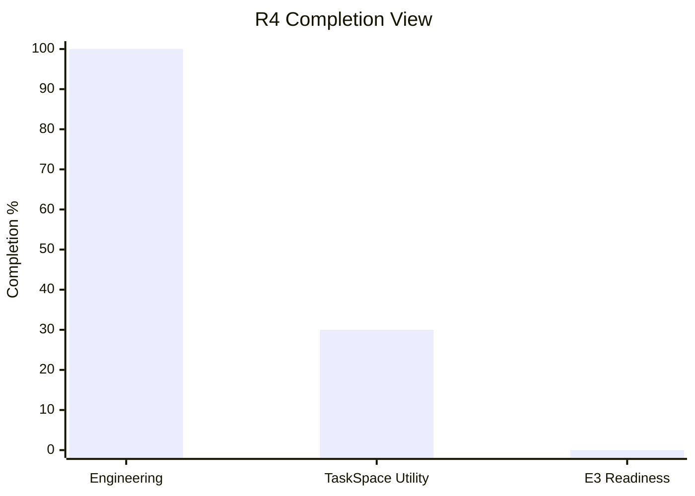

# R4 Tools Chain 工程收口报告

- Report date: 2026-07-02
- Source plan: `docs/v0.0.5/build-R4/00-r4-tools-chain-special-project.md`
- Scope inspected: R4 文档、脚本、focused tests、真实 paired benchmark artifacts，当前分支 `whalecode-alpha`
- Verification summary: R4 coverage gates、adapter harness、public-10 report gate 均已执行；公开 10 样本显示 TaskSpace utility no-go

## 1. Completion Overview

| Level | Planned Units | Verified Units | Completion | Scoring Basis |
|---|---:|---:|---:|---|
| R4 engineering deliverables | 8 phases | 8 phases | 100% | 每个 phase 有文档、代码或报告证据；R4-G 完成 10/10 public sample report；R4-H 产出本 closeout |
| TaskSpace utility outcome | 10 public samples | 3 TaskSpace solved | 30% | 只按 `outcome_taskspace=solved` 计数；timeout/wrong/engineering_unclean 不计入 utility pass |
| E3 readiness | 1 decision | 0 pass | 0% | public-10 暴露 timeout/wrong/cost 问题，不能进入 E3 |



## 2. Stage And Module Completion

| Stage | Stage Completion | Module | Module Completion | Status | Evidence | Verification |
|---|---:|---|---:|---|---|---|
| R4-A | 100% | tool path coverage manifest/gate | 100% | complete | `r4-tool-path-coverage.json` | `test-r4-tool-path-coverage.ps1` pass |
| R4-B | 100% | sample evidence ledger/gate | 100% | complete | `r4-sample-evidence-ledger.json` | `test-r4-sample-ledger.ps1` pass |
| R4-C | 100% | direct tool preview parity | 100% | complete | `parallel.rs` path and focused tests | `failure_response_preview` tests pass |
| R4-D | 100% | internal feedback and validation closeout | 100% | complete | `count-call-stack`, `large-output`, `processing-pipeline` reruns | focused Rust tests and real reruns pass targeted gates |
| R4-E | 100% | large output ref and pair-safe projection | 100% | complete | output-ref events, exact payload scan, pair-safe tests | rollout bounded and projection tests pass |
| R4-F | 100% | CodeMode/MCP/multi-agent non-direct paths | 100% | complete | coverage manifest and wrapper tests | CodeMode/MCP/multi-agent focused tests pass |
| R4-G | 100% | public-10 benchmark gate/report | 100% | complete | `target/r4-public-10-tool-stress/r4-public-10-tool-stress-report.json` | `-RequireComplete`: 10/10 rows; report gate pass |
| R4-H | 100% | closeout and E3 decision | 100% | complete | this document | E3 decision recorded as no-go |

## 3. Goal Alignment Matrix

| Main Goal | Subgoal | Planned Result | Work Actually Done | Measured Effect | Verification Method | Status |
|---|---|---|---|---|---|---|
| Tool feedback correctness | Direct tool result standard-equivalent | TaskSpace map uses the same model-visible tool result semantics | Direct success/error preview and action-contract feedback paths repaired | known feedback-loss count is `0/0` in public-10 report | focused tests + public-10 report | complete |
| Tool path coverage | No blind tool path | canonical/needs-fix/excluded path map | 10 paths canonical, non-direct paths classified | `needs_fix_count=0` | coverage gate | complete |
| Context/cache stability | High cache hit during long tool workflows | preserve prefix/cache while projecting map context | provider cache traces recorded across public samples | measurable rows around `0.9810-0.9882` cache hit | public-10 report | complete |
| Benchmark validation | 10 public tool-stress samples | one row per public sample with correctness/time/token/tool evidence | 10/10 rows generated from Terminal-Bench core `0.1.1` public subset | complete report produced; several negative outcomes exposed | report gate | complete |
| Utility improvement | TaskSpace should be competitive with standard | correctness and cost should not regress materially | only 3/10 TaskSpace samples solved; several solved-by-standard samples timeout/wrong in TaskSpace | utility no-go | public-10 paired runs | partial |
| E3 entry | proceed only if evidence supports it | E3-ready release decision | E3 blocked | E3 readiness 0% | closeout decision | blocked |

## 4. Evidence And Verification Matrix

| Item | Evidence Type | Evidence Location | Verification Performed | Result | Gap |
|---|---|---|---|---|---|
| public-10 plan | doc/test | `docs/v0.0.5/build-R4/r4-public-10-tool-stress-plan.json` | `test-r4-public-10-tool-stress-plan.ps1` | passed | none for plan validity |
| public-10 report | runtime/test | `target/r4-public-10-tool-stress/r4-public-10-tool-stress-report.json` | `write-r4-public-10-tool-stress-report.ps1 -RequireComplete` | passed, 10/10 rows | report artifact is under `target`, not committed by design |
| local URL scanner fix | code/test | `terminal-bench-remote-assets.ps1` | adapter harness local-url case | passed | none found |
| heredoc URL scanner fix | code/test | `terminal-bench-remote-assets.ps1` | adapter harness heredoc case | passed | none found |
| large-rollout tool-call and timeout usage report accounting | code/test/report | `metrics-extractor.ps1`, `write-r4-public-10-tool-stress-report.ps1`, `test-r4-public-10-usage-accounting-gate.ps1` | observability fallback self-test + public-10 report gate + ambiguous usage negative gate | passed; `organization-json-generator` TaskSpace calls corrected to 17; timeout usage no longer reported as fake zero | provider timeout usage may still be unavailable, but report marks that explicitly |
| R4-G final evidence | doc/runtime | `docs/v0.0.5/build-R4/05-phase-benefit-evidence.md` | report gate plus documented summary | passed | utility is negative |
| git safety | review/runtime | git history | commits pushed through `c95a5ac49` | passed | generated target artifacts remain untracked |

## 5. Unfinished Work

| Unfinished Item | Planned Scope | Current State | Reason Not Completed | Evidence For Reason | Impact If Left Unfinished | Required Decision |
|---|---|---|---|---|---|---|
| TaskSpace utility parity | TaskSpace should be competitive with standard on tool-heavy tasks | not achieved | public-10 has TaskSpace timeout/wrong where standard solved | `organization-json-generator`, `sqlite-db-truncate`, `heterogeneous-dates`, `csv-to-parquet` rows | cannot claim R4 improves real task outcomes | redesign |
| Long-flow convergence | TaskSpace should not keep running after enough actionable state exists | not achieved | multiple 900s timeout rows with open leaves or partial edits | public-10 rows for `organization-json-generator`, `tmux-advanced-workflow`, `git-workflow-hack` | high latency/cost and failed tasks | finish |
| Cost/token advantage | TaskSpace should not be materially more expensive for solved tasks | not achieved | solved rows show 3.73x, 5.40x, 11.08x token ratios | public-10 report | cost remains too high even with cache hits | redesign |
| Timeout usage accounting | timeout rows should preserve usage enough for cost analysis | report marking fixed; provider flush incomplete | timeout rows now use `null` plus `usage_unavailable_after_timeout` / `cache_trace_unavailable` instead of fake zero | public-10 report fields and usage-accounting gate | cost diagnosis no longer confuses missing usage with zero cost; exact timeout token cost may still be unavailable | finish provider flush if exact timeout cost is required |
| E3 formal readiness | proceed to formal E3 only with clean utility evidence | blocked | public-10 utility no-go and validator fidelity still E1/E2-candidate | pair reports include `e3_external_validator_fidelity_unproven` | E3 would produce misleading release signal | blocked by redesign |

## 6. Recommended Next Actions

| Priority | Action | Rationale | Dependency | Expected Outcome | Verification |
|---:|---|---|---|---|---|
| P0 | Open R5 or equivalent utility-convergence plan for TaskSpace long-flow timeout/wrong cases | R4 proved observability and gates, but not TaskSpace utility | R4 closeout | targeted fixes for timeout/wrong public samples | rerun `organization-json-generator`, `sqlite-db-truncate`, `heterogeneous-dates`, `csv-to-parquet` |
| P0 | Add timeout-safe provider usage flush | report marking is fixed, but exact usage can still be unavailable when the process is killed before provider usage flush | provider event writer | timeout rows have valid partial usage, not only explicit unavailable reason | focused timeout harness |
| P1 | Reduce TaskSpace projection/token multiplier for solved tasks | solved rows still cost 3.73x to 11.08x tokens | context manager and projection policy | solved samples keep cache hit while reducing input tokens | paired rerun with token ratio threshold |
| P1 | Separate validator environment noise from agent quality in final tables | `engineering_unclean` rows are useful but not utility pass | report generator | clearer utility and infra columns | report generator self-test |
| P2 | Promote public-10 report artifact into durable docs or release bundle when stable | current canonical JSON is under `target` | artifact policy decision | durable audit path outside generated cache | docs gate or release artifact check |

## 7. Release Decision

R4 engineering deliverables are closed. R4 does not authorize E3 progression for TaskSpace utility.

The next stage must treat the public-10 negative evidence as input requirements, not as optional optimization.

## 8. 2026-07-02 Post-Closeout Utility Finding

R4 closeout 后继续复跑 `sqlite-db-truncate`，确认了一个额外的工程事实：R4 的局部状态机修复仍能产生真实收益，但 TaskSpace utility 仍未收敛。

新增修复：

- 修复 `blocked validation + ready recovery node` 被 action-contract closed-validation 覆盖的问题。
- 新增 `active_map_has_ready_recovery_node` 共享判断，并在 prompt 注入和 terminal `blocked` 改写两处复用。

新增验证：

```text
cargo test -j1 -p codex-core blocked_validation_with_ready_recovery_node_is_not_closed --lib
PASS

相关 R4-D/R4-G 回归测试全部通过
cargo fmt --all -- --check
PASS
cargo build -j1 --profile dev-small -p codex-cli --bin whale
PASS
```

真实样本结果：

```text
RunDir:
C:\WhaleRunCache\r4-rerun-20260702\sqlite-db-truncate-ready-recovery-fix\runs\terminal_bench__sqlite-db-truncate\20260702-101238-428\pair-001

outcome_standard=solved
outcome_taskspace=engineering_unclean
public_validation_skipped=true
public_validation_skip_reason=agent_exec_timeout
taskspace_wall_time_ms=900037
tool_call_count=24
rollout_trace_model_request_count=28
changed_paths=recover.py, trunc.db.recovered
open_leaf_nodes=1
```

解释：

- 相比前一轮 9 次工具调用后错误 closed-validation，本轮进入 `node-6` recovery path，说明 ready-recovery 修复有效。
- 样本仍未 solved，失败从 closed-validation masking 转移为 900s long-flow timeout。
- 因此 R4 的 release decision 不变：工程交付和观测门禁可以保留为完成，但 TaskSpace utility parity 仍是后续 P0。

## 9. 2026-07-02 Post-Closeout H-024 Tool Invocation Finding

继续追踪 `sqlite-db-truncate` 时，又确认了一个 action-contract `run_test` host-shell 规范化缺口：TaskSpace 可能把 Bash 顶层 `||` 原样交给 Windows PowerShell，导致 `InvalidEndOfLine`，工具还没有产生有价值诊断就失败。

新增修复：

- `run_test` 在 Windows 上将顶层 `cmd1 || cmd2; tail` 转换为 PowerShell 兼容形式：`cmd1; if ($LASTEXITCODE -ne 0) { cmd2 }; tail`。
- 分隔符扫描忽略单引号和双引号内部的 `||`/`;`，避免破坏 Python/SQL 等内联片段。

新增验证：

```text
cargo test -j1 -p codex-core run_test_normalizes --lib
PASS

cargo test -j1 -p codex-core taskspace_powershell_ --lib
PASS

cargo fmt --all -- --check
PASS

cargo build -j1 --profile dev-small -p codex-cli --bin whale
PASS
```

真实复验说明：

```text
RunDir:
C:\WhaleRunCache\r4-rerun-20260702\sqlite-db-truncate-powershell-or-chain-fix\runs\terminal_bench__sqlite-db-truncate\20260702-163512-422\pair-001

left whale-exec.jsonl len=0
right whale-exec.jsonl len=0
left/right both timed out at 900s before first JSON event
```

解释：

- H-024 的代码路径已通过 focused action-contract 测试证明。
- 本次 pair 复验没有进入 tool execution 层，不能证明真实样本收益，也不能否定本次修复。
- R4 release decision 不变：tool-chain 局部质量继续收敛，但 TaskSpace utility parity 仍未达成。
