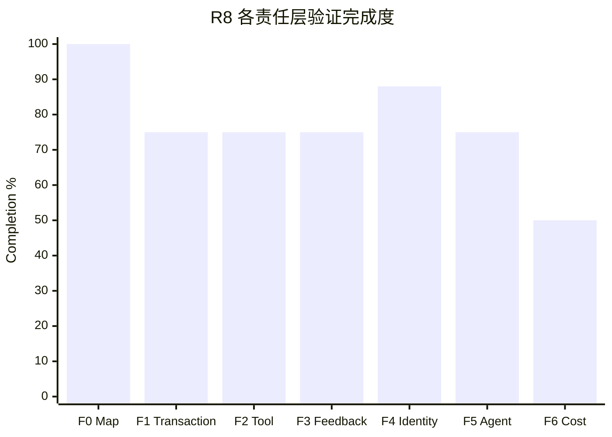

# R8 当前进展报告

- Report date: 2026-08-18
- Source plans: `00-r8-charter.md`、`01-r8-known-issues.md`、`taskspace-exec/12-phase-b-zero-base-plan.md`
- Scope: `whalecode-alpha` branch，commit `fd01b2339`
- Latest runtime evidence: `WAR-20260818-013746-R8-I05-I07-ACCEPT-R3`
- Scoring: 十个 R8 全局问题等权；每项按已验证验收条件计 `0/25/50/75/100`

## 1. 完成度总览

| 口径 | 分子 / 分母 | 完成度 | 含义 |
|---|---:|---:|---|
| R8 验证完成度 | 775 / 1000 | **77.5%** | 十个问题按实现、接入、测试和生产证据评分 |
| 正式问题关闭率 | 2 / 10 | **20.0%** | 只有 I09、I07 达到 `closed` |
| TaskSpace Exec 阶段实现度 | 650 / 700 | **92.9%** | B0～B4 为 100%，B5/B6 各按 75% 计 |

77.5% 不等于发布完成度。当前代码和最小真实链路已经可运行，但复杂 DAG、三种 projection 的一致性、Provider-hosted
机械归纳生产证据和复杂样本成本仍未验收。

## 2. 全局问题状态

| 顺序 | 问题 | 完成度 | 当前状态 | 已验证结果 | 未完成验收 |
|---:|---|---:|---|---|---|
| 1 | I09 Map 恢复合法性 | 100% | closed | 非法关系图在 hydrate 时停止，canonical 事实不变 | 无 |
| 2 | I01 唯一最终进度 | 75% | verifying | map-request 当前请求无 retry/duplicate，旧双版本链为零 | map-always、map-append 未做同等级验收 |
| 3 | I06 Tool 不可绕过边界 | 75% | verifying | 顶层 client 逃逸可在副作用前拒绝；成功路径保持每请求最多一个 Patch | 尚未完成正式关闭结算 |
| 4 | I05 拒绝反馈忠实性 | 75% | verifying | 同 `call_id`、零执行、可继续反馈已实现；最新 3 次正常路径无回归 | 逃逸恢复分支未自然在线命中 |
| 5 | I02 Tool 事实单次表达 | 75% | verifying | 当前 final wire 无 Exec output body 重复或 orphan output | 尚未完成正式关闭结算 |
| 6 | I10 capability 身份 | 75% | verifying | 当前 TaskSpace trace 的能力身份跨层一致 | 三 projection 的完整生产验收未完成 |
| 7 | I07 观测可信性 | 100% | closed | 41 logical = boundary = completed = usage；无孤儿、重复、重试或 finding | 无 |
| 8 | I03 动作组织稳定性 | 75% | verifying | 最新简单样本 3/3 完成，无 escape、JSON/schema reject | 复杂动作与 Provider-hosted 场景未复验 |
| 9 | I04 frontier 使用 | 75% | verifying | 最新 3 次无 Waiting/frontier 拒绝，全部节点闭合 | 复杂 fork/join 依赖未验证 |
| 10 | I08 成本与晋升 | 50% | investigating | 简单样本请求/input/平均每请求 input/Agent wall 为 `1.05x/1.32x/1.25x/1.33x` | 复杂样本、三 projection 和产品阈值未确定 |

## 3. 阶段完成情况

| Phase | 完成度 | 已完成工程结果 | 当前缺口 |
|---|---:|---|---|
| B0 Zero-Base Reset | 100% | 旧 Map/协议兼容路线净删除，零基线门禁建立 | 无 |
| B1 Minimal Map | 100% | Root/Work/Finish、parents/children/actions 与关系化 Store 落地 | 无 |
| B2 Exec Contract | 100% | `taskspace_exec`、静态 catalog、Map/client 合法输入与预检落地 | 无 |
| B3 Execution & Feedback | 100% | 原生 Router dispatch、逐 Tool 低延迟结算、唯一 outer result 与恢复链落地 | 无离线 blocker |
| B4 Observability | 100% | canonical request facts、身份链、缓存门禁、性能报告和对抗性闭环完成 | 无 |
| B5 Production Integration | 75% | Codex Exec 基建对齐、JSON 自愈、反馈分类、真实简单样本闭环 | I05 恢复分支和 Provider-hosted 聚合缺少生产命中 |
| B6 Closed Sequences | 75% | L1～L8 闭集、四状态模型、DAG 预检和 simple repeat=3 通过 | 复杂 DAG 与多能力场景未通过完整验收 |

## 4. 目标与工程收益

| 目标 | 已完成工作 | 可量化收益 | 证据 | 状态 |
|---|---|---|---|---|
| Canonical Map 可信 | 删除平行 ledger/ref/edges，关系化持久化并机械派生 children/state | I09 关闭；最新 3/3 Map 完整闭合、图警告 0 | I09 结果、最新 repeat=3 | achieved |
| Runtime 只守硬边界 | 普通 Tool 保持原生；TaskSpace 只增加 Exec 顺序与 node metadata | 最新 3 次 TaskSpace failed Tool 0、边界绕过 0 | `78-i05-i07-repeat3-acceptance-result.md` | achieved on simple sample |
| 反馈不丢失不重复 | 唯一 outer result、错误分类、同调用反馈、单闭合符自愈进入正式上下文 | 自愈专项 5/5 完成；最新 3 次无 feedback reject | `76-single-closing-delimiter-self-heal-repeat5-result.md` | partial |
| 观测可复算 | 所有成本消费者统一读取 canonical request facts | 41 个请求四类计数完全相等，I07 关闭 | I07 结果、run ledger | achieved |
| 缓存不发生结构性塌陷 | Tool shape 静态化、缓存敏感面门禁、动态 Map 按 projection 策略处理 | 最新 request 2+：Standard 97.80%，map-request 92.35%，零 shape transition | 最新 repeat=3 | partial |
| 成本可解释 | Tool/schema/history/feedback 分项测量，SC-01 删除重复合同 | 等请求轮次 input 曾下降 10.83%；当前 map-request 总 input 为 Standard 1.32x | I08 IC-09、最新 repeat=3 | partial |

## 5. 最新真实验收

| 模式 | Runs | Success | Requests | Input | Cached | Uncached | Output | Request 2+ cache | Agent wall |
|---|---:|---:|---:|---:|---:|---:|---:|---:|---:|
| Standard | 3 | 3/3 | 20 | 244,094 | 239,360 | 4,734 | 3,734 | 97.80% | 40.615s |
| map-request | 3 | 3/3 | 21 | 321,120 | 299,136 | 21,984 | 6,289 | 92.35% | 53.956s |

总计 41 requests、565,214 input、10,023 output，低谷估算费用 CNY 0.1121053。该结果证明当前简单样本稳定，
不证明复杂样本、Provider-hosted Tool 或另外两种 projection 已稳定。

## 6. 未完成工作

| 未完成项 | 原因 | 不完成的影响 | 下一验收 |
|---|---|---|---|
| I06/I02/I10 正式关闭结算 | 当前证据已较充分，但唯一问题账本仍为 verifying | 关闭率低于实际工程成熟度，后续依赖判断含糊 | 只读复算最新 trace 与确定性门禁，不新增真实运行 |
| Provider-hosted Runtime 机械归纳 | 当前 PR-01～PR-04 仅离线实现，PR-05 尚未完成生产验收 | Web Search/Image 等动作可能未在 Map 中留下可证明记录 | 单一 hosted sample，需另行预算 |
| I05 逃逸恢复在线分支 | 最新自然样本没有触发逃逸 | 不能证明目标模型收到失败后会稳定恢复且无请求放大 | 不人为诱导；复杂自然样本出现时随 trace 验收 |
| I03/I04 复杂动作 | 最新证据是简单线性任务 | fork/join、多 Ready 节点和跨节点连续动作仍可能出现错误选择 | 选择一个现有复杂 sample，Standard/map-request 各一次起步 |
| I01 三 projection | 只对 map-request 做了当前版本验收 | 无法比较 always/append/request 的最终一致性与固有成本 | 每种策略保持同 Runtime，仅测 projection 差异 |
| I08 复杂成本 | 当前只有简单样本稳定测量 | 无法判断 1.32x input 是否随任务复杂度扩大或收敛 | 底层问题关闭后执行复杂样本成本对照 |

## 7. 建议顺序

| 优先级 | 动作 | 依赖 | 验收方式 |
|---:|---|---|---|
| P0 | 用现有证据正式重评 I06、I02、I10 | 无新增生产变更 | 静态调用链、门禁、最新 41-request trace |
| P0 | 完成 Provider-hosted 机械归纳 PR-05 | 不恢复双写/pending | 离线回归后申请单一 hosted sample 预算 |
| P1 | 选择一个复杂 DAG sample 验收 I03/I04 | P0 项无 blocker | Standard/map-request 各 repeat=1，异常即停 |
| P1 | 重评 I01 的三 projection 一致性 | I03/I04 复杂路径稳定 | 三种 projection 同 Runtime 对照 |
| P2 | 完成 I08 复杂成本与产品阈值判断 | I01～I07、I09～I10 收敛 | 请求/token/cache/time/cost 全量对比 |

下一步不建议继续修改提示词、状态机或合法序列。应先用现有证据关闭可关闭项，再补 Provider-hosted 生产证据，最后才进入
复杂 DAG 与成本验收。
