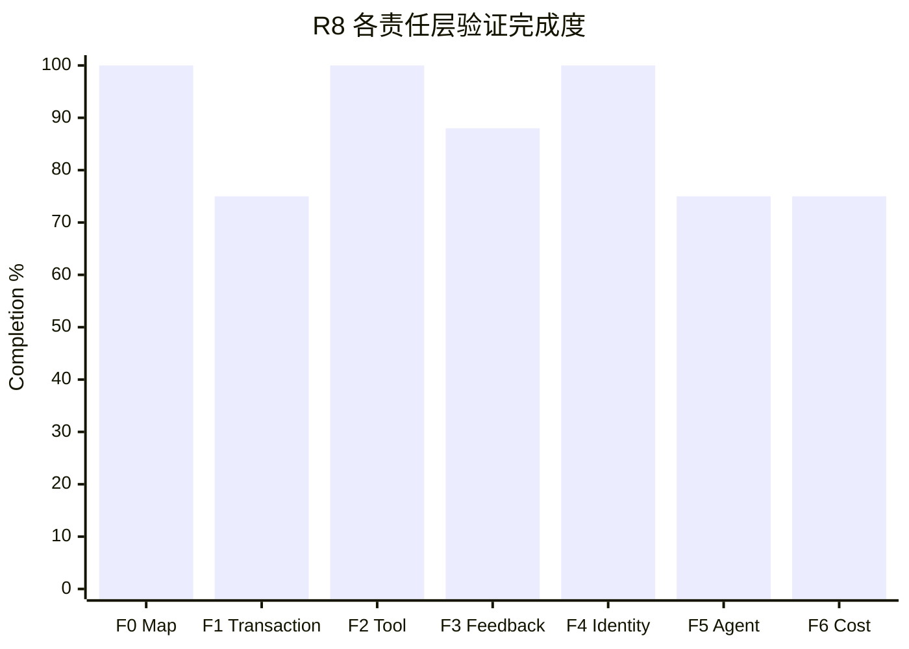

# R8 当前进展报告

- Report date: 2026-08-19
- Source plans: `00-r8-charter.md`、`01-r8-known-issues.md`、`taskspace-exec/12-phase-b-zero-base-plan.md`
- Scope: `whalecode-alpha` branch，当前生产代码 commit `5d2516eb1`
- Latest runtime evidence: `WAR-20260819-223533-R8-BASE-CLIENT-SCOPE-R5`
- Scoring: 十个 R8 全局问题等权；每项按已验证验收条件计 `0/25/50/75/100`

## 1. 完成度总览

| 口径 | 分子 / 分母 | 完成度 | 含义 |
|---|---:|---:|---|
| R8 验证完成度 | 875 / 1000 | **87.5%** | 十个问题按实现、接入、测试和生产证据评分；I01 关闭，I07 因新 trace 证实漏报而重开 |
| 正式问题关闭率 | 5 / 10 | **50.0%** | I09、I01、I06、I02、I10 达到 `closed` |
| TaskSpace Exec 阶段实现度 | 650 / 700 | **92.9%** | B0～B4 为 100%，B5～B6 各按 75% 计 |

87.5% 不等于发布完成度。当前代码和三种 projection 的复杂 client-tool 链路已经可运行，Provider-hosted 机械归纳
已有生产证据；I01-W10 已接受并晋升 baseline，fork/join DAG 和默认模式产品阈值仍未收敛；最新 trace 使 I07
因漏报重新进入验证。

## 2. 全局问题状态

| 顺序 | 问题 | 完成度 | 当前状态 | 已验证结果 | 未完成验收 |
|---:|---|---:|---|---|---|
| 1 | I09 Map 恢复合法性 | 100% | closed | 非法关系图在 hydrate 时停止，canonical 事实不变 | 无 |
| 2 | I01 唯一最终进度 | 100% | closed | 唯一 final result、复杂样本 9/9、W10 三模式 3/3 与 accepted baseline 全部通过 | 无；默认模式决策归 I08 |
| 3 | I06 Tool 不可绕过边界 | 100% | closed | 统一 preflight、零副作用旁路拒绝、单 Patch 和原生 dispatch 均有确定性与生产证据 | 无 |
| 4 | I05 拒绝反馈忠实性 | 75% | verifying | 同 `call_id`、零执行、可继续反馈已实现；最新 3 次正常路径无回归 | 逃逸恢复分支未自然在线命中 |
| 5 | I02 Tool 事实单次表达 | 100% | closed | 最新三次生产运行 `18 calls = 18 outputs`，无高优先级副本、重复或 orphan | 无 |
| 6 | I10 capability 身份 | 100% | closed | 最新 21 个 TaskSpace wire 请求身份一致，跨 Catalog/dispatch/wire/report 无冲突 | 无；projection 对照归入 I01/I08 |
| 7 | I07 观测可信性 | 75% | verifying | canonical usage 与 projection 可复算 | 最新 I04 rollout 有 1 次 `TransitionInvalid`，observer 却报告 0 次失败 |
| 8 | I03 动作组织稳定性 | 75% | verifying | Base `3.0.6` 候选 5/5 业务/oracle/Map 通过，顶层逃逸为 0/5 runs、0 calls | 单一样本不足以关闭跨样本问题；仍有两次 JSON syntax 与两次 Waiting preflight |
| 9 | I04 frontier 使用 | 75% | verifying | 顺序 patch 事务离线通过；最新复杂运行无 `TransitionInvalid` 且 Map 闭合 | 同批父子完成未自然命中；Map 仍为线性链，fork/join 未观察到 |
| 10 | I08 成本与晋升 | 75% | investigating | 复杂样本四臂请求/input/cache/time/cost 已量化 | 只有一个复杂样本，产品阈值未确定 |

## 3. 阶段完成情况

| Phase | 完成度 | 已完成工程结果 | 当前缺口 |
|---|---:|---|---|
| B0 Zero-Base Reset | 100% | 旧 Map/协议兼容路线净删除，零基线门禁建立 | 无 |
| B1 Minimal Map | 100% | Root/Work/Finish、parents/children/actions 与关系化 Store 落地 | 无 |
| B2 Exec Contract | 100% | `taskspace_exec`、静态 catalog、Map/client 合法输入与预检落地 | 无 |
| B3 Execution & Feedback | 100% | 原生 Router dispatch、逐 Tool 低延迟结算、唯一 outer result 与恢复链落地 | 无离线 blocker |
| B4 Observability | 100% | canonical request facts、usage 身份链、projection final-wire 与 Exec reject 分类统一 | 无 |
| B5 Production Integration | 75% | Codex Exec 基建对齐、JSON 自愈、反馈分类、真实简单样本闭环及 Provider-hosted Root 归纳生产命中 | I05 恢复分支未自然在线命中 |
| B6 Closed Sequences | 75% | L1～L8 闭集、四状态模型、DAG 预检和 simple repeat=3 通过 | 复杂 DAG 与多能力场景未通过完整验收 |

## 4. 目标与工程收益

| 目标 | 已完成工作 | 可量化收益 | 证据 | 状态 |
|---|---|---|---|---|
| Canonical Map 可信 | 删除平行 ledger/ref/edges，关系化持久化并机械派生 children/state | I09 关闭；最新 3/3 Map 完整闭合、图警告 0 | I09 结果、最新 repeat=3 | achieved |
| Runtime 只守硬边界 | 普通 Tool 保持原生；TaskSpace 只增加 Exec 顺序与 node metadata | 本轮三次协议拒绝均为零副作用，9 张 Map 最终闭合 | 四臂 repeat=3 | achieved for hard boundary |
| 反馈不丢失不重复 | 唯一 outer result、错误分类、同调用反馈、单闭合符自愈进入正式上下文 | 三次拒绝均在原 call 输出准确原因并由 Agent 恢复 | 四臂 repeat=3 | partial；错误仍发生 |
| 观测可复算 | 请求/usage 读取 canonical facts，projection 读取 final-wire，Exec reject 由专用观察器分类 | usage/projection 已闭环；最新 canonical `TransitionInvalid` 被 observer 漏报 | 四臂结果、I04 DAG 结果 | regressed；I07 reopened |
| 缓存不发生结构性塌陷 | Tool shape 静态化、缓存敏感面门禁、动态 Map 按 projection 策略处理 | 四臂零 shape transition；request 2+ 为 97.80%/84.21%/93.49%/89.39% | 四臂 repeat=3 | achieved for measured sample |
| 成本可解释 | Tool/schema/history/feedback 分项测量，SC-01 删除重复合同 | always/append/request 总 input 为 Standard 1.25x/1.60x/1.32x，费用 2.83x/2.09x/2.43x | 四臂 repeat=3 | partial；阈值未定 |

## 5. 最新真实验收

| 模式 | Runs | Success | Requests | Input | Cached | Uncached | Output | Request 2+ cache | Agent wall | CNY |
|---|---:|---:|---:|---:|---:|---:|---:|---:|---:|---:|
| Standard | 3 | 3/3 | 30 | 442,990 | 433,664 | 9,326 | 13,981 | 97.80% | 116.527s | 0.04596128 |
| map-always | 3 | 3/3 | 30 | 553,757 | 472,064 | 81,693 | 19,542 | 84.21% | 162.324s | 0.13021828 |
| map-append | 3 | 3/3 | 32 | 710,150 | 666,112 | 44,038 | 19,421 | 93.49% | 155.406s | 0.09620224 |
| map-request | 3 | 3/3 | 31 | 586,416 | 528,000 | 58,416 | 21,268 | 89.39% | 171.306s | 0.11151200 |

总计 123 requests、2,293,313 input、74,212 output，估算费用 CNY 0.3838938。12/12 业务与 oracle 通过，
但 2/9 TaskSpace runs 出现三次可恢复协议拒绝；详细结果见
[`I01 四臂报告`](I01/03-i01-four-arm-repeat3-result.md)。

Provider-hosted 专项另完成 `provider-web-search-probe × map-request × repeat=1`：10 requests、267,288 input、
239,232 cached、28,056 uncached、5,225 output，request 2+ cache hit 89.03%，CNY 0.04329064。业务与 Map 均闭合，
唯一 `web_search` Root 子节点归纳三条响应级 Action，未创建空 Hosted 节点。该结果关闭 Provider-hosted PR-05，
但不外推另外两种 projection 或复杂 DAG。

I01-W10 最小缓存发布验收另完成三个 TaskSpace 模式各一次，3/3 业务通过并已晋升 accepted baseline：22 requests、352,500 input、318,848
cached、33,652 uncached、7,629 output，费用 CNY 0.05528696。request 2+ 命中率分别为 87.53%、93.97%、
91.84%。结果完整但尚未获得用户对精确结果的 baseline 接受，见
[`I01-W10 结果`](I01/04-i01-w10-cache-release-verification-result.md)。

I04 新自然 DAG 样本两臂均完成：Standard 9 requests，TaskSpace 11 requests；TaskSpace Map 为
`root -> explore -> fix -> verify -> finish`，未形成 fork/join。该 trace 的 `TransitionInvalid` 已确认是旧 Runtime 没有在同批
有序 patch 之间重新派生 readiness，并非 Agent 误选 waiting 节点；顺序 patch 事务已离线修复。Observer 对历史拒绝漏报为 0
仍是独立 I07 缺口，详见 [`I04 结果`](I04/01-fork-join-live-validation-result.md)。

## 6. 未完成工作

| 未完成项 | 原因 | 不完成的影响 | 下一验收 |
|---|---|---|---|
| I05 逃逸恢复在线分支 | 最新自然样本没有触发逃逸 | 不能证明目标模型收到失败后会稳定恢复且无请求放大 | 不人为诱导；复杂自然样本出现时随 trace 验收 |
| I03 协议行为 | 反馈 identity、work 示例和内层 description 均已证伪；显式 Base `3.0.6` 将同样本逃逸降至 0/5 runs、0 calls | 仍缺跨样本、其他 client Tool 和长期复发证据 | 保留候选，在后续自然复杂验收中观察；不立即继续增加提示文字 |
| I04 复杂依赖 | 客观提供两个独立修复域的新样本仍形成线性链；顺序 patch 事务仅离线通过 | fork/join、多 Ready 节点和多父节点仍无生产证据 | 不诱导拆图；先验收新事务，再分析首次读取前初始化通用链的影响 |
| I07 观测漏报 | rollout 有明确 `TransitionInvalid`，pair report 的失败计数为 0 | 报告会错误隐藏协议错误并污染 I03/I04 判断 | 修复 canonical reject 到 observer 的消费链并离线回放该 trace |
| I08 产品阈值 | 单个复杂样本已量化三模式取舍 | 不能据此决定默认 projection policy | 增加代表性样本前先定义决策指标 |

## 7. 建议顺序

| 优先级 | 动作 | 依赖 | 验收方式 |
|---:|---|---|---|
| P0 | 修复 I07 对 canonical Exec reject 的漏报 | 已有 I04 trace | 离线回放必须得到 1 次 `TransitionInvalid`，不改 Runtime payload |
| P1 | 通过缓存门禁并最小真实验收顺序 patch 事务 | 当前离线实现 | 同一 `update_and_finish` 依序完成父节点、刚解锁子节点与 Finish，不产生拒绝或额外请求 |
| P2 | 深入分析 I04 为何在自然 DAG 样本仍生成线性链 | I07 恢复可信 | 先查上下文与初始化时序，不用提示词诱导或 Runtime 自动拆图 |
| P3 | 定义 I08 默认模式的产品决策指标 | 当前四臂结果 | 同时评价质量、input、缓存费用和 Map 使用，不只看单项 |

下一步先使用已存在的 I04 trace 离线修复 I07，再为 Agent 可见协议文本变更执行缓存门禁与最小真实验收；
不得把顺序 patch 事务扩展成 Runtime 的语义判断。
