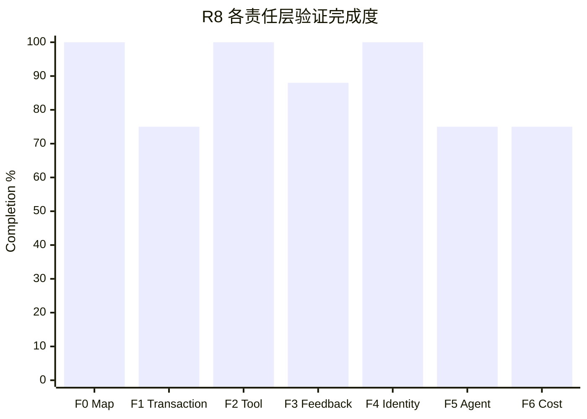

# R8 当前进展报告

- Report date: 2026-08-18
- Source plans: `00-r8-charter.md`、`01-r8-known-issues.md`、`taskspace-exec/12-phase-b-zero-base-plan.md`
- Scope: `whalecode-alpha` branch，产品代码 commit `4fe2f3557`
- Latest runtime evidence: `WAR-20260818-055427-R8-FOUR-ARM-R3`
- Scoring: 十个 R8 全局问题等权；每项按已验证验收条件计 `0/25/50/75/100`

## 1. 完成度总览

| 口径 | 分子 / 分母 | 完成度 | 含义 |
|---|---:|---:|---|
| R8 验证完成度 | 875 / 1000 | **87.5%** | 十个问题按实现、接入、测试和生产证据评分 |
| 正式问题关闭率 | 5 / 10 | **50.0%** | I09、I06、I02、I10、I07 达到 `closed` |
| TaskSpace Exec 阶段实现度 | 650 / 700 | **92.9%** | B0～B4 为 100%，B5～B6 各按 75% 计 |

87.5% 不等于发布完成度。当前代码和三种 projection 的复杂 client-tool 链路已经可运行，Provider-hosted 机械归纳
已有生产证据；fork/join DAG、I01-W10 和默认模式产品阈值仍未收敛。

## 2. 全局问题状态

| 顺序 | 问题 | 完成度 | 当前状态 | 已验证结果 | 未完成验收 |
|---:|---|---:|---|---|---|
| 1 | I09 Map 恢复合法性 | 100% | closed | 非法关系图在 hydrate 时停止，canonical 事实不变 | 无 |
| 2 | I01 唯一最终进度 | 75% | verifying | 三 projection 复杂样本 9/9 通过，stale revision 为 0 | W10 发布缓存证据未独立结算 |
| 3 | I06 Tool 不可绕过边界 | 100% | closed | 统一 preflight、零副作用旁路拒绝、单 Patch 和原生 dispatch 均有确定性与生产证据 | 无 |
| 4 | I05 拒绝反馈忠实性 | 75% | verifying | 同 `call_id`、零执行、可继续反馈已实现；最新 3 次正常路径无回归 | 逃逸恢复分支未自然在线命中 |
| 5 | I02 Tool 事实单次表达 | 100% | closed | 最新三次生产运行 `18 calls = 18 outputs`，无高优先级副本、重复或 orphan | 无 |
| 6 | I10 capability 身份 | 100% | closed | 最新 21 个 TaskSpace wire 请求身份一致，跨 Catalog/dispatch/wire/report 无冲突 | 无；projection 对照归入 I01/I08 |
| 7 | I07 观测可信性 | 100% | closed | 123 个请求 usage、final-wire projection 和 Exec reject 子类均可复算 | 无 |
| 8 | I03 动作组织稳定性 | 75% | verifying | 复杂样本三 policy 9/9 完成、Map 全闭合 | 2/9 runs 出现可恢复协议错误 |
| 9 | I04 frontier 使用 | 75% | verifying | 9 张 Map 最终闭合，硬门零副作用 | 复现 1 次 waiting 误选；fork/join 未验证 |
| 10 | I08 成本与晋升 | 75% | investigating | 复杂样本四臂请求/input/cache/time/cost 已量化 | 只有一个复杂样本，产品阈值未确定 |

## 3. 阶段完成情况

| Phase | 完成度 | 已完成工程结果 | 当前缺口 |
|---|---:|---|---|
| B0 Zero-Base Reset | 100% | 旧 Map/协议兼容路线净删除，零基线门禁建立 | 无 |
| B1 Minimal Map | 100% | Root/Work/Finish、parents/children/actions 与关系化 Store 落地 | 无 |
| B2 Exec Contract | 100% | `taskspace_exec`、静态 catalog、Map/client 合法输入与预检落地 | 无 |
| B3 Execution & Feedback | 100% | 原生 Router dispatch、逐 Tool 低延迟结算、唯一 outer result 与恢复链落地 | 无离线 blocker |
| B4 Observability | 100% | canonical request facts、usage 身份链、projection final-wire 与 Exec reject 分类统一 | 无 |
| B5 Production Integration | 75% | Codex Exec 基建对齐、JSON 自愈、反馈分类、真实简单样本闭环及 Provider-hosted Root 归纳生产命中 | I05 恢复分支未自然在线命中 |
| B6 Closed Sequences | 75% | L1～L8 闭集、四状态模型、DAG 预检和 simple repeat=3 通过 | 复杂 DAG 与多能力场景未通过完整验收 |

## 4. 目标与工程收益

| 目标 | 已完成工作 | 可量化收益 | 证据 | 状态 |
|---|---|---|---|---|
| Canonical Map 可信 | 删除平行 ledger/ref/edges，关系化持久化并机械派生 children/state | I09 关闭；最新 3/3 Map 完整闭合、图警告 0 | I09 结果、最新 repeat=3 | achieved |
| Runtime 只守硬边界 | 普通 Tool 保持原生；TaskSpace 只增加 Exec 顺序与 node metadata | 本轮三次协议拒绝均为零副作用，9 张 Map 最终闭合 | 四臂 repeat=3 | achieved for hard boundary |
| 反馈不丢失不重复 | 唯一 outer result、错误分类、同调用反馈、单闭合符自愈进入正式上下文 | 三次拒绝均在原 call 输出准确原因并由 Agent 恢复 | 四臂 repeat=3 | partial；错误仍发生 |
| 观测可复算 | 请求/usage 读取 canonical facts，projection 读取 final-wire，Exec reject 由专用观察器分类 | 123 requests usage 完整；always `4+26`、append `3+29`、request absent `31`；拒绝三类各 1 | 四臂结果、I07 增量结果 | achieved |
| 缓存不发生结构性塌陷 | Tool shape 静态化、缓存敏感面门禁、动态 Map 按 projection 策略处理 | 四臂零 shape transition；request 2+ 为 97.80%/84.21%/93.49%/89.39% | 四臂 repeat=3 | achieved for measured sample |
| 成本可解释 | Tool/schema/history/feedback 分项测量，SC-01 删除重复合同 | always/append/request 总 input 为 Standard 1.25x/1.60x/1.32x，费用 2.83x/2.09x/2.43x | 四臂 repeat=3 | partial；阈值未定 |

## 5. 最新真实验收

| 模式 | Runs | Success | Requests | Input | Cached | Uncached | Output | Request 2+ cache | Agent wall | CNY |
|---|---:|---:|---:|---:|---:|---:|---:|---:|---:|---:|
| Standard | 3 | 3/3 | 30 | 442,990 | 433,664 | 9,326 | 13,981 | 97.80% | 116.527s | 0.04596128 |
| map-always | 3 | 3/3 | 30 | 553,757 | 472,064 | 81,693 | 19,542 | 84.21% | 162.324s | 0.13021828 |
| map-append | 3 | 3/3 | 32 | 710,150 | 666,112 | 44,038 | 19,421 | 93.49% | 155.406s | 0.09620224 |
| map-request | 3 | 3/3 | 31 | 586,416 | 528,000 | 58,416 | 21,268 | 89.39% | 171.306s | 0.11151200 |

总计 123 requests、2,293,313 input、74,212 output，估算费用 CNY 0.3838938。12/12 业务与 oracle 通过，
但 2/9 TaskSpace runs 出现三次可恢复协议拒绝；详细结果见
[`I01 四臂报告`](I01/03-i01-four-arm-repeat3-result.md)。

Provider-hosted 专项另完成 `provider-web-search-probe × map-request × repeat=1`：10 requests、267,288 input、
239,232 cached、28,056 uncached、5,225 output，request 2+ cache hit 89.03%，CNY 0.04329064。业务与 Map 均闭合，
唯一 `web_search` Root 子节点归纳三条响应级 Action，未创建空 Hosted 节点。该结果关闭 Provider-hosted PR-05，
但不外推另外两种 projection 或复杂 DAG。

## 6. 未完成工作

| 未完成项 | 原因 | 不完成的影响 | 下一验收 |
|---|---|---|---|
| I05 逃逸恢复在线分支 | 最新自然样本没有触发逃逸 | 不能证明目标模型收到失败后会稳定恢复且无请求放大 | 不人为诱导；复杂自然样本出现时随 trace 验收 |
| I03/I04 协议行为 | 复杂样本已复现 init 类型、waiting、JSON 三类可恢复错误 | 增加请求和成本，说明 Agent 状态/合同掌握仍不稳定 | 逐类复盘协议表达；不放宽硬门 |
| I04 复杂依赖 | 当前复杂样本 Map 仍是线性链 | fork/join、多 Ready 节点和多父节点尚无生产证据 | 选择真正 DAG 样本最小验收 |
| I01 W10 | 三 projection 生产行为通过，但发布缓存合同未结算 | I01 不能按原计划正式 closed | 使用既有缓存门禁流程独立处理 |
| I08 产品阈值 | 单个复杂样本已量化三模式取舍 | 不能据此决定默认 projection policy | 增加代表性样本前先定义决策指标 |

## 7. 建议顺序

| 优先级 | 动作 | 依赖 | 验收方式 |
|---:|---|---|---|
| P0 | 结算 I01-W10 发布缓存证据 | I07 observer 可信 | 既有缓存门禁合同，不重复本轮产品测量 |
| P1 | 选择真正 fork/join DAG sample 验收 I04 | I07 已关闭 | Standard/map-request 最小起步，另行预算 |
| P2 | 定义 I08 默认模式的产品决策指标 | 当前四臂结果 | 同时评价质量、input、缓存费用和 Map 使用，不只看单项 |

下一步不建议继续修改提示词、状态机或合法序列。先结算 I01-W10，再决定是否执行新的付费 DAG 样本；任何新的真实运行
都需重新申请预算。
