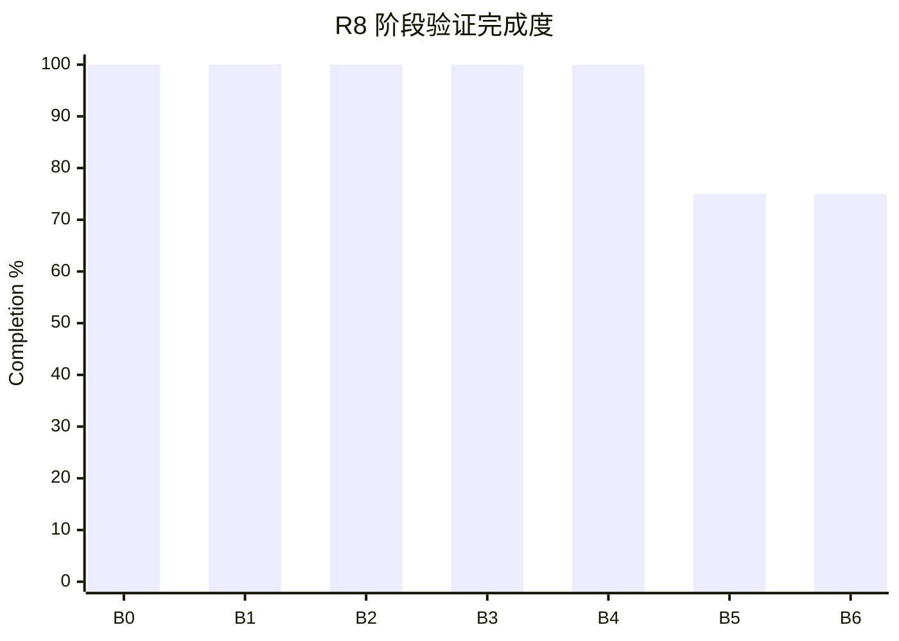

# R8 最终收敛与冻结报告

- Report date: 2026-08-20
- Source: `00-r8-charter.md`、`01-r8-known-issues.md`、`taskspace-exec/12-phase-b-zero-base-plan.md`
- Frozen engineering baseline: `8ae4f2759`
- Latest production evidence: `WAR-20260820-214337-R8-MAP-REQUEST-R3`
- Verification boundary: 已复用当前问题账本中的离线、真实运行和成本证据；本次冻结未启动 Whale Agent run

## 1. 完成度总览

| 口径 | 已验证 / 总量 | 完成度 | 计算依据 |
|---|---:|---:|---|
| R8 问题验收 | 890 / 1000 | **89.0%** | 十个问题按现有验收分值合计 |
| TaskSpace Exec 阶段 | 650 / 700 | **92.9%** | B0～B4 各 100，B5/B6 各 75 |
| 正式问题关闭 | 5 / 10 | **50.0%** | I09、I01、I06、I02、I10 closed |
| 残余项冻结处置 | 5 / 5 | **100%** | 每项均有处置、边界和重新开启条件 |

冻结依据不是问题全部关闭，而是：底层正确性和不可绕过边界已有验证；五个残余项均不具备高置信度的即时代码修改，继续
开发会超出已证明根因。

## 2. 阶段与模块结果

| Stage | 完成度 | 已交付结果 | Evidence | 验证状态 |
|---|---:|---|---|---|
| B0 Zero-Base | 100% | 删除旧兼容、平行协议和无消费者残留，建立零基线门禁 | zero-base gate | complete |
| B1 Minimal Map | 100% | Root/Work/Finish、parents/children/actions 与关系 Store | I09 Store/hydrate tests | complete |
| B2 Exec Contract | 100% | 唯一 `taskspace_exec` client/map 入口、合法序列和 node 绑定 | TaskSpace Exec tests | complete |
| B3 Execution & Feedback | 100% | 原生 Router、统一预检、逐 Tool 结算、唯一 outer 反馈 | 18 calls = 18 outputs | complete |
| B4 Observability | 100% | canonical request/usage、projection、拒绝与身份对账 | observer fixtures + production trace | complete |
| B5 Production Integration | 75% | 简单/复杂样本、Provider-hosted、JSON 自愈与投影控制已接入 | 多轮真实运行 | partial：自然逃逸恢复未命中 |
| B6 Closed Sequences | 75% | 四状态、L1～L8、顺序事务和硬边界已实现 | State/Exec tests + linear Map runs | partial：复杂 fork/join 未获自然证据 |

## 3. 目标对齐

| 主目标 | 计划结果 | 实际结果 | 可量化效果 | 验证方法 | 状态 |
|---|---|---|---|---|---|
| 忠实语义传递 | Tool 事实不丢失、不重复、不再解释 | Tool 结果只通过 outer output 进入上下文，拒绝按原 `call_id` 返回 | 最新正常三轮 `18 calls = 18 outputs`，无 orphan/副本 | rollout + observer | complete |
| Runtime 只守底线 | 只拒绝机制性非法动作，不替 Agent 决策 | client 旁路、多 outer、Waiting 和单 Patch 均在副作用前检查 | 多 outer 两个 call 均拒绝，client 调用 0、Map 0 | deterministic tests | complete |
| Map 是持久事实 | 最简 DAG 独立持久化并可恢复 | Root/Work/Finish 与关系进入 Store，状态和 children 机械派生 | 最新复杂三轮 Map 3/3 合法闭合 | Store tests + runtime artifacts | complete |
| 能力与观测可追踪 | 请求、工具和报告共用事实身份 | Catalog identity 贯穿 dispatch、wire、trace、report | 最新 21 个 TaskSpace wire 请求 identity 一致 | wire/trace/report join | complete |
| 三种 projection 共基建 | 只切换 projection 入上下文方式 | `map-request/append/always` 共用 Map、Exec 和 Runtime | 复杂样本三模式各 3/3 完成 | four-arm benchmark | complete |
| Agent 复杂 DAG 利用 | Agent 可使用多父节点和多个活跃节点 | Runtime 能力已具备，但客观样本仍形成线性链 | fork/join 效果未验证 | natural complex sample | not verified |

## 4. 工程收益

| 收益 | 类型 | 基线 | 目标 | 观察结果 | 验证证据 | 状态 |
|---|---|---|---|---|---|---|
| 非法响应可恢复 | reliability | 多 outer 直接 session fatal、无 Tool output | 零副作用逐 call 拒绝并继续 | 两个原 `call_id` 均得到合同错误，turn 可继续 | Exec 85 tests | achieved offline |
| 反馈不重复 | reliability | 历史存在 Tool 结果再包装 | 一个调用只产生一个正式结果 | 18 calls 对应 18 outputs，无高优先级副本 | production rollout | achieved |
| Provider-hosted 无双写 | maintainability | 双写/延迟归属路线脆弱 | 复用 Provider 原生事实机械归纳 | 真实 web search 业务与 Map 闭合 | hosted probe | achieved |
| 缓存差异可解释 | performance | projection 策略成本不明 | 给出三模式与 Standard 的可复算差异 | request 总 input 为 Standard 1.32x；三模式差异已量化 | four-arm report | measured, not optimized |
| 回归可发现 | testability | observer 与缓存变化靠事后发现 | 敏感变更在提交时阻断 | cache、zero-base、observer fixture 已进入门禁 | commit hooks/tests | achieved |

## 5. 关键证据

| 项目 | 类型 | Evidence location | 验证 | 结果 | 未覆盖范围 |
|---|---|---|---|---|---|
| TaskSpace Exec 当前模块 | test | `core/src/tools/taskspace_exec*` | `cargo test -p codex-core tools::taskspace_exec` | 85 passed | 不代表 Agent 在线行为 |
| Core 编译 | test | Codex Rust workspace | `cargo check -p codex-core` | passed | 无发布二进制 smoke |
| 多 outer observer | test | `test-taskspace-exec-observation.ps1` | 离线双 call fixture | 2 call / 2 reject / 1 request，missing=0 | 自然生产 artifact 未命中 |
| 三模式复杂样本 | runtime | 四臂 repeat=3 账本与报告 | Standard/always/append/request 对照 | 四臂均 3/3 | 单一复杂样本，不能长期外推 |
| Provider-hosted | runtime | `provider-web-search-probe` | 原生 web search 真实运行 | 业务与 Map 闭合，未创建空节点 | 其他 Hosted Tool 未逐项在线验证 |

## 6. 未完成工作与冻结处置

| ID | 计划范围 | 当前状态 | 未完成原因与证据 | 留存影响 | 决定 |
|---|---|---|---|---|---|
| I05 | 忠实、可恢复拒绝 | verifying | 修复后的逃逸分支未自然命中；正常 repeat=3 无回归 | 在线恢复仍缺直接证据 | defer to natural observation |
| I07 | 原始事实可复算 | verifying | 多 outer 只有离线 fixture；已知 timing 缺口已修 | 生产 observer 对该分支未直接确认 | defer with I03 |
| I03 | 稳定合法动作组合 | verifying | Agent 仍低频生成非法 envelope，未坐实统一诱因 | 可能增加一次纠正请求；Runtime 已容纳 | retain known residual |
| I04 | 正确利用 DAG frontier | verifying | 真实样本未自然形成复杂 fork/join | 复杂 DAG 利用收益未知 | defer capability observation |
| I08 | 成本与收益匹配 | investigating | 只有一个复杂样本的四臂成本 | 长期商业成本不能外推 | retain request default and observe |

## 7. 后续动作与重新开启

| 优先级 | 动作 | 依赖 | 预期结果 | 验证 |
|---|---|---|---|---|
| Observe | 正常使用中追加 I03/I05/I07 证据 | 自然命中，不专项诱导 | 确认恢复与 observer 在线一致性 | canonical artifact 对账 |
| Observe | 积累 I04/I08 跨样本事实 | 代表性真实任务 | 判断复杂 DAG 利用和长期成本 | 多样本报告 |
| Reopen only | 满足章程硬条件后重新开启 R8 | 用户确认 + 可复现证据 | 形成新的单问题计划 | 新 E1/E2，必要时 E3 |

没有排期中的 R8 实现动作，也没有已批准的专项 Whale Agent run。

## 8. 冻结结论

R8 在 `8ae4f2759` 冻结工程基线。R8 不再安排主动实现、专项真实运行或协议优化；五个残余项全部转自然观察。只有满足
`00-r8-charter.md` 第 9 节的重新开启条件并取得用户确认，才允许修改该基线。否则，新目标进入后续里程碑，R8 文档只追加
事实证据，不恢复为滚动开发计划。
