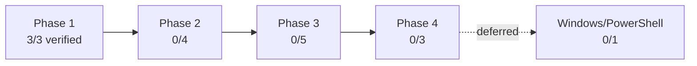

# Workspace Bootstrap Phase 1 实施结果报告

- Report date：2026-08-08
- Source plan：`docs/v0.0.5/local-workspace-safety/01-local-workspace-safety-plan.md`
- Scope inspected：branch `whalecode-codex`；实现提交`4fd125ac2`、`5b27de45b`、`e48a9da68`
- Verification summary：17项workspace-safety unittest、Python编译、JSON解析、真实clean HEAD零写入plan smoke、Git状态与marker不存在断言

## 1. Completion Overview

按16个计划工作单元等权计分；只有实现和声明验证均存在的单元计100%。

| Level | Planned Units | Verified Units | Completion | Scoring Basis |
| --- | ---: | ---: | ---: | --- |
| Overall | 16 | 3 | 19% | 3/16=18.75%，四舍五入 |
| Phase 1 | 3 | 3 | 100% | D0、W1、W2均有代码与测试/运行证据 |
| Phase 2 | 4 | 0 | 0% | W3-W6未开始 |
| Phase 3 | 5 | 0 | 0% | W7、W8、W9a、W9b、W12未开始 |
| Phase 4 | 3 | 0 | 0% | W10、W11、W13未开始 |
| Deferred | 1 | 0 | 0% | W14 Windows/PowerShell明确延期 |

## 2. Stage And Module Completion

| Stage | Stage Completion | Module | Module Completion | Status | Evidence | Verification |
| --- | ---: | --- | ---: | --- | --- | --- |
| Phase 1 | 100% | D0 inventory | 100% | complete | inventory CLI、schema、report | 4项fixture与真实脱敏盘点 |
| Phase 1 | 100% | W1 resolver/plan | 100% | complete | `resolve_context()`、`build_plan()`、CLI、plan schema | 8项fixture、clean HEAD真实smoke |
| Phase 1 | 100% | W2 identity/state | 100% | complete | `derive_workspace_id()`、`evaluate_state()`、marker schema | 5项fixture |
| Phase 2 | 0% | W3-W6 | 0% | not started | 无生产实现 | 未运行 |
| Phase 3 | 0% | W7/W8/W9a/W9b/W12 | 0% | not started | 无生产实现 | 未运行 |
| Phase 4 | 0% | W10/W11/W13 | 0% | not started | 无生产实现 | 未运行 |
| Deferred | 0% | W14 | 0% | deferred | 仅计划 | 缺Windows实机/CI证据 |

## 3. Goal Alignment Matrix

| Main Goal | Subgoal | Planned Result | Work Actually Done | Measured Effect | Verification Method | Status |
| --- | --- | --- | --- | --- | --- | --- |
| 通用盘点 | 识别构建根与敏感入口 | clone/worktree同结构JSON | 识别4个build root和23个当时可执行敏感入口 | D0产出稳定Schema，W9收敛为两个宿主入口 | inventory fixture与真实运行 | complete |
| 稳定identity | 同名目录不碰撞 | basename+canonical-root摘要 | 10位SHA-256后缀并保留可读slug | 两个同名root得到不同且重复稳定的id | `test_same_basename_roots_have_distinct_stable_ids` | complete |
| 五态判断 | branch与资源变化可诊断 | 纯函数Unbootstrapped/Ready/Stale/Conflict/DoctorFailed | 五态及机械reason code已实现 | 5类状态路径通过fixture | `test_state.py` | complete |
| 只读plan | 无落盘地生成apply目标与fingerprint | context、actions、warnings、blocking、fingerprint | JSON/人类输出和CLI已实现 | clean/dirty HEAD均未创建marker；fingerprint保持一致 | `test_plan.py`与真实smoke | complete |
| 运行隔离 | 实际写marker、doctor、exec | Phase 2闭环 | 未实现 | not verified | 无生产路径 | not started |

## 4. Engineering Benefit Matrix

| Main Goal | Engineering Benefit | Benefit Type | Baseline | Target | Observed Result | Verification Evidence | Status |
| --- | --- | --- | --- | --- | --- | --- | --- |
| 身份可信 | 同名workspace不再依赖人工改名 | reliability | basename方案存在碰撞 | 自动稳定区分 | fixture中两个同名root的id不同 | W2 unit test | achieved |
| plan安全 | 开工检查不污染repo、Git或XDG | security/compliance | 无统一检查入口 | plan零写入 | 8项fixture及真实clean HEAD前后Git状态一致、marker不存在 | W1 tests/runtime smoke | achieved |
| 竞态准备 | apply可获得确定性确认token | reliability | 无fingerprint | 64位SHA-256绑定关键上下文 | dirty告警与commit前进不改变fingerprint；marker变化会改变 | W1 tests及两次真实smoke | achieved |
| 可测试性 | workspace生命周期逻辑可在临时Git仓库验证 | testability | D0只有4项测试 | Phase 1覆盖identity/state/plan | workspace-safety回归由4项增至17项且全部通过 | unittest discover | achieved |
| 实际隔离 | 阻止错误binary/home运行 | reliability | 当前仍可共享legacy资源 | 统一入口fail closed | 未实现apply/doctor/exec | 缺Phase 2运行证据 | not verified |

## 5. Evidence And Verification Matrix

| Item | Evidence Type | Evidence Location | Verification Performed | Result | Gap |
| --- | --- | --- | --- | --- | --- |
| Identity/state | code | `scripts/workspace-safety/workspace_context.py` | 5项状态fixture | passed | 尚无真实marker生产写入 |
| Read-only plan | code/test | `workspace_context.py`、`tests/test_plan.py` | 8项fixture | passed | apply消费侧未实现 |
| 全套回归 | test | `python3 -m unittest discover -s scripts/workspace-safety/tests -p 'test_*.py' -v` | 17项 | passed | 不覆盖Phase 2+ |
| 当前worktree | runtime | `bootstrap plan --repo-root . --json` | clean HEAD执行前后status一致、marker不存在 | passed | 仅Linux当前workspace |
| Schema | test | identity/plan/inventory schema与合同tests | 标准库JSON解析和required字段一致性 | passed | 环境未安装可选`jsonschema`，未运行完整Draft 2020-12外部validator |
| 模型与付费路径 | runtime | 无 | 未运行 | not run | Phase 1明确禁止模型请求 |

## 6. Unfinished Work

| Unfinished Item | Planned Scope | Current State | Reason Not Completed | Evidence For Reason | Impact If Left Unfinished | Required Decision |
| --- | --- | --- | --- | --- | --- | --- |
| W3 apply | fingerprint验证和幂等落盘 | not started | Phase 1授权不包含Phase 2 | 无apply子命令 | 只能计划，不能进入Ready | 批准Phase 2后实施 |
| W4 doctor/log | 深查与脱敏事件 | not started | 同上 | 无doctor子命令 | 无法形成运行前完整诊断 | 批准Phase 2后实施 |
| W5 exec | 子进程home/bin隔离 | not started | 同上 | 无exec子命令 | 实际运行仍可能使用legacy环境 | 批准Phase 2后实施 |
| W6 require-ready | 轻量统一门禁 | not started | 同上 | 无门禁函数/命令 | installer/runner尚不能接入 | 批准Phase 2后实施 |
| W7-W13 | 入口迁移和现有workspace启用 | not started | 依赖Phase 2合同 | 计划依赖关系 | 当前本机串扰风险仍存在 | Phase 2验证后分批实施 |
| W14 | Windows/PowerShell parity | deferred | 用户已决定延期 | 计划状态deferred | Windows不具备本方案能力 | 后续专项授权 |

## 7. Recommended Next Actions

| Priority | Action | Rationale | Dependency | Expected Outcome | Verification |
| ---: | --- | --- | --- | --- | --- |
| P0 | W3：实现`apply --expect` | 没有apply就无法把只读计划转为可验证状态 | Phase 1 fingerprint/schema | 过期计划零写入失败，正确计划幂等落盘 | `test_apply.py` |
| P0 | W4：实现doctor与审计日志 | Ready必须由实际资源检查证明 | W3 marker | 稳定诊断码和脱敏事件 | `test_doctor.py` |
| P0 | W5/W6：实现exec和require-ready | 隔离与入口门禁的共同基础 | W3/W4 | 错workspace在子进程/副作用前失败 | 并发writer与快速门禁fixtures |

Phase 1的cycle decision为`retain and guard`。下一阶段未获本报告自动授权。
