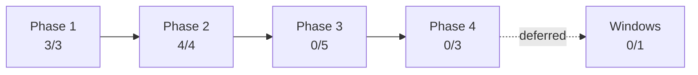

# Workspace Bootstrap Phase 2 实施结果报告

- 报告日期：2026-08-08
- 依据计划：`docs/v0.0.5/local-workspace-safety/01-local-workspace-safety-plan.md`
- 检查范围：branch `whalecode-codex`；W3-W6提交`3d3c335aa`、`93a73c702`、`95145de39`、`f6ca840fd`
- 验证摘要：46项workspace-safety unittest、Python编译、全部JSON Schema解析、双workspace并发无模型fixture、当前workspace只读门禁基准

## 1. 完成度

按16个计划工作单元等权计分；只有实现和声明验证均存在的单元计100%。

| 阶段 | 计划单元 | 已验证 | 完成度 | 依据 |
| --- | ---: | ---: | ---: | --- |
| Overall | 16 | 7 | 44% | 7/16=43.75%，四舍五入 |
| Phase 1 | 3 | 3 | 100% | D0、W1、W2 |
| Phase 2 | 4 | 4 | 100% | W3、W4、W5、W6 |
| Phase 3 | 5 | 0 | 0% | W7、W8、W9a、W9b、W12未开始 |
| Phase 4 | 3 | 0 | 0% | W10、W11、W13未开始 |
| Deferred | 1 | 0 | 0% | W14 Windows/PowerShell延期 |

## 2. 模块结果

| 模块 | 目标 | 实际结果 | 验证 | 状态 |
| --- | --- | --- | --- | --- |
| W3 apply | fingerprint确认、原子幂等落盘 | 四个`0700`资源目录、`0600` marker、同目录临时文件+fsync+replace；相同marker复用inode | 8项fixture；过期计划零写入；branch重新apply复用资源 | complete |
| W4 doctor/audit | 新鲜诊断与脱敏事件 | identity/branch/resource/binary/attestation/build override稳定码；1 MiB有界JSONL、进程锁、字段白名单 | 10项fixture覆盖全部定义分支、损坏行、上限和CLI | complete |
| W5 exec | Ready-only子进程隔离 | binary/attestation失败零启动；只改变四个受管环境键；PATH优先workspace slot | 5项fixture；双workspace并发writer路径与inode无交叉 | complete |
| W6 gate | 副作用前快速门禁 | 仅两次Git读查询和一次marker读取；五态稳定退出 | 6项fixture；当前workspace 50次平均2.426 ms | complete |

## 3. 目标与工程收益

| 目标 | 基线 | 目标值 | 实测结果 | 收益类型 | 证据 |
| --- | --- | --- | --- | --- | --- |
| 防止确认后上下文漂移 | 无apply消费侧 | mismatch零写入 | fingerprint错误和plan后branch变化均未创建XDG home | reliability | `test_apply.py` |
| 可恢复持久化 | 无marker writer | 原子、幂等、权限收敛 | 重复apply不替换相同marker inode；部分冲突保留现场 | reliability | W3 fixtures |
| 诊断可归因 | 无稳定日志 | 固定码、无秘密、有界 | 诊断分支均有正反例；argv、环境值、root不进入日志 | observability/security | `test_doctor.py`、`test_exec.py` |
| 并发运行隔离 | 父环境可指向legacy home | 每workspace独立home/bin | 两个并发子进程写入不同路径和inode，父环境不变 | reliability | `test_two_workspaces_write_to_distinct_runtime_homes` |
| 入口前置延迟 | 无统一门禁 | 毫秒级 | 当前workspace 50次平均2.426 ms | delivery speed | 本机只读基准 |

## 4. 证据与限制

| 项目 | 结果 | 证据位置 | 限制 |
| --- | --- | --- | --- |
| 全量回归 | 46/46 passed | `python3 -m unittest discover -s scripts/workspace-safety/tests -p 'test_*.py'` | 仅Linux无模型fixture |
| Python语法 | passed | `python3 -m py_compile scripts/workspace-safety/*.py` | 不替代平台集成测试 |
| Schema | parsed/contract passed | `scripts/workspace-safety/schemas/` | 环境未安装可选`jsonschema`，未运行完整Draft 2020-12外部validator |
| 真实当前workspace | gate only | `Unbootstrapped`，50次平均2.426 ms | 按W13边界未执行真实apply |
| 模型与付费路径 | not run | 无账本新增 | Phase 2明确不需要模型请求 |

## 5. 未完成工作与影响

| 未完成项 | 当前状态 | 影响 | 下一决策 |
| --- | --- | --- | --- |
| W7 installer接入 | not started | workspace binary slot不会由现有安装器自动填充，`exec`不能用于真实Whale binary | Phase 3优先实施W7 |
| W8/W9 runner接入 | not started | cache与TaskSpace入口仍可绕过require-ready | W7稳定后分入口迁移 |
| W12静态回归门禁 | not started | 新入口可能重新引入legacy默认值 | Phase 3随入口迁移实施 |
| W10/W11开发体验与规范 | not started | 开发者尚无VS Code任务和强制开工文档 | CLI接入稳定后实施 |
| W13真实两个workspace启用 | not started | 本机codex/alpha仍未创建隔离marker/home/bin | 用户专项确认后执行 |

Phase 2的cycle decision为`retain and guard`。下一阶段未获本报告自动授权。
